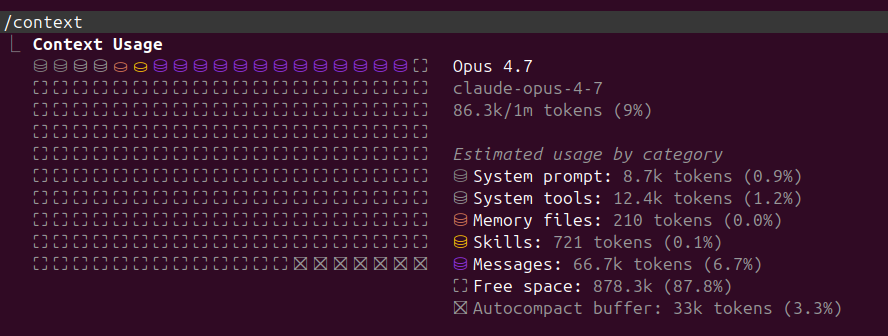

# Context Management  

# Conversation Storage  

## Chat History  

Claude works in 'projects' - i.e. the directory you launch `claude` from is considered the current project. Everything about that project is stored in `~/.claude/projects/THE_DIRECTORY_OF_THE_PROJECT_WITH_DASHES_INSTEAD_OF_SLASHES`; each conversation in that directory (i.e. every time you typed `claude` and not `claude --resume` in that directory) is stored with a `SESSION_ID` - and every conversation is stored in a `SESSION_ID.jsonl` file. in `~/.claude/projects/THE_DIRECTORY_OF_THE_PROJECT_WITH_DASHES_INSTEAD_OF_SLASHES` (note: there are also additional pieces of information in a directory called `SESSION_ID`, but the conversation itself is in `SESSION_ID.jsonl`).  

> A good way to view the jsonl file is via jq: `cat SESSION_ID.jsonl | jq .`  

The agent _can_ read other session jsonl files - but its expensive and, usually, needs to use a subagent (helper), but the subagent wont catch every nuance. Also, this is reactive and not automatic. If you need to work in several different sessions on the project, utilizing the memory function is far better.  

## Your Prompt History  

Your prompt history seems to be stored in a second location - `~/.claude/history.jsonl`. I think this history is to allow you to press up / down and scroll through your own responses (I guess if you wanted to give a similar one again). It seems to list the project and sessionID too, along with the timestamp.  

## Auto Memory  

> Read more about this [here](https://code.claude.com/docs/en/memory#auto-memory).  

<font color="green">Auto Memory</font> is a mechanism to transfer knowledge across sessions in the same project: its not a great idea to keep the same session going as it will mean you will be carrying a large context window, probably unnecessarily; its good to have different sessions under the same project, but you will need Claude to _somehow_ not completely forget your work in previous sessions.  

While Claude works on a task, if it encounters something it didn't know, it can decide on its own to write that learning to a memory file. Next session, that knowledge is loaded back automatically. Auto memory is for things you can't recover by re-reading the code:
* user - your role, expertise level, how you like to work  
* feedback - corrections you've given me and why (with the reason, so I can judge edge cases)  
* project - the why behind decisions, deadlines, stakeholder context  
* reference - pointers to external systems (Linear, Grafana, Slack channels)  


You toggle it via `autoMemoryEnabled` in your project settings (default is on); furthermore, you can view / edit / update any memory file with the `/memory` slash command in a session. The pitch is that documentation gaps fill themselves in over time without you having to remember to update CLAUDE.md after every "oh, I figured something out" moment.  


Claude keeps these memory files in `~/.claude/projects/THE_DIRECTORY_OF_THE_PROJECT_WITH_DASHES_INSTEAD_OF_SLASHES/memory/`, and it maintains all files in this directory by itself (although I find occasionally asking if memory should be updated is a good practice, as it does not always do it). `MEMORY.md` acts as an index of the memory directory. Claude reads and writes files in this directory throughout your session, using `MEMORY.md` to keep track of what markdown files are stored where (along with a small description, and important note: lines after 200 in `MEMORY.md` will be truncated). Claude will then write markdown files as necessary; the convention is `type_topic.md` (e.g. `user_role.md`, `feedback_accuracy.md`, `project_auth_rewrite.md`). The type prefix matters because the four memory types (user/feedback/project/reference) are first-class - they're set in frontmatter and shape how Claude uses them.

 Claude will keep that small description in mind, and if it has to delve into that memory (using that small description as a marker), it will.  

> The bigger win is usually being deliberate about what goes into [CLAUDE.md](agentic/claude_code/configuration?id=claudemd) instead of relying on memory. Be deliberate with what goes into [CLAUDE.md](agentic/claude_code/configuration?id=claudemd)!  

---  

# The Context Window  

I wont delve into the generalities of context windows here, but you can read more about [context windows](agentic/general/concepts?id=context-window) and [tokens](agentic/general/concepts?id=token) on the [concepts page](agentic/general/concepts).  

## Caching  

Every turn you send to Claude includes the entire conversation history so far - system prompt, tools, every prior message. Without caching, the server would re-process all of those tokens from scratch on every turn. Anthropic's prompt cache lets the server store that prefix and reuse it on subsequent turns, billed at very different rates:  

| Token category | Billing rate |  
|---|---|  
| Uncached input | 1.0x (baseline) |  
| `cache_creation` (writing to cache) | ~1.25x|  
| `cache_read` (reading from cache) | ~0.10x (10%) |  

So a healthy turn writes a small amount of new content and reads a large amount of cached prefix - and pays a tiny fraction of what an uncached turn would cost,

**<font size="4">TTL: how long the cache lives</font>**  

Each cached entry has a **time-to-live**. Anthropic offers two TTL buckets:  
* 5-minute - short-lived, cheaper to write  
* 1-hour - longer-lived, slightly more expensive to write  

Reading a cached entry _refreshes its TTL_, so as long as you keep talking within the window, the cache stays alive indefinitely. Going idle past the TTL expires the entries naturally.  

**<font size="4">Reading the JSONL</font>**  

In your [chat history](agentic/claude_code/context_management?id=chat-history) session file, every assistant turn records a `cache_creation` breakdown:  
```json
"cache_creation": {                                                                                                                                                   
  "ephemeral_5m_input_tokens": 0,                                           
  "ephemeral_1h_input_tokens": 10292                                                                                                                                  
}
```  

That tells you exactly which TTL bucket the cache write went into this turn:  

* `ephemeral_5m_input_tokens` > 0 - that many tokens written to the 5-minute bucket  
* `ephemeral_1h_input_tokens` > 0 - that many tokens written to the 1-hour bucket  
* Both can be non-zero (a mixed write - some sections at 5m, some at 1h)  

**<font size="4">Reads have no bucket breakdown</font>**  

For reads, only the flat `cache_read_input_tokens` count is recorded - no bucket breakdown. (`.cache_read` is always `null` in the JSONL.) You can infer which bucket a read came from by looking at the `cache_creation` breakdown of earlier turns: a read this turn is reusing what those earlier turns wrote.  

---  

# Compacting  

> See [here](agentic/general/concepts?id=compact) for a general description of compact.  

To <font color="green">Compact</font> the context means to collapse the older parts of the conversation into an AI-written summary so the session can keep going without having to track a large portion of the context window - or, worse, hitting the limit of the context window. The summary replaces those turns in memory, while the raw transcript stays on disk.  

You can manually compact the context window (with `/compact`), but its also automatically done as well if you are nearing the context window cap.  

During compaction, key code snippets and your requests are preserved; detailed early instructions may be lost. Control what survives by:  
* Adding a `Compact Instructions` section to [CLAUDE.md](agentic/claude_code/configuration?id=claudemd)  
* Running `/compact` focus on X with optional guidance (e.g., `/compact keep only the plan and the diff`)  
* If its necessary, Claude _can_ look inside that [chat history](agentic/claude_code/context_management?id=chat-history), as it will always be there, uncompacted.  

When you compact, Claude seemingly crawls backwards through the [jsonl file \ chat history](agentic/claude_code/context_management?id=chat-history) in reverse order; if it hits a line that specifies `isCompactSummary: true`, it reads that and then stops - and, hence, the context window is 'compacted'. Subagent activity is in the JSONL too, marked with isSidechain: true. The main-agent context shouldn't include those (otherwise the main agent would see all subagent chatter and get confused). So the actual logic is, roughly:  

1\. Scan backward until `isCompactSummary:true` (or start of file).  

2\. Walk forward from there, including entries that aren't filtered out (sidechain entries, possibly other meta entries).  

Fields in the .jsonl like `isCompactSummary`, `isSidechain`, `isVisibleInTranscriptOnly`, `isMeta` (probably) are all knobs the assembler reads to decide what makes it into context.  


## How to Compact  

You can use the command `/compact` in the CLI to perform a compact; if you wish to see how it summarized things, you can hit`Ctrl+o` in the CLI (after you compact) _or_ you could look in the [chat history jsonl file](agentic/claude_code/context_management?id=chat-history) - the line will be marked by `isCompactSummary: true`.  

 

> A critical point of an Agent is it can use strategic ways (usually via tools, proper use of grep, etc) to investigate your codebase without ingesting your _entire_ codebase; this is critical, as otherwise, it would consume your context window and potentially confuse the agent with unrelated information.  

# Exploring Context Window  

To explore the context window, type `/context` while in the Claude Code CLI. An example:  

  


**<font size="4">Anatomy of /context output</font>**  

**<font size="4">Top section: header</font>**  

Opus 4.7  
claude-opus-4-7 (model ID)  
86.3k/1m tokens (9%) (total context used / window size)  

The model name and ID identify which Claude variant is running. The "X/Ym tokens (Z%)" tells you how much of the model's window is currently occupied.  

**<font size="4">Visual grid</font>**  

A 20-column stacked bar where each cell is a colored block representing a chunk of the window. Categories are color-coded. The grid lets you eyeball proportions without reading numbers. Symbols:  
* filled cell (in-use)  
* partially filled cell (a category that's smaller than one full cell)  
* autocompact buffer cell (reserved space)  
* free space cell (empty)  

**<font size="4">Category breakdown</font>**  

| Category | What's in it | Example<br>session |  
| --- | --- | --- |  
| System prompt<br>(dark gray) | The base Claude Code instructions Anthropic ships - tone, tool guidance, the auto memory section, etc. The interpolated template | 8.7k<br>(0.9%) |  
| System tools<br>(gray) | Tool schemas for the built-in tools (Read, Edit, Bash, etc.) - counts the JSON schemas, not the tool descriptions in prose. | 12.4k<br>(1.2%) | 
| Memory files<br>(orange) | [CLAUDE.md](agentic/claude_code/configuration?id=claudemd) (79 tokens) + the auto-loaded [MEMORY.md](agentic/claude_code/context_management?id=auto-memory) index (131 tokens). Individual memory files are NOT counted here unless they were actively read one this session. | 210 (~0%) |  
| Skills (yellow) | The skill triggers/descriptions loaded into context (not full skill bodies - those load on demand when invoked). | 721 (0.1%) |  
| Messages (purple) | The actual conversation: every user message, every assistant response, every tool call and tool result that's still in the post-compact window. | 130.3k<br>(13.0%) |  
| Free space<br>(gray empty) | Whatever's left of the window. | 814.7k<br>(81.5%) |  
| Autocompact buffer | Reserved at the end of the window. Auto-compact triggers when used + buffer would exceed the window - so the buffer effectively lowers your usable ceiling. | 33k (3.3%) |  

So the math is: `window` = `used` + `free space` + `autocompact buffer`. For Opus 4.7 with a 1M-token window and a 33k buffer, there is ~967k usable before auto-compact fires.  

**<font size="4">MCP tools section</font>**  

Lists MCP servers' tools by name. Crucially: the "Available" header means loaded into the registry, not loaded into context.  Per-tool schemas are pulled in on demand when one is invoked. That's why a long MCP tool list (60+ entries here) doesn't blow up your /context totals.  

**<font size="4">Memory files section</font>**  

Itemized list of which files are auto-loaded into context, with token cost per file. In your case: project CLAUDE.md and MEMORY.md. Individual memory files (feedback_candor.md, etc.) don't appear here - they're loaded lazily when relevant.  

**<font size="4">Skills section</font>**  

Lists skill names (triggers visible in the deferred-tools system reminder). Skill bodies don't count toward context until you invoke one.  
