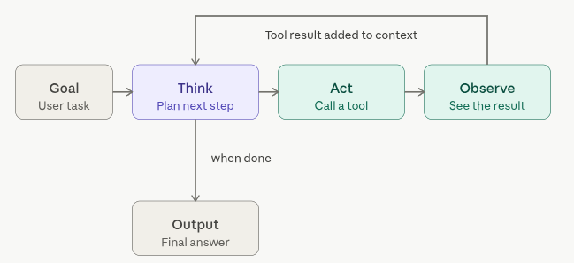

# Definitions  

# (AI) Agent  

An AI Agent (or simply Agent) is a software, backed by an LLM, that can interact with its environment and can perform actions to complete a defined goal.  It can:  
* run terminal commands  
* search the web  
* edit files  
* write code  
* act as you / on your behalf - anything the account on your machine can do with you, the AI Agent can usually do it too.  

# Agentic Loop  

The Agentic Loop is a repeated cycle where an AI model thinks about what to do, acts by calling a tool, and observes the result, looping until it decides the task is complete.  

 The Agentic Loop is the single most important concept. Everything else (multi-agent systems, subagents, orchestration) is just variations on this loop or loops calling loops.  

  

The whole thing is just three verbs: think, act, observe — and a decision point that asks `am I done yet?`. Everything else in agentic systems is built on top of this skeleton.  

Walking through it: 
* The goal arrives (a user message, a ticket, a spec).  
* The model thinks; it generates reasoning tokens about what it should do next.  
* The thinking leads to an action:  
  * A tool call (a structured request like "run this bash command" or "read this file")  
    * If it's a tool call, the runtime (Claude Code, Codex CLI, an SDK harness, whatever) actually executes it.  
    * That's the act step; the model itself doesn't run anything, it just emits a request.  
    * The runtime feeds the result back into the conversation as an observe step, and now the model thinks again, but this time with the new information sitting in its context.
    * The decision to exit isn't a separate node — it's just the moment the model produces an answer instead of another tool call.  
  * A final result  
* The action leads to an observation  
  * If the tool call results in an answer that the LLM / Agent finds satisfactory, the LLM / Agent will report a final answer  
  * If not, another tool call is made  

At any point, you can interrupt, steer, or add context to the Agentic Loop.  

Its important to note that every loop iteration sees the entire accumulated history. The model isn't being incrementally updated — each "think" step is a fresh forward pass over the whole conversation so far, including every previous tool call and result. That's why context window management becomes such a big deal in agentic systems. Long-running agents are constantly fighting context bloat, and tricks like subagents, summarization, and /compact exist mainly to manage this.  

The loop also has termination conditions that are wired in by the agentic harness (Claude Code, Codex CLI, etc): a max iteration count, a token budget, a timeout, or a human stop signal. Without those, a confused agent can spin forever, calling tools, observing failures, "thinking" up new approaches, and never deciding it's done. Most production agent harnesses set hard limits and surface them as errors when hit.  

# Context Window  

The Context Window is the 'working memory' of an agent. Its the total amount of text (measured in tokens) that a model can "see" at once during a single forward pass. Everything outside it is invisible to the model.

Its components are:  

* The System prompt  
* Your various prompts  
* The models various responses  
* tool calls  
  * web searches, commands run, etc  
* tool call results  

**Tool Calls in Context Window**  

Tools are especially important - they can provide a way for the agent to find answers, but they are especially useful when examining large codebases. Via tools, an agent can use strategic ways (usually via tools, proper use of grep, etc) to investigate your codebase without ingesting your _entire_ codebase; this is critical, as otherwise, it would consume your context window and potentially confuse the agent with unrelated information.  

**Agentic Loops and Context Window**  

Each iteration of the [agentic loop](agentic/general/concepts?id=agentic-loop) — each think/act/observe cycle — appends more content to the window. Over a long-running agent session, that pile grows fast. A task that runs 50 tool calls might burn through tens of thousands of tokens before it's done. Once you hit the limit, one of a few things happens depending on the harness: it errors out, it starts dropping older content from the front (losing early context), or it triggers a summarization step to compress history (this is the typical thing that is done).  

# Compact  

To Compact the [context window](agentic/general/concepts?id=context-window) means to collapse the older parts of the conversation into an AI-written summary so the session can keep going without having to track a large portion of the context window. The summary replaces those turns in memory, while the raw transcript stays on disk. Typically, older / verbose tool outputs and early background detail are either summarized or dropped (usually a combo of the two). The summary replaces the messages it covers in the live session; the agent continues from the summary as if those turns had been collapsed; the agent will summarize the older part of the conversation, keeping the recent tail intact. The original messages are preserved in the session transcript.  

# Token  

A Token is the basic unit of text that a language model processes — typically a short chunk of characters (a whole word, a piece of a word, a single character, or a punctuation mark) produced by a tokenizer that splits raw text into a fixed vocabulary the model understands.

A token is roughly ¾ of a word in English, so a 200,000-token context window holds somewhere around 150,000 words (about the length of a novel). That sounds like a lot until you consider that a full codebase, a stack of tool results, and several rounds of reasoning can chew through it surprisingly quickly. It shifts noticeably for code (often closer to 1:1 or worse, since whitespace, punctuation, and identifiers tokenize less efficiently), for non-English languages (often much worse: many languages tokenize at near 1 token per character), and across tokenizers.  

Each token has an integer ID, and that ID maps to a learned embedding vector. The model only ever operates on these IDs. Feed it text, and the tokenizer chops your input into a sequence of IDs; have it generate, and the final step is sampling from a probability distribution over this same vocabulary. There is no "outside the vocabulary" — every string of text on Earth, in any language, has to be expressible as some sequence drawn from this set. Frontier models typically carry 50,000 to 200,000 entries in their vocabulary.
The vocabulary itself is built using byte-pair encoding (BPE) or a close variant. 

The algorithm is straightforward: start with raw bytes or single characters as the initial vocabulary, scan a huge corpus of text, find the most frequent adjacent pair of tokens, merge that pair into a new single token, and repeat tens of thousands of times. The result is a vocabulary that naturally biases toward storing common letter sequences, common words, and common morphemes (like "ing", "tion", "pre") as single tokens, while rare or novel strings have to be assembled from smaller pieces at inference time.  

For example, take the word `understand`. It's frequent enough in English that essentially every modern tokenizer stores it as a single token. So `understand` by itself is 1 token. The leading-space variant ` understand` is also typically a single, separate token — bundling the leading space saves a token per use, since mid-sentence occurrences almost always have a space in front. Now watch the related forms (exact splits vary by tokenizer):  
* `understands`: `understand` + `s`  
* `understanding`: `understand` + `ing` (or possibly one token if it earned its own slot)  
* `understandable`: `understand` + `able`  
* `misunderstanding`: `mis` + `understand` + `ing`  
* `ynderstand` (a typo): falls apart into several small pieces, since it doesn't match the stem  

The morphologically related forms reuse the understand stem rather than each having their own dedicated entry. That stem-sharing is part of why models generalize naturally over inflections: they see the same underlying token across many surface forms during training, and learn semantics for it that transfer.  

**No Spell Checker**  

There's no preprocessing step that scans your input, fixes typos, and feeds the cleaned-up version to the model. The tokenizer is dumb in a specific way: it just runs its merge rules over whatever bytes you sent. `ynderstand` doesn't match the merge sequence that produces the understand token, so BPE falls back to whatever sub-pieces do match — maybe `yn` + `der` + `stand`, or even smaller chunks. Those token IDs go to the model exactly as produced. Nothing gets silently corrected on the way in.  

What's actually happening when an LLM appears to "handle" your typos is that the model has seen enormous amounts of text during training - including text full of typos and many other quirky inputs and optical character recognition (OCR) garbage (the ML algorithms that attempt to 'read' letters in a picture and convert it to text). So even though `ynderstand` arrives as a weird sequence of sub-tokens the model has rarely or never seen in that exact combination, the _surrounding context_ usually makes the intended word obvious. The model effectively does a kind of probabilistic interpretation: "given the rest of this sentence, the most likely word here is `understand`, so I'll proceed as if that's what was meant." It's pattern completion, not correction.  

A few practical consequences fall out of this:  
* The model can be wrong about what you meant, and you'll never know it silently substituted.  
  * If you write `bare with me` (a common typo for `bear with me`), the model will usually proceed with the intended meaning  
  * If context were ambiguous, it might genuinely interpret it as something about being unclothed.  
* Typos cost you tokens.  
  * `understand` is one token, while `ynderstand` might be three or four.  
  * In long agent runs or large codebases, garbled input wastes context window space.  
    * This matters less for a single message and a lot more for things like processing optical character recognition output (OCRs), PDFs, or scraped web content where every page might have a smattering of broken words.  
* Adversarial typos can sometimes change behavior in unexpected ways.  
  * There's a small body of research on how unusual tokenizations can elicit different responses than the clean version of the same prompt, sometimes called glitch tokens or tokenizer-level prompt injection. 
    * This is not usually a practical concern for normal use, but it's a real artifact of how the system works.  

The model's apparent fluency-with-mess is a feature of training, not infrastructure. The underlying language modeling is robust enough to recover meaning from imperfect input most of the time.  