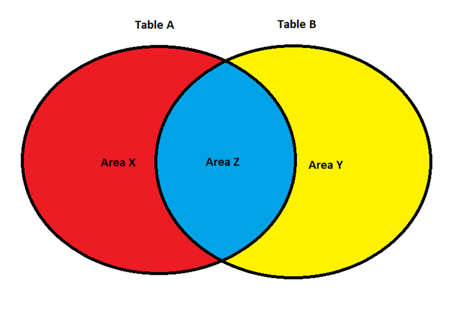

# SQL 

# SELECT Query

**Example of a SELECT Query**
 
> SELECT <columnName1\>, <columnName2\>, <columnName3\>, <columnName4\>, SUM(<columnName5\>) 
> FROM <tableName1\> 
> INNER JOIN <tableName2\> 
> &nbsp;&nbsp;&nbsp;&nbsp;ON <tableName2\>.<UniqueIdentifierColumnName1\> = <tableName2\>.<UniqueIdentifierColumnName1\>  
> &nbsp;&nbsp;&nbsp;&nbsp;&nbsp;&nbsp;&nbsp;&nbsp;AND <tableName2\>.<UniqueIdentifierColumnName2\> = <tableName2\>.<UniqueIdentifierColumnName2\> 
> WHERE <someDateBasedColumn\> = '2012-02-28' AND <someDateTimeBasedColumn\> = '2012-02-28 13:00 :00'  
> &nbsp;&nbsp;&nbsp;&nbsp;AND <someColumnThatIsNumberBased\> = 1234.5678 
> &nbsp;&nbsp;&nbsp;&nbsp;AND <someColumnThatIsTextBased\> = 'SomeTextHere' 
> GROUP BY <columnName1\>, <columnName2\>, <columnName5\>, <columnName4\> 
> HAVING SUM(<columnName6\>) > 1000 
> ORDER BY <columnName1\> DESC 
> LIMIT 1000
 
 
 
The above is the basic structure for a query.  All of the words in blue are reserved words.  Note: Any time you see a <SomeText\>, this can be a variety of table or column names – so this will vary based on your query.  Do NOT literally use the < and \>. 
 
Typically, when you are talking about a query, its broken into “blocks” or “clauses” which are important subsections of the query.  For ease of reading in the above example, each block starts with an upper cased blue word, and it ends just before the next blue word (note: small words like AND, OR, and ON don’t count, and neither does official functions; you can tell if something is a function because it has an immediate (someText) right after the word in parenthesis).  The only bare bones blocks you will need are SELECT and FROM, but you will typically use the WHERE as well.
 
## SELECT Clause
 
The SELECT block lists all columns you want to display, separated with commas (note: make sure you don’t put a comma after the last column listed, I have done this many times and it WILL error out).  If you just want everything returned, use * here (this is OK if you just want a quick snapshot, but you shouldn’t use this in a script).
 
The SELECT block can have more than just column names, though.  It can include literal characters – so for example if you want it to have a 1 printed in each dataset, you would literally type a 1; if you wanted a character string or a date (or dateTime), you would wrap it in single quotes ‘like this!’.  It can also use functions that are defined in the database that is being used (in our case, the mySQL functions).  For example, say you have a column FirstName and a column LastName in a table, and you want to display the name in the format “Smith, John”.   This can be achieved using the CONCAT() function as follows  
 
> SELECT CONCAT(LastName, ‘, ‘, FirstName) FullName FROM someTableNameHere  
 
So in the above example, we concatenated (mashed together) the LastName column, then a comma and a space (‘, ‘ – note we had two wrap it in single quotes as they are literal characters), then the first name.  
 
Also note in the immediate example above we renamed our concatenation FullName – this way, when we run the query the name “FullName” appears as the column name in the query we run, which makes it easy to read.  You can rename any column, function result, or even table by typing a new name immediately after the column/function result/table name, as we did here when we defined FullName.  
 
The last thing we can include in the SELECT block are aggregate functions – otherwise known as mathematical functions such as SUM, COUNT, or AVG (there are more as well).  In the main example we used SUM(<columnName5\>), which will add all of the <columnName5> values together in the result returned.  

!> When using aggregate functions, YOU MUST MAKE SURE YOU WANT THE DATA GROUPED BY ALL OF THE OTHER NON-AGGREGATE COLUMNS IN THE SELECT BLOCK.  I will go into detail about this later.  
 
Finally, sometimes you will see column names that look like this: “<mySchemaName\>.<myTableName\>.<myColumnName\>”.  Yes, that’s one column that uses three words separated by a dot.  Sometimes, tables that you are joining (see below for an explanation of joining tables, but its basically mashing multiple tables together) use the same column name in each table; in this case, if you just use the column name without any other identifier, mySQL does not know which table’s column to use and it will just error out (and, in most cases, it doesn’t matter which table’s column you use, just pick one of them).  In these cases, you put the schema AND table name along with the column name to exactly identify which column you are using.
 
## FROM Clause
 
The FROM block is fairly straightforward- it will almost always be the word FROM and then the name of the table you are using.  

> Advanced topic, just for your information: sometimes you will want to use something call a Cartesian join (beyond the scope of this example); if you are using a Cartesian join you will list ALL of the tables after the FROM word, separating each table name with a comma.  Again, these situations are rare, in most cases you will just use INNER JOIN, RIGHT JOIN, or LEFT JOIN.
 
## INNER JOIN 'Clause'
 
Sometimes (actually often times) the data you need is stored across multiple tables.  In these cases you have to do something called joining the tables.  Basically what this means is joining the data on [primary keys](learn_to_code/SQL/sql?id=primary-key).
 
For example lets say we wanted to select the EmployeeID, name, Date, and MonthlyUnitsSold.  We would do it like this:  
 
> SELECT Employees.EmployeeID, CONCAT(LastName, ‘, ‘, FirstName) FullName, Date, numOfUnits  
> FROM Employees  
> INNER JOIN MonthlyUnitsSold ON Employees.EmployeeID = MonthlyUnitsSold.EmployeeID 
 
In the example above, we selected data from Employees and INNER JOINed it with data from MonthlyUnitsSold.  The word ON just means “use the following to join the two tables.”  After the word ON, we list which columns from which table should equal each other (and remember, typically you will have to specify the schema.tableName as well, although above we omitted the schema name).
 
Wait, I am confused!  The SELECT block has columns from BOTH Employees and MonthlyUnitsSold but we are only selecting FROM Employees!  What is going on?
 
In the SELECT block, you can list ANY column in ANY table in the FROM block OR the INNER JOIN block.  So, feel free to select any column from either table in the SELECT block!  And no, when using an INNER JOIN, it doesn’t matter which table is mentioned in the FROM statement or the INNER JOIN statement, so the following query will give the exact same results as the above query: 
 
> SELECT Employees.EmployeeID, CONCAT(LastName, ‘, ‘, FirstName) FullName, `Date`, numOfUnits  
> FROM MonthlyUnitsSold  
> INNER JOIN Employees ON Employees.EmployeeID = MonthlyUnitsSold.EmployeeID
 

**INNER, LEFT, and Right JOINS**
 
There are more types of JOINS than just an INNER JOIN: LEFT JOIN and RIGHT JOIN also exist.  What is the difference between the three? 
 
An INNER JOIN only returns items that are in BOTH tables.  In our Employees table example, we joined the table Employees to the MonthlyUnitsSold tables on the condition that there were matching EmployeeIDs between both tables.  What happens if one table has an EmployeeID and the other table does not have that EmployeeID?  It gets thrown out – it is not used or displayed if we use the INNER JOIN.  What happens if you need to see not only matched EmployeeIDs but unmatched as well?
 
This is where LEFT JOIN and RIGHT JOINs come into play.  For example, say the EmployeeID “goofy” exists in table Employees, but Goofy being Goofy, he makes no sales and thus is not represented in our MonthlyUnitsSold table when both tables are joined by using INNER JOIN.  However, the boss still wants goofy displayed in the result; in this case, we could use a LEFT JOIN, which would return everyone in the left table like this:
 
> SELECT Employees.EmployeeID, CONCAT(LastName, ‘, ‘, FirstName) FullName, `Date`, numOfUnits  
> FROM Employees  
> LEFT JOIN MonthlyUnitsSold ON Employees.EmployeeID = MonthlyUnitsSold.EmployeeID
 
Using the LEFT JOIN here instead of the INNER JOIN means ALL records from the left table (the table Employees, left meaning literally the table mentioned to the left of the LEFT JOIN statement) MUST be represented in the output, even if they don’t exist in the table on the right (in this case the table MonthlyUnitsSold).  Since we are now using a LEFT JOIN, goofy will now be present in the output, even though he didn’t have a match in MonthlyUnitsSold.  Since the columns `Date` and numOfUnits come from the table MonthlyUnitsSold, how will this be represented for goofy?  Easy – the system will just make both of these values NULL for goofy.
 
A RIGHT JOIN works exactly like a LEFT JOIN, except for all values in the right table are used.
 
Consider the following diagram that consists of two tables.  Using an INNER JOIN, only items that are in both table A and table B will be displayed.  Using a LEFT JOIN, objects that are in Area Z will be fully displayed, and objects in Area X will be displayed as well (although any information that should come from table B will just be NULL).  Using a RIGHT JOIN, objects that are in Area Z will be fully displayed, and objects in Area Y will be displayed as well (although any information that should come from table A will just be NULL). 

 
 
## WHERE Clause
 
The WHERE clause lets you restrict the returned rows.  This is helpful if your table has thousands (or millions) of rows and you only want to see a small subset of them.  Typically, you compare columns to other columns or literal numbers, dates, or text.  For example, if in our Employees table we only wanted to see employees whose first name was “John” we would do it like this:
 
> SELECT * FROM Employees WHERE FirstName = ‘John’
 
Now, what happens if we need to see employees with the first name John AND who live in PA?
 
> SELECT * FROM Employees WHERE FirstName = ‘John’ AND State = ‘PA’
 
You can just keep adding constraints with the AND keyword.  Note you can also use the OR keyword too, but it has a different meaning; AND is used when the statement on the left and right of the AND must be true; OR is used if either the left or right statement is true.  The scope of AND & OR is beyond this lesson – and can be difficult to master - but if you wish, research logistical AND & OR operators [at w3schools](http://www.w3schools.com/sql/sql_and_or.asp).
 
Some general notes:
* You can compare a column to another column, but both columns must be the same general data type – only compare text-based columns to other text-based columns, date-based columns to other date-based columns, datetime-based columns to other datetime-based columns, and numeric-based columns to other numeric-based columns.
* If you are comparing a column to a literal value (if you want to hard code in a number, text, or specific date or datetime), you have to check to see if you must wrap the value in single quotes.  Text, dates, and datetimes must all be wrapped in single quotes while numbers do not.  For example,
 * Text: WHERE FirstNameColumn = ‘John’
 * Date: WHERE DateOfOrder = ‘2012-02-24’
 * DateTime: WHERE DateTimeOfOrder = ‘2012-02-24 14:00:00’
 * Number: WHERE SomeNumberColumn = 1234.5678
* Literal dates must ALWAYS be in the format YYYY-MM-DD.
* Literal datetimes must ALWAYS be in the format YYYY-MM-DD HH:MM:SS, where the hours are military time.
* Comparison operators
 * EQUAL TO: =
 * LESS THAN: <
 * GREATER THAN: >
 * DOES NOT EQUAL: <>
 * LESS THAN OR EQUAL TO: <=
 * GREATER THAN OR EQUAL TO: >=
* Comparing NULL values is a bit different – if you want to say “SomeColumn = NULL” this will not work; for NULL and NULL only replace = with IS, so its “SomeColumn IS NULL”.  Does not equal NULL would be “SomeColumn IS NOT NULL”

 
## GROUP BY Clause
 
There are several aggregating functions available in most versions of SQL, the basics being SUM (add all values in this specific column), AVG (find the average value in this specific column), MAX (find the max value in this specific column), MIN (find the min value in this specific column), and COUNT (count the number or records returned).  Typically, the format is the aggregate function you want to use and the columns you want to perform the aggregate on in parenthesis.  In our example above, say we wanted to SUM numOfUnits.  We would do it like this:
 
> SELECT SUM(numOfUnits) FROM MonthlyUnitsSold
 
Now we have summed all numOfUnits, which his great.  But what if we wanted to sum the numOfUnits for each EmployeeID?  We would use the GROUP BY clause, which literally means “when using an aggregate function, group the data by these specific columns.”  So, to get the sum of numOfUnits for each EmployeeID we would do this
 
> SELECT EmployeeID, SUM(numOfUnits) FROM MonthlyUnitsSold GROUP BY EmployeeID
 
As a rule of thumb, the columns you use in the GROUP BY clause must match exactly those columns in the SELECT clause, minus the aggregate function (in this case, SUM(numOfUnits)).  Some compilers simply force you to do this; other compilers allow you to have different columns in the SELECT and GROUP BY clauses but it can lead to undesirable results, so its not recommended. 

## HAVING Clause

> Is this reaL?

The HAVING block works exactly like the WHERE clause but for aggregate functions, and must only include an aggregate as one of the comparisons.  For example, say you only wanted to show EmployeeIDs that have sold more than 100 units. The SQL would look like this:  

> SELECT EmployeeID, SUM(numOfUnits)  
> FROM MonthlyUnitsSold  
> GROUP BY EmployeeID  
> HAVING SUM(numOfUnits) > 100
 
The above query will only show the EmployeeIDs that have sold more than 100 units.

Note that you must use the GROUP BY clause if you use the HAVING clause.  If you are not, ask yourself why you need the HAVING clause if you aren’t using the GROUP BY clause – as far as I know there is no reason to do so.
 
## ORDER BY Clause
 
The ORDER BY clause is purely used to display the data in a specific order.  The makeup of the ORDER BY clause is straightforward – you simply list the columns you want to ORDER BY separated by commas.  If you want the data to be displayed in descending order (largest to smallest, or in the case of text Z-A), say DESC; if you want the data in ascending order (smallest to largest, or in the name of text A-Z) say ASC.  For example, say you wanted to list all of our employees by descending last name but ascending first name, you would do it like this:
 
> SELECT * FROM Employees ORDER BY LastName DESC, FirstName ASC
 
## LIMIT Clause
 
The LIMIT clause is very straightforward – it simply limits the number of rows that the query returns.  This is helpful if you only want a specific (or less) number of rows to be shown.  If you wanted to display only the first row in the table Employees you could do so like this:
 
> SELECT * FROM Employees LIMIT 1
 
This can be particularly useful if you only want to do operations on a specific row.

# Keys 

## Primary Key
 
A primary key is a column – actually often multiple columns – that define a row of data.  So, for example, say you have a table with three columns: employee ID, month, and units sold.  What would define a unique row?  Obviously employee ID helps define a row, so employee ID is a primary key.  Again, we want a unique row identifier, so we have to ask ourselves: can there be multiple rows in the data with the same employee ID?  The answer is yes – since there is also a month column, this indicates an employee can be in this table multiple times, once per month listed.  So, in this example, there are two columns that define a unique row: employee ID and month.
 
It can be difficult figuring out primary keys (unique columns), but here are a few general guidelines (that will identify a primary key in most cases):

* Any column that has the specific word “ID” in it that can be construed as “identification” is probably a primary key (or one of them).
* Any date or date/time columns, IF it’s the only date or date/time column in the table (or if it has one DATE AND one DATETIME column, they are typically both primary key columns).  In the case of multiple date and/or date/time columns you have to use your judgment based on the name of the column.
* Typically, if the column is a column that has numbers in it that are not IDs, it is NOT a primary key.
* First and Last names are typically NOT primary keys.  Why?  Because there are, in theory, multiple people can have the same name.  As an example, there are 24,333 people in the US that have the name “John Smith.”  Do NOT use a first/last name as a primary key, ever – use an employee ID or some other unique identifier.

 
When joining tables, determine the primary keys in each table; then, determine which primary keys from each table should be used to join the tables together.  It is important to identify EVERY primary key pairing between both tables – the more primary keys that you can match the faster the query will execute (as well as eliminate flawed joins).
 
For example, consider two tables:
 
| Employees | MonthlyUnitsSold |
| --- | --- |
| EmployeeID | EmployeeID | 
| FirstName | Date | 
| LastName | numOfUnits | 
| Position |  | 
| State |   | 
| MonthlyTargetUnits |   | 
 
For the table Employees, it seems only the EmployeeID identifies a unique row; the MonthlyUnitsSold table uses both the EmployeeID AND the Date columns to identify a unique row.  What columns do both tables have in common?  That’s right, the EmployeeID is the only column that both tables have in common.  Therefore, if we wanted to join these two tables, we would join them ON Employees.EmployeeID = MonthlyUnitsSold.EmployeeID. 