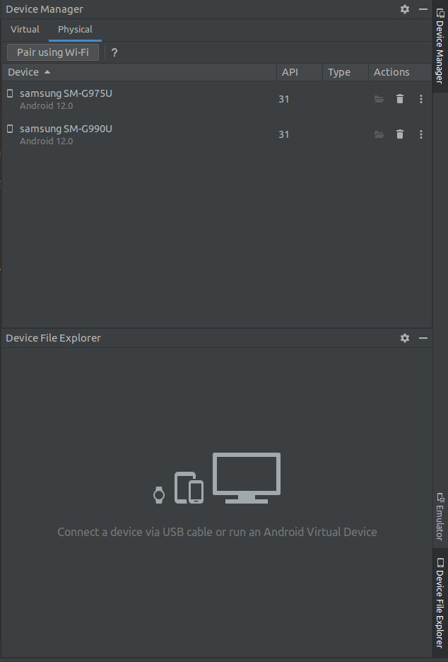

# Android Studio  

# Installation  

## Install Android Studio  

> This assumes you are in Ubuntu, or another Debian offshoot.  

1\. [Become root](/operating_systems/ubuntu/linux_notes?id=becoming-root).

2\. [Update all packages](/operating_systems/ubuntu/linux_notes?id=updating-upgrading-all-packages).

3\. Install `qemu-kvm` via: `apt-get install qemu-kvm`  

4\. Add your current user to the `kvm` group: `usermod -aG kvm USERNAME`  
   * `USERNAME` is your user name.  
   
5\. If it exists, uninstall `adb` with: `apt remove adb`  
   * You _probably_ do not actively use `adb` if you have never used the Android SDK, but if its installed - figure out why.  
     * If its needed elsewhere you can leave it, but be warned - the Android SDK also installs a local version of this, and if the versions do not match between the two you _will_ have issues.  
	 * Its best to have only _one_ instance of `adb` installed (and I would stick with the one the Android SDK installs).  

6\. Exit root: `exit`  

7\. Download the Android Studio tarball [here](https://developer.android.com/studio).  

8\. Unzip the tarball to your favorite directory - I usually pick `/android-studio`, but the choice is ours.  

9\. Download the Android Studio Platform tools [here](https://developer.android.com/tools/releases/platform-tools).  

10\. Unzip the tarball to your favorite directory - I usually pick `/android-studio/platform-tools`, but the choice is ours.  

11\. <font color="red">Optional</font> Follow [these instructions](operating_systems/ubuntu/linux_notes?id=creating-executable-icons) on how to make an executable icon for Android Studio.  
   * If you do not take this step, **you will have to run** `/android-studio/bin/studio.sh` every time you want to run Android Studio.  
     * This assumes you unzipped the tarball in step #8 above to `/android-studio`; if you did not, you will have to run `studio.sh` from that directory.  
   * I named my desktop file <font color="purple">Android Studio.desktop</font> but you are free to name it whatever you wish - the contents are:
```
[Desktop Entry]
Type=Application
Name=Android Studio
Comment=Android Studio
Icon=/android-studio/bin/studio.png
Exec=/android-studio/bin/studio.sh
Terminal=false
Categories=Android;Development;IDE;
StartupWMClass=jetbrains-studio
```  
     * This assumes you unzipped the tarball in step #8 above to `/android-studio`; if you did not, you will have to alter the Icon and Exec lines above.  
   * You should be able to skip checking the `WM_CLASS` as that should be `jetbrains-studio` - but if you have problems, check it.  
   * You _will_ have to add the desktop file to `/usr/share/applications`  
     * You will have to do this step [as root](/operating_systems/ubuntu/linux_notes?id=becoming-root) (and only this step - once the file is added exit root).  
   * You _will probably_ have to alter the 'Custom Values' field after you launch `dconf-editor` for the icon to stay (and work).  
   
12\. Run Android Sudio (either via the executable `studio.sh` _or_ your icon).  
   * The first time you run this, you will be prompted to set up / install the **<font color="purple">Android SDK</font>** - do so.  
   * Not only does this install the **<font color="purple">Android SDK</font>**, it also installs critical tools to interact with the Android emulator (i.e. `adb` and `emulator`).  
   * By default, **<font color="purple">Android SDK</font>** installs to your directory `~/Android/Sdk` (its specific to you, it does not seem to be a global install).  

13\. Add this line to your [.profile](operating_systems/ubuntu/linux_notes?id=the-profile), as the Android SDK that was installed in step #9/10 above installs a bunch of critical tools as well (`adb` and `emulator` to name a few):  
```
PATH="$HOME/Android/Sdk/emulator:/android-studio/platform-tools:$PATH"
```  
   * This assumes you installed the Android SDK to the default of `~/Android/Sdk` and the platform tools to `/android-studio/platform-tools`.   

12\. [Source in](operating_systems/ubuntu/linux_notes?id=sourcing-your-profile) your .profile.  
   * This is only necessary if you have a terminal up and you are ready to run Android SDK commands immediately in that terminal.  
   
13\. Add your current user to the `plugdev` group. [As root](/operating_systems/ubuntu/linux_notes?id=becoming-root) (and only this step - once the file is added exit root): `usermod -aG plugdev USERNAME`  
   * `USERNAME` is your user name.  
   
14\. Install the Common SDK Platform Tools so you can load your apk install file directly to a physical Android device. do this [as root](/operating_systems/ubuntu/linux_notes?id=becoming-root) (and only this step - once the file is added exit root): `apt-get install android-sdk-platform-tools-common`  

15\. [Add a virtual device](learn_to_code/android/android_studio?id=adding-a-virtual-device).  
   * While not technically a part of setup, you will need this if you ever wish to test your code on a virtual device.  

## Additional Skins  

Additional Skins:
1\. [Samsung Galaxy Skins](https://developer.samsung.com/galaxy-emulator-skin)

## Adding a Virtual Device  

If you wish to test your code, you _will_ need to install a virtual Android device - here is how that is done within Android Studio.  

1\. Click the dropdown for `Tools / Device Manager` which will open a toolbox on the right like so:  

* Note the `/dev/kvm device: permission denied` warning - [here is how you fix that](learn_to_code/android/sdk_tools/sdk_basics?id=changing-ownership-of-devkvm).  
* I have a virtual device set up already (`Pixel 2 API Tiramisu`) - if you are just starting out, this box will be empty.  

2\. Click <font color="purple">Create device</font>.  

3\. A pop-up will appear, asking you to select some virtual hardware. This is the physical Android device you will be emulating (Samsung Galaxy, Pixel, etc). You can also customize the device, if you wish):  

* Once you are happy with your selection, click <font color="purple">Next</font>.  

4\. Now you must set the system image (i.e., which Android OS would you like to install on this device?):

* If you select a system image you have never downloaded, you _must_ click the `Download` link immediately next to the system image name to download the system image.  
* Note the `/dev/kvm device: permission denied` warning - [here is how you fix that](learn_to_code/android/sdk_tools/sdk_basics?id=changing-ownership-of-devkvm).  
* Once you are happy with your selection, click <font color="purple">Next</font>.  

5\. Finally, you will have to name the device; you also have some final things to set, but only if you wish to do so:  

* Note the `/dev/kvm device: permission denied` warning - [here is how you fix that](learn_to_code/android/sdk_tools/sdk_basics?id=changing-ownership-of-devkvm).  
* Once you are happy with your selection, click <font color="purple">Finish</font>.  
* You will now have a device in the `Device Manager` toolbox.  
   * See the image in step #1 for an example - here, we have a 'Pixel 2' device running on the 'Tiramisu' version of the Android OS.  
 
## Attaching a Physical Android Device  

> I give a very brief overview here; for a more detailed walkthrough, see [developer.android.com](https://developer.android.com/studio/command-line/adb#connect-to-a-device-over-wi-fi-android-11+).  

Its fully possible to attach a physical Android device to Android Studio; if you do so, you will be able to test your code on an actual device.  

The first thing you have to do is [enable the Developer Options](learn_to_code/android/sdk_tools/adb?id=enable-developer-options) on your physical device. 

Once you have enabled <font color="purple">Developer Options</font> on your device you have three options on connecting it in Android Studio - directly connecting using WiFi via Android Studio (which is this section, although you can do this [entirely in adb](learn_to_code/android/sdk_tools/adb?id=connect-device-over-wifi-11)), directly [connecting via USB](learn_to_code/android/sdk_tools/adb?id=connecting-device-over-usb), and [connecting over WiFi for Android version 10-](learn_to_code/android/sdk_tools/adb?id=connect-device-over-wifi-10-).  You can check out the other two methods, but I will discuss the Andriod Studio WiFi method here. Note this requires Android 11 or higher; if your device does not have that you must use [one of the other methods](learn_to_code/android/sdk_tools/adb?id=attaching-a-physical-android-device). The advantage of using this method is you can connect _multiple_ devices at once.  

> Note its possible to perform all of this outside of Android Studio with [adb](learn_to_code/android/sdk_tools/adb?id=connect-device-over-wifi-11).  

To connect _devices using Android version 11+_ via Android Studio:  

1\. Make sure your laptop and your Android device are on the same WiFi.  

2\. Make sure the [Developer Options](learn_to_code/android/sdk_tools/adb?id=enable-developer-options) are enabled on your device 
   * _After_ performing the 'Build Options' trick (as described [here](learn_to_code/android/sdk_tools/adb?id=enable-developer-options), you need to turn it on - `Settings` -> `Developer Options`).  

3\. Enable wireless debugging on your device.  
   * This is usually turned on via `Settings` -> `Developer Options` -> `Wireless Debugging`  
   * This is an option you need to turn on _and_ it has additional elements available once you do enable it. Once enabled:    
     * You can <font color="purple">Pair Device with QR Code</font> _or_ <font color="purple">Pair Device With Pairing Code</font>.  
	   * Remember this option as we will have to come back to this.  
	 * The device's IP and port will be displayed here, which can be used to connect to it as necessary.  
	 
4\. Back on your laptop / desktop, click `Tools` -> `Device Manager` in Android Studio.  

5\. A <font color="purple">Device Manager</font> windows pops up - click the `Physical` tab: 



6\. Click the <font color="purple">Pair using Wifi</font> button.  

7\. A box appears, allowing you to pair with a <font color="purple">QR Code</font> _or_ a <font color="purple">pairing code</font>.  
   * Make your selection now, but before we move further we need to select the corresponding selection back on your physical device.  
     * Selecting <font color="purple">QR Code</font> should pop up a QR code you can scan (do not scan now).  
	 * Selecting <font color="purple">pairing code</font> will allow you to enter a code.  
   * Occasionally you will get an error in the popup box here; I am not sure why this happens, but just re-start Android Studio and it _should_ fix it.  
   
8\. Back on your device under `Settings` -> `Developer Options` -> `Wireless Debugging`, you can select to either <font color="purple">Pair Device with QR Code</font> _or_ <font color="purple">Pair Device With Pairing Code</font>.  
   * If you select the <font color="purple">Pair Device With Pairing Code</font>, your device will show the code; your Android Studio will have a box showcasing the IP and port of your device, and underneath that will be a place to enter the code as displayed on your device.  
   * If you select <font color="purple">Pair Device with QR Code</font>, your camera will come up; scan the QR code in Android Studio.  
   
9\. You are now connected to your device! You can now use _most_ of the [adb](learn_to_code/android/sdk_tools/adb) commands on your device as long as its connected.  

> Dont forget to disconnect when you are done; I simply disconnect via my device (turn off <font color="purple">Wireless Debugging</font> on your device), but you could also use [disconnect](learn_to_code/android/sdk_tools/adb?id=disconnect-device-over-wifi).  