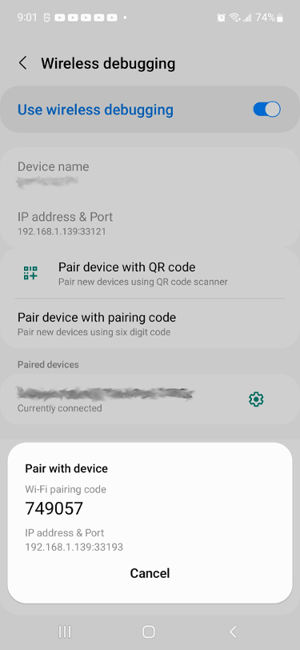

# ADB  

# Purpose of ADB  

> The main ADB page is found [here](https://developer.android.com/studio/command-line/adb).  

While the [emulator](learn_to_code/android/sdk_tools/emulator) is used for setting up the emulator, you need a way to interact with it once it is running. The <font color="green">Android Debug Bridge</font> (or <font color="green">adb</font> for short) is used to interact with a running [AVD](learn_to_code/android/sdk_tools/sdk_basics?id=android-virtual-device-avd) instance. In addition, <font color="green">adb</font> can be used to interact with connected _physical_ devices as well!  

`adb` is installed during the [installation of Android Studio](learn_to_code/android/android_studio?id=install-android-studio), which is the recommended way to install. If, for whatever reason, you do not want to install via Android Studio you can install with `apt-get install adb`, but installing directly gave me problems.  

# Basic ADB Commands  

## ADB Help

For help with ADB:  
```
adb help
```  

!> There are plenty of topics I have missed here - I just covered the most critical ones. Check out `adb help` for the full listing of commands supported by ADB!  

## List Running AVDs  

To show a list of running [AVDs](learn_to_code/android/sdk_tools/sdk_basics?id=android-virtual-device-avd) _and_ connected physical devices, use the `adb devices` command:  
```
adb devices -l
```  
* The `-l` is not required, but shows you a bit more information about the running instance.  

Example output of this command is:  
```
List of devices attached
emulator-5554          device product:sdk_gphone64_x86_64 model:sdk_gphone64_x86_64 device:emu64xa transport_id:6
```  

Note the name - `emulator-5554`. You cannot directly set this as far as I can tell; that said, the `5554` is the port opened for this ADV for [console commands](learn_to_code/android/sdk_tools/other_tools?id=console-commands).  This means the name is a bit hard to pin down, but you can [explicitly set the port](learn_to_code/android/sdk_tools/emulator?id=set-ports) when you start the emulator, which may make finding your specific AVD easier if you have multiple AVDs running.  

## Specifying AVD in ADB  

If you only have _one_ running [AVD](learn_to_code/android/sdk_tools/sdk_basics?id=android-virtual-device-avd) instance (or you are only connected to one physical device), you will never have to specify the instance - `adb` will automatically know to pick the sole running instance. However, if you _do_ have multiple instances, you will need to get the device name (found be [listing the devices in adb](learn_to_code/android/sdk_tools/adb?id=list-running-avds)) and then use that name like so when running commands:  
```
adb -s EMULATOR_SERIAL_NUMBER XYZ
```  
* The `EMULATOR_SERIAL_NUMBER` is the name from [listing the devices in adb](learn_to_code/android/sdk_tools/adb?id=list-running-avds).  
* The `-s EMULATOR_SERIAL_NUMBER` specifies the running AVD instance _or_ physical device.  
   * If its a physical device, the `EMULATOR_SERIAL_NUMBER` will be an `IP:PORT`  
* `XYZ` is any command that is used by `adb` (`adb -s EMULATOR_SERIAL_NUMBER shell`, for example).  

## Starting the ADB Server  

To start the ADB server (if it is not running):  
```
adb start-server
```  

## Stopping the ADB Server  

To stop the ADB server:  
```
adb kill-server
```  

---  

# Attaching a Physical Android Device  

Its fully possible to attach a physical Android device to ADB; if you do so, you will be able to test your code on an actual device.  

## Enable Developer Options  

> I give a very brief overview here; for a more detailed walkthrough, see [developer.android.com](https://developer.android.com/studio/command-line/adb#connect-to-a-device-over-wi-fi-android-11+).  

The first thing you have to do is enable <font color="purple">Developer Options</font> on your physical device. Typically the way to do this is to find the <font color="purple">Build Number</font> field and tap it 7 times in a row (usually, the <font color="purple">Build Number</font> is in Settings -> About Phone -> Software Information, but that is no guarantee). Once you enable <font color="purple">Developer Options</font>, it will typically be the last option in the main <font color="purple">Settings</font> tree.  Once you have unhidden this option, _do not forget to turn the option on_.  

Once you have enabled <font color="purple">Developer Options</font> on your device you have three options on connecting it - via USB, via WiFi (for Android version 10 and lower), or in [Android Studio](learn_to_code/android/android_studio?id=attaching-a-physical-android-device) (for Android version 11 and higher).  

## Connecting Device Over USB  

Its possible to connect your device via USB.  

1\. Make sure the [Developer Options](learn_to_code/android/sdk_tools/adb?id=enable-developer-options) are enabled on your device.  
   * _After_ performing the 'Build Options' trick (as described [here](learn_to_code/android/sdk_tools/adb?id=enable-developer-options), you need to turn it on - `Settings` -> `Developer Options`.  

2\. On your device, make sure `USB Debugging` is enabled via `Settings` -> `Developer Options` -> `USB Debugging`.  

3\. Connect your device via USB.  
   * If you are asked to confirm anything, do so.  

4\. You are now connected to your device! You can now use _most_ of the [adb](learn_to_code/android/sdk_tools/adb) commands on your device as long as its connected via USB.  

!> If you see an error saying `This adb server's $ADB_VENDOR_KEYS is not set`, try [stopping the adb server](learn_to_code/android/sdk_tools/adb?id=stopping-the-adb-server) and then [restarting it](learn_to_code/android/sdk_tools/adb?id=starting-the-adb-server).  

## Connect Device Over WiFi (11+)  

If the version on your Android device is 11+, you can connect your device easily over WiFi.  

1\. Make sure the [Developer Options](learn_to_code/android/sdk_tools/adb?id=enable-developer-options) are enabled on your device.  
   * _After_ performing the 'Build Options' trick (as described [here](learn_to_code/android/sdk_tools/adb?id=enable-developer-options), you need to turn it on - `Settings` -> `Developer Options`.  

2\. On your device, make sure `Wireless Debugging` is enabled via `Settings` -> `Developer Options` -> `Wireless Debugging`.  

3\. Open the Wireless Debugging section and tap `Pair device with pairing code` - you should get a screen that looks like this:  
 
   * _Note there are two different ports here_; this will be important.

4\. Pair the device with:  
```
adb pair IP:PORT PAIR_CODE
```  
   * The `IP` and `PORT` are listed in the `Pair with device` section.  
     * Note there is another port on this screen - ignore that one for now.  
	 * In my example screenshot above, this is `192.168.1.139:33193`  
	 * <font color="red">Please note</font> that this port changes _every time you request a new pairing code_ so do not assume this will stay the same port.  
   * The `PAIR_CODE` in my example screenshot above is `749057`  
   * If this works you should see `Successfully paired to `  
   
5\. Once paired, connect to the device with:  
```
adb connect IP:PORT
```  
   * Note that while the `IP` will probably be the same as in step #4, the `PORT` will probably _not_ be the same.  
   * Use the `IP` and `PORT` under the `IP address & Port` section.  
     * In my example above, this is `192.168.1.139:33121`
   
6\. You are now connected to your device! You can now use _most_ of the [adb](learn_to_code/android/sdk_tools/adb) commands on your device as long as its connected.  
   * You can [disconnect](learn_to_code/android/sdk_tools/adb?id=disconnect-device-over-wifi) when finished.  
   
You can [disconnect the device](learn_to_code/android/sdk_tools/adb?id=disconnect-device-over-wifi) and attempt a [quick connect](learn_to_code/android/sdk_tools/adb?id=quick-connect) to connect again; the 'pairing' seems to persist even after a restart of the device _or_ the [restart of adb](learn_to_code/android/sdk_tools/adb?id=stopping-the-adb-server), so a quick connect is appropriate. If a quick connect  does not work, you will have to re-pair the device (as outlined above).  

!> If you have any problems, try [stopping the adb server](learn_to_code/android/sdk_tools/adb?id=stopping-the-adb-server) and then [restarting it](learn_to_code/android/sdk_tools/adb?id=starting-the-adb-server).  

## Connect Device Over WiFi (10-)  

> I give a very brief overview here; for a more detailed walkthrough, see [developer.android.com](https://developer.android.com/studio/command-line/adb#connect-to-a-device-over-wi-fi-android-11+).  

You can connect your device over WiFi using the below method, regardless of its Android version. This will need a USB cord to initially set up, though, as well as your device _and_ laptop / desktop being connected to the same network.  

1\. Make sure the [Developer Options](learn_to_code/android/sdk_tools/adb?id=enable-developer-options) are enabled on your device.  
   * _After_ performing the 'Build Options' trick (as described [here](learn_to_code/android/sdk_tools/adb?id=enable-developer-options), you need to turn it on - `Settings` -> `Developer Options`.  

2\. On your device, make sure `USB Debugging` is enabled via `Settings` -> `Developer Options` -> `USB Debugging`.  

3\. Connect your device to your laptop/desktop via a USB cable.  
   * This will automatically connect `adb` to your device at this point, so you can run most `adb` commands.  

4\. Set the device to listen for a TCP/IP connection on port 5555:  
```
adb tcp 5555
```  
* This assumes the _only_ device connected is connected via USB; if this is not the case you will have to [use the -s flag](learn_to_code/android/sdk_tools/adb?id=specifying-avd-in-adb) to specify this particular device.  

5\. Remove the USB cable; your device is now ready to connect via WiFi!  

6\. Find the IP of your Android device; This is usually in `Settings` -> `About` -> `Status` -> `IP`.  

7\. Connect to the device with:  
```
adb connect IP:PORT
```  
   * The `IP` is the `IP` you found in step #6.  
   * The port will be `5555` (or whatever port you selected to listen on above).  


Once connected, you _must_ leave the `USB Debugging` setting on (even though you are using WiFi at this point); if you turn this off, the WiFi connection will instantly drop! 

You can [disconnect the device](learn_to_code/android/sdk_tools/adb?id=disconnect-device-over-wifi) and attempt a [quick connect](learn_to_code/android/sdk_tools/adb?id=quick-connect) to connect again. This will usually work, but if it does not - for example, if you turned off developer options _or_ restarted the device - you will have to do all steps above.  

!> If you have any problems, try [stopping the adb server](learn_to_code/android/sdk_tools/adb?id=stopping-the-adb-server) and then [restarting it](learn_to_code/android/sdk_tools/adb?id=starting-the-adb-server).  

## Quick Connect  

_IF_ you have already connected to a device previously via WiFi, it may be possible to re-connect without going through the entire process. If you connected as an Android device version 11+, make sure `Wireless Debugging` is turned on; if Android version 10-, make sure `USB Debugging` is turned on. If it is turned on, attempt a re-connect with:  
```
adb connect IP:PORT
```  
   * You will have to know the `IP` and `PORT`.  
     * For Android 11+, this is the same `IP:PORT` as found in step #5.  
	 * For Android 10-, this is probably the 
   * Use the `IP` and `PORT` under the `IP address & Port` section.  
     * In my example above, this is `192.168.1.139:33121`


## Disconnect Device Over WiFi  

To disconnect a device that is connected over WiFi:  
```
adb disconnect IP:PORT
```  
* You must specify the unique `IP` and `PORT`  
   * The `IP` and `PORT` are listed via `adb devices`  

---  

# Opening a Shell  

To open a shell to a running [AVD](learn_to_code/android/sdk_tools/sdk_basics?id=android-virtual-device-avd):  
```
adb shell
```  
* You do not have to identify the AVD so long as you only have one running; if you do have multiple AVDs running, [specify the specific AVD](learn_to_code/android/sdk_tools/adb?id=specifying-avd-in-adb).  
* Most [Linux commands](operating_systems/ubuntu/linux_notes) will work.  

You will be operating the `shell` account when you log in; if you want to switch to root, its simply `su`.  

To exit, type `exit`.  

## Running Single Shell Command  

If you just need to run _one_ shell command, you can do so with:  
```
adb shell COMMAND
```  
* You do not have to identify the AVD so long as you only have one running; if you do have multiple AVDs running, [specify the specific AVD](learn_to_code/android/sdk_tools/adb?id=specifying-avd-in-adb).  
* `COMMAND` is the single command you wish to run on the device.  

# Package Commands  

## Installing a Package (APK)  

To install an .apk file to a running [AVD](learn_to_code/android/sdk_tools/sdk_basics?id=android-virtual-device-avd):  
```
adb install /path/to/apk/someAPK.apk
```  
* You do not have to identify the AVD so long as you only have one running; if you do have multiple AVDs running, [specify the specific AVD](learn_to_code/android/sdk_tools/adb?id=specifying-avd-in-adb).  
* Its worth noting that most APKs will be in `PROJECT_NAME/MODULE_NAME/build/outputs/apk/debug`  
   * `PROJECT_NAME` and `MODULE_NAME` will vary.  
   * ITs possible that the last directory - `debug` - may not exist for you; in that case just ignore that directory.  

Some installs come with _multiple_ APKs; to install these you use `adb install-multiple` and then list all APKs separated by a space (and each individually wrapped in double quotes). The order does not matter, but there should be a main APK (usually called `base.apk` but that is not guaranteed).  Example:  
```
adb install-multiple "base.apk"  "split_config.en.apk" "split_config.x86_64.apk"
```  

> There are other ways to install multiple APKs that are centered around a single package as well.  


## List All Packages

To list all packages, use the `shell` command as follows:  
```
adb shell pm list packages | sort  
```  

## Uninstall a Package  

To uninstall a package, find the package name by [listing all packages](learn_to_code/android/sdk_tools/adb?id=list-all-packages) and then using the `uninstall` command:  
```
adb uninstall com.path.to.package.targetapp
```  
* `com.path.to.package.targetapp` is the package name above.  

## Locate Package APK  

To locate the .apk file used to install a particular package, find the package name by [listing all packages](learn_to_code/android/sdk_tools/adb?id=list-all-packages) and then using the `shell pm` command:  
```
adb shell pm path com.path.to.package.targetapp
```  
* `com.path.to.package.targetapp` is the package name above.  

## Other Package Commands  

There re _multiple_ commands to interact with packages on Android; I will not get into them here, but [here](https://developer.android.com/studio/command-line/adb?hl=nb#pm) is a listing. In addition, the [device policy manager](https://developer.android.com/studio/command-line/adb?hl=nb#dpm) commands may be useful as well.  


---  

# Emulate Commands  

You can mimic the [console commands](learn_to_code/android/sdk_tools/other_tools?id=console-commands) via adb; the basic structure is `adb emu` followed by the command that would otherwise be given on the console.  

For example, if we wanted to simulate a call from `215-555-1234` we could do that like so:  
```
adb emu gsm call 2155551234
```  
* You do not have to identify the AVD so long as you only have one running; if you do have multiple AVDs running, [specify the specific AVD](learn_to_code/android/sdk_tools/adb?id=specifying-avd-in-adb).  

# Logging  

The logging works similarly to how it works [using the emulator command](learn_to_code/android/sdk_tools/emulator?id=logging); the general usage is:  
```
adb logcat "*:v"
```  
* You do not have to identify the AVD so long as you only have one running; if you do have multiple AVDs running, [specify the specific AVD](learn_to_code/android/sdk_tools/adb?id=specifying-avd-in-adb).  
* The `"*:v"` is a listing of `tag: log level`, just as it is while using the logcat command via [emulator](learn_to_code/android/sdk_tools/emulator?id=logging).  
* This command is one of the rare commands you can get further help with `adb logcat --help`.  

You _can_ save to a file (as opposed to having the logs sent to the screen), however - its a file on the AVD and _not_ your local hard drive. To do so, use the `-f /path/on/avd/device/log.txt` argument at the end of your `adb logcat` statement above.    

# File Transfers  

## Pushing a File  

To push a local file to the [AVD](learn_to_code/android/sdk_tools/sdk_basics?id=android-virtual-device-avd):  
```
adb push --sync /path/to/local/file.txt /path/on/emulated/device/someFile.txt
```  
* You do not have to identify the AVD so long as you only have one running; if you do have multiple AVDs running, [specify the specific AVD](learn_to_code/android/sdk_tools/adb?id=specifying-avd-in-adb).  
* `--sync` is not required, however if the file on the host is older than the device, the file will _not_ be pushed.  

## Pulling a File  

To pull a file from the [AVD](learn_to_code/android/sdk_tools/sdk_basics?id=android-virtual-device-avd) and store it on the host:  
```
adb pull -a /path/on/emulated/device/someFile.txt /path/to/new/local/file.txt  
```  
* You do not have to identify the AVD so long as you only have one running; if you do have multiple AVDs running, [specify the specific AVD](learn_to_code/android/sdk_tools/adb?id=specifying-avd-in-adb).  
* `-a` preserves file timestamp and mode (not required).  

# sqlite  

> More on this can be found [here](https://developer.android.com/studio/command-line/adb?hl=nb#sqlite).  

Android devices use sqlite3 as a database structure - many packages use this relational database system as a database. I will not get into it here, but [here is sqlite command line documentation](http://www.sqlite.org/cli.html), and most packages store their `.db` files in `/data/data/PACKAGE_NAME_HERE/databases`.   

The accepted way of accessing the sqlite databases is using [shell](learn_to_code/android/sdk_tools/adb?id=opening-a-shell) to enter the emulator / device and then using the `sqlite3` command to issue commands once you are in, like so:  
```
$ adb -s emulator-5554 shell
$ sqlite3 /data/data/com.example.app/databases/rssitems.db
```  