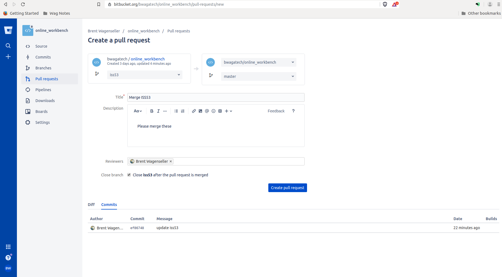

# Bitbucket

# Pull Requests

A [pull request](learn_to_code/git/git_concepts?id=pull-request) is a formal request to [merge](learn_to_code/git/git?id=merging-branches) two [branches].

## Creating a PR

> This follows [this merge example](learn_to_code/git/git?id=common-merge-example).

To create a pull request, click on the `Pull requests` image (which is to the left of the screen); from there, press the `Create pull request` button (which is in the upper right):


Now its time to pick the two branches to merge. For the first branch, select the child branch (in our case its `iss53`) on the left and the parent branch on the right (in our case its `master`). This actually mirrors [a common merge methodology](learn_to_code/git/git?id=methodology-of-merging).

Next, fill out the title, a good description, and the reviewers. The reviewers are important, as (in theory) they will review the code for any errors or inconsistencies.

For the final configuration, check the `Close XXX after the pull request is merged`. This will close the child branch automatically after it is merged.

To complete the request, press the `Create pull request` button:



## Approving a Pull Request

To approve a pull request,  click on the `Pull requests` image (which is to the left of the screen); from there, find the specific pull request you are looking for and click it:


You will now view the changes that will be made with this merge.

At this point you could simply press the `Merge` button which will actually perform the [merge](learn_to_code/git/git?id=merging-branches) on the remote server, but its typically common practice to wait until at least one reviewer approves it (you can see the reviewer counts next to the `Approve` button in the upper right). Once you are clear to merge, click the `Merge` button:


!> If you see anything that mentions <font color="red">conflict</font>, you will have to follow [these instructions](learn_to_code/git/bitbucket?id=if-there-is-a-conflict).

To clean up any loose ends, you may want to [display merged branches](learn_to_code/git/git_cli_commands?id=displaying-merged-branches) and [delete the local child branches](learn_to_code/git/git_cli_commands?id=deleting-a-branch) as necessary.

## If There is a Conflict

> This follows [the instructions on bitbucket](https://confluence.atlassian.com/bitbucket/resolve-merge-conflicts-704414003.html) and uses [my merge example](learn_to_code/git/git?id=common-merge-example).

If you see anything that indicates a <font color="red">conflict</font> you must rectify it manually. Here is an example of what conflicts look like (in addition you will not be able to press the `Merge` button):


From this point, the only thing you can do is manually rectify this on your local machine. Follow these steps back on your [local repository](learn_to_code/git/git_concepts?id=local-repository):

1\. Enter the directory that contains your [local repository](learn_to_code/git/git_concepts?id=local-repository).

2\. Pull the most recent version of the repository to your local machine:
```
git pull
```

3\. Checkout the child branch (in [our example](learn_to_code/git/git?id=common-merge-example) this is `iss53`):
```
git checkout iss53
```
* Replace `iss53` with your own child branch name.
* This may seem like its at odds with [my common merge methodology](learn_to_code/git/git?id=methodology-of-merging), but its really not. 
* This will work even if you do not have a local repository for this branch.

4\. Pull the destination branch (parent) into the source branch (child); pulling the destination will try to merge it with the source:
```
git pull origin master
```
* Replace `master` with your own parent branch name.
* The [remote name](learn_to_code/git/git_concepts?id=remote-name) will most likely be `origin`, but if its not, change it above.

5\. At this point, [follow these instructions](learn_to_code/git/git?id=dealing-with-conflicts) to rectify all conflicts. Unfortunately it can get messy.

6\. Add the changes and commit:
```
git add --all
git commit -m "Enter some commit message"
```

7\. Push the changes to the remote repository:
```
git push origin iss53
```
* Replace `iss53` with your own child branch name.

8\. Refresh the web page and the conflicts should be resolved:


9\. Continue [approving the pull request](learn_to_code/git/bitbucket?id=approving-a-pull-request).

---