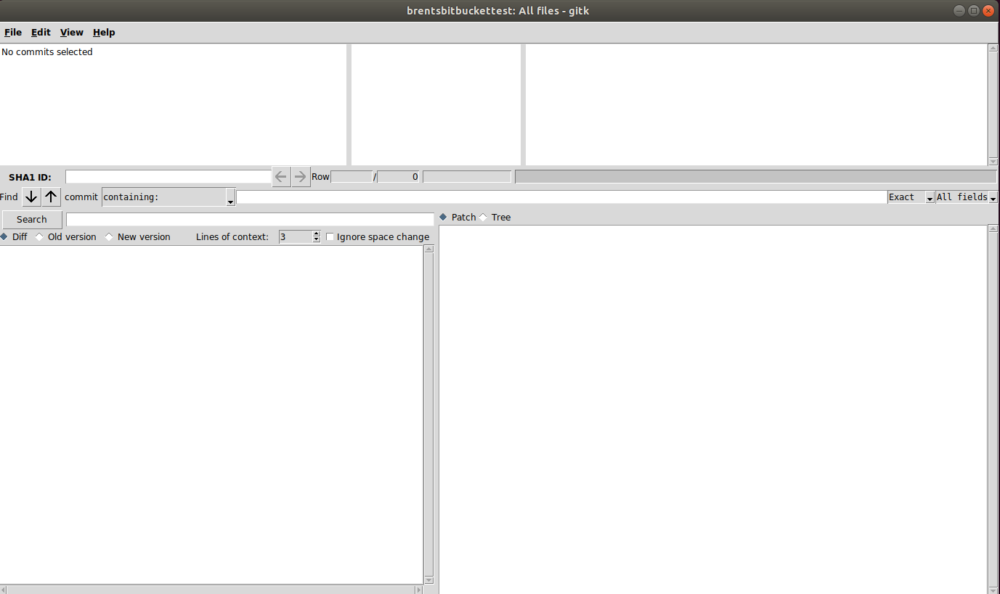
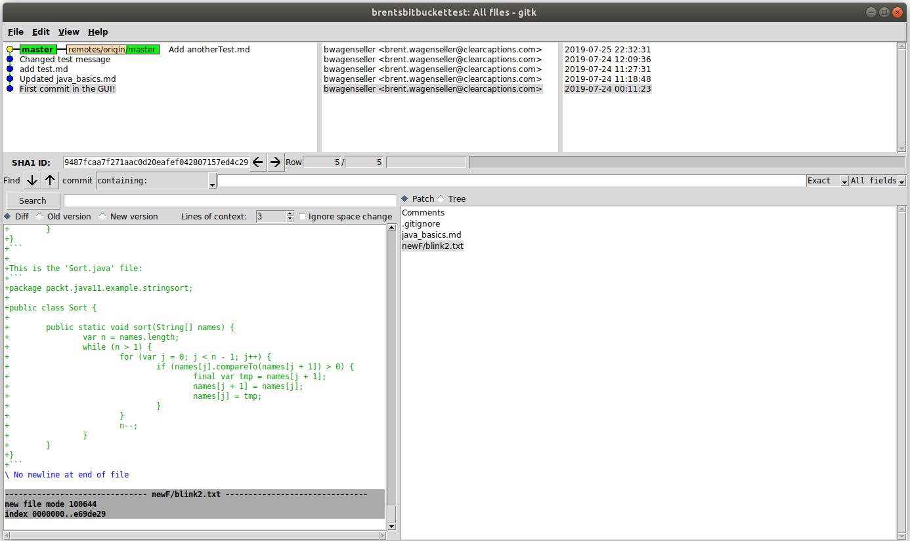
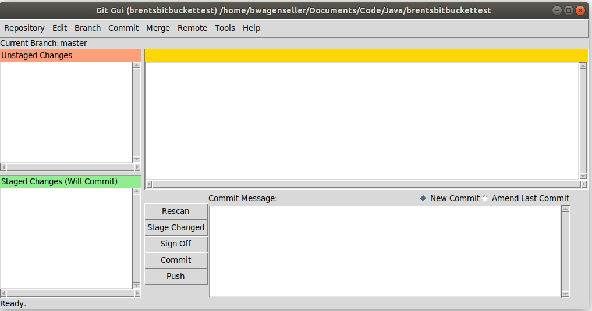
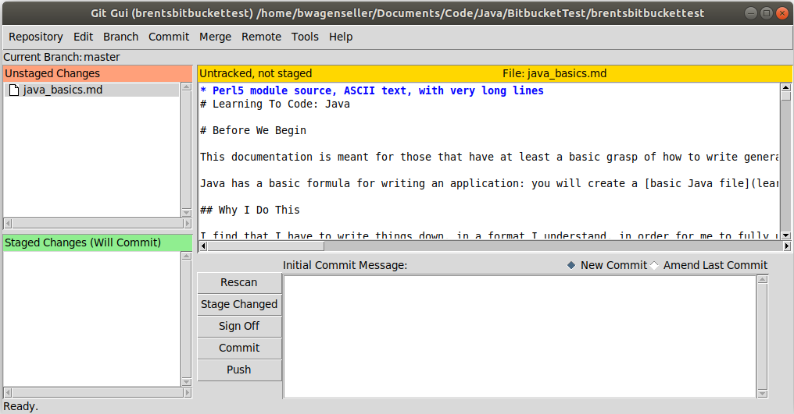
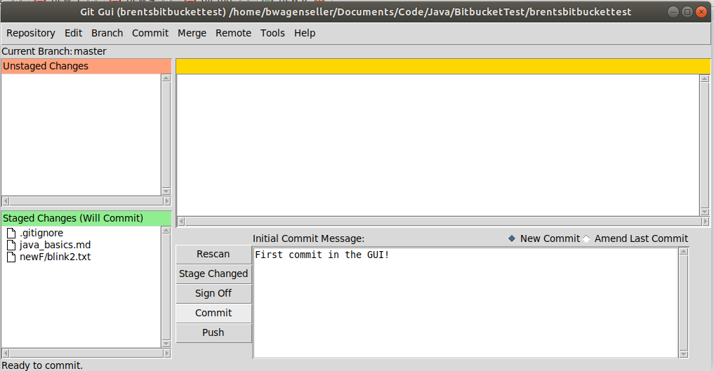
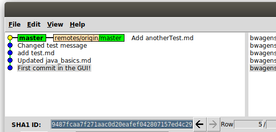
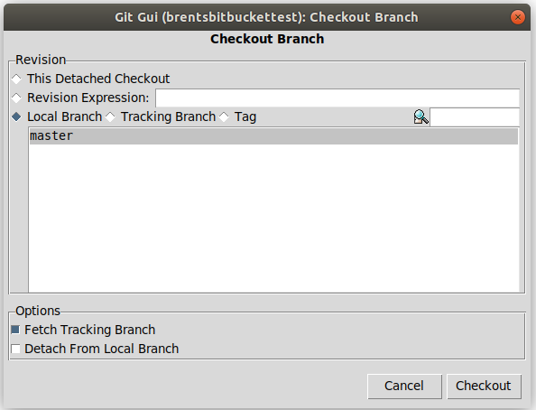
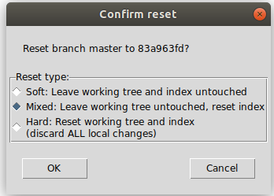

# Git

!> Brent - Do 6

# Basics of Git

>For more info on Git, [please go to Git-Scm](http://git-scm.com/), [a major online book on Git-Scm](https://git-scm.com/book/en/v2/), or [Github](https://github.com/).

## Why Git?

Git is a <font color="green">version control</font> which can save changes to code. What makes Git powerful is:
* You can revert to previous versions of code at any time.
* Multiple people can work on the code at once.

The above equates to Git being a <font color="green">multi-directional free flow context</font>.

## Distributed Version Control System

Git is a <font color="green">Distributed Version Control System</font>, which means that there is a copy of _all_ code on a remote server _as well as_ locally on your machine. 

## Installing Git (Command Line)

To install Git, [follow these instructions]

## Snapshots

You can revert to any version of any file in Git; this is possible because Git takes a <font color="green">snapshot</font> of the entire set of files instead of storing the changes from one version to the next (although note that if a file remains unchanged, a simple _reference_ is kept to the previous file). This means Git can restore previous versions quickly (instead of having to build following a change tree).

---

# Git GUI

You can use a GUI for Git in Ubuntu. I will try to mention both the <font color="green">CLI</font> and <font color="green">GUI</font> instructions for commands.

## Git Installation

**<font size="4">Git on Ubuntu</font>**

I covered how to install Git for Ubuntu (the command line interface (<font color="purple">CLI</font>)) for Git [here](ubuntu/server_build?id=installing-git).

**<font size="4">GUI on Ubuntu</font>**

To install the Git GUI in Ubuntu (must be done as root):
```
apt-get install git-gui
```

!> Do NOT use `git-gui` to launch the GUI - it will not work. Instead, use `gitk`. Also note it MUST be launched from the local [repository](learn_to_code/git/git_concepts?id=repository) directory of the project.

## Launching Git GUI

**<font size="4">Ubuntu</font>**

> You must first either clone or [initialize](learn_to_code/git/git?id=initialization-for-each-project-local) the project! If you do not do either one of these Running `gitk` will return nonsense.

To launch the Git GUI in Ubuntu, navigate to the [repository](learn_to_code/git/git_concepts?id=repository) and type `gitk`.

!> If you forget to navigate to the repository, the Git GUI will freak out. **Do not** forget to navigate to the repository _first_, then launch `gitk`!

Here is the initial screen:




## Git GUI Screens

There are two main screens for the Git GUI: The 'Visualize all Branch History' screen and the Git command screen.

The initial screen that opens is the 'Visualize all Branch History' screen, which shows you the history of all [branches](learn_to_code/git/git_concepts?id=branch). This screen looks similar to:




In order to get to the Git command screen (where you can actually issue commands), click `File`->`Start git gui` on the 'Visualize all Branch History' screen. The Git command screen looks something like this:




# Initializing

## One-Time Initialization

Its best to set up Git locally and globally, so Git can identify and group changes made to files in any repository.

```
git config --global user.name "user_name"
git config --local user.name "user_name"
git config --global user.email "email_id"
git config --local user.email "email_id"
git init
```
* replace `"user_name"` with your user name
* replace `"email_id"` with your email


## Setting Password

> I first found these instructions [here](https://stackoverflow.com/questions/11403407/git-asks-for-username-every-time-i-push).

It is possible to store your password so you do not have to constantly re-enter it for every interaction with the remote repository (push, pull, etc). From what I understand, you need to run `git config credential.helper store` and then do a push; you will be asked for a username/password, but from then on there will be no need to enter a username/password.

Your credentials will be stored in the file `.git-credentials` in your home directory, but beware - its unencrypted (although the permissions are set to `700`).

You must do this for _every_ repository; if you have done this previously for a different repository - even if it is the same provider (GitHub, Bitbucket, etc) - you _must_ run `git config credential.helper store` after _every_ time you clone a project _for that specific project_. Apparently, each repository _must individually_ be alerted to the fact that its username / password exists in `.git-credentials` (I suspect something is set in the `.git` folder to let Git know this local repository's credentials are stored). This means that if you are initializing a project with [clone](learn_to_code/git/git?id=cloning-a-project), you will still need the password as technically it will be a new local repository - with its own `.git` folder - and thus will have no knowledge of the saved credentials.

## Initialization for Each Project (Local)

> This does _not_ need to be done for repositories that already exist remotely - for repositories that already have a remote server, use [clone](learn_to_code/git/git?id=cloning-a-project).

When you wish to create a Git project that will either remain local to your machine _or_ will eventually exist on a remote repository **and** you will eventually use this local repository to make the remote repository, you must initialize the project. Git needs to be initialized for every project - more specifically, a `.git` directory needs to be created in the working directory. This `.git` folder houses all the history about file changes made to your project.

**<font size="4">Initialization on the Command Line</font>**

To initialize on the command line, go into the directory you with to set as the [repository](learn_to_code/git/git_concepts?id=repository) and type:
```
git init
```

---

# Interacting with Remote Repository

As stated, a Git project can be purely local _or_ it can be both local **and** remote; there are a few advantages to having a remote repository:  
* Multiple people can work on your project at once.  
* You can work on the project from multiple locations.
* Multiple people can work from multiple locations.

This is how to set up a remote repository.

## Setting up a Remote Repository

There are multiple ways to get a remote repository; two popular (and free) websites to do this are:
1. [GitHub](https://github.com/)
2. [Bitbucket](https://bitbucket.org)
 * [Here](https://www.atlassian.com/git/tutorials/learn-git-with-bitbucket-cloud) is Bitbucket's tutorial on how to do basic things like create a remote repository.

It is important to know how to get the address of your repository; this can be done _after_ you set up the remote repository initially. For Bitbucket, if you traverse to the main page of the repository, a `Clone` button will be in the upper right of the page; clicking it will give you the `clone` command, but this will _also_ include the address of the remote repository. An example would be:
```
https://YOUR_BITBUCKET_USERNAME@bitbucket.org/GROUP/repository.git
```
* `YOUR_BITBUCKET_USERNAME` is your username in Bitbucket.
* `GROUP` is the group; if this is your personal repository this may be your username, but if it is your company's Group it will probably reflect your company's name.
* `repository.git` is the repository; the base name will be different (it will probably match your local base directory for your local repository) but it will end in `.git`.

Remote repositories _must_ be initialized remotely; this is done in various ways depending on the host (such as GitHub or Bitbucket), but regardless of which remote service you choose, you must initialize the repository on their system.

Once the remote repository is initialized, you should rectify this with (at least one) local repository. You have one of two options available:
1. [Clone the remote repository](learn_to_code/git/git?id=cloning-a-project) on your local machine. This is a good choice if A) you already have code written and stored remotely or B) you have no code written anywhere.
2. If your local repository has code you wish to save / store, overwrite the remote repository with this local repository, either by [adding a source to your local repository](learn_to_code/git/git_cli_commands?id=adding-a-source) or [changing the source of your local repository](learn_to_code/git/git_cli_commands?id=changing-a-source). These are good choices if you have some good code locally and no code stored remotely (or the remote code can be completely overwritten).

## Adding An Origin to Local Repository

In some cases you may have existing code locally and wish to push it to a repository that did not exist when you made the local code. If this is the case, you can [set up a remote repository](learn_to_code/git/git?id=setting-up-a-remote-repository) - making sure you name it after your local repository - and then can [add that source to your local repository](learn_to_code/git/git_cli_commands?id=adding-a-source). Once the source is added, you will have access to a remote repository.

> Its also possible to  [change the source of your local repository](learn_to_code/git/git_cli_commands?id=changing-a-source) if it exists on one remote repository but you wish it existed on another.

## Cloning a Project

Its possible to <font color="green">clone</font> a project, which simply means go to the remote server and download the _existing_ code - along with all of its versions and history - to your local machine (please note this also [initializes](learn_to_code/git/git?id=initialization-for-each-project-local) the project, so there is no need to further initialize it locally before or after you clone it). To do so, go to the directory you wish to house the [repository](learn_to_code/git/git_concepts?id=repository); from there, the general command is:
```
git clone https://some.website/your_git_project.git
```

!> Keep in mind that `git clone` creates the repository, so there is no need to do so yourself (unlike [initializing a new local Git project](learn_to_code/git/git?id=initialization-for-each-project-local)). That said, make sure you run `git clone` in the directory you wish to house the repsoitory, as it will be created here. Make sure a directory that has the same name as the repository does not exist in the directory you are in!

You will have to get the link `https://some.website/your_git_project.git` from your server.  There are a few ways this is done, depending on the host you are using:
* If using <font color="purple">Bitbucket</font>, go to the project's main page - there will be a `Clone` button in the upper right corner of the page. Click this, and you will be able to copy the _entire_ git clone line (address and all). 


---

# Adding Files to a Project

!> Since adding files are project-specific, you _must_ be in the directory structure somewhere under your [repository](learn_to_code/git/git_concepts?id=repository).

> After you add files by following these instructions, you must [commit](learn_to_code/git/git?id=committing-changes) the changes for them to be added to the repository; if you are working with a remote repository, you will have to [push](learn_to_code/git/git?id=pushing-to-remote-repository) the changes to the remote repository after you commit them.

You will have to routinely add files and folders to your git project. 

## Manually Adding Files

Simply place the files in your [repository](learn_to_code/git/git_concepts?id=repository) and then add them like so:
```
git add myFile.txt
```
Here, we have added `myFile.txt` to our repository and are now [tracking](learn_to_code/git/git_concepts?id=tracked-files) the file.

We can also just add _all_ new files under the repository - to do so, use the commmand:
```
git add --all
```

Alternatively, you can add all files with:
```
git add .
```

And you can even add using a wildcard like so:
```
git add *.txt
```

The files are now [staged](learn_to_code/git/git_concepts?id=staged-file).

## Manually Removing (Non-Committed) Files

If you add a file with `git add` _before_ you commit it (i.e. the file is [staged](learn_to_code/git/git_concepts?id=staged-file), you can remove the file like so:
```
git reset myFile.txt
```

The file will _not_ be a part of the next commit if it is removed in such a fashion.

## Adding Files with the Git GUI

To add files with the Git GUI, we must first click the `Rescan` button (see below) to find all new files; then, click on the page icon (next to the file name) to move the file from the [unstaged changes](learn_to_code/git/git_concepts?id=unstaged-changes) pane to the `Staged Changes` pane:



The files are now [staged](learn_to_code/git/git_concepts?id=staged-file).

> If you wish to add _all_ unstaged files, simply press `Ctrl`+`I`.

## Removing (Non-Committed) Files with the GUI

To remove a [staged file](learn_to_code/git/git_concepts?id=staged-file), simply click on the 'paper' icon next to the file in the `Staged Changes (Will Commit)` area.

The file will _not_ be a part of the next commit if it is removed in such a fashion.

---

# Updating Files

> After you update files by following these instructions, you must [commit](learn_to_code/git/git?id=committing-changes) the changes for them to be added to the repository; if you are working with a remote repository, you will have to [push](learn_to_code/git/git?id=pushing-to-remote-repository) the changes to the remote repository after you commit them.

After you make changes to your file you will want to [commit](learn_to_code/git/git?id=committing-changes) them to the [local repository](learn_to_code/git/git_concepts?id=repository). Updating files are very similar to [adding them](learn_to_code/git/git?id=adding-files-to-a-project); the GUI instructions are exactly the same - even the `add` of the files. This may seem counterintuitive ("I already added the files, why am I adding again?") but it is what it is. 

Note that you only have to re-add the files that changed, not all files. The GUI will take care of this for you if you hit `rescan`, but if you are using the command line, you will want to run a [git status](learn_to_code/git/git_cli_commands?id=status) which will identify all changed files. Re-add these (or just re-add all), and then you will want to run a [commit](learn_to_code/git/git?id=committing-changes).

---

# Ignoring Files

Sometimes we do not want Git to track specific files (such as temp files). In order to force Git to ignore files we must use the file `.gitignore`. Create the file `.gitignore` and store it in your [repository directory](learn_to_code/git/git_concepts?id=repository).

Once this file is in place, type file names in this file to exclude them in Git. You can use wildcards too. For example, if your file contained these two lines:
```
blink.txt
~*.*
```
* _Any_ file named `blink.txt` would be ignored - no matter where it was in the directory structure (even if it is in a subdirectory under the [repository](learn_to_code/git/git_concepts?id=repository)).
* _Any_ file that matched the <font color="purple">pattern</font> `~*.*` would be ignored - no matter where it was in the directory structure (even if it is in a subdirectory under the [repository](learn_to_code/git/git_concepts?id=repository)). This specific pattern can be useful, as many temp files (such as Windows backup files) are created with a `~` in the beginning of the file.

As you can see, pattern matching is used, so **any** files that match that pattern are ignored, across all subdirectories. Its important to note, however, that _if the line in .gitignore contains a / pattern matching will **not** span subdirectories_. 

Say, for example, you had a subdirectory `{repository}/newDir` under your repository that contained a file called `blink.txt` that you do _not_ want to ignore, but you **do** want to ignore `blink.txt` in your main repository directory as well as in the subdirectory `{repository}/newDir/someOtherDir`. Your `.gitignore` could look something like this:
```
~*.*
/blink.txt
/newDir/someOtherDir/blink.txt
```
* Its also important to note that the repository directory is assumed to be the root - so `/newDir/someOtherDir/blink.txt` is _actually_ `{repository}/newDir/someOtherDir/blink.txt`

Since we use the `/`, the file `blink.txt` in the root repository directory will be ignored, the `blink.txt` file in `{repository}/newDir/someOtherDir/` will be ignored, but the file `{repository}/newDir/blink.txt` will _not_ be ignored.

> Note you _can_ have a `.gitignore` file in each subdirectory, if you wanted to - but usually only one `.gitignore` file is used.

---

# Committing Changes

> You must either [add files](learn_to_code/git/git?id=adding-files-to-a-project) or [update files](learn_to_code/git/git?id=updating-files) before you commit any changes. If you simply save files - but do not officially use the [add](learn_to_code/git/git?id=adding-files-to-a-project) or [update](learn_to_code/git/git?id=updating-files) Git process - your changes will _NOT_ be saved to the local repository!
> <br> <br>
> In addition, if you are working with a remote repository, you will have to [push](learn_to_code/git/git?id=pushing-to-remote-repository) the changes to the remote repository after you commit them.

Eventually, you will have to [commit your changes to the local repository](learn_to_code/git/git_concepts?id=commit), which basically means add your changes to the _local_ (as opposed to remote) version control system.

To do so manually, type something like the following:
```
git commit –m "some comment"
```
* The `-m` flag is to specify a comment, which you should _always_ do.
* Make _sure_ you are on the correct branch before committing!

To do so in the GUI, simply put your message in the `Commit Message` section and then press the `Commit` button:



After the commit you will be given a commit identifier (commit ID), which is used for various things ([checking out](learn_to_code/git/git?id=checking-out-a-branch-commit) a specfic commit ID, [interacting with a tag](learn_to_code/git/git?id=tag), etc.

!> Commiting changes only affects the _local_ repository; if yo ualso have a remote repository you must [push](learn_to_code/git/git?id=pushing-to-remote-repository) the changes there as well after your commit!


---

# Pushing To Remote Repository

When you [add](learn_to_code/git/git?id=adding-files-to-a-project) or [update](learn_to_code/git/git?id=updating-files) files and then [commit](learn_to_code/git/git?id=committing-changes) them to Git, you are adding them to the local [repository](learn_to_code/git/git_concepts?id=repository); if you have connected your local [repository](learn_to_code/git/git_concepts?id=repository) to a remote [repository](learn_to_code/git/git_concepts?id=repository), though, these commands do _not_ update the remote repsoitory. To do so, you must [push](learn_to_code/git/git_concepts?id=push) these changes to the remote repository.

---

# Checking Out a Branch / Commit

> See more CLI commands on [Git-SCM](https://git-scm.com/docs/git-checkout).

Git heavily relies on the concept of a 'checkout', which you can read more about [here](learn_to_code/git/git_concepts?id=checkout). In order to [checkout](learn_to_code/git/git_concepts?id=checkout) a previous [commit](learn_to_code/git/git_concepts?id=commit), you can do so in a few ways:
Practically speaking, you can issue a commit based on the [hash](ubuntu/linux_notes?id=file-hashes) of the commit (as a hash is given for _every_ commit made), the branch name, the tag name, or use relative syntax (HEAD^, HEAD~1).
* use the [SHA-1 hash ID](learn_to_code/git/git_concepts?id=sha1-id).
* use the [branch](learn_to_code/git/git_concepts?id=branch) name.
* use the [tag]((learn_to_code/git/git?id=tag)) name.
* use relative syntax using [HEAD](learn_to_code/git/git_concepts?id=head) (`HEAD`, `HEAD-1`, `HEAD^`)

!> Note that using anything but the branch name will result in a [detached HEAD](learn_to_code/git/git_concepts?id=detached-head) unless you also specify a new branch name [like this](learn_to_code/git/git_cli_commands?id=checkout-remote-branches) (this example uses remote branches but you can do the same for tags and hash IDs as well).

## Checkout in the GUI

To checkout a [branch] in the GUI, open the '[Visualize all Branch History](learn_to_code/git/git?id=git-gui-screens)' screen, and in the upper left you will see a visualization of all [branches](learn_to_code/git/git_concepts?id=branch) and [commits](learn_to_code/git/git_concepts?id=commit) for your current Git project. Select one of the commits (I selected my first commit, entitled 'First commit in the GUI!'). Notice that the selected commit's [SHA1 ID](learn_to_code/git/git_concepts?id=sha1-id) is visible in a label directly under the visualization:



You will need this SHA1 ID, so copy it.

Now, go to the '[Git command](learn_to_code/git/git?id=git-gui-screens)' screen and select `Branch` -> `Checkout`. On this screen, select the `Revision Expression` option and paste your SHA1 hash ID here, then click `Checkout`. You will notice that your project - and all its associated code - has reverted to its condition ([state](learn_to_code/git/git_concepts?id=state)) of that commit!

!> You will get a warning about a 'detached checkout' - this is actually a [detached HEAD](learn_to_code/git/git_concepts?id=detached-head) and is typically not good. Ways around this are to create a new branch _while_ checking out the commit ID _or_ checking out a branch and _not_ a specific commit ID.

You can go back to your main [branch] by following the steps above (just select the latest commit ID). You can also checkout a branch (without the need for a SHA1 hash); to do so, simply select the 'Local Branch' option and select your branch (I only have one here, and its the master branch):




## Checkout on the Command Line

To checkout on the CLI:  

1\. Find what you want to checkout:
* If you wish to checkout by [commit / SHA1 ID](learn_to_code/git/git_concepts?id=sha1-id) use the command [git log](learn_to_code/git/git_cli_commands?id=log) to find the commit ID you want to restore (you will have to [follow these instructions](learn_to_code/git/git_cli_commands?id=checkout-remote-branches) in the next step to avoid a [detached head](learn_to_code/git/git_concepts?id=detached-head) if you plan on making changes).  
* If you wish to checkout by [branch name](learn_to_code/git/git_concepts?id=branch), use [this](learn_to_code/git/git_cli_commands?id=displaying-all-branches) to show all branches or simply [this](learn_to_code/git/git_cli_commands?id=displaying-all-local-branches) command to show local branches (if you are checking out a remote branch with no associated local branch you will have to [follow these instructions](learn_to_code/git/git_cli_commands?id=checkout-remote-branches) in the next step to avoid a [detached head](learn_to_code/git/git_concepts?id=detached-head) if you plan on making changes).  
* If you wish to checkout by [tag name](learn_to_code/git/git_concepts?id=tags) use the command `git tag` to list the tag names available (you will have to [follow these instructions](learn_to_code/git/git_cli_commands?id=checkout-remote-branches) in the next step to avoid a [detached head](learn_to_code/git/git_concepts?id=detached-head) if you plan on making changes).  

2\. Use the command [git checkout](learn_to_code/git/git_cli_commands?id=checkout) to perform the checkout if you are simply switching to a branch; if you actually wish to make a new branch after checking out whatever you are checking out, [follow these instructions](learn_to_code/git/git_cli_commands?id=checkout-remote-branches) but substitute hash ID / tag name for the branch name if you are using one of those methods.  

## OOPS! Accidental Changes, Cannot Checkout

!> After using either of these two methods, use `git branch -v --all` to make sure the hash IDs of your local branch matches that of the remote branch (if you are utilizing a remote branch).

There are times when you accidentally make changes and save them but do not use `git add` or commit; if you do, Git will not allow you to check out another branch.

There are two ways of getting around this. The first is to simply d oa hard reset to the last commit:
```
git reset --hard
```
* If you use this method, just make sure you are in the right branch when its finished.


The second way is to stash the changes:
```
git stash save --keep-index
```

_Then_ checkout a different branch, and then checkout the branch where you accidentally saved (but did not `git add`) files, and then run:
```
git stash drop
```

The changes you accidentally made are now gone forever.

# Resetting a Branch

!> Please see [here](learn_to_code/git/git_concepts?id=reset) to understand how resets work. Its important to understand before use!

You can perform a branch [reset](learn_to_code/git/git_concepts?id=reset), which basically re-sets the branch's `HEAD`. See [here](learn_to_code/git/git_concepts?id=reset) for more info.

## Reset in the GUI

To perform a reset in the GUI:

1\. Open the '[Visualize all Branch History](learn_to_code/git/git?id=git-gui-screens)' screen.  
2\. Left click a commit from the branch visualization area: <br>  
  
3\. Select 'Reset XXX branch to here'.  
 * 'XXX' will be the branch associated with that commit.
 
4\. You will be presented with the reset options; pick one and press 'OK': <br>  


The reset is now performed, the results depending on if you picked soft, hard, or mixed (see [here](learn_to_code/git/git_concepts?id=reset) for the meanings of these).

## Reset on the Command Line

To perform a [reset](learn_to_code/git/git_concepts?id=reset) on the command line perform the following:  
1\. Make sure you are on the desired branch.  
2\. Use [git log](learn_to_code/git/git_cli_commands?id=log) to find the [commit ID](learn_to_code/git/git_concepts?id=sha1-id).  
3\. Use [git reset](learn_to_code/git/git_cli_commands?id=reset).

# Merging Branches

[Merging](learn_to_code/git/git_concepts?id=merge) branches is a very common occurrence.

## Common Merge Example

> This example borrows heavily from [git-scm.com](https://git-scm.com/book/en/v2/Git-Branching-Basic-Branching-and-Merging).

You have a [master branch](learn_to_code/git/git_concepts?id=master-branch) that contains your master code. You are asked to make a feature change (for issue #53), so you [check out a new branch based off the master branch](learn_to_code/git/git_cli_commands?id=create-new-branch-and-checkout) and name this branch 'iss53'. You do some work on this branch and then [commit](learn_to_code/git/git_concepts?id=commit) the changes. Unexpectedly, you are told you need to make a fix for a separate issue and deploy a patch _now_; to do so, you save / commit any changes for the branch <font color="orange">iss53</font>, [checkout](learn_to_code/git/git_concepts?id=checkout) the master branch, and then create a new branch called 'hotfix' - you will make the emergency changes in the <font color="orange">hotfix</font> branch and commit those changes. The commit history looks lie so (from [git-scm.com](https://git-scm.com/book/en/v2/Git-Branching-Basic-Branching-and-Merging)):


Once you are happy with the changes you have committed in the <font color="orange">hotfix</font> branch, you can merge the <font color="orange">hotfix</font> branch back into the master branch:
```
git checkout master
git merge hotfix
```

Now, if the merge was successful, [push](learn_to_code/git/git_cli_commands?id=push) the current branch to the remote server.  

Finally, since the <font color="orange">hotfix</font> branch is no longer necessary, you can [delete it](learn_to_code/git/git_cli_commands?id=deleting-a-branch).

## Methodology of Merging

When merging, its best to:  
1\. Identify the two [branches](learn_to_code/git/git_concepts?id=branch) to be merged.  
* One should be a <font color="purple">parent</font> of another; identify the <font color="purple">parent branch</font> and the <font color="purple">offspring branch</font>.  

2\. [Checkout](learn_to_code/git/git?id=checking-out-a-branch-commit) the parent branch.

3\. Issue the `merge` command on the <font color="purple">offspring branch</font>:
```
git merge offspring_branch_name
```

4\. If the merge was successful, [push](learn_to_code/git/git_cli_commands?id=push) the current branch to the remote server.

5\. If the merge was successful, [delete both the local and remote child branches](learn_to_code/git/git_cli_commands?id=deleting-a-branch) that were merged (obviously do not delete the parent branch).

## Dealing With Conflicts

Consider the following code:
```
public class someClass {
	public void firstMethod() {
		#will start with x's, but will be changed to y's in a hotfix
		int x;

		for (x = 0; x < 10; x++) {
			print x;
		}
	}

	public void secondMethod() {
		#will start with a's, but will be changed to b's in a hotfix and then c's in an issue fix 'iss53'
		int a;

		for (a = 30; a > 0; a--) {
			print a;
		}
	}
}
```

We will follow the story used in the [common merge example](learn_to_code/git/git?id=common-merge-example). For the sake of argument, say the above represents code in a file in the <font color="purple">master branch</font>. Using the <font color="purple">master branch</font> as a base, we make a child branch and call it <font color="purple">iss53</font> (using the command to [create a new branch from the current branch, checking that new branch out](learn_to_code/git/git_cli_commands?id=create-new-branch-and-checkout)), make the specified changes (which basically means change the 'a' variable to 'c'); we save the file, [update the tracking system](learn_to_code/git/git?id=updating-files), and then [commit](learn_to_code/git/git?id=committing-changes) the changes.  

We are then notified of an issue that needs the `hotfix` - so, we again [Checkout](learn_to_code/git/git?id=checking-out-a-branch-commit) the <font color="purple">master branch</font> and [make a new child branch](learn_to_code/git/git_cli_commands?id=create-new-branch-and-checkout), calling it <font color="purple">hotfix</font>, make the specified changes (which basically means change the 'a' variable to 'b' and 'x' variable to 'y'); we save the file, [update the tracking system](learn_to_code/git/git?id=updating-files), and then [commit](learn_to_code/git/git?id=committing-changes) the changes. 

At this point we have not merged anything, but we know the hotfix is a critical issue so we merge that in first. Using [our methodology of merging](learn_to_code/git/git?id=methodology-of-merging), we merge <font color="purple">hotfix</font> into the <font color="purple">master branch</font>. Yay! No issues.  

Later on, we try merging the branch <font color="purple">iss53</font> into the <font color="purple">master branch</font>; unfortunately, there are conflicts.

When you ran `git merge iss53` You probably saw someting like this (assuming your file name was `someClass.java`):
```
Auto-merging someClass.java
CONFLICT (content): Merge conflict in someClass.java
Automatic merge failed; fix conflicts and then commit the result.
```

There was a conflict. You can also see some info by running a `git status`:
```
On branch master
Your branch is up to date with 'origin/master'.

You have unmerged paths.
  (fix conflicts and run "git commit")
  (use "git merge --abort" to abort the merge)

Unmerged paths:
  (use "git add <file>..." to mark resolution)

	both modified:   someClass.java

no changes added to commit (use "git add" and/or "git commit -a")

```

If you open the file (in my case `someClass.java`) you will see this in the text:
```
<<<<<<< HEAD
		int b;

		for (b = 30; b > 0; b--) {
			print b;
=======
		int c;

		for (c = 30; c > 0; c--) {
			print c;
>>>>>>> iss53
```

Everything between `<<<<<<< HEAD` and `=======` indicates the code in the <font color="purple">parent</font> (which in our case is the <font color="purple">master branch</font>); this code was actually changed from the merge between the <font color="purple">master branch</font> and the <font color="purple">hotfix</font>, but since they were merged it appears as the <font color="purple">master branch</font>.  

Everything between `=======` and `>>>>>>>` (which is followed by the branch name) indicates the code in the <font color="purple">child</font> branch we are trying to merge (which in our case is the <font color="purple">iss53</font> branch); its clear that our <font color="purple">master branch</font> uses the variable 'b' while the <font color="purple">iss53</font> branch uses the variable 'c', which is an obvious conflict.

You can manually alter the files; keep the code you wish to keep (make **sure** to get rid of the `<<<<<<< HEAD`, `=======`, and `>>>>>>>` bits) and save it. At this point you must be mindful of any additional files Git may have created if you used a tool to visualize the conflicts (`XXX_BACKUP_`, `XXX_BASE_`, `XXX_LOCAL_`, and `XXX_REMOTE_` for _each_ conflict): Git will try to add these to your project, so its best to <font color="red">delete</font> them at this point.  

Now [update the tracking system again](learn_to_code/git/git?id=updating-files), and then [commit](learn_to_code/git/git?id=committing-changes) the changes.

>! Be **very** careful here - its possible to attempt to merge, see the conflicts, and try to jam through a `git add --all` followed by a commit; if you do this, it _will_ work but the conflicts will _not_ be resolved and you _will_ have the `<<<<<<< HEAD`, `=======`, and `>>>>>>>` bits in your code! Make sure to settle the conflicts.

> It seems that merging had no issue with the final use of the 'y' variable instead of the 'x'; the larger point here is so long as the code remains _unchanged by the child branch_ there will be no conflict; in other words, even though <font color="purple">iss53</font> is based off the <font color="purple">master branch</font> _before_ <font color="purple">hotfix</font> - meaning, in its own instance it had 'x' as the variable, even though the variable is now 'y' because <font color="purple">hotfix</font> was merged with the <font color="purple">master branch</font> - because <font color="purple">iss53</font> made no changes to that _section_ of code, Git does not consider there to be any conflict and happily accepts the previously merged variable 'y'.


**<font size="4">Using a Tool to Visualize Conflicts</font>**

If you try to use a conflict visualization tool, Git makes several copies of all files that have a conflict:
* `XXX_BACKUP_` seems to be the original file Git made, using the `<<<<<<< HEAD`, `=======`, and `>>>>>>>` tags.  
* `XXX_BASE_` seems to be the original file before _any_ merge affected it.  
* `XXX_LOCAL_` seems to be the original _parent_ version (in our case, <font color="purple">master branch</font>).  
* `XXX_REMOTE_` seems to be what the file looked like _at the time you made the child branch_ in addition to the specific changes you made in the child branch (that is to say, since we made the child <font color="purple">iss53</font> before we merged <font color="purple">hotfix</font> the original _parent_ version (in our case, the <font color="purple">master branch</font>), 'x' will be used instead of 'y' but also 'c' will be used instead of 'a').  
The above files _MUST_ be deleted manually before the commit or they _will_ be uploaded to the remote repository!

## Aborting a Merge

Sometimes [if there are conflicts with a merge](learn_to_code/git/git?id=dealing-with-conflicts) and you cannot be bothered to settle them you can simply back out / abort the merge. To do so type:
```
git merge --abort
```

In older versions of Git its:
```
git reset --merge
```

And on ancient versions its:
```
git reset --hard
```

## Pull Requests

A [pull request](learn_to_code/git/git_concepts?id=pull-request) is a request to merge two branches.

Pull requests are not officially part of Git, but they are incorporated into remote repositories that utilize a website. [Here](learn_to_code/git/bitbucket?id=pull-requests) is how pull requests are performed for bitbucket.

## Merge Cleanup

There will most likely be some cleanup that must be done after a merge: specifically, deleting old child branches that were merged to a parent branch.

Steps:

1\. Determine the remote child branch name that was merged. You should know this as you should be doing this immediately after a merge.

2\. [Delete the remote branch](learn_to_code/git/git_cli_commands?id=deleting-a-branch) if your [pull request functionality](learn_to_code/git/git?id=pull-requests) did not do so already.

3\. Perform a [pull](learn_to_code/git/git_cli_commands?id=simple-pull).

4\. [Prune the remote repository](learn_to_code/git/git_cli_commands?id=clean-up-remote-branches) to clean up old remote branch links in your local system.

5\. [Display all branches](learn_to_code/git/git_cli_commands?id=displaying-all-branches) with `git branch -v --all`.

6\. Take note of which local branches are defunct. You probably know from step #1, but of not, running step #5 lists them. Example:
```
  add_XML                1b49acd Added XML file
* develop                00a0083 Merged in iss53 (pull request #2)
  iss53                  2a23251 [gone] iss53 changes
  master                 bb16bb1 re-set
  remotes/origin/add_XML 1b49acd Added XML file
  remotes/origin/develop 00a0083 Merged in iss53 (pull request #2)
  remotes/origin/master  bb16bb1 re-set
```
* Branch `iss53` was merged and no longer exists remotely; we know because
 * It has no representation in origin.
 * It is marked as `[gone]` in the comments.

7\. [Delete all pertinent local branches](learn_to_code/git/git_cli_commands?id=deleting-a-branch).

---

# Tag

!> While [tags](learn_to_code/git/git_concepts?id=tags) make for an easy way to earmark a point in time for a branch, note that [checking them out](learn_to_code/git/git?id=checking-out-a-branch-commit) will lead to a [detached HEAD](learn_to_code/git/git_concepts?id=detached-head) unless you also specify a new branch name [like this](learn_to_code/git/git_cli_commands?id=checkout-remote-branches) (substituting `origin/remote_branch` for the tag name).

Git [tags](learn_to_code/git/git_concepts?id=tags) are a nice way to bookmark spots in the code.

## Listing All Tags

To list all tags, simply type
```
git tag
```
* This can also use pattern matching with the `-l` flag; for example, `-l v3.*` will show all tags that start with 'v3.'.


## Creating Tags

There are two types of tags:
* Lightweight tag
 * Simply points to a particular commit.
* Annotated tag
 * Stored as full objects
 * They are checksummed.
 * They contain information about their creation (date/time, who created them, etc)
 * Have the ability to show a message / description.
 * Can be signed with the GNU Privacy Guard.
 
> It is highly advised to use annotated tags over lightweight tabs.

To create an annotated tag, type:
```
git tag -a my_tag_name -m "Associated tag message"
```
* the `-a` flag creates an annotated flag; _without this flag_ (and the `-m` flag)_, this would ve a lightweight tag_.
* `my_tag_name` is your chosen tag name.
* `-m` lets you put a description on the tag.

**<font size="4">Create a Tag Using Commit ID</font>**

To create a tag using a commit ID, use [log](learn_to_code/git/git_cli_commands?id=showing-all-commits) to find a [commit ID](learn_to_code/git/git_concepts?id=sha1-id) (we will use `1b49acd`) and then type the following:
```
git tag -a my_tag_name 1b49acd
```
* `my_tag_name` is your chosen tag name.
* `1b49acd` is the [commit ID](learn_to_code/git/git_concepts?id=sha1-id) we are using.

## Showing Tag Information

To show tag information:
```
git show my_tag_name
```
* `my_tag_name` is your chosen tag name.

## Uploading Tags

Tags ae not automatically pushed to the remote repository - they must be manually shared with it. To do so, type the following:
```
git push origin my_tag_name
```
* `my_tag_name` is your chosen tag name.
* `origin` is the [remote name](learn_to_code/git/git_concepts?id=remote-name); it is usually `origin`.

If you just want to push all tags, its:
```
git push origin --tags
```
* `origin` is the [remote name](learn_to_code/git/git_concepts?id=remote-name); it is usually `origin`.

## Deleting Tags

To delete a tag locally, its:
```
git tag -d my_tag_name
```
* `my_tag_name` is your chosen tag name.

To delete a remote tag its:
```
git push origin --delete my_tag_name
```
* `my_tag_name` is your chosen tag name.
* `origin` is the [remote name](learn_to_code/git/git_concepts?id=remote-name); it is usually `origin`.

## Checking Out Tags

When checking out a tag, if you do not assign it a new branch name it will be considered a [detached HEAD](learn_to_code/git/git_concepts?id=detached-head); to avoid this, checkout a tag while also giving it a new branch like so:
```
git checkout my_tag_name -b new_branch
```
* `my_tag_name` is your chosen tag name.
* `new_branch` is the new branch name you are creating.
* This technically branches off of whatever branch the tag was originally on.

---


# Quick Commands to Update

These are just quick commands that can be used if you simply keep one branch and want to update the master:

```
git add --all
git commit -m "Initial Commit"
git push -u origin master
```


