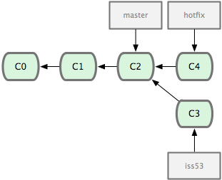

# Git Concepts

# Checkout

> For more information [see this article on Stack Overflow](https://stackoverflow.com/questions/15296473/what-do-git-checkouts-really-mean).

# Commit

A commit officially stores all of your changes made to your local [repository](learn_to_code/git/git_concepts?id=repository), officially registering the changes for (at least local) version control. Note `commit` does _not_ push data to the remote repository, its simply used to commit any and all changes to your _local_ repository.

It should be noted that every commit will give a commit ID, which uniquely identifies the commit.

> See [this article on Git-Scm](https://git-scm.com/book/en/v2/Git-Basics-Viewing-the-Commit-History) for more on viewing the commit history.

---

# Repository

The repository is simply the base directory that will house your Git project; it can also reference the _concept_ of your project as well.

As stated previously, there is a local repository (which resides on your machine) and a remote repository (which resides on some remote server). In theory, **ALL changes** are kept both locally and remotely, so you can revert to a previous version of any file and you can do so locally. That said, most people make a local `commit` (as `commit` is local) and do not always issue commands to send updates to the remote server (i.e. a `push`) until after a few `commit`s are made.

---

# Unstaged Changes

Unstaged Changes are changes that have happened since the last known [state](learn_to_code/git/git_concepts?id=state) of the [repository](learn_to_code/git/git_concepts?id=repository).

---

# Staged File

A staged file is one that is marked to be committed (but not actually committed yet). 

> It seems that staged and unstaged my not be fully in opposition, as it _seems_ a file can be unstaged (not committed) and also staged (marked to be committed), but this is unclear to me.

---

# State

State represents the relation of items in the project. For example, a specific configuration of files with specific data is considered a state; changing the data in any of these files (and then saving the data) means the state of the project is now changed to a new state - one that reflects the additional (or in some cases, even removed) data.

A short (but not exhaustive) list of how state can change:
* Adding one (or more) files to the [repository](learn_to_code/git/git_concepts?id=repository).
* Deleting one (or more) files from the [repository](learn_to_code/git/git_concepts?id=repository).
* Adding data to one (or more) files.
* Deleting data from one (or more) files.

Typically, the state is not considered 'changed' until a commit or push is issued.

---

# Tip (or Branch Tip)

A tip or branch tip references the most recent commit on a branch.

It is also possible to have multiple tips per project; specifically if there are multiple branches. For example, as taken from the [Pro Git Book](https://git-scm.com/book/en/v2):

There are actually 3 branches here, each with a tip: `master` (commit 2), `hotfix` (commit 4), and `iss53` (commit 3).

---

# Tracked Files

Tracked Files are files that Git is monitoring for changes. Its possible to have _untracked_ files in the [repository](learn_to_code/git/git_concepts?id=repository) - usually these are files that were just added and we intend on tracking them later, but there are also cases where we wish for certain files to _never_ be tracked (for these we use the file [.gitignore](learn_to_code/git/git?id=ignoring-files)).
