# Learning To Code: Java

# Before We Begin

This documentation is meant for those that have at least a basic grasp of how to write general code (so you understand what 'compile' and 'run' means, you understand 'if' conditionals, 'while' and 'for' loops, etc). This documentation is to teach people in this category the general concepts of Java first, and then we will start writing some code. <br> <br>

Java has a basic formula for writing an application: you will create a [basic Java file](learn_to_code/java?id=basic-file-setup-first-java-program) that has [a class](learn_to_code/java?id=java-classes); you will [compile](learn_to_code/java?id=basic-compiling) your code, and then [run](learn_to_code/java?id=basic-script-running) it. You can re-use code with [JAR Files](learn_to_code/java?id=jar-files) if you wish.

## Why I Do This

I find that I have to write things down, in a format I understand, in order for me to fully understand a topic; therefore I take notes on subjects I try to learn. These notes are an artifact of that line of thinking.

## My Note Sources

My main note sources are various code examples I have seen on the web, [stackoverflow](https://stackoverflow.com/), and the Packt book [Java Projects (Second Edition) by Peter Verhas](https://www.packtpub.com/application-development/java-projects-second-edition).

## Java Version

This document was made for Java version 11.

## Installing Java

I wrote how to install java either [with the default jre](ubuntu/server_build?id=install-java-jre) or [from Oracle](ubuntu/server_build?id=installing-java-from-oracle).

## Basic File Setup / First Java Program

The basic file setup for a basic java program is:

```
package dragons;

public class DragonBorn {

	public static void witnessDragonBorn() {
		System.out.println("You.....you took it's soul.");
	}

	public static void main (String[] args) {
		DragonBorn.witnessDragonBorn();
	}

}
```
* The file extension for this file must be .java.
* Classes are a big thing in java; [we will discuss more later](learn_to_code/java?id=java-classes), but for now just know a class is a collection of functions and variables that are centered around a similar idea. I have named the class here 'DragonBorn', but feel free to name it whatever you want.
 * Know that whatever you name the class you must ALSO name the file that same thing; so for example, the above MUST be in a cile named 'DragonBorn.java'.
* If we want the .java file to be run-able (sometimes you do not want to directly run it, but other times you do), you MUST include a function called `public static void main (String[] args) { }` as we did above. Whatever is in this will run when [we run it](learn_to_code/java?id=basic-script-running).

> If you want to use the `module-info.java` file (see below), you *must* include a 'package' as well (in the above code this is defined as 'package dragons;'). The package name *must* be a module in the file `module-info.java`. However if you do not use `module-info.java` and are just writing a quick program, you do not have to declare a 'package' in your .java file (and for small things I would not recommend it, as [there are some consequences / things you have to do differently when using a package](learn_to_code/java?id=notes-on-using-module-infojava)).


Another file named `module-info.java` is also usually required (for more complex Java projects):

```
module dragons {
	requires someOtherPackage;
}
```
* The module MUST be named (here we name it 'dragons'; also note you are pretty much forced to use a lowercase letter for the first letter.
* You can require other packages here. This is important when you want to reference other packages.

## Notes On Using module-info.java

Using `module-info.java` will have some consequences:
* You MUST have a 'package' name for every .java file you write (i.e. you must declare a package like 'package dragons;' does above) AND the package name in the .java file MUST be present as a 'module' name in module_info.java.
* You will still have to use the 'include' statement in your .java file if you are referencing other classes on the classpath (it seems that if you do not declare a package and do not use a `module-info.java` file, you may not have to 'include' it).
* If you are using a [JAR file](learn_to_code/java?id=jar-files):
 * If that JAR file was built prior to Java 9 - or if it does not have a package name - _in addition to including it on the classpath_, you MUST require it in the `module-info.java` file as well;  for example, if your current Java project package name is 'somePackageName' and you included the file `SomeJAR.jar` in the classpath, you MUST require SomeJAR in the module somePackageName in the file `module-info.java` like so:
```
module somePackageName {
		requires SomeJAR;
}
```
 * Note you do NOT include the .jar file type - just the first part of the name.
   * Java will give you a warning that this may be ambiguous, but you may not have any other option for JAR files pre-Java 9 (and it will still work). 
	   
# Java Classes

## Description of a Class

Java classes are a bit overwhelming but the truth is, they are fairly straightforward. A class can be considered a grouping of things; so for example, there could be a 'building' class/group, and members of this group are things like house, skyscraper, shed, outhouse, etc. The idea of a 'Building' is a bit vague - and at first, classes are a bit vague - but things that are _defined_ as a building - a house, for example - is a bit more granular.

Early in this document I defined a [DragonBorn class](learn_to_code/java?id=basic-file-setup-first-java-program); this was named from a concept in one of my favorite video games, [The Elder Scrolls V: Skyrim](https://en.wikipedia.org/wiki/The_Elder_Scrolls_V:_Skyrim). The [Dragonborn](http://elderscrolls.wikia.com/wiki/Dragonborn_%28Lore%29) refers to someone born with the blood and soul of a dragon, but the body of a mortal human; there are multiple people who were 'Dragonborn' throughout the history of Skyrim.

So, 'Dragonborn' is a class, but any _individual_ instance of a 'Dragonborn' is not a class, but a specific person (such as the main character in Skyrim). 

## Class vs Object

You must know the difference between a class an an object; a class is a grouping, but an object is an instance of that class; that is to say, class:object as Dragonborn:(main character in Skyrim).

Objects are declared with the `new` keyword.

If you still need help on understandng the differences between a class and an object, [this handy website](https://www.javatpoint.com/difference-between-object-and-class) sums it up nicely:

| Object | Class |
|    ---   |   --- | 
| Object is an instance of a class. | Class is a blueprint or template from which objects are created. |
| Object is a real world entity such as pen, laptop, mobile, bed, keyboard, mouse, chair etc. | Class is a group of similar objects. |
| Object is a physical entity. | Class is a logical entity. |
| Object is created through new keyword mainly <br> e.g. Student s1=new Student(); | Class is declared using class keyword <br> e.g. class Student{} |
| Object is created many times as per requirement. | Class is declared once. |
| Object allocates memory when it is created. | Class doesn't allocated memory when it is created. |
| There are many ways to create object in java such as new keyword, newInstance() method, clone() method, factory method and deserialization. | There is only one way to define class in java using clas |

## Defining Scopes in Classes

Scope, in computer science terms, can be boiled down to 'what parts of the code have visibility to this entity'; practically, we must worry about the scope of several things, usually functions or variables. For example, some variables can only be seen inside of specific classes (or functions) and cannot be referenced outside of that class or function; other times, variables are _global_ and can be referenced anywhere in the code.

When class functions are defined as _public_, those functions can be referenced from entities outside of the class; when declared _private_, only other functions inside the class itself can access private functions. Using our [DragonBorn class](learn_to_code/java?id=basic-file-setup-first-java-program) class, the DragonBorn class function `public static void witnessDragonBorn()` is private; if there exists some other Java code that uses the DragonBorn class, it could create a DragonBorn object and call this function directly:
```
...
DragonBorn heroOfSkyrim = new DragonBorn();
heroOfSkyrim.witnessDragonBorn();
...
```

This would print "You.....you took it's soul."

## Defining Static Entities in Classes

We see the word _static_ in the defintion of the witnessDragonBorn() function: this means that we dont necessairly have to declare an object, we can just call this function from the class directly;  this means that instead of writing 
```
...
DragonBorn heroOfSkyrim = new DragonBorn();
heroOfSkyrim.witnessDragonBorn();
...
```

...we could simply write:
```
...
DragonBorn.witnessDragonBorn();
...
```

## Class Constructors

Each time we wish to use a class (by creating an object), we must do something like so:
```
Sort sorter = new Sort();
```

This says 'we are creating a new object called 'sorter', it will be of type 'Sort', and we wish to create this now (with `new Sort()`)'. Each time this is done, the class **constructor** is called, which is a function that is called when an object is created. Technically, a constructor does not return a value because it returns the object itself.

The contstructor may do nothing at all, but oftentimes it helps initialize the object. There can be multiple constructors for the same class, each with a different parameter list; or, there may be no constructor at all, at which point Java will make one for the class (a bare bones constructor).


## General Notes on Classes

Notes:
* Class names start with upper-case letters.
* Static methods / functions in the same class do not need the class name to be called.
* The `this` keyword can be useful.
 * For static functions in the class, `this` just represents that function.
 * For nonstatic functions / methods, `this` will represent that _instance_ of the method /function in the object.
* There can be multiple classes in a single .java file, but this is usually not the case.
 * This stems from an old Java practice that allowed multiple classes so long as only one was public, but this is frowned upon by developers now.

---

# Basic Compiling / Running Code

In order to actually run the code, you must compile it (with the `javac` command) and then run it (with the `java` command). We will briefly discuss this here.

## Basic Compiling

The basic way to compile is `javac NAME_OF_JAVA_FILE_GOES_HERE.java`. 

That said, this can _quickly_ become overwhelming for larger projects; its best to compile using [Ant](learn_to_code/java?id=compiling-with-ant), [Maven](learn_to_code/java?id=compiling-with-maven), or Gradle.

## Advanced Compiling

More often than not, your projects will be so massive that you will not want to compile dozens - or even hundreds - of .java files with `javac`. The oldest way to do this is 'make', but this is not often used in Java anymore. The two largest tools that are used to compile Java code are [Ant](learn_to_code/java?id=compiling-with-ant) and [Maven](learn_to_code/java?id=compiling-with-maven).

## The Class File

Compiling the Java file will create a .class file in the same directory (with the same name, sans extension), which will be a binary file. Its this .class file that actually runs when we run the .java file.

> It is easy to ge confused by a class and the class file; the class file is a compiled file that contains the 'machine code' of the class. If I ever reference the .class (with the dot), I am referencing the .class file.

## Basic Script Running

There seems to be two different methods of running Java code: when a 'package' is declared in the .java file and when there is no 'package' declared.

**<font size="4">When a Package Name is Declared</font>**

When a package name is declared in the .java file, after you have [compiled the single file](learn_to_code/java?id=basic-compiling), you can run it simply by running `java NAME_OF_JAVA_FILE_GOES_HERE.java`. Note that, even though the [class file is actually what runs](learn_to_code/java?id=the-class-file), we still reference the .java file here anyway.

**<font size="4">When a Package Name is Not Declared</font>**

If you try to run the file name when you declared a 'package SOMENAME;' in the .java file (that is to say, if you try to run the file with `java NAME_OF_JAVA_FILE_GOES_HERE.java`), you will see this error:
```
error: class found on application class path: DragonBorn
```

Instead, when you do not declare a package name, simply lop off the .java from the file name:
```
java NAME_OF_JAVA_FILE_GOES_HERE
```


## The Classpath

The *classpath* is simply a listing of locations to look for .class files; we can put this listing together and then pass it to Java. This will enable us to reference multiple, distributed .class files anywhere on the hard drive (or server). For example, lets say we wrote an awesome class called 'AwesomeDateTime' last week and stored it to the Unix directory '/home/brent/awesomefunctions'. If we put '/home/brent/awesomefunctions' in the classpath, we could reference the class 'AwesomeDateTime' in any other Java program!

You list the class path as an option after the `java` command; so for example, if we wanted to include our new class into our DragonBorn class (for the sake of the argument, say we used 'AwesomeDateTime' in the DragonBorn class), we would compile our DragonBorn class like so:
```
javac -cp '/home/brent/awesomefunctions' DragonBorn.java
```

And then to run it we would use:
```
java -cp '/home/brent/awesomefunctions' DragonBorn.java
```

If you wanted to add multiple paths, just list them and separate them with a ':' in Unix (or a semicolin ';' in Windows).

!> When I tested this, I did *not* have to do any sort of 'import' statement in DragonBorn.java to use AwesomeDateTime, it just 'worked'. Note that I did not declare a package name [like I did in the example 'java file](learn_to_code/java?id=basic-file-setup-first-java-program).

# JAR Files

A Java JAR file is a collection of compiled Java classes that act as a Java application (a file with  a.jar extension); it houses Java classes that can actively be imported (and then used) in other Java projects, and (in many cases) it can directly run code. JAR files can also be thought of as a pre-compiled Java 'zipped' file: it and can be opened as a compressed file, and if you do you will likely see a directory structure (like a zipped file) with a collection of various [compiled class files](learn_to_code/java?id=the-class-file).

## MANIFEST.MF

All JAR files must have a `MANIFEST.MF` file; this file is usually in the folder `META-INF/` in the JAR file. At the least, this file contains meta information about the JAR file.

## Creating a JAR File

To create a JAR file, you must first [compile the .java file](learn_to_code/java?id=basic-compiling) and then use the command `jar` like so (we will use the [basic Java file from above](learn_to_code/java?id=basic-file-setup-first-java-program), but take care to NOT include the 'package' (so delete 'package dragons;' from that file)):
```
jar -cf dragon.jar DragonBorn.class
```
* The 'c' tells java to create a new JAR file.
* The 'f' names the new JAR file.
* All classes listed will be included in the JAR file.

## Running Java from a JAR File

To run a Java appication from a JAR file, you must specify the class in the file (and that class *must* have a main() function):
```
java -cp dragon.jar DragonBorn
```
* Note we are technically putting our JAR file on [the classpath](learn_to_code/java?id=the-classpath) and then running it.


## Using JAR files in the Classpath

You can also use JAR files (will be explained shortly) in the classpath, which means you will *also* have access to it's classes in your own Java code; the major difference is since JAR files are 'archives' (like a ZIP file), a JAR file acts like a directory itself; therefore, when putting a JAR file on the classpath you specify the _name_ if the JAR file as well (if you do not, `javac` will error out).

For example, if we packaged the class 'AwesomeDateTime' in a JAR file called 'AwesomeDateTime.jar' in the directory '/home/brent/awesomefunctions' and wanted to reference it in our DragonBorn.java file, we would have to compile DragonBorn.java like so:
```
javac -cp '/home/brent/awesomefunctions/AwesomeDateTime.jar' DragonBorn.java
```

And then to run it we would use:
```
java -cp '/home/brent/awesomefunctions/AwesomeDateTime.jar' DragonBorn.java
```

!> Be careful when declaring a package in a .java file / using a `module-info.java` file - [you will have to handle JARs differently](learn_to_code/java?id=notes-on-using-module-infojava).

# Compiling with Ant

If you wish to compile a more complex Java project, you will want to compile your project with a program called `ant` or [with a program called maven](learn_to_code/java?id=compiling-with-maven).

## Installing Ant

If you wish to know how to install ant on your linux system, [the instructions are here](ubuntu/server_build?id=installing-apache-ant).

The fundamental idea behind Ant is compiling large Java projects with ease; its easy to just use [basic compiling](learn_to_code/java?id=basic-compiling) for one .java file, but if you have, say, 50, that can be a headache. In addition, Ant will also allow you to make a .jar file, which you can then use as a reference in another Java project. These two points are the reasons that Ant (or [Maven](learn_to_code/java?id=compiling-with-maven)) are used.

## Basics of Ant

Simply put, Ant is a program that takes a specifically formatted XML file and builds a java .jar file to the declared specifications; this .jar file can then be used in other Java projects / can be used as a stand-alone program. Here is a basic file that ant would accept (note I use the [basic java example](learn_to_code/java?id=basic-file-setup-first-java-program) from above as the 'project' we are compiling). Note that, by default, we would paste this into a file called `build.xml`:

```
<project name="HelloWorld" default="jar" basedir=".">
	<description>
		This is a sample HelloWorld project build file.
	</description>
	<property name="buildDir" value="build"/>
	<property name="srcDir" value="src"/>
	<property name="classesDir" value="${buildDir}/classes"/>
	<property name="jarDir" value="${buildDir}/jar"/>
	<target name="dirs">
		<mkdir dir="${classesDir}"/>
		<mkdir dir="${jarDir}"/>
	</target>
	<target name="compile" depends="dirs">
		<javac srcdir="${srcDir}" destdir="${classesDir}"/>
	</target>
		<target name="jar" depends="dirs,compile">
		<jar destfile="${jarDir}/HelloWorld.jar" basedir="${classesDir}"/>
	</target>
</project>
```
* Assumptions
 * You can run `ant` from any directory, but there *must* be a file named `build.xml` in that directory (filled out with the above info), and the file 'DragonBorn.java' must be stored in a subdirectory named 'src'.
   * Alternatively, you can name the XML file something else, but you must specify the filename when you run ant like so: `ant -f SomeOtherFileName.xml`.
* The project name set here is 'HelloWorld'.
* The descrtiption is 'This is a sample HelloWorld project build file.' The description can be helpful, as this is what is displayed when a user uses the option 'projecthelp' at the command line.
* The `property` tags are actually variables that will be used in the xml file later on; they are referenced with the `${VARIABLE_NAME_HERE}` format.
 * For example, `<property name="srcDir" value="src"/>` declares the variable `srcDir` and is set to 'src'; later on, we will reference the variable using the format `${srcDir}` and the word 'src' will be used.
* The XML tag `target` specifies an action.
 * The 'name' property can be anything you want it to be, and will be how you reference the target action later.
   * For example, the arbitrary name 'dirs' for the first target means that if the 'dirs' action is called, two directories will be made (in the case above, the directories 'build/classes/' and 'build/jar/' will be made).
 * The 'depends' property means 'these targets must be called before I can be run'.
   * For example, if the 'compile' target is selected, the 'dirs' target would run _first_ (which would create the two directories), and _then_ the 'compile' target would run.
 * The actual actions are laid out in tags within the `<target>` tag.
   * The `<mkdir>` tag makes directories and, in this example, takes one parameter: the name of the directory to be made.
   * The `<javac>` tag actually compiles the code and, in this example, takes two parameters: the source directory (of the .java files) and the destination directory (where the .class files will be stored).
   * The `<jar>` tag actually creates the .jar file for our project and, in this example, takes two parameters: the destination of the completed file and the base directory where the .class files are stored.
* The default target action is 'jar', which is specified in the `<project>` tag.


If we run ant by typing either `ant` (and naming our XML file build.xml) or `ant -f SomeOtherFileName.xml`, we will get the following output:


```
dirs:
    [mkdir] Created dir: /home/brent/temp/build/classes
    [mkdir] Created dir: /home/brent/temp/build/jar

compile:
    [javac] /home/brent/temp/SomeFile.xml:14: warning: 'includeantruntime' was not set, defaulting to build.sysclasspath=last; set to false for repeatable builds
    [javac] Compiling 1 source file to /home/brent/temp/build/classes

jar:
      [jar] Building jar: /home/brent/temp/build/jar/HelloWorld.jar

BUILD SUCCESSFUL
Total time: 3 seconds
```
* The 'dirs' action was run first and two directories were created.
* The 'compile' action was then run, with no errors.
* The 'jar' action was then run and the .jar file was created.

If we run it again we will get this:

```
Buildfile: /home/brent/temp/SomeFile.xml

dirs:

compile:
    [javac] /home/brent/temp/SomeFile.xml:14: warning: 'includeantruntime' was not set, defaulting to build.sysclasspath=last; set to false for repeatable builds
    [javac] Compiling 1 source file to /home/brent/temp/build/classes

jar:
      [jar] Building jar: /home/brent/temp/build/jar/HelloWorld.jar
```
* Notice how the directories were not created this time.


# Compiling with Maven

Like Ant, Maven is a (newer, and now more widely-used) tool that can compile Java projects. Many entities wanted to move away from Ant because it was _too_ general. <br>

Note that you [must install Maven](ubuntu/server_build?id=installing-apache-maven) before you use it.

!> It appears that Maven is _very_ specific: so much so that it may be advisable to create the project with Maven _first_, _then_ import to Eclipse (or whatever IDE you are using).

## Locations of Files in Maven

Its possible to change the file structure in Maven, but most do not (and most do not recommend it). The basic file structure is:
* Source (code) files: Directory `src/`
 * Test code: `src/test/`
   * Test Java Code: `src/test/Java/`
   * Resources: `src/test/resources/`
 * Production Code: `src/main/`
   * Production Java Code: `src/main/Java/`
   * Resources: `src/main/resources/`
* Files created by Compiling: Directory `target/`
 * JAR file
 * .class files (in a similar directory to what it is in in the source directory)

## Maven XML File

The XML file that Maven needs to compile the code is pom.xml (Project Object Model). This pom.xml file is _required_ to be in the root directory of your Java project (and your Java project _must_ use the directory structure [as noted above](learn_to_code/java?id=locations-of-files-in-maven)).

## Creating a Project with Maven

!> Make SURE that when you create your project that you want your current working directory to be the root directory for your project!

Maven helps you build a skeleton for your project. You can create a Maven project with generating an 'archetype' for a project with the command `mvn archetype:generate` (an archetype is basically an initial code layout). You will now be asked several questions:
* <font color="green">Project Type</font>: Maven will ask 'Choose a number' and will be referencing a project type. It will then list *thousands* of project types; just choose the default (which the ID can change)
* <font color="green">Project Version</font>: Pick what you like, but the best is choice 5 (Version 1.0).
* <font color="green">groupID</font>: A 'group' that this project will belong to; its [usually a domain name reversed](http://maven.apache.org/guides/mini/guide-naming-conventions.html) (so microsoft.com becomes com.microsoft) followed by you company's policy on naming groups. Usually any 'dot' here will represent a folder (so com.sun will become com/sun/ on the server). For our purposes we will choose 'com.vandelay.industries'
* <font color="green">artifactID</font>: This is a description of what the code will be doing; hyphens (-) are usually used instead of underscores. Do NOT include any versions for this. I just called it 'SortTutorial'.
* <font color="green">Version</font>: I am not sure why it asks for another version, but most use [semantic versioning](http://semver.org/), which means 'MajorRelase.MinorRelease.PatchRelease'. Also the term '-SNAPSHOT' is sometimes used at the end which means 'nightly build'; that said, Maven interprets '-SNAPSHOT' as a non-release version, which means it allows multiple versions of this to be released (versions without '-SNAPSHOT' at the end can only be used once, so be careful). Lets name ours '1.0.0-SNAPSHOT'
* <font color="green">Package</font>: Almost exclusively the same as the 'groupID', so use that unless there is some odd reason to use something else.

Maven has now created a 'SortTutorial' folder in your current directory; in SortTutorial/ Maven created the [pom.xml](learn_to_code/java?id=maven-xml-file) file. It also created two files: a test filecalled 'AppTest.java' in `SortTutorial/src/test/java/com/vandelay/industries` and a 'main' file called 'App.java' in `SortTutorial/src/main/java/com/vandelay/industries`; these use the groupIDs (and make directories separated by the dots present) combined with the [main and test files that are standard for Maven](learn_to_code/java?id=locations-of-files-in-maven).

The file is a skeleton built for testing your code; in fact, Maven has included the junit library 'junit.framework.\*' (pronouncted j-unit), which is meant for unit testing your code.

## Compiling Your Maven Project

To compile the Maven project, go into its root directory (for us thats SortTutorial/) and type:
```
mvn package
```

!> The first time you run this it will download a bunch of pom files - this is fine.

You should see something like this:
```
WARNING: An illegal reflective access operation has occurred
WARNING: Illegal reflective access by com.google.inject.internal.cglib.core.$ReflectUtils$1 (file:/usr/share/maven/lib/guice.jar) to method java.lang.ClassLoader.defineClass(java.lang.String,byte[],int,int,java.security.ProtectionDomain)
WARNING: Please consider reporting this to the maintainers of com.google.inject.internal.cglib.core.$ReflectUtils$1
WARNING: Use --illegal-access=warn to enable warnings of further illegal reflective access operations
WARNING: All illegal access operations will be denied in a future release
[INFO] Scanning for projects...
[INFO] 
[INFO] ------------------------------------------------------------------------
[INFO] Building SortTutorial 1.0.0-SNAPSHOT
[INFO] ------------------------------------------------------------------------
[INFO] 
[INFO] --- maven-resources-plugin:2.6:resources (default-resources) @ SortTutorial ---
[WARNING] Using platform encoding (UTF-8 actually) to copy filtered resources, i.e. build is platform dependent!
[INFO] skip non existing resourceDirectory /home/manifest/TEMP_Eclipse/SortTutorial/src/main/resources
[INFO] 
[INFO] --- maven-compiler-plugin:3.8.0:compile (default-compile) @ SortTutorial ---
[INFO] Nothing to compile - all classes are up to date
[INFO] 
[INFO] --- maven-resources-plugin:2.6:testResources (default-testResources) @ SortTutorial ---
[WARNING] Using platform encoding (UTF-8 actually) to copy filtered resources, i.e. build is platform dependent!
[INFO] skip non existing resourceDirectory /home/manifest/TEMP_Eclipse/SortTutorial/src/test/resources
[INFO] 
[INFO] --- maven-compiler-plugin:3.8.0:testCompile (default-testCompile) @ SortTutorial ---
[INFO] Nothing to compile - all classes are up to date
[INFO] 
[INFO] --- maven-surefire-plugin:2.12.4:test (default-test) @ SortTutorial ---
[INFO] Surefire report directory: /home/manifest/TEMP_Eclipse/SortTutorial/target/surefire-reports

-------------------------------------------------------
 T E S T S
-------------------------------------------------------
Running com.vandelay.industries.AppTest
Tests run: 1, Failures: 0, Errors: 0, Skipped: 0, Time elapsed: 0.007 sec

Results :

Tests run: 1, Failures: 0, Errors: 0, Skipped: 0

[INFO] 
[INFO] --- maven-jar-plugin:2.4:jar (default-jar) @ SortTutorial ---
[INFO] ------------------------------------------------------------------------
[INFO] BUILD SUCCESS
[INFO] ------------------------------------------------------------------------
[INFO] Total time: 1.106 s
[INFO] Finished at: 2019-01-14T21:36:19-05:00
[INFO] Final Memory: 11M/44M
[INFO] ------------------------------------------------------------------------
```

It did multiple things here, but most importantly: it compiled the code, created a [JAR file](learn_to_code/java?id=jar-files), and ran unit testing on the code.

This created the `SortTutorial/target/` folder; in that folder is compile-realted files, including a [JAR file](learn_to_code/java?id=jar-files) of your project.
<br>
**<font size="4">If Compiling Led to Errors</font>** 

Its possible to fail with errors looking something like this:
```
...
[ERROR] COMPILATION ERROR : 
[INFO] -------------------------------------------------------------
[ERROR] Source option 5 is no longer supported. Use 6 or later.
[ERROR] Target option 1.5 is no longer supported. Use 1.6 or later.
[INFO] 2 errors 
[INFO] -------------------------------------------------------------
[INFO] ------------------------------------------------------------------------
[INFO] BUILD FAILURE
...
```

This means that your version of Maven is expecting Java 5; you need to tell it that the source code will be in Java 11 and the target (read: compiled) code should be done in Java 11.  To do so, open pom.xml and paste this in between the `<project>...</project>` tags:
```
  <build>
      <plugins>
        <plugin>
          <groupId>org.apache.maven.plugins</groupId>
          <artifactId>maven-compiler-plugin</artifactId>
          <version>3.8.0</version>
          <configuration>
              <source>1.11</source>
              <target>1.11</target>
              <release>11</release>
          </configuration>
        </plugin>
      </plugins>
  </build>
```

Re-run with `mvn package` and it should compile.

## Running The Compiled JAR File

Maven makes a toy 'Hello World' program in App.java; we can run this by calling the project name and then the App class by putting the [JAR file](learn_to_code/java?id=jar-files) on the [classpath](learn_to_code/java?id=the-classpath) (run this from the `SortTutorial/` folder):
```
java -cp target/SortTutorial-1.0.0-SNAPSHOT.jar com.vandelay.industries.App
```
* The class is 'App'
* The package for the 'App' class is 'com.vandelay.industries'

---

# Maven In Eclipse IDE

Its possible to use Maven in the Eclipse IDE. Here is a short demo on using it.

## Installation of Maven in Eclipse

Maven usually comes installed in Eclipse, but if its not there for some reason, [here is how you install it](ubuntu/server_build?id=installing-the-eclipse-maven-add-on) in Eclipse.

## Building a New Maven Project in Eclipse

There are two ways you can initiate a Maven Project: By Clicking 'File->New->Project...' OR by right-clicking on the 'Packagte Explorer' area and then clicking 'New->Project...'. Both are below:<br>
<span style='width: 350px; display:inline-block'>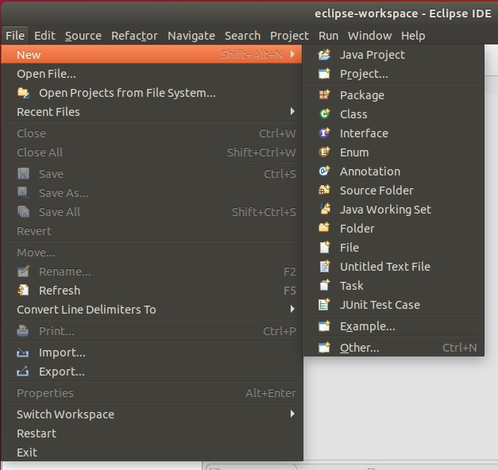</span> <span style='width: 350px; display:inline-block'>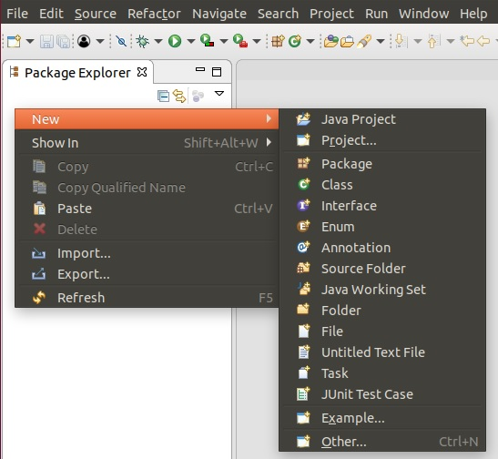</span> <br>

Now pick 'Maven'/'Maven Project':
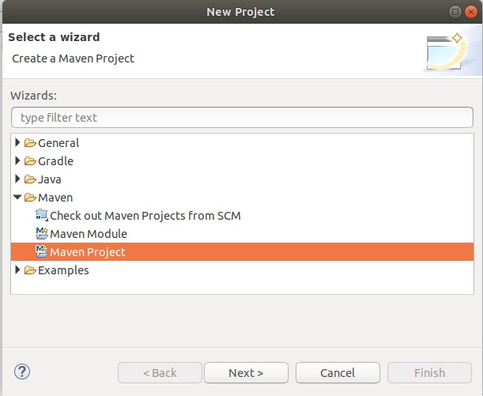

There are some options on the next screen, but I just click 'Next': <br>
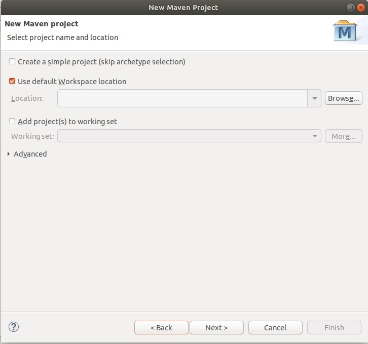

Now you will have to pick an archetype (an archetype is basically an initial code layout); if you don't know what this is, you should simply pick the default archetype (groupID 'org.apache.maven.archetype', artifact ID 'maven-archetype-quickstart', Version '1.1'). If you do not have problems, you will see the selection on the left; however [if you have problems initializing Maven](learn_to_code/java?id=problems-initializing-eclipse-maven) you will see the screen on the right, and you will have to manually pick your archetype. Do so and press 'Next': <br>
<span style='width: 350px; display:inline-block'>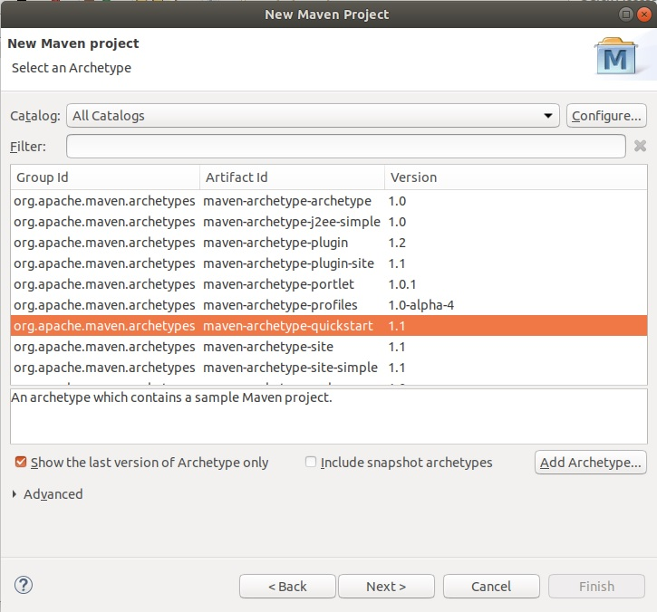</span> <span style='width: 350px; display:inline-block'>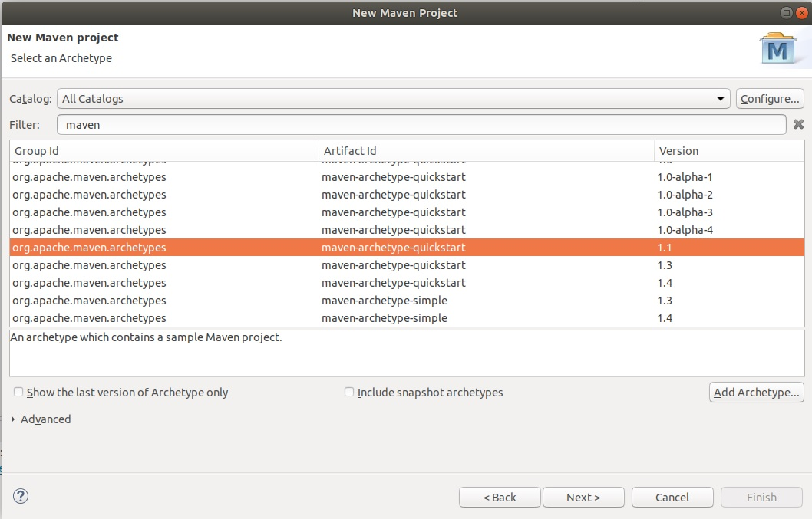</span> <br>

Finally you can fill out the unique information about your Maven project; use the information we filled in for [our project above](learn_to_code/java?id=creating-a-project-with-maven) and click 'Finish': <br>
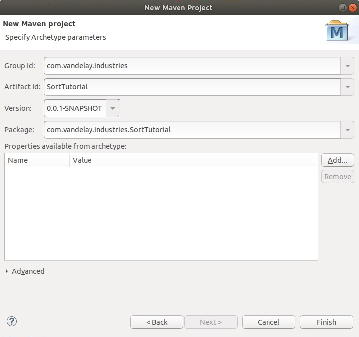

If it works, you will see the setup is the same as it was [when the command version created the project](learn_to_code/java?id=creating-a-project-with-maven); even the [directories], the location of the pom.xml and generated JAR file, etc should be the same: <br>
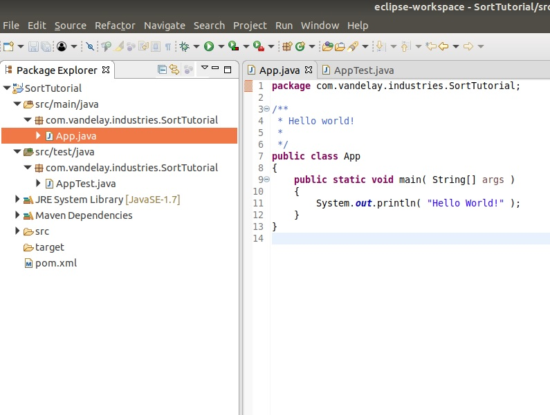

!> You may have to configure the file pom.xml for Java 11 [as you did when you compiled manually](learn_to_code/java?id=compiling-your-maven-project).

### Problems Initializing Eclipse-Maven

> This section was influenced by the discission on [stackoverflow](https://stackoverflow.com/questions/15506043/create-a-maven-project-in-eclipse-complains-could-not-resolve-archetype).

Its possible that there are problems when trying to start a Maven project in Eclipse; the biggest issues seem to stem from firewall / proxy issues, so if your firewall or proxy does not allow for the connection to common Maven sites you may have to find an alternative.

When starting a Maven Project in Eclipse you may see something like this:
```
...
Could not resolve archetype org.apache.maven.archetypes:maven-archetype-webapp:RELEASE from any of the configured repositories.
Could not resolve artifact org.apache.maven.archetypes:maven-archetype-webapp:pom:RELEASE
Failed to resolve version for org.apache.maven.archetypes:maven-archetype-webapp:pom:RELEASE: Could not find metadata org.apache.maven.archetypes:maven-archetype-webapp/maven-metadata.xml in local ....
...
```

If you see errors like this, the first thing you should do is add the remote catalog http://repo1.maven.org/maven2/archetype-catalog.xml to the Maven Archetypes. To do this, Click 'Window->Preferances', then click 'Maven->Archetypes':
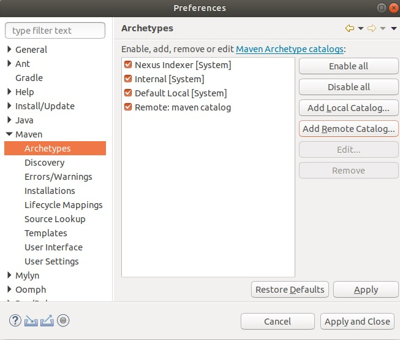

Click the 'Add Remote Catalog' button, then add  http://repo1.maven.org/maven2/archetype-catalog.xml to the 'Catalog File' and 'maven catalog' to the 'Description. Click 'Apply and Close'. <br><br>

You may also have to alter the file 'settings.xml', which is in your home directory in the folder `.m2` (so `~/.m2/settings.xml`). Add the following to that file:
```
<mirror>
  <id>ibiblio.org</id>
  <url>http://mirrors.ibiblio.org/maven2</url>
  <mirrorOf>central</mirrorOf>
</mirror>
```

You will then have to tell Eclipse to re-load this file. To do this, Click 'Window->Preferances', then click 'Maven->User Settings': <br>
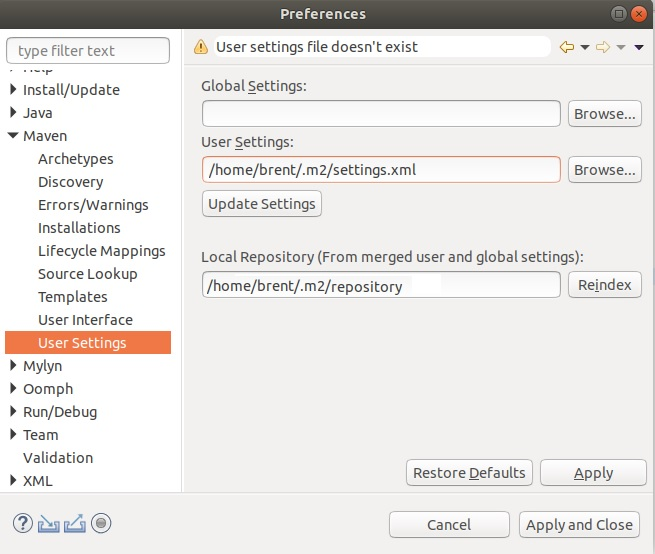

Simply click the 'Update Settings' button, then 'Apply and Close'.

If you still cannot create a Maven project, [read more about it here](https://stackoverflow.com/questions/15506043/create-a-maven-project-in-eclipse-complains-could-not-resolve-archetype).

## Running Maven In Eclipse

> This info was found [here](http://www.vogella.com/tutorials/EclipseMaven/article.html#download-the-maven-index).

To run the code as a Maven project, right-click the pom.xml file and select 'Run as...'

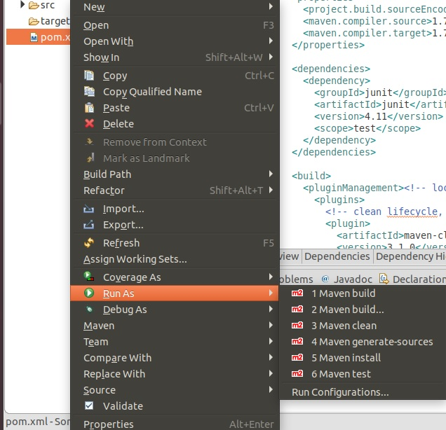


There are many options; [this article on stackoverflow](https://stackoverflow.com/questions/37999457/what-is-the-difference-between-maven-install-and-maven-build-with-m2eclipse) talks about most of them.  For our purposes, stick to 'Maven Clean' for now.

# Variables

Basic variables are declared like so:
```
int someOtherVar = 10;
```

General notes:
* Variables are typed - so once they are declared, the type cannot be changed.
* In place of the type on the left, you can simply use `var` and then whatever is assigned on the right the variable will assume that type; _this can be useful_. Example: `var i = 10;` typecasts i to an integer.
 * This may be only available to local variables!
* Variables are only visible in the code block they are assigned (be it function or even things like if/for/while statements).
* Variables are either primitive or reference.
* A local variable can be defined `final` (example: `final String name = "Jack";`) if it will be assigned exactly _once_ in that code block.
 * Each time the code block is executed - say, in a FOR loop - its considered a 'new' block.
 * This is done usually for ease of reading the code and nothing more.
 * Do _NOT_ confuse this with a final class / method OR a final field!

## Primitive Variables

The primitive variables are: byte, short, int, long, float, double, boolean, and char.

Sometimes, though, primitive types are required to be a class; therefore a primitive can be converted to  its matching class type using a concept called **auto-boxing**. The corresponding classes are Byte, Short, Integer, Long, Float, Double, Boolean, and Character.

# Strings

Strings are actually classes / objects with functions, so much of how they are treated are just like objects; in most cases they can also be treated like primitives, although they are not primitive.

## Combining Strings

```
//Strings can be combined with the + operator
String str1 = "Brent";
String str2 = "Jackson";
System.out.println(str + " and " + str2 + " went to the park.");
```

## String Comparison

Code Example:
```
String str1 = "Brent";
String str2 = "Brent";
String str3 = "brent";
String str4 = "Jackson";
Object objString = str1;

//The compareTo() gives an integer as a return
////if its less than 0, the main string object is before / is 'greater than' the string passed to it
////if its 0 the strings are equal
////if its greater than 0, the main string object is after / is 'less than' the string passed to it
if (str1.compareTo(str4) > 0) {
	System.out.println("'" + str1 + "' comes after '" + str4 + "'");
} else if (str1.compareTo(str4) < 0) {
	System.out.println("'" + str1 + "' comes before '" + str4 + "'");
}

//compareToIgnoreCase is similar to compareTo, but obviously ignores the case
if (str3.compareToIgnoreCase(str2) == 0) { System.out.println("These strings are the same (compareToIgnoreCase())."); }

//the equals() method simply gives a boolean as a result
if (str2.equals(objString)) { System.out.println("These strings are the same (equals())."); }

//finally, you can also use the == operator
if (str2 == objString) { System.out.println("These strings are the same (== operator)."); }


```
* Note that using objString was a hit or miss - it did NOT work in compareToIgnoreCase().

# Operators

## Standard

| Operator | Description |
| ---      | ---         |
| +      | Plus  |
| -      | Minus        |
| *      | Multiply       |
| /      | Divide       |
| %      | Modulo      |


## Unary Prefix and Postfix Increment Operators

To increment a variable by 1 quickly, use `i++;`.

To decrement a variable by 1 quickly, use `i--;`.

## The Assignment Operators

To increment a variable by a specific number quickly, use `+=`:
```
int a = 5;
a += 10; //is now 15
```

To decrement a variable by a specific number quickly, use `-=`:
```
int a = 15;
a -= 5; //is now 10
```

There are also other assignment operators such as `*=`, `/=`, and `%=`. There are also binary operators which are `&=`, `^=`, `|=`, `<<=`, `>>=`, and `>>>=`.

## Logical Operators

| Operator | Description |
| ---      | ---         |
| ll      | OR    |
| &&      | AND   |
| !   |  Negation |
* Note the `l` above is actuall a pipe `|` but it would not render
* Logical operators are shortcut evaluated, which means the rightmost expression is only evaluated if absolutely necessary.

## Bitwise Operators

| Operator | Description |
| ---      | ---         |
| <<      | Left Shift         |
| >>      | Right Shift         |
| >>>      | Unsigned Right Shift         |
| l      | OR         |
| &      | AND         |
| ^      | Exclusive OR         |
| ~      | Negation         |
* Note the `l` above is actuall a pipe `|` but it would not render

# Arrays
```
//simply declare an array
int[] myArrayOfNumbers; //preferred
int myArrayOfNumbers[]; //works, but not preferred

//actually create the array
myArrayOfNumbers = new int[10]

//you can do both in one step
int[] myArrayOfNumbers = new int[10];

//you can create the array immediately
double[] myDoubleArray = {1.22, 2.3456, 17.578, 99.2};

//if you want to get the length, you can just use
int myLength = myArrayOfNumbers.length;


```
* Arrays are treated like objects (as they sort of operate like one)

# Basic Conditionals and Loops

## If Statements
```
if (condition) { }

...

if (condition) { 

} else if (condition) { 

} else {

}
```

## Ternary Operator

The Ternary Operator is a shorthand 'if' statement that has the form <br> `result = (boolean condition) ? (return value if true) : (return value if false)`.

An example would be:
```
minimum = (a < b) ? a : b;
```

Whats cool is you can use function calls in the results; for example:
```
someReturnValue = ifExists(a) ? SomeFunction(a) : 0;
```

You can also use it right in the middle of building a variable!
```
greetingString = "Hello " + (person.IsMan() ? "Mr." : (person.IsMarried() ? "Mrs." : "Miss")) + " " + person.lastName();
```

## For Loops

```
for (int i = 0;i<10;1++) { }
```

You can also use multiple variables at once; example:
```
for (int i = 0, j = 10; i < 10; i++, j--) {
	...
}
```

## Foreach Loops

Foreach loops are built for [Arrays](learn_to_code/java?id=arrays):
```
double[] myDoubleArray = {1.22, 2.3456, 17.578, 99.2};
for (double element: myDoubleArray) {
	System.out.println(element);
}

```


## While Loops
```
while (true) { }
```

## DO ... While Loops
```
do { } while(true);
```


# Code Example: StringSort

This is the 'App.java' file:

```
public class App {
	public static void main(String[] args) {
		var actualNames = new String[]{
			"Johnson", "Wilson",
			"Wilkinson", "Abraham", "Dagobert"};
		Sort.sort(actualNames);
		for (final String name : actualNames) {
			System.out.println(name);
		}
	}
}
```

This is the 'Sort.java' file:
```
package packt.java11.example.stringsort;

public class Sort {

	public static void sort(String[] names) {
		var n = names.length;
		while (n > 1) {
			for (var j = 0; j < n - 1; j++) {
				if (names[j].compareTo(names[j + 1]) > 0) {
					final var tmp = names[j + 1];
					names[j + 1] = names[j];
					names[j] = tmp;
				}
			}
			n--;
		}
	}
}
```