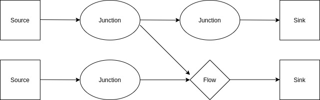
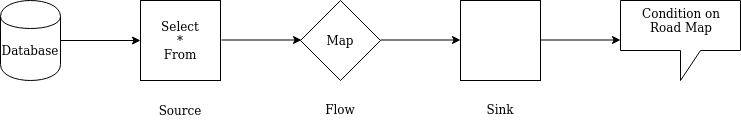

# Akka Streams  

# Purpose

Akka streams enables the ability to handle streaming data without blocking.

# Terms 

## Backpressure

The concept of <font color="green">backpressure</font> needs a bit of explanation. If a [source](learn_to_code/java/akka/streams?id=source) can send data faster than a [sink](learn_to_code/java/akka/streams?id=sink), data can be lost _or_ the [sink](learn_to_code/java/akka/streams?id=sink) can run out of memory as it cannot hold the data as its processing slower than it receives the data payload. <font color="green">Backpressure</font> is a mechanism that notifies the [source](learn_to_code/java/akka/streams?id=source), on behalf of the [sink](learn_to_code/java/akka/streams?id=sink), that the [sink](learn_to_code/java/akka/streams?id=sink) cannot handle more data at the moment.

The above may not be fully true, but it helps to understand what <font color="green">backpressure</font> is. In reality, <font color="green">backpressure</font> usually uses a pull / push setup: the [sink](learn_to_code/java/akka/streams?id=sink) sends a signal to the [source](learn_to_code/java/akka/streams?id=source), and that signal is a message that says it has demand for more data / is looking for more data (note that this message may pass through one or more [flows](learn_to_code/java/akka/streams?id=flow). The [source](learn_to_code/java/akka/streams?id=source) then sends more data, if its available.  

In [reactive streams](learn_to_code/java/akka/streams?id=reactive-streams), [publishers](learn_to_code/java/akka/streams?id=source) are forbidden to send data _without_ demand for it (i.e. if a [subscriber](learn_to_code/java/akka/streams?id=sink) does not make a demand for (more) data, a [publisher](learn_to_code/java/akka/streams?id=source) cannot send (more) data).

## Flow 

> More info on <font color="green">Flows</font> can be found in this document [here](learn_to_code/java/akka/streams?id=flows-akka-code).  

A <font color="green">Flow</font> (in [reactive streams](learn_to_code/java/akka/streams?id=reactive-streams), a <font color="purple">processor</font>) takes data from an upstream [stage](learn_to_code/java/akka/streams?id=graph-stages), transforms it, and then sends to another downstream [stage](learn_to_code/java/akka/streams?id=graph-stages); in other words, it is both a consumer _and_ a producer. A <font color="green">flow</font> (itself a [stage](learn_to_code/java/akka/streams?id=graph-stages)) has a single input and a single output. 

A <font color="green">flow</font> transforms the data and then forwards it to a [sink](learn_to_code/java/akka/streams?id=sink); a <font color="green">flow</font> effectively acts as a middleman if pre-processing is necessary before the data gets to the [sink](learn_to_code/java/akka/streams?id=sink).

Usually, the upstream [stage](learn_to_code/java/akka/streams?id=graph-stages) is a [source](learn_to_code/java/akka/streams?id=source) and the downstream [stage](learn_to_code/java/akka/streams?id=graph-stages) is  a [sink](learn_to_code/java/akka/streams?id=sink), but it doesnt always have to be that configuration - the upstream [stage](learn_to_code/java/akka/streams?id=graph-stages) could be a [source](learn_to_code/java/akka/streams?id=source), a [junction](learn_to_code/java/akka/streams?id=junction), or another <font color="green">flow</font> and the downstream could be a [sink](learn_to_code/java/akka/streams?id=sink), a [junction](learn_to_code/java/akka/streams?id=junction), or another <font color="green">flow</font>. Since a <font color="green">flow</font> is so interchangeable, it must follow the rules of both a [source](learn_to_code/java/akka/streams?id=source) and a [sink](learn_to_code/java/akka/streams?id=sink).

## Fusion  

> More info on <font color="green">Fusion</font> can be found in this document [here](learn_to_code/java/akka/streams?id=fusing-akka-code).  

The concept of <font color="green">Fusion</font> is taking streams and breaking them into separate elements that can be run asynchronously.  

## Graph

A <font color="green">Graph</font> is a system of [graph stages](learn_to_code/java/akka/streams?id=graph-stages). Unlike a [linear stream](learn_to_code/java/akka/streams?id=linear-stream), a graph can have _multiple_ [sources](learn_to_code/java/akka/streams?id=source) and [sinks](learn_to_code/java/akka/streams?id=sink). 

  

## Graph Stages 

The various <font color="green">Graph Stages</font> are 'nodes' in either a [linear stream](learn_to_code/java/akka/streams?id=linear-stream) or a [graph](learn_to_code/java/akka/streams?id=graph). These can be a:

* [Source](learn_to_code/java/akka/streams?id=source).  
* [Sink](learn_to_code/java/akka/streams?id=sink).  
* [Flow](learn_to_code/java/akka/streams?id=flow).  
* [Junction](learn_to_code/java/akka/streams?id=junction).  

In an Akka Stream, a <font color="green">Graph Stage</font> is an immutable, re-useable template.  They contain instructions on what to do (produce, transform, consume, etc) but do nothing on their own. 

## Junction

> More info on <font color="green">Junctions</font> can be found in this document [here](learn_to_code/java/akka/streams?id=junctions-akka-code).  

A <font color="green">junction</font> is a branch point in a stream. They allow for a [stage](learn_to_code/java/akka/streams?id=graph-stages) in a [graph](learn_to_code/java/akka/streams?id=graph) to have multiple outputs / allow for multiple options on where the data should move next (all other stages only allow for _one_ input or output).  

## Linear Stream

> Most streams are <font color="green">Linear Streams</font>.  

A <font color="green">Linear Stream</font> is a [runnable graph](learn_to_code/java/akka/streams?id=runnable-graph) with exactly one [source](learn_to_code/java/akka/streams?id=source) and exactly one [sink](learn_to_code/java/akka/streams?id=sink) (which is in contrast to a [graph](learn_to_code/java/akka/streams?id=graph), which can have multiple [sources](learn_to_code/java/akka/streams?id=source) and [sinks](learn_to_code/java/akka/streams?id=sink)). An example is below, which mocks a GPS app notifying the user of road hazards on the horizon: 



* The [source](learn_to_code/java/akka/streams?id=source) is an object that converts the data from the database into a stream. 
* The [flows](learn_to_code/java/akka/streams?id=flow) can modify the stream before it gets to the [sink](learn_to_code/java/akka/streams?id=sink).  
* The [sink](learn_to_code/java/akka/streams?id=sink) is an object that prepares the data to be seen in the GPS app.  
* Each stage can be executed synchronously or asynchronously.  
 * The default is synchronous.  
 * In this case, synchronously means 'the entire <font color="green">Linear Stream</font> works on one message at a time' while asynchronously would allow for, say, both the [source](learn_to_code/java/akka/streams?id=source) and  [sink](learn_to_code/java/akka/streams?id=sink) could be processing two different messages at the same time.  
   * In order for a <font color="green">Linear Stream</font> to behave asynchronously, a <font color="purple">boundary</font> my be set.
* Element order is usually preserved.  
* [Backpressure](learn_to_code/java/akka/streams?id=backpressure) is sent from downstream to upstream stages.  

## Runnable Graph

A <font color="green">Runnable Graph</font> is either a [graph]([sink](learn_to_code/java/akka/streams?id=graph) _or_ a [linear stream](learn_to_code/java/akka/streams?id=linear-stream) that is executable.  

In order to execute the <font color="green">Runnable Graph</font> - and thus start the flow of data - it must be [materialized](learn_to_code/java/akka/streams?id=materializers).  

## Sink 

> More info on <font color="green">Sinks</font> can be found in this document [here](learn_to_code/java/akka/streams?id=sinks-akka-code).  

A <font color="green">Sink</font> (in [reactive streams](learn_to_code/java/akka/streams?id=reactive-streams), a <font color="purple">subscriber</font>) is the destination of the [source](learn_to_code/java/akka/streams?id=source). The <font color="green">Sink</font> is a [stage](learn_to_code/java/akka/streams?id=graph-stages) has a single input (the data from a stream). A <font color="green">Sink</font> may store data to a file, a database, may output audio / video, or output some other information. <font color="green">Sinks</font> create [backpressure](learn_to_code/java/akka/streams?id=backpressure).  

## Source 

> More info on <font color="green">Sources</font> can be found in this document [here](learn_to_code/java/akka/streams?id=sources-akka-code).  

A <font color="green">Source</font> (in [reactive streams](learn_to_code/java/akka/streams?id=reactive-streams), a <font color="purple">publisher</font>) is an input to a stream (i.e. the origin of the data). The <font color="green">Source</font> is a [stage](learn_to_code/java/akka/streams?id=graph-stages) with a single output (which is actually an _input_ to a stream). A <font color="green">Source</font> receives data from a file, a database, a microphone, or some other source of information. Technically, there is no set amount of data in a source - it could be infinite.

A <font color="green">Source</font> only sends data downstream if there is a demand (see [Backpressure](learn_to_code/java/akka/streams?id=backpressure)); if there is no demand, the souce is barred from pushing data. Since this is the case, a source will have to have a strategy on dealing with incoming data until demand resumes.  

# Reactive Streams

> More on <font color="green">Reactive Streams</font> can be found at [reactive-streams.org](http://www.reactive-streams.org/), and more <font color="green">Reactive Stream</font> implementations can be found [here](https://en.wikipedia.org/wiki/Reactive_Streams).  

The foundation of Akka streams is based on the concept of <font color="green">Reactive Streams</font>, which is an initiative to provide a standard for asynchronous stream processing with non-blocking back pressure. This encompasses efforts aimed at runtime environments (JVM and JavaScript) as well as network protocols. It should be noted that <font color="green">Reactive Streams</font> is a low level API, but its not geared for typical end users; the purpose of <font color="green">Reactive Streams</font> is a base for a more user-friendly implementation (i.e. [Akka Streams](learn_to_code/java/akka/streams?id=basics-of-akka-streams)).

A <font color="purple">Stream</font> is a sequence of data, divided up into elements. The size of a data stream can vary anywhere from small to infinite (in other words, continuous); in many cases, streams are too large to fit into memory.

Examples of streams:  
* Data from a GPS application.  
* Audio streams.  
* Live video streams.  

## Why Reactive Streams  

These are the problems that can plague streaming:
* The consumption of data may have problems if its not asynchronous.
* A stream relies on message passing, so a fast stream may ovherwhelm a slow consumer.  
* Order of packets must be guaranteed.  

Reactive streams addresses all of these.

## Reactive Streams Components  

Reactive Streams have the following components:  
* A [Publisher](learn_to_code/java/akka/streams?id=source).  
* A [Subscriber](learn_to_code/java/akka/streams?id=sink).  
* A [Processor](learn_to_code/java/akka/streams?id=flow).  
* A <font color="green">Subscription</font>, which connects a <font color="purple">subscriber</font> to a <font color="purple">publisher</font>.  
 * Without a <font color="green">subscription</font>, messages cannot flow through the stream.
 
# Basics of Akka Streams  

The best way to think of <font color="green">Akka Streams</font> is its an API that implements the more base level [Reactive Streams](learn_to_code/java/akka/streams?id=reactive-streams). While an <font color="green">Akka Stream</font> has a more advanced API than a <font color="purple">Reactive Stream</font>, <font color="green">Akka Streams</font> do have endpoints that allow for the interaction with base level <font color="purple">Reactive Stream</font> systems.  

## Akka Streams and Actors

An <font color="green">Akka Stream</font> works by passing data through a chain of different <font color="purple">stages</font>. <font color="purple">Stages</font>:
* Have at least _one_ input _or_ output (or, it could have multiple inputs and outputs or anything inbetween, so long as there is at least one in the overall system). 
* By default, stages are [fused](learn_to_code/java/akka/streams?id=fusion) together to run synchronously in a single actor, but can also run asynchronously in separate actors.

There is a special relationship between <font color="green">Akka Streams</font> and [Akka actors](learn_to_code/java/akka/akka_basics?id=actor). Actors consume streams in the form of [messages](learn_to_code/java/akka/akka_basics?id=message). This could be done without the separate concept of an <font color="green">Akka Stream</font>, but without <font color="green">Akka Streams</font>:  
* The actor would have to manage the stream processing itself.  
* It would be hard to manage [backpressure](learn_to_code/java/akka/streams?id=backpressure) manually.  
* <font color="green">Akka Streams</font> provide statically typed guarantees that prevent errors.

It must be noted that <font color="green">Akka Streams</font> actually use their own [Akka actors](learn_to_code/java/akka/akka_basics?id=actor) under the hood, but the nitty gritty of handling streams is abstracted from view; the software engineer only has to interact with the <font color="green">Akka Stream</font> object and not the actor itself.  

## Materializers

The act of allocating resources to the stream is known as <font color="green">Materialization</font>. This only happens when all [stages](learn_to_code/java/akka/streams?id=graph-stages) in the stream are connected and the stream is run. <font color="green">Materializers</font> are required.  

Running the stream results in <font color="purple">Materialized Values</font>.
* Each [stage](learn_to_code/java/akka/streams?id=graph-stages) is capable of making a single <font color="purple">Materialized Value</font>.  
* <font color="purple">Materialized Values</font> are not the same as the elements being produced / transformed / consumed by the [stage](learn_to_code/java/akka/streams?id=graph-stages).  
* its possible to use `NotUsed` for a <font color="purple">Materialized Value</font> if its not important for the given stage.
 * That said, its usually important for the [sink](learn_to_code/java/akka/streams?id=sink), as that is the resulting value of the stream.  

# Sources (Akka Code)

> This section goes into greater detail on [sources](learn_to_code/java/akka/streams?id=source).  

* A <font color="green">source</font> is defined as `Source<Out, Mat>`.  
 * `Out` defines the type of the elements the <font color="green">source</font> produces.  
 * `Mat` defines the <font color="purple">materialized value</font>.  
* Sources respond to demand, which is generated by receiving an `onPull` request handler.
 * In response, the <font color="green">source</font> can:
   * `push` data downstream.
   * `complete` the stream (which is a success).  
   * `fail` the stream with an error.
   * Do nothing (if there is no data to send currently but the incoming data is still active). 
 * They can also respond to `onDownstreamFinish`
 
> Usually, <font color="green">sources</font> are pre-built, so you will usually not have to build your own.  Common ones are listed in this section.  

## Empty Sources 

An <font color="green">empty source</font> is a source with no data. This is usually used for testing, but it can also be used if, say, you make a call to something that doesnt return a value. 

An example of how to make an empty source:
```
Source(String, NotUsed) empty = Source.empty();
```  
* The source sends a string as the payload.
* The source sends `NotUsed` as the <font color="purple">materialized value</font>.  

> Empty sources _always_ `complete` a stream (see [here](learn_to_code/java/akka/streams?id=sources-akka-code).  

## Single Element Sources 

A <font color="green">single element source</font> is a source with a single arbitrary element; it pushes a _single_ element and then `completes` the stream (see [here](learn_to_code/java/akka/streams?id=sources-akka-code).  An example:  
```
Source(String, NotUsed) singleSource = Source.single("Hello World");
```  
* The `String` sets the return type for the pushed message.  
* The source sends `NotUsed` as the <font color="purple">materialized value</font>.  

You can also modify this a bit and have a repeated string, which is infinitely pushed whenever there is demand like so:  
```
Source(String, NotUsed) repeatedSource = Source.repeat("Hello World");
```  

## Tick Element Sources

A <font color="green">tick element source</font> is similar to a [single element source](learn_to_code/java/akka/streams?id=single-element-sources), but it repeats on a timed schedule. Example:
```
Source(String, NotUsed) tickSource = Source.tick(Duration.ofSeconds(1), Duration.ofSeconds(10), "Hello World");
```  
* This sends "Hello World" after 1 second, initially.  
 * Other durations are spread apart by 5 seconds.  
* If there is no [backpressure](learn_to_code/java/akka/streams?id=backpressure), no tick is pushed - its simply dropped.  

## Iterable Sources

An <font color="green">iterable source</font> uses objects that have a `java.lang.Iterable` subclass. Each _individual_ element is taken from `Iterable` and pushed downstream to the demand. The stream is `complete` (see [here](learn_to_code/java/akka/streams?id=sources-akka-code) if there is no more data in `Iterable`.  An example:
```
Source(Integer, NotUsed) iterableSource = Source.from(IntStream.rangeClosed(1,10).boxed().collect(Collectors.toList());
```  
* We could have used `Source.range()` here instead, but the above is more general.  

## FromIterator Sources

A <font color="green">fromIterator source</font> source creates a source from an Iterator, which is created each time the Source is [materialized](learn_to_code/java/akka/streams?id=materializers). This will send a `complete` (see [here](learn_to_code/java/akka/streams?id=sources-akka-code) when `hasNext` returns false. Example:  
```
Source<Integer, NotUsed> allPositiveNumbers = Source.fromIterator( () -> IntStream.iterate(0, i -> i + 1).iterator());
```  
 * This takes a function the _returns_ an iterator instead of an Iterator.
   * This means every time the source is [materialized](learn_to_code/java/akka/streams?id=materializers), this starts over again.

## Cycle Sources

A <font color="green">cycle source</font> is similar to a [fromIterator source](learn_to_code/java/akka/streams?id=fromiterator-sources), but the iterator is infinitely repeated. When `hasNext` returns `false`, the `Iterator` is recreated and the process starts again. Example:  
```
Source<Integer, NotUsed> repeatOneToTen = Source.cycle( () -> IntStream.rangeClosed(1,10).boxed().iterator());
```  

## Stateful Sources  

A <font color="green">stateful source</font> (actually uses `unfold`) is one that holds state; this is achieved by using an initial value and a transformation function. The transformation function returns an `Optional` of a `Pair` containing the value for the next iteration as well as the value to push. This completes when the transformation returns `None`. Example:  
```
Source<Integer, NotUsed> countTo100 = Source.unfold( 
	0, 
	(Integer value) -> {
		if (value <= 100) 
			return Optional.of(new Pair(value + 1, value));
		else 
			return Optional.empty();
	});
```  
* `0` is the initial value (can be anything though).
* The `Pair` returned is the value for the next iteration (i.e. `value + 1`) and what to push (i.e. `value`).  
* `Optional.empty()` terminates the stream.  

Note that we can also use a `unfoldAsync` here, which returns a `CompletionStage` of an `Optional`. This is useful for completable futures. 

## Actor Sources

An <font color="green">actor source</font> is a source that acts like an Akka [actor](learn_to_code/java/akka/akka_basics?id=actor); instead of processing messages, though, it simply passes the message off to the [sinks](learn_to_code/java/akka/streams?id=sink).  Recall this is not automatic, though, as there needs to be demand for data from the sink. This type of source sends a `complete` (see [here](learn_to_code/java/akka/streams?id=sources-akka-code) when a `PoisonPill` _or_ an `akka.actor.Status.Success` is sent to the source as a message.

An example:  
```
Source<Message, ActorRef> actorSource = Source.actorRef(0, OverflowStrategy.dropNew());  
```  
* The `Message` is any class type (for this example, its specifically `Message`).  
* The `0` represents a `bufferSize`, which is how many messages the actor will buffer.
* It also needs a buffer overflow strategy.  

## File Sources  

A <font color="green">file source</font> reads from a file using `ByteString`, using a thread-pool backed dispatcher. This `completes` (see [here](learn_to_code/java/akka/streams?id=sources-akka-code) when the end of the file is reached.

Example:
```
Source<ByteString, CompletionStage<IOResult>> fileBytes = FileIO.fromPath(Paths.get("/some/file/here.txt"), 1024);  
```  
* The `1024` is the chunk size.  

> In order to decode the `ByteString` into lines of text, you will have to use the Framing API.  

## TCP Connection Sources  

A <font color="green">TCP connection source</font> reads from a TCP socket. 

Example:  
```
Source<IncomingConnection,CompletionStage<ServerBinding>> connectionSource = Tcp.get(system).bind("127.0.0.1",8888);
```  
* Each time a client connects, a new connection will be emitted to the stream.  
 * This means there is not actually a data stream, its simply a connection; therefore, the connection needs to be sent to a [flow](learn_to_code/java/akka/streams?id=flow) in order to be processed.  

## Java Stream Sources  

A <font color="green">Java stream source</font> reads from a Java Input Stream; it completes if the input stream completes. StreamConverters provides a variety of sources that will allow interoperability with Java IO.  

Example:  
```
Source<ByteString, CompletionStage<IOResult>> fileBytes = StreamConverters.fromInputStream(() -> new FileInputStream("someFile.txt"));
```  
* This will accept other types of input streams as well.  

## Flow Methods in Sources

Its possible to apply many methods traditionally saved for [flows](learn_to_code/java/akka/streams?id=flows-akka-code) to sources instead; for example, you can use flow's [map()](learn_to_code/java/akka/streams?id=map-flows) method:  
```
Source.range(1,10).map(Object::toString);  
```  
* This applices the appropriate Flow to the stated source, returning a new source.

> Other methods, such as [filter()](learn_to_code/java/akka/streams?id=filtering-flow), etc can be called directly on the source.

# Sinks (Akka Code)

> This section goes into greater detail on [sinks](learn_to_code/java/akka/streams?id=sink).  

* A <font color="green">sink</font> is defined as `Sink<In, Mat>`.  
 * `In` defines the type of the elements the <font color="green">sink</font> consumes.  
 * `Mat` defines the <font color="purple">materialized value</font>.  
   * <font color="purple">Materialized values</font> are far more important in <font color="green">sink</font> then they are in [sources]([source](learn_to_code/java/akka/streams?id=source).  
* <font color="green">Sinks</font> send demand upstream.  
 * A <font color="green">sink</font> should only send demand when it is able to receive more data.  
 * <font color="green">Sinks</font> can temporarily halt in sending demand, which means the data flow will temporarily stop.
* <font color="green">Sinks</font> respond to being sent data in the stream, which is generated by receiving an `onPush` request handler.
 * In response, the <font color="green">sink</font> can:
   * request new data from upstream using `pull`.
   * `grab` data that has been pushed.  
   * `cancel` the stream, which terminates it.
 * They can also respond to `onUpstreamFinish` or `onUpstreamFailure`.  

> Usually, <font color="green">sinks</font> are pre-built, so you will usually not have to build your own.  Common ones are listed in this section.  

## A note On Sink Type Definitions

You will see Sinks defined as the following:  
```
Sink<Integer, CompletionStage<String>> ....
```  

The first type (in the above case, `Integer` is the type that each data object in the stream will be; the second (i.e. `String`) is the object type of the <font color="purple">Materialized value</font>, which is usually returned once the stream is complete.  

It should also be noted that <font color="green">sinks</font> that use `CompletionStage` return a materialized `CompletionStage` / a completeable future. In most cases, this is because the sink is not yet completed as the stream is not yet completed.  In these cases, we get back the `CompletionStage` as soon as the stream is materialized (i.e. we only get output when the entire stream is sent).  

## Ignoring Sinks

An <font color="green">ignore sink</font> simply accepts incoming data and drops the data instantly. <font color="green">Ignore sinks</font> are good for testing purposes; in addition, they are good for times when all work is completed before the sink is contacted, so there is little work for the sink to do outside of be a placeholder. 

Example:  
```
Sink<Object, CompletionStage<Done>> ignore = Sink.ignore();
```  
## Sinks With No Materialized Value

> In these sinks, no value is returned from the stream.  

Some sinks do not require a <font color="purple">Materialized value</font>; for these types of sinks you can use a `foreach`:  
```
Sink<Integer, CompletionStage<Done>> printAll = Sink.foreach(i -> System.out.println("Value " + i));
```  

## Single Materialized Value Sinks

> It must be said that <font color="green">sinks</font> in this section return a materialized `CompletionStage` / a completeable future. In most cases, this is because the sink is not yet completed as the stream is not yet completed.  In these cases, we get back the `CompletionStage` as soon as the stream is materialized (i.e. we only get output when the entire stream is sent).  

In some cases, we will only want _one_ data element from a stream, even if there are other data elements in the stream. There are a few options to do this.  

**<font size="4">First Value Only (Head)</font>**  

If you wish you only pull the first element in a stream, you can use `.head()`. Example:
```
Sink<Integer, CompletionStage<Integer>> head = Sink.head();
```  
* Pulls data of the first element, if it exists.  
 * If an element does not exist, it fails with a `NoSuchElementException` error if the stream is empty.  
* This materializes the first element in a completeable future.

You could also pull the first element in a stream with a `.headOption()`, which would return an empty `Optional` of the stream is empty:
```
Sink<Integer, CompletionStage<Optional<Integer>>> head = Sink.headOption();
```  
* Pulls data of the first element, if it exists.  
 * Will not throw an error if the stream is empty - instead, it will simply send an empty `Optional`.  
 
**<font size="4">Last Value Only (Tail)</font>**  

If you wish you only pull the last element in a stream, you can use `.last()`. Example:
```
Sink<Integer, CompletionStage<Integer>> last = Sink.last();
```  
* Pulls data of the last element, if it exists.  
 * If an element does not exist, it fails with a `NoSuchElementException` error if the stream is empty.  
 

You could also pull the last element in a stream with a `.lastOption()`, which would return an empty `Optional` of the stream is empty:
```
Sink<Integer, CompletionStage<Optional<Integer>>> last = Sink.lastOption();
```  
* Pulls data of the last element, if it exists.  
 * Will not throw an error if the stream is empty - instead, it will simply send an empty `Optional`.   
 
## Sinks - Materialize All Values 

This section is helpful if we wish to materialize all values in a <font color="green">sink</font>.  

> It must be said that <font color="green">sinks</font> in this section return a materialized `CompletionStage` / a completeable future. In most cases, this is because the sink is not yet completed as the stream is not yet completed.  In these cases, we get back the `CompletionStage` as soon as the stream is materialized (i.e. we only get output when the entire stream is sent).  

If we wish to pull all elements in a sequence we can do this:  
```
Sink<Integer, CompletionStage<List<Integer>>> toList = Sink.seq();
```  
* This pulls all elements in the stream into a sequence (in this case, a list).
* Materializes the sequence through a `CompletionStage` that only completes when the stream itself completes.  

## Stateful Sinks  

Sometimes we want to return an aggregated result in the <font color="purple">Materialized value</font>; for these times we can use a <font color="green">stateful sink</font>.  

There are two kinds of stateful sinks: one that has a static initial base, and one that uses the first element as the base.  

**<font size="4">Static Initial Base</font>**  

If we want to use a static initial value, we could do so with `fold`:  
```
Sink<Integer, CompletionStage<Integer>> foldSum = Sink.fold(0, (sum,elem) -> sum + elem);
```  
* This uses `0` as the initial `sum` (although it could be any object type).  
* This cycles through each element in the data returned by the stream.  
* `sum` is the aggregate <font color="purple">accumulator</font>, which is modified after each element and passed to the next element (which, in this case, is initialized to `0`).  
 * This <font color="purple">accumulator</font> is persistent - i.e. the 'stateful' part.  
 * The type of the <font color="purple">accumulator</font> _must_ match the type captured in `CompletionStage<Integer>`.  
   * The element type _must_ match the first type listed (i.e. `Sink<Integer...`).  
 * The result of the operations after the `->` are stored to the <font color="purple">accumulator</font>.
* `elem` is an individual data point in the stream.  
* The result is embedded in the <font color="purple">Materialized value</font>.  
 * The <font color="purple">Materialized value</font> can be different than the initial stream type; so for example, if we had an `Integer` coming in from the stream bht the `CompletionStage` output was a string of these numbers, this would be defined as `Sink<Integer, CompletionStage<String>>` instead.  

**<font size="4">First Element As Initial Base</font>**  

If we want to use a the first element in the stream as the initial value, we could do so with `reduce`:  
```
Sink<Integer, CompletionStage<Integer>> reduceSum = Sink.reduce(sum,elem) -> sum + elem);
```  
* Most points are same as above, with these exceptions.  
* This uses the first element `elem` as the initial value.  
* Unlike the static initial value, the <font color="purple">Materialized value</font> _cannot_ be different from the initial stream type; both must be the same, as the `sum` type will have to match the initial `elem` type.  

## Actor Sinks  

Its possible to use an Akka [actor](learn_to_code/java/akka/akka_basics?id=actor) as a <font color="green">sink</font>; in this case, the data in the stream will simply be sent to an actor. The `ActorRef` needs to be built first (or on the fly) and then sent as a parameter to `Sink.actorRef()` like so:  
```
ActorRef someActor = system.actorOf(...);

Sink<Integer, NotUsed> actorSink = Sink.actorRef(someActor, Done.getInstance());
```  
* All data elements in the stream are pulled and sends them to the actor.  
* An `onCompleteMessage` is sent to the actor when the stream finishes (above, that is `Done.getInstance()`).  
* Unlinke most other <font color="green">sink</font> types, **there is no default [backpressure](learn_to_code/java/akka/streams?id=backpressure) mechanism for this type of actor**. 
 * Its possible the actor mailbox overflows.  
 * That said, `actorRefWithAck` can be used in place of [backpressure](learn_to_code/java/akka/streams?id=backpressure) but it must manually be entered into the actor.  
 
## File Sinks  

If we wish to simply have a <font color="green">sink</font> write to a file, we can do so like this:  
```
Sink<ByteString, CompletionStage<IOResult>> fileWrite = FileIO.toPath(Paths.get("someFile.txt"));
```  
* `FileIO.toPath` pulls `ByteStrings` from upstram and writes them to a file.  
 * The stream data object type _must_ be a `ByteString`.  
 * If the upstream has something else (say, a `String`), you will need a flow to convert this to a `ByteString`.  
 
## Sinks to Java Streams  

Its possible to have a <font color="green">sink</font> that terminates in a Java stream. To do so with `StreamConverters.fromOutputStream()`:  
```
Sink<ByteString, CompletionStage<IOResult>> toJavaStream = StreamConverters.fromOutputStream(() -> new FileOutputStream("someFile.txt"));
```  
* This is a <font color="green">sink</font> to a Java `OutputStream`.  
* `StreamConverters` has a variety of <font color="green">sinks</font> that can interact with Java IO.  

# Flows (Akka Code)

> This section goes into greater detail on [flows](learn_to_code/java/akka/streams?id=flow).  

* A <font color="green">flow</font> is defined as `Flow<In, Out, Mat>`.  
 * `In` defines the type of the elements the <font color="green">flow</font> consumes.  
 * `Out` defines the type of the elements the <font color="green">flow</font> produces.   
 * `Mat` defines the <font color="purple">materialized value</font>.  
   * Since a <font color="green">flow</font> needs to follow both the rules of a [source](learn_to_code/java/akka/streams?id=source) and a [sink](learn_to_code/java/akka/streams?id=sink), <font color="purple">Materialized values</font> are important in <font color="green">flows</font>.  
 * The `In` and `Out` types _can_ be different.  
* A <font color="green">flow</font> is not necessary in a [linear stream](learn_to_code/java/akka/streams?id=linear-stream) or a [graph](learn_to_code/java/akka/streams?id=graph); its possible that a [source](learn_to_code/java/akka/streams?id=source) connects directly to a [sink](learn_to_code/java/akka/streams?id=sink). That said, if data transformation is necessary, then a <font color="green">flow</font> is necessary.
* Like a [sink](learn_to_code/java/akka/streams?id=sink), a <font color="green">flow</font> _must_ use [backpressure](learn_to_code/java/akka/streams?id=backpressure) to signal demand.  
 * Similarly, like a [source](learn_to_code/java/akka/streams?id=source), a <font color="green">flow</font> _must also_ respond to demand, and only push data if requested.  
 * <font color="green">Flows</font> can also drop data, buffer, etc.  
 * <font color="green">Flows</font> can respond to both `onPush` and `onPull`, and it responds with the same messages as a [source](learn_to_code/java/akka/streams?id=source) or a [sink](learn_to_code/java/akka/streams?id=sink).  

## Map Flows  

A <font color="green">map flow</font> is the basic flow. An example:  
```
Flow<String, Integer, NotUsed> longestString = Flow.of(String.class).map(String::length);
```  
* This map takes a `String` from the data stream, gets its length (via the string's `length()` method), and then uses that as the `Out` (i.e. the `Integer`).  
 * This is done for each element.  
 
`mapAsync` can also be used, which accepts a function that returns a future. An example:  
```
Flow<String, Integer, NotUsed> longestString = Flow.of(String.class).mapAsync(4, str -> CompletableFuture.supplyAsync(str::length));
```
* The order is guaranteed.  
 * This does _not_ guarantee execution order, but it does still guarantee the order of the data in the stream.  
* `mapAsyncUnordered` can be used too, which does _not_ guarantee order.
   * Because of this, `mapAsyncUnordered` is a bit faster in execution time, as ordering takes a small amount of time.  
* The `4` defines the amount of parallelism to use when resolving futures.  
 * This means we can compute up to 4 results in parallel.  

## Flattening Maps

We can use a <font color="green">flattening map</font> that transforms data into a collection and then sends each item _individually_ downstream. For example:  
```
Flow<String, String, NotUsed> words = Flow.of(String.class).mapConcat(str -> Arrays.asList(str.split("\\s")));
```  
* This takes a string, breaks the string down by splitting on a space (i.e. it splits a sentence up into words) and sends the _individual_ word downstream. 
 
## Group Flows 

If we want to cut down the number of elements the [sink](learn_to_code/java/akka/streams?id=sink) receives at one time, we can use a <font color="green">group flow</font> that puts the individual elements in a collection (List, etc) _before_ sending that collection to a [sink](learn_to_code/java/akka/streams?id=sink). An example:  
```
Flow<Integer, List<Integer>, NotUsed> groupedFlow = Flow.of(Integer.class).grouped(10);
```  
* This collects the individual elements in groups of 10 and _ten_ sends that group to the [sink](learn_to_code/java/akka/streams?id=sink).  
* If the list terminates and there is less than 10 elements, those elements will be sent in a group less than 10.

We can also use a sliding window to do something similar:  
```
Flow<Integer, List<Integer>, NotUsed> slidingWindowFlow = Flow.of(Integer.class).sliding(10, 1);
```
* `10` is the window size.  
* `1` is the step.  
* For example, if we were using numbers 0 to 100 in the entire step, the first collection would be `[0-9]`, then we would apply a step of 1, then we would send a second collection of `[1-10]`, then we would apply a step of 1, then we would send a third collection of `[2-11]`, then we would apply a step of 1, then we would send a fourth collection of `[3-12]`....etc. 

## Stateful Flows  

Much like [stateful sinks](learn_to_code/java/akka/streams?id=stateful-sinks), sometimes we want to propagate an aggregated result to the next [stage](learn_to_code/java/akka/streams?id=graph-stages); for these times we can use a <font color="green">stateful flow</font>.  

There are two kinds of stateful flows: one that only propages one sum (the final one), _or_ one that propagates an intermediate / partial sum downstream..  

If we want to simply propagate the final sum downstream, we could do so with `fold`:  
```
Flow<Integer, Integer, NotUsed> aggregatedSum = Flow.of(Integer.class).fold(0, (sum,value) -> sum + value);
```  
* This uses `0` as the initial `sum` (although it could be any object type).  
* This cycles through each element in the data returned by the stream.  
* `sum` is the aggregate <font color="purple">accumulator</font>, which is modified after each element and passed to the next element (which, in this case, is initialized to `0`).  
 * This <font color="purple">accumulator</font> is persistent - i.e. the 'stateful' part.  
 * The result of the operations after the `->` are stored to the <font color="purple">accumulator</font>.
* `value` is an individual data point in the stream.   

How it differs from a [stateful sinks](learn_to_code/java/akka/streams?id=stateful-sinks):  
* `fold()` only propagates a result to a [sink](learn_to_code/java/akka/streams?id=sink) (or other [stage](learn_to_code/java/akka/streams?id=graph-stages)) _if_ the upstream transmission is _fully_ complete.  

!> `fold()` will _never_ complete if using an infinite stream!  

If we want `fold()` to give a result for _each_ iteration, we can use `scan()` instead:  
```
Flow<Integer, Integer, NotUsed> scanSum = Flow.of(Integer.class).scan(0, (sum,value) -> sum + value);
```  
* This is like `fold()`, yet it propagates a value to a [sink](learn_to_code/java/akka/streams?id=sink) (or other [stage](learn_to_code/java/akka/streams?id=graph-stages)) after _each_ iteration (i.e. it will give intermediate sequential sums between 0 and the final sum).  
* This _can_ work on an infinite stream.  

## Filtering Flow  

We can use a <font color="green">filtering flow</font> to only keep messages that meet basic matching criteria.  

The first method is by using `filter()`, which seems to accept one criteria:  
```
Flow<String, String, NotUsed> filterCriteria = Flow.of(String.class).filter(str -> str.startsWith("C"));
```  
* The `str.startsWith("C")` is what is known as a <font color="purple">predicate function</font>; this is a boolean that returns either `false` or `true`, and only functions that return `true` are kept.
 * Knowing this, we can deduce that the above only keeps elements that start with "C".  


If we want to transform the data as well, we can use `collect()` combined with `match()`:  
```
Flow<Message, String, NotUsed> filterCriteria = Flow.of(Message.class).collect(new PFBuilder<Message,String>().match(
		Message.class,
		(msg) -> msg.value.startsWith("C"),
		(msg) -> msg.value
	).build());
```  
* `collect()` actually _transforms_ the data.  
 * It still acts as a filter but it also transforms the data as well (in this case, from a `Message` to a `String` class).  
* `PFBuilder` is the _partial function builder_, and we use it here to create the partial function which accepts type `Message` and outputs a `String`.  
 * Parameters
   * The first parameter in `match()`, which is `Message.class` here, tells which class to match.  
   * The second parameter in `match()`, which is `(msg) -> msg.value.startsWith("C")` here, is the matching <font color="purple">predicate function</font>.  
   * The third parameter in `match()`, which is `(msg) -> msg.value` here, is the transformation (i.e. the function that turns the data into our desired output, in this case a `String`).  
 * We apply this partial function to all elements in the stream.  
 * Matched elements are transformed by the function.  
 * Unmatched elements are dropped.  
 
## Time Flows

Its possible to limit flows by time with a <font color="green">time flow</font>.  There are three types:  
* `takeWithin()`  
* `dropWithin()`  
* `groupedWithin()`  

`takeWithin()` accepts elements from the stream for a set amount of seconds, then terminates the stream. Example:  
```
Flow<Integer, Integer, NotUsed> secondOfData = Flow.of(Integer.class).takeWithin(Duration.ofSeconds(10));
```  
* Accept data for 10 seconds.  

`dropWithin()` drops elements from the stream for a set amount of seconds, then starts collecting elements after that. Example:  
```
Flow<Integer, Integer, NotUsed> skipTenSecondsOfData = Flow.of(Integer.class).dropWithin(Duration.ofSeconds(10));
```  
* Drops data for 10 seconds, then accepts any data after that point.  

`groupedWithin()` turns the data elements from the stream into a collection; it will bundle the data in a set amount of items in a list _or_ for a certain number of seconds, whichever comes first. Example:  
```
Flow<Integer, List<Integer>, NotUsed> timeGroupedFlow = Flow.of(Integer.class).groupedWithin(20, Duration.ofSeconds(10));
```  
* Bundles the data in a group of 20 items _or_ after 10 seconds, whichever comes first, and then sends the data downstream.  

## Logging Flows  

A <font color="green">logging flow</font> allows us to log the fact that the flow was used as a passthrough. For example:  
```
Flow<Integer, Integer, NotUsed> loggedFlow = Flow.of(Integer.class).log("log label");
```  
* This requires a logging adapter.  
* The element is written to the log and then is passed along downstream.  
* The "log label" is the log's label that is printed in the log.  
* There is an extract function that can be used that can extract data from the object / element being logged.  
* The default log level is `Debug`, but you can change this using `withAttributes`.  

## Combining Flows 

We can combine incoming data elements with elements from another source by <font color="green">combining flows</font>. We will use the `zip()` method to do so:  
```
Flow<String, Pair<String, Integer>, NotUsed> zippedWithIndex = Flow.of(String.class).zip(
	Source.fromIterator(
		() -> IntStream.iterate(0,i->i+1).iterator()
	)
);
```  
* This combines an incoming `String` element with an `Integer`.  
* The result is a `Pair<String, Integer>` which is passed downstream.  

## Flattening Flows  

Similar to [flattening maps](learn_to_code/java/akka/streams?id=flattening-maps), these flows flatten [sources](learn_to_code/java/akka/streams?id=source) instead of Iterables. 

One way to do this is with `flatMapConcat()`:  
```
Flow<String, ByteString, NotUsed> flattenFiles = Flow.of(String.class).flatMapConcat(
	filename -> FileIO.fromPath(Paths.get(filename))
	);
```  
* Transforms data into a collection that is "flattened" into the stream.  
 * This takes filenames, then converts it into [sources](learn_to_code/java/akka/streams?id=source) of each file, then we flatten them into the stream.
   * Substreams are consumed in sequence, which preserves ordering.  
 * This results in a single stream, which is the contents of all of the files named.  


We can also use a `flatMapMerge()`; its like `flatMapConcat()`, but the substreams are consumes simultaneously; order is _not_ guaranteed!  
```
//this is a function that is written outside of the flow - it simply returns a source for a given Twitter username
Source<Tweet, NotUsed> tweetsForUser(String username) {...}

Flow<String, Tweet, NotUsed> tweetsForSelectedUsers = Flow.of(String.class).flatMapMerge(
	4, 
	username -> tweetsForUser(String username)
	);
```  
* The 4 is the <font color="purple">breadth</font>, which indicates how many substreams to consume at the same time.  
* Since the streams are consumed simultaneously; order is not guaranteed - so we may get a Tweet from user A, then B, then A again, then C, etc.  

## Buffering Flows  

Occasionally, we would like to buffer incoming elements in order to smooth out inconsistencies in flow rate - this is where <font color="green">buffering flows</font> are helpful.  we can do this like so:  
```
Flow<Integer, Integer, NotUsed> buffer100Elements = Flow.of(Integer.class).buffer(
	100, 
	OverflowStrategy.backpressure());
```
* This does not send elements downstream unless we have 100 elements in the buffer.  
 * The `100` is a buffer size.  
 * The `OverflowStrategy.backpressure()` is an overflow strategy.  
* There are several available overflow strategies:  
 * `backpressure` - Normal [backpressure](learn_to_code/java/akka/streams?id=backpressure) is used.  
 * `dropHead` - Drops the oldest element in the buffer to make room for new elelemnts.  
 * `dropTail` - Drops the newest element in the buffer to make room for new elelemnts.  
 * `dropNew` - Drops the incoming element, leaving the buffer unchanged.  
 * `dropBuffer` - Drops _all_ elements in the buffer to make room for new elements.  
 * `fail` - Stream completes with failure.  

# Runnable Graphs (Akka Code)  

> This section goes into greater detail on [runnable graphs](learn_to_code/java/akka/streams?id=runnable-graph).  

In order for [sources](learn_to_code/java/akka/streams?id=source), [sinks](learn_to_code/java/akka/streams?id=sink), and [flows](learn_to_code/java/akka/streams?id=flow) to be of any use, we must organize them in a [linear stream](learn_to_code/java/akka/streams?id=linear-stream) or a [graph](learn_to_code/java/akka/streams?id=graph) - we will investigate that here.  

# Basic Runnable Graph  

A basic <font color="green">runnable graph</font> can be built right off a [source]. Example:  
```
NotUsed mat = Source.range(1,10)
	.via(Flow.of(Integer.class).map(i->i*2))
	.to(Sink.foreach(System.out::println))
	.run(materializer);
```  
* `.via` is how you connect a [flow](learn_to_code/java/akka/streams?id=flows-akka-code) to the [source](learn_to_code/java/akka/streams?id=source).  
 * Technically, a new [source](learn_to_code/java/akka/streams?id=source) is created.  
* `.to` is how you connect a [sink](learn_to_code/java/akka/streams?id=sink) to the [source](learn_to_code/java/akka/streams?id=source).  
 * A [sink](learn_to_code/java/akka/streams?id=sink) technically returns a `RunnableGraph`, on which we can use `.run`.  
* `.run` is how you actually run the graph.  
 * `.run` is used on a `RunnableGraph` object.  
 * This needs a <font color="purple">materializer</font> as a parameter; its not built in the above example, but the example on how to link it to one is there.  
 * This returns the <font color="purple">materialized value</font> of the graph.  

## Multi-Graph Stage Graph  

```
Sink<Object, CompletionStage<Done>> sink = Sink.foreach(Sytem.out::println);

Flow<String, Integer, NotUsed> flow = Flow.of(String.class).map(String::length);

Flow<String, Double, NotUsed> newFlow = flow.via(Flow.of(Integer.class).map(Double::valueOf));

Sink<String, NotUsed> newSink = flow.ti(Sink.foreach(System.out::println));
```  
* `via` and `to` can also be run on a flow.  
 * `via` connects a flow to another flow and returns a new flow.  
 * `to` connects a flow to a sink and returns a new sink.  

# Materializer  

After a graph runs, <font color="green">Materialization</font> is the act of allocating the necessary resources to run the stream; it occurs when terminal operations are performed on the stream (for example, `run`, `runWith`, etc).  

Each stage can produce a <font color="purple">Materialized Value</font>, which is the result of <font color="green">Materializing</font> the [stage](learn_to_code/java/akka/streams?id=graph-stages) (and is returned when the stream is run (which is _independent_ of completion)). 

These values are passed to the next stage (and are created when each stage completes); the programmer decides what to do with these values.  Some things that can be done:  
* Manipulate the <font color="purple">materialized value</font> in some way.  
* Discard the <font color="purple">materialized value</font> (as a new one will be made as soon as the current stage ends for the current iteration).  
* Drop the _current_ <font color="purple">materialized value</font> and keep the previous one.  

While its true that the <font color="purple">materialized value</font> is created after each stage, its possible that it's wrapped in a `CompletionStage` / a completeable future (especially tue for [sinks](learn_to_code/java/akka/streams?id=sink)), and this means that the <font color="purple">materialized value</font> is computed _after_ the stream ends.  

## Accessing Materialized Values 

```
// each stage has a different materialized value: Cancellable, CompletionStage<Done>, and NotUsed
Source<String, Cancellable> source = ...

Sink<String, CompletionStage<Done>> sink =  ...

Flow<String, String, NotUsed> flow =  ...  

Cancellable matSource = source.to(sink).run(materializer);

NotUsed matFlow = source.viaMat(flow, Keep.right()).to(sink).run(materializer);

CompletionStage<Done> matSink = source.toMat(sink, Keep.right()).run(materializer);
```  
* `to` <font color="green">materializes</font> the value from the stage its called on.  
 * This is useful for upstream [stages](learn_to_code/java/akka/streams?id=graph-stages) (i.e. [sources](learn_to_code/java/akka/streams?id=source) and [flows](learn_to_code/java/akka/streams?id=flows-akka-code)).  
 * In the above example, since `to` is called from the source object, the <font color="purple">materialized value</font> will reference the value from the source.  
* `toMat` allows for the transformation / combining of <font color="purple">materialized values</font>.  
 * `toMat` accepts a [sink](learn_to_code/java/akka/streams?id=sink) and a function to combine <font color="purple">materialized values</font>.  
 * `Keep` includes functions for `both`, `left`, and `right`.  
   * `right` is current / downstream.
   * `left` is the stage upstream (i.e. the source in the examples above).  
* `viaMat` is like `toMat` but works on a [flow](learn_to_code/java/akka/streams?id=flows-akka-code) instead of a [sink](learn_to_code/java/akka/streams?id=sink).  
* `run` executes the `RunnableGraph` and returns the <font color="purple">materialized value</font>.  

## Shortcuts to Materializers  

Sometimes you can eliminate the [sink](learn_to_code/java/akka/streams?id=sink) if its a simple [linear stream](learn_to_code/java/akka/streams?id=linear-stream) or a [graph](learn_to_code/java/akka/streams?id=graph). Examples:  
```
Source.range(1,10).runWith(Sink.foreach(System.out::println),materializer);  
Source.range(1,10).runForeach(System.out::println,materializer);  
Source.range(1,10).runFold(0, (sum,i) -> sum + i, materializer);  
Source.range(1,10).runReduce((sum,i) -> sum + i, materializer);  
```  
* `runWith` attaches a [sink](learn_to_code/java/akka/streams?id=sink) and then runs the graph.  
* `runForeach` creates and then runs a `Sink.foreach` on the source.  
* `runFold` creates and then runs a [Sink.fold](learn_to_code/java/akka/streams?id=stateful-sinks) on the source.  
* `runReduce` creates and then runs a [Sink.reduce](learn_to_code/java/akka/streams?id=stateful-sinks) on the source.  
* There are others as well.
* Each of these returns the materialized value from the [sink](learn_to_code/java/akka/streams?id=sink). 

# Fault Tolerance

Exceptions in Akka streams are handled in the materializer; this is done with a supervisor strategy. The default strategy is to simply stop the stram itself, but this can be overridden. 

## Global Fault Tolerance

Before we actually use a supervisor strategy, we need to create a <font color="purple">decider</font>, which is a function from a `Throwable` to a supervision directive. An example:
```
Function<Throwable, Supervision.Directive> decider = ex -> {
	if(ex instanceOf MyException) {
		return Supervision.resume();
	} else {
		return Supervision.stop();
	}
};
``` 
* From a `Throwable` to a `Supervision.Directive`.  
 * The `Throwable` is the parameter.  
 * `MyException` is any exception class (and in this case, we simply resume).  
 * Available directives:  
   * `stop` - terminates the stream with an error.  
   * `resume` - The failing element is dropped and the stream continues.  
   * `restart` - The failing element is dropped and the stream continues after restarting the stage.  
     * Any [stateful stage](learn_to_code/java/akka/streams?id=stateful-sinks) is cleared (i.e. re-sets).  

Now that we know how a <font color="purple">decider</font> works, here is an example of using the supervision strategy:  
```
Materializer materializer = ActorMaterializer.create( ActorMAterializerSettings.create(system)
		.withSupervisionStrategy(decider), 
	system
);
```  
* `system` is an `ActorSystem`, which was set previously.  

## Targeted Fault Tolerance 

Its possible to apply attributes (including a supervision strategy) to a specific [stage](learn_to_code/java/akka/streams?id=graph-stages); for example, the below sets a dispatcher to the given source:  
```
Source.range(1,10)
	.withAttributes(ActorAttributes.dispatcher("myDispatcher"))
	.runForeach(System.out::println, materializer); 
```  
* attaches a dispatcher "myDispatcher" to the source.  
 * This _only_ affects the source, no other stage.  
* This allows you to customize aspects of the stage like:  
 * Dispatcher  
 * Buffer Sizes  
 * Log Levels  
 * Supervision  
 
Another example that customizes a supervision:  
```
Function<Throwable, Supervision.Directive> decider = ex -> {
	if(ex instanceOf ArithmeticException) {
		return Supervision.resume();
	} else {
		return Supervision.stop();
	}
};

Flow<Integer, Integer, NotUsed> possibleDivisionByZeroFlow = Flow.of(Integer.class).map(i -> 100 / i)
	.withAttributes(
		ActorAttributes.withSupervisionStrategy(decider)
	);
```  
* Attributes can be used to customize supervision per stage.  
* Allows you to supply a supervision strategy that will apply only to the stage.  

## Recovering from a Fault 

When a failure occurs, sometimes its desirable to terminate the stream immediately with a specific value. Example:  
```
Flow<Integer, Integer, NotUsed> recoverWithZero = Flow.of(Integer.class)
	.recover(ArithmeticException.class,
		() -> 0);
```  
* If the above sees an error, we want to recover by returning a `0` as the final value.  
 * Specifically, an `ArithmeticException`.  
* The recover takes a `PartialFunction<Throwable,T>` or a `Class<? extends Throwable>` and a `Supplier<T>`.  
 * It will terminate the stream gracefully passing the resulting value as the final value of the stream.  
 
# Junctions (Akka Code)

> This section goes into greater detail on [junctions](learn_to_code/java/akka/streams?id=junction).  

A <font color="green">junction</font> allows you to deviate from writing [linear streams](learn_to_code/java/akka/streams?id=linear-stream) and allows you to write a true [graph](learn_to_code/java/akka/streams?id=graph). In Akka streams, a <font color="green">junction</font> can either be:  
* <font color="purple">fan-in</font> - accepts multiple inputs with one output.  
* <font color="purple">fan-out</font> - has one input with multiple outputs.  
* More complicated ones are available, with multiple inputs _and_ outputs.  

## Fan-Out Junctions  

Recall that a <font color="green">fan-out junction</font> is a <font color="purple">junction</font> with one input and multiple outputs.  Here are a few types of <font color="green">fan-out junctions</font>:  
* `Broadcast<T>` - (1 input, N outputs) Incoming elements are emitted to _all_ outputs.  
* `Balance<T>` - (1 input, N outputs) Incoming elements are emitted to _one of_ the outputs (the first one available).  
* `Unzip<In, A, B>` - (1 input, 2 outputs) Splits a stream of `Pair<A,B>` into two streams of `A` and `B`.  
* `UnzipWith<In, A, B, ...>` - (1 input, N outputs) Use a function to convert 1 input element into N output elements and emits one to each output.  

## Fan-In Junctions  

Recall that a <font color="green">fan-in junction</font> is a <font color="purple">junction</font> with multiple inputs and one output.  Here are a few types of <font color="green">fan-in junctions</font>:  
* `Merge<In>` - (N inputs, 1 output) randomly selects from inputs and pushes to a single output.  
* `MergePreferred<In>` - (N inputs, 1 output) similar to `Merge` but one input is given priority over all others.  
* `ZipWith<A, B, ..., Out>` - (N inputs, 1 output) Use a function to take one element from each input and convert them all into a single output.  
 * Emits an array or a list.  
* `Zip<A, B>` - (2 inputs, 1 output) Zips to streams of `A` and `B` into a single stream of `Pair<A, B>`.  
* `Concat<A>` - (2 inputs, 1 output) concatenates two streams. Consumes one completely before the other.  

# Graphs (Akka Code)  

## Graph DSL

A <font color="green">graph DSL</font> (domain-specific language) is provided to simplify the creation of complex graphs (i.e. makes it easier to translate drawings into code).  To do so, we must import `akka.stream.javadsl.GraphDSL` to enable the Java-specific <font color="green">graph DSL</font>.

## Closed Graphs  

When building graphs, we are really building <font color="purple">graph shapes</font> that consist of zero or more inputs (<font color="purple">inlets</font>) and zero or more outputs (<font color="purple">outlets</font>).  

A <font color="green">closed graph</font> is a type of graph where all of the <font color="purple">inlets</font> and <font color="purple">outlets</font> have been connected; this means the graph is runnable as-is.  
```
RunnableGraph.fromGraph(GraphDSL.create(builder -> {
	...
	return ClosedShape.getInstance();
})).run(materializer);
```  
* A `ClosedShape` all inlets and outlets have been connected. 
* A `builder` in a <font color="purple">graph DSL</font> returns a `ClosedShape.getInstance()`
* The `GraphDSL` is passed into the `RunnableGraph` which we can then run.  

## Partial Graphs

A <font color="green">partial graph</font> can be created in the shape of a [linear graph element](learn_to_code/java/akka/streams?id=graph-stages). They have a single open <font color="purple">inlet</font> and/or <font color="purple">outlet</font>, depending on the shape being created (for example, a source will have a single open <font color="purple">outlet</font>).  Example:  
```
Source.fromGraph(GraphDSL.create(builder -> {
	...
	return SourceShape<Integer>(outlet);
}));
```  

A <font color="green">partial graph</font> can also take the shape of a [junction](learn_to_code/java/akka/streams?id=junctions-akka-code) (either a [fan-in](learn_to_code/java/akka/streams?id=fan-in-junctions) or [fan-out](learn_to_code/java/akka/streams?id=fan-out-junctions) or a combination).  A junction can have multiple open <font color="purple">inlets</font> and/or <font color="purple">outlets</font>.  Example:  
```
GraphDSL.create(builder -> {
	...
	return UniformFanInShape(outlet, inlets);
});
```  
* This has one <font color="purple">outlet</font> and some number of <font color="purple">inlets</font>.  

## Connecting Inlets and Outlets

we use the `builder` to connect these <font color="purple">inlets</font> and <font color="purple">outlets</font>.  

```
RunnGraph.fromGraph(GraphDSL.create(builder -> {
	SourceShape<Integer> source = builder.add(Source.range(1,10));
	SinkShape<Integer> sink1 = builder.add(Sink.foreach(System.out::println));
	SinkShape<Integer> sink2 = builder.add(Sink.foreach(System.out::println));
	UniformFanOutShape<Integer, Integer> bcast = builder.add(Broadcast.create(Integer.class,2));
	
	builder.from(source).toinlet(bcast.in());
	builder.from(bcast.out(0)).to(sink1);
	builder.from(bcast.out(1)).to(sink2);
	
	return ClosedShape.getInstance();
})).run(materializer);
```  
* In the example above, the source feeds the broadcast [fan-out junction], which feeds both sinks.  
* This is a `ClosedShape` as all <font color="purple">inlets</font> and <font color="purple">outlets</font> are accounted for.  
* Using methods such as `to`, `from`, `via`, `toInlet`, etc, we can connect the <font color="purple">inlets</font> and <font color="purple">outlets</font> of our graph stages.  
* Recall that a broadcast is a [fan-out junction](learn_to_code/java/akka/streams?id=fan-out-junctions).  
 * The `2` signifies the number of outlets.  
 * We set the broadcast inlet (`bcast.in()`) as well as the destinations of its two outlets (`sink1` and `sink2`).  
* This allows us to create complex graphs.  
* Remember: Depending on the desired shape, we need to ensure the proper inlets and outlets are left open. 
 * Again, the one above is `ClosedShape` so they are all accounted for.  
 * If, for example, we did not define `bcast.out(0)` or `bcast.out(1)` we would have to re-define this as a `SourceShape` and _not_ a `ClosedShape`.  
 
# Shapes  

There are different types of <font color="green">shapes</font> in an Akka stream. Some examples we have already seen:  
* `ClosedShape` - these are complete graphs that can be run as-is.  
* `SourceShape` - this is a shape that can act as a source.  
* `UniformFanOutShape` - this is a shape that will need an input and will have `N` outputs.  

There are some predefined shapes that allow for easier graph construction:  
* Linear Shapes
 * `SourceShape`
 * `SinkShape`
 * `FlowShape`  
* Junction Shapes with the same input / output types
 * `UniformFanInShape`
 * `UniformFanOutShape`
* Junction Shapes with different input/output types
 * `FanInShape1`, `FanInShape2`, ..., `FanInShape22`
 * `FanOutShape1`, `FanOutShape2` ..., `FanOutShape22`
 * These transform the types.  
 
Custom shapes can be created beyond the built-in ones; these may have an arbitrary number of input or output ports. In order to define a custom shape, extend `akka.stream.Shape`.  

# Simplified Graph APIs 

A <font color="green">Simplified Graph API</font> is an attempt to simplify a complex graph. 

```
Source<Integer, NotUsed> source1 = Source.range(1,10);
Source<Integer, NotUsed> source2 = Source.range(1,10);

Source<Integer, NotUsed> mergedSource = Source.combine( 
	source1,
	source2, 
	new ArrayList(),
	i -> Mergelcreate(i)
);
```  
* `Source.combine` - combine two or more [sources](learn_to_code/java/akka/streams?id=sources-akka-code) into a single source using the provided fan-in shape.  
* `Sink.combine` - combine two or more [sinks](learn_to_code/java/akka/streams?id=sinks-akka-code) into a single sink using the provided fan-out shape.  

# Fusing (Akka Code)  

> This section goes into greater detail on [fusion](learn_to_code/java/akka/streams?id=fusion).  

By default, Akka "fuses" all [stages](learn_to_code/java/akka/streams?id=graph-stages) into a single synchronous stage; however, its possible to disable this to allow for asynchronously running the different stages in a graph.  To disable fusing, we set `akka.stream.materializer.auto-fusing=off`.

There is a computational cost to this, as crossing asynchronous boundaries is an expensive operation. For example, 
* The creation of buffers is mandatory.  
* An under-the-hood actor is necessary, which needs a thread.  
* If the executions are very fast, this overhead is probably not worth it.  

If we disable fusing, each stage has its own:  
* Actor.  
* Message buffer.  
* Threads.  

Stages usually use a small buffer, and these are not present when a stage is fused (adding an asynchronous boundary will introduce the buffer). The buffer can result in a different behavior in the stream.

## Asynchronous Boundaries  

Its possible to set asynchronous boundaries for _one_ stage wit hthe use of `async()`; for example:  
```
Source.range(1,10)
	.async()
	.runForeach(System.out::println, materializer);
```  
* Fusing is disabled for _just_ the source above.  
* The souce can now be processed in parallel of other sources.
* Overhead is created by dowing this in the form of:  
 * Actors.
 * Mailboxes. 
 * Buffers.  
* This approach should _only_ be done if _one_ or a few stages are a bottleneck.  