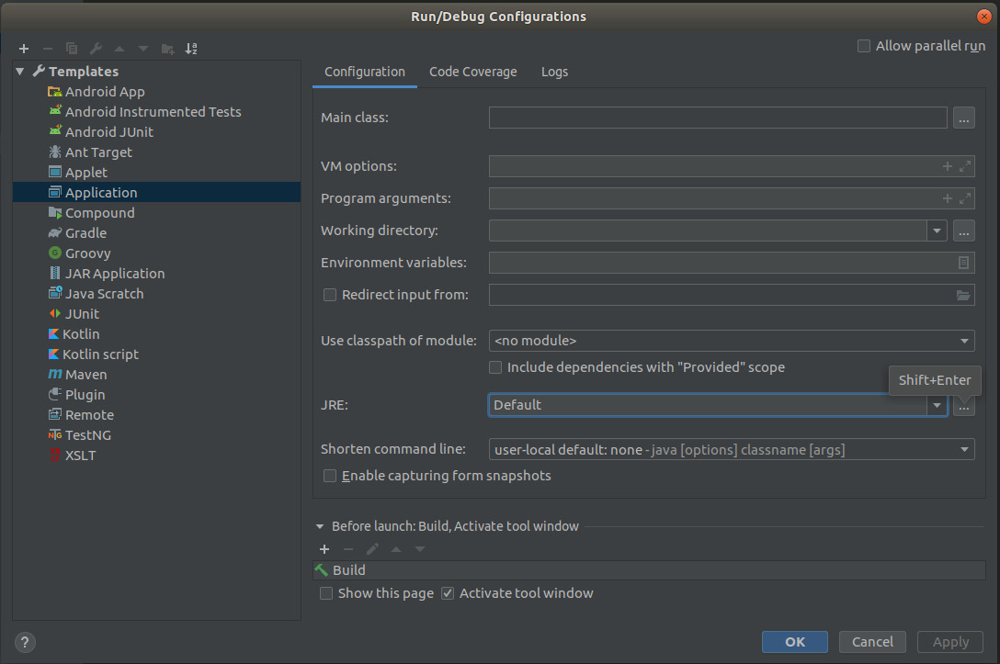

# Learning To Code: IntelliJ IDEA

# Before We Begin

This documentation is to teach people how to use the IntelliJ IDEA IDE; it is meant for those that have at least a basic grasp of how to write general code (so you understand what 'compile' and 'run' means, you understand 'if' conditionals, 'while' and 'for' loops, etc). 

<br> <br>

## Why I Do This

I find that I have to write things down, in a format I understand, in order for me to fully understand a topic; therefore I take notes on subjects I try to learn. These notes are an artifact of that line of thinking.

## My Note Sources

My main note sources are various code examples I have seen on the web, [stackoverflow](https://stackoverflow.com/), and other places.

## Java Version

This document was made for Java version 8.

# Installation

[Go here](https://www.jetbrains.com/idea/download) and download the version of IntelliJ IDEA for your desktop / laptop.

## Linux Installation

There is no official installation on a Linux desktops - simply download the `.tar.gz` file and unzip to the directory of your choice. Within that directory will be a bin directory, and within that directory will be a file called `idea.sh`; simply run this file to launch IntelliJ IDEA.

---

# Basic Java Functions

## Switching Java Version

> If you are using [Maven](learn_to_code/java/maven), you will _also_ have to [change the Java version](learn_to_code/java/maven?id=wrong-java-version) in the [pom.xml](learn_to_code/java/maven?id=pomxml) file.

If you have multiple versions of Java installed and you wish to switch the Java version, click `Run` -> `Edit Configurations`, then dropdown the `Templates` dropdown and select `Application`. There, you will see a `JRE:` label, and then a `...` to the right of the box. Click the `...`:



 From here you will have to select the base path of the version of Java you wish to use for this project (if you followed [these instructions](ubuntu/server_build?id=installing-java-from-oracle) to install Java, this will be `usr/local/java/XXX`, where 'XXX' is the specific folder that contains the version of Java you wish to use).
 
!> If you ran this project as another version of Java, you will get fatal errors saying you have run this in a newer version of Java. You will probably have to delete the `target` folder at the very least, and everything that is not the `src` folder and `pom.xml` if using [Maven](learn_to_code/java/maven) (or Gradle's config file, if that is what you are using) at worst.

## Adding Jars to the Classpath

Follow these instructions to add a jar to the classpath. In or example, we are adding the jar file for a nice [command line argument jar](learn_to_code/java/java_basics?id=command-line-arguments).
To add a jar to the classpath, select `File` -> `Project Structure` -> `Libraries`, click on the `+` (near the top) and then pick `Java` like so:


Once here, navigate to the location of your .jar file and press `OK`:


Press `OK` again to confirm that the .jar file will be added to the module, then click `Apply`, then `OK` again to close the dialog. The .jar file is now in the classpath!

## Command Line Arguments

Sometimes it is necessary to pass arguments to Java via the command line. To do so in IntelliJ, click `Run` -> `Edit Configurations...` and each application (class with a `main()`) will have a `Program arguments` variable under the `Configuration` tab. This is where command line arguments are set. In the example below, `-v Victor` is passed to the Java application:


!> The example above uses flags (-v) in its arguments; this is not native to Java. If you wish to use flags, [see my documentation on Apache Commons CLI](learn_to_code/java/java_basics?id=command-line-arguments).

# The Workspace

## Tool Windows

The tools can be accessed by clicking the square in the lower left corner:


Tools will bring up 'tabs' in what is known as the **tool window bar**:

---

# Debugging

## Break Points

To make a temporary break point in IntelliJ, press `Shift`+`Ctrl`+`Alt`+`F8` while on the line where yo uwish to add the temporary breakpoint. Once that breakpoint is hit, it will be removed.

## Attach Debugger To Running Process

> This section was initially found [on Stack Overflow](https://stackoverflow.com/questions/21114066/attach-intellij-idea-debugger-to-a-running-java-process).

Its possible to create [breakpoints](learn_to_code/java/intellij?id=break-points) in your code, and then attach your instance to a remote running instance of the Java code; this will allow you to temporarily stop the _remote code_ and inspect the values stored in all variables.

First, the environment variable _must_ be set to allow this. On the host server (that is running the code), make sure the environment variable `JAVA_OPTS` is set to something like:
```
export JAVA_OPTS="-agentlib:jdwp=transport=dt_socket,server=y,suspend=n,address=5005"
```
* `address=5005` is the port to connect to; set it to the port number you wish to use.
* You can change `suspend=n` to `suspend=y` to force the application to *not start* until you connect to it with IntelliJ. You will usually want to avoid this.


To connect with IntelliJ, First you must set up the remote debugging session:

1. Run -> Edit Configurations...
2. Click the "+" in the upper left.
3. Select the "Remote" option in the left-most pane.
4. Choose a name.
5. Put the IP of the foreign machine running the code in `Host:`.
6. Put the port of the foreign machine running the code in `Port:`.
7. Click "OK" to save.


Once set up, you can interact with the session. To actually connect, click `Run` and you will see a `Debug XXX` option, where `XXX` is the name you gave the session above. It will connect (in the console window) and give you some commands in the console window. These are important, as if a breakpoint is hit _you will have to hit play after you are done inspecting, otherwise the code will be paused indefinitely on the remote server_. To exit the remote debugger, hit the `stop` button.