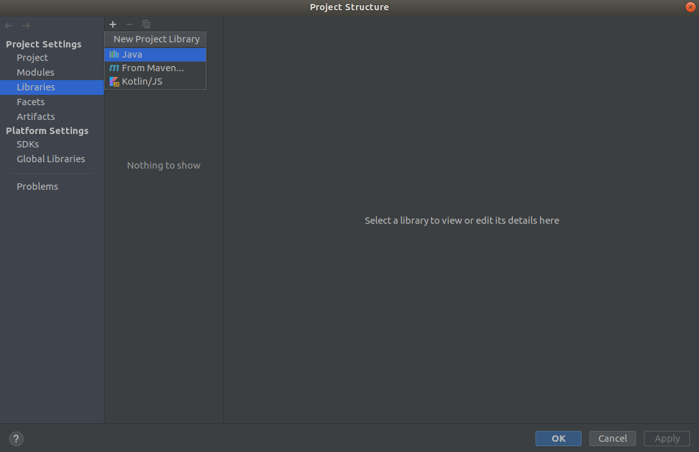
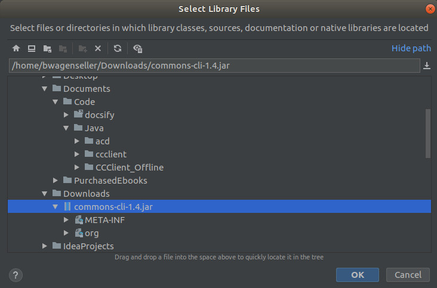
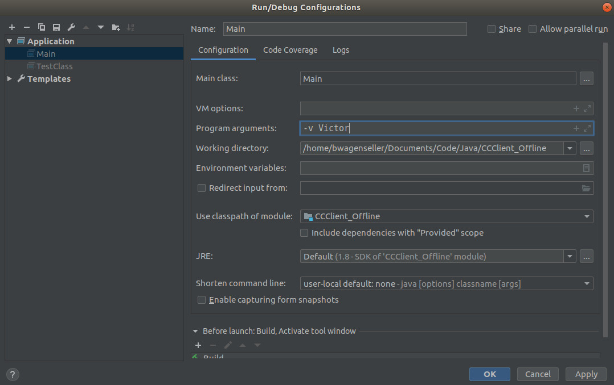
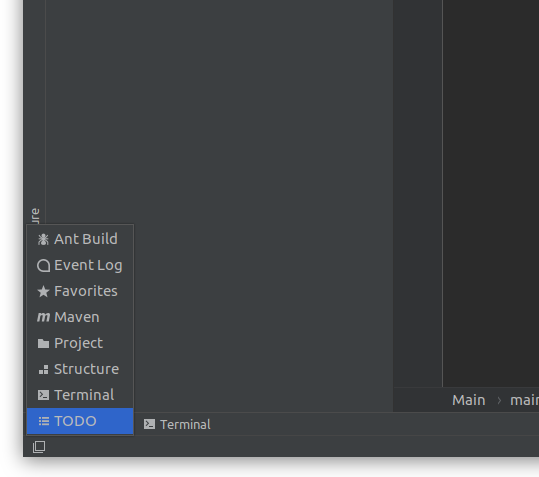

# Learning To Code: IntelliJ IDEA

# Before We Begin

This documentation is to teach people how to use the IntelliJ IDEA IDE; it is meant for those that have at least a basic grasp of how to write general code (so you understand what 'compile' and 'run' means, you understand 'if' conditionals, 'while' and 'for' loops, etc). 

   

## Why I Do This

I find that I have to write things down, in a format I understand, in order for me to fully understand a topic; therefore I take notes on subjects I try to learn. These notes are an artifact of that line of thinking.

## My Note Sources

My main note sources are various code examples I have seen on the web, [stackoverflow](https://stackoverflow.com/), and other places.

## Java Version

This document was made for Java version 8.

# Installation

[Go here](https://www.jetbrains.com/idea/download) and download the version of IntelliJ IDEA for your desktop / laptop.

## Linux Installation

There is no official installation on a Linux desktops - simply download the `.tar.gz` file and unzip to the directory of your choice. Within that directory will be a bin directory, and within that directory will be a file called `idea.sh`; simply run this file to launch IntelliJ IDEA.

---

# Basic Java Functions

## Adding Jars to the Classpath

Follow these instructions to add a jar to the classpath. In or example, we are adding the jar file for a nice [command line argument jar](learn_to_code/java/java_basics?id=command-line-arguments).
To add a jar to the classpath, select `File` -> `Project Structure` -> `Libraries`, click on the `+` (near the top) and then pick `Java` like so:

Once here, navigate to the location of your .jar file and press `OK`:

Press `OK` again to confirm that the .jar file will be added to the module, then click `Apply`, then `OK` again to close the dialog. The .jar file is now in the classpath!

## Command Line Arguments

Sometimes it is necessary to pass arguments to Java via the command line. To do so in IntelliJ, click `Run` -> `Edit Configurations...` and each application (class with a `main()`) will have a `Program arguments` variable under the `Configuration` tab. This is where command line arguments are set. In the example below, `-v Victor` is passed to the Java application:

!> The example above uses flags (-v) in its arguments; this is not native to Java. If you wish to use flags, [see my documentation on Apache Commons CLI](learn_to_code/java/java_basics?id=command-line-arguments).

# The Workspace

## Tool Windows

The tools can be accessed by clicking the square in the lower left corner:

Tools will bring up 'tabs' in what is known as the **tool window bar**:

