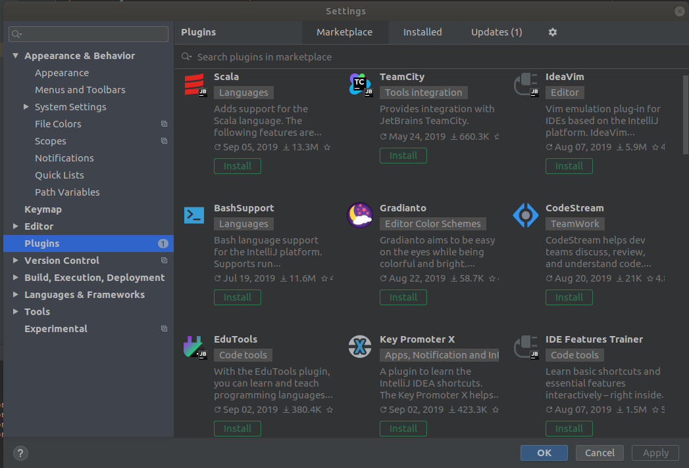
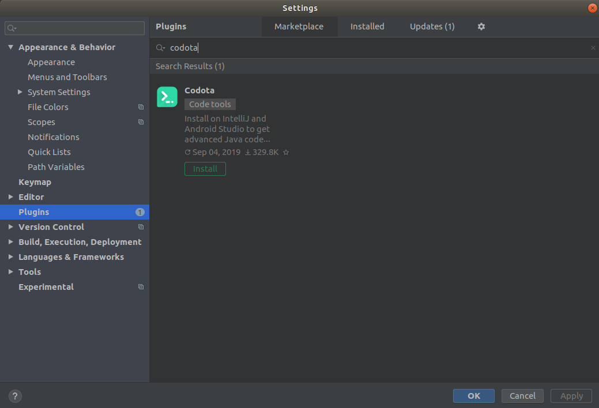
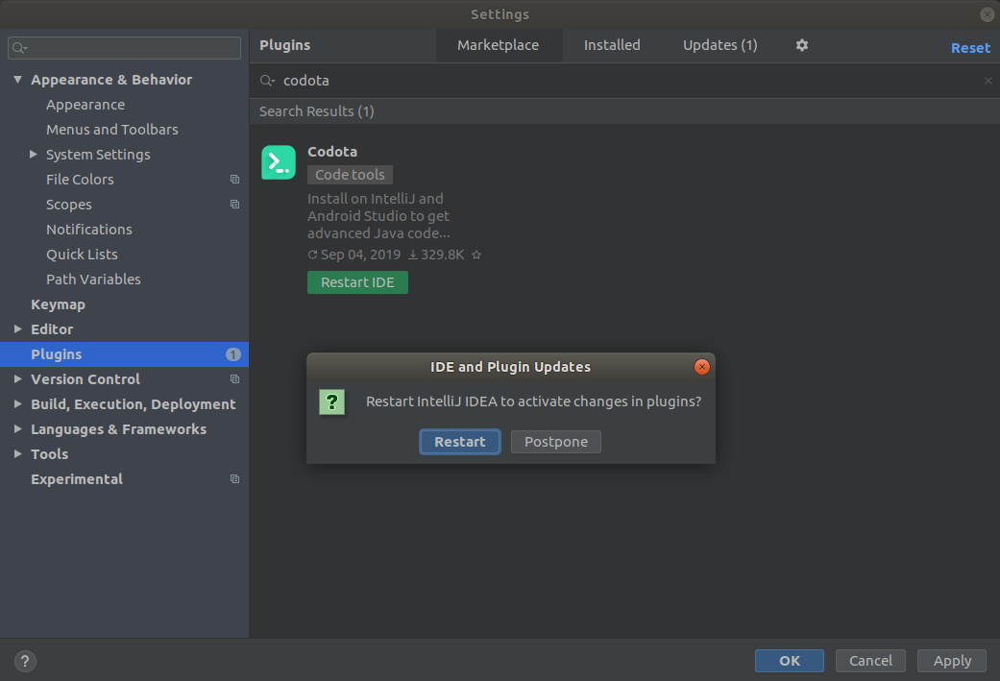
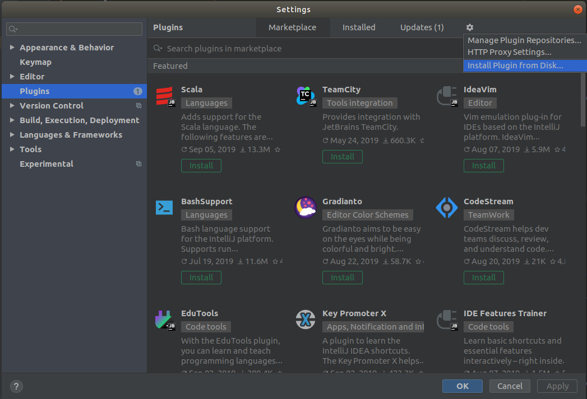
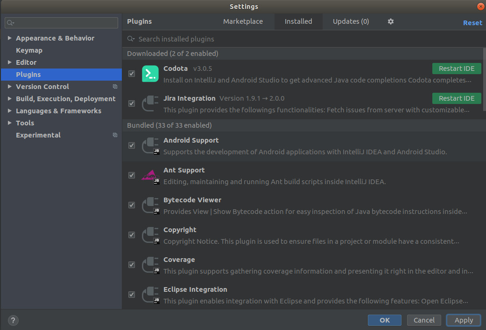
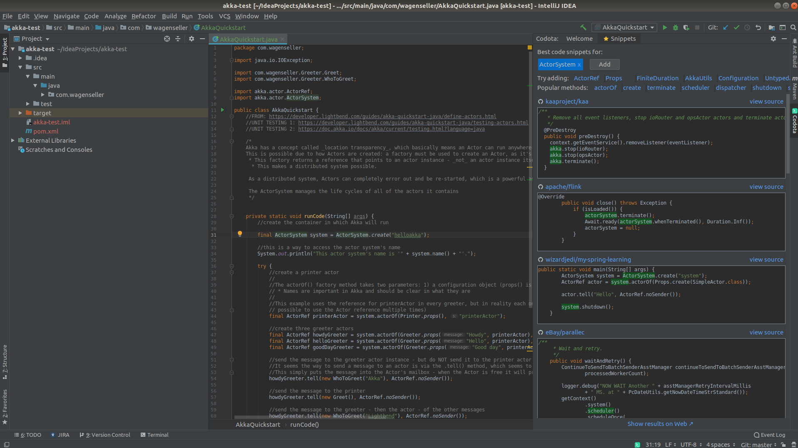
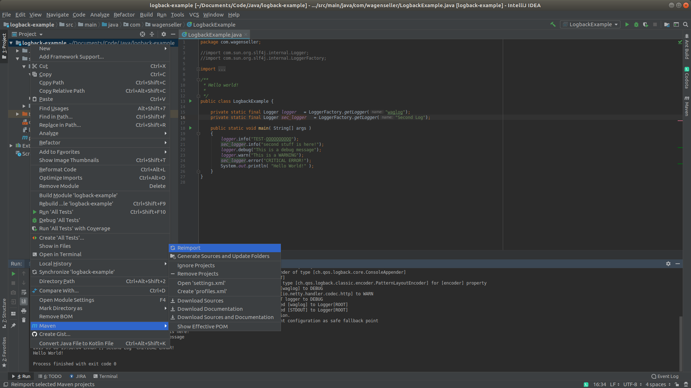

# Learning To Code: IntelliJ IDEA

# Before We Begin

This documentation is to teach people how to use the IntelliJ IDEA IDE; it is meant for those that have at least a basic grasp of how to write general code (so you understand what 'compile' and 'run' means, you understand 'if' conditionals, 'while' and 'for' loops, etc). 

<br> <br>

## Why I Do This

I find that I have to write things down, in a format I understand, in order for me to fully understand a topic; therefore I take notes on subjects I try to learn. These notes are an artifact of that line of thinking.

## My Note Sources

My main note sources are various code examples I have seen on the web, [stackoverflow](https://stackoverflow.com/), and other places.

## Java Version

This document was made for Java version 8.

# Installation

[Go here](https://www.jetbrains.com/idea/download) and download the version of IntelliJ IDEA for your desktop / laptop.


## Linux Installation

There is no official installation on a Linux desktops - simply download the `.tar.gz` file and unzip to the directory of your choice. Within that directory will be a bin directory, and within that directory will be a file called `idea.sh`; simply run this file to launch IntelliJ IDEA.

# Plugin Installation

## Install Plugin From Marketplace

To install a plugin from the internal IntelliJ marketplace:

1\. Press `Ctrl` + `Alt` + `S` to enter the settings menu.

2\. Click `Plugins`:



3\. Search for your plugin (example is of <font color="purple">Codota</font>), and then press <font color="green">Install</font>:



4\. Click <font color="green">Restart IDE</font> and then <font color="blue">Restart</font>:




## Install Plugin From File

To install a plugin from a file you have downloaded (usually something like a <font color="purple">.zip</font> file):

1\. Download your file.

2\. Press `Ctrl` + `Alt` + `S` to enter the settings menu.

3\. Click `Plugins` (as above).

4\. Click the 'Settings' gear (shown here) and then pick <font color="blue">Install Plugin from Disk...</font>:



5\. The plugin will show under `Downloaded` (as does the <font color="purple">Codota</font> example below). Click <font color="green">Restart IDE</font>:



## Suggested Plugins

**<font size="4">Codota</font>**

<font color="purple">Codota</font> is a plugin that allows you to see examples of publicly available classes on the fly. To do so, simply right-click on a class name and then click <font color="green">Get relevant examples</font>. An example of what is displayed is below (I clicked on the `ActorSystem` class):



Doing so brings up code examples on the right - I believe they are from GitHub (as a requirement to use <font color="purple">Codota</font>, you must log in with your GitHub, Facebook, or a few other accounts). These are all publicly available pieces of code.

To install <font color="purple">Codota</font>, you can [find it in IntelliJ's marketplace](learn_to_code/java/intellij?id=install-plugin-from-marketplace) or you can download the zip file [here](https://plugins.jetbrains.com/plugin/7638-codota-) and then [install it manually](learn_to_code/java/intellij?id=install-plugin-from-file).

**<font size="4">Jira Integration</font>**

If your team uses Jira, you can load it [from IntelliJ's marketplace](learn_to_code/java/intellij?id=install-plugin-from-marketplace).

---

# Basic Java Functions

## Switching Java Version

> If you are using [Maven](learn_to_code/java/maven), you will _also_ have to [change the Java version](learn_to_code/java/maven?id=wrong-java-version) in the [pom.xml](learn_to_code/java/maven?id=pomxml) file.

If you have multiple versions of Java installed and you wish to switch the Java version, click `Run` -> `Edit Configurations`, then dropdown the `Templates` dropdown and select `Application`. There, you will see a `JRE:` label, and then a `...` to the right of the box. Click the `...`:


 From here you will have to select the base path of the version of Java you wish to use for this project (if you followed [these instructions](operating_systems/ubuntu/server_build?id=installing-java-from-oracle) to install Java, this will be `usr/local/java/XXX`, where 'XXX' is the specific folder that contains the version of Java you wish to use).
 
!> If you ran this project as another version of Java, you will get fatal errors saying you have run this in a newer version of Java. You will probably have to delete the `target` folder at the very least, and everything that is not the `src` folder and `pom.xml` if using [Maven](learn_to_code/java/maven) (or Gradle's config file, if that is what you are using) at worst.

## Adding Jars to the Classpath

Follow these instructions to add a jar to the classpath. In or example, we are adding the jar file for a nice [command line argument jar](learn_to_code/java/java_basics?id=command-line-arguments).
To add a jar to the classpath, select `File` -> `Project Structure` -> `Libraries`, click on the `+` (near the top) and then pick `Java` like so:


Once here, navigate to the location of your .jar file and press `OK`:


Press `OK` again to confirm that the .jar file will be added to the module, then click `Apply`, then `OK` again to close the dialog. The .jar file is now in the classpath!

## Command Line Arguments

Sometimes it is necessary to pass arguments to Java via the command line. To do so in IntelliJ, click `Run` -> `Edit Configurations...` and each application (class with a `main()`) will have a `Program arguments` variable under the `Configuration` tab. This is where command line arguments are set. In the example below, `-v Victor` is passed to the Java application:


!> The example above uses flags (-v) in its arguments; this is not native to Java. If you wish to use flags, [see my documentation on Apache Commons CLI](learn_to_code/java/java_basics?id=command-line-arguments).

# The Workspace

## Tool Windows

The tools can be accessed by clicking the square in the lower left corner:


Tools will bring up 'tabs' in what is known as the **tool window bar**:

---

# Shortcuts

| Main Idea | Key Combo | Effect | 
| --- | --- | --- |  
| Find | `Ctrl` + `Shift` + `Alt` + `N` | (right side of keyboard only) Finds a 'symbol' - this can be a variable name OR a method name, anywhere. |  
| Find/Replace | `Ctrl` + `F` | <font color="purple">Find</font> (Current Window) | 
| Find/Replace | `Ctrl` + `Shift` + `F` | <font color="purple">Find</font> (Entire Project) | 
| Find/Replace | `F3` | <font color="purple">Find</font> Next (Current Window) | 
| Find/Replace | `F2` | <font color="purple">Find</font> Next Error (Current Window) | 
| Find/Replace | `Shift` + `F3` | <font color="purple">Find</font> Previous | 
| Find/Replace | Double `Shift` | <font color="purple">Find</font> Classes and Files | 
| Find/Replace | `Ctrl` + `F3` | <font color="purple">Find</font> Word at Cursor | 
| Find/Replace | `Ctrl` + `R` | <font color="green">Replace</font> (Current Window) | 
| Find/Replace | `Ctrl` + `Shift` + `R` | <font color="green">Replace</font> (Entire Project) | 
| Cursor Position | `Alt` + `Shift` + `Left` | Move cursor backward. | 
| Cursor Position | `Alt` + `Shift` + `Right` | Move cursor forward. |  
| Show | `Ctrl` + `P` | <font color="orange">Show</font> parameter information in called method. | 
| Show | `Ctrl` + `E` | <font color="orange">Show</font> recently used files. | 
| Show | `Ctrl` + `F12` | Opens a popup (called the Structure Popup) that shows ALL methods and class variables for the current class. Pressing `Ctrl` + `F12` again while the window is up will show all interface and superclass methods as well (or you can just toggle the checkmark that controls this in the window). |  
| Show | `Ctrl` + `Alt` + `F7` | 'Show usages' of a 'symbol' (method, class, interface, etc) will show where this symbol is used. <font color="red">Be careful</font> with this as this same shortcut in Ubuntu will switch to a terminal 'virtual' screen, and the only way to get back is `Ctrl` + `Alt` + `F1`. An alternative is to hold `Ctrl` and then click the symbol with the mouse. |  
| Comment | `Ctrl` + `/` | Quickly comment out / uncomment current line. Moves to next line so this can be done in rapid succession. |
| Comment | `Ctrl` + `Shift` + `/` | Quickly uncomment an entire block of code. This also starts a new block of comments where one does not exist. |  
| Usage | `Ctrl` + `B` | Find where a method etc is declared or the spots where its used. Works the same way as `Ctrl` + `Left Mouse Click`. |  
| GoTo | `Ctrl` + `G` | Opens the `Go To Line` box.  |  
| Bookmark | `F11` | Bookmark a spot in the code. |  
| Bookmark | `Shift` + `F11` | Show all bookmarks. |  
| Switcher | `Ctrl` + `Tab` | Opens the `Switcher` box.  |  
| Hierarchy | `Alt` + `Home` | Lets you navigate the entire project tree if the project window is not open. |  
| Hierarchy | `Ctrl` + `H` | Gives you a hierarchy tree of the current interface / class. You can also do this by pressing `Ctrl` and then clicking the class with the mouse - then in the popup, pick 'Class Hierarchy' in the dropdown and then type the interface / class name. |  
| Hierarchy | `Ctrl` + `Alt` + `U` | Gives you a hierarchy like `Ctrl` + `H`, but is a _visual_ representation (paid version of IntelliJ only). |  
| Hierarchy | `Ctrl` + `Alt` + `H` | Brings up the method call hierarchy. If you press this in a method, it will show you every way that method gets called, from the very first method that will eventually invoke the method you selected. |  
| ??? | `Ctrl` + `W` | Extend selection. <font color="red">More research needed.</font> |  
| ??? | `Alt` + `Insert` | Generate code. <font color="red">More research needed.</font> |  
| ??? | `Shift` + `F6` | Rename. <font color="red">More research needed.</font> |  
| ??? | `Alt` + `Enter` | Show intention actions and quick-fixes. <font color="red">More research needed.</font> |  
| ??? | `Alt` + `Backquote` | VCS operations popup. <font color="red">More research needed.</font> |  

## Ubuntu Shortcuts  

I am listing these as some of these step on IntelliJ shortcuts.  

| Main Idea | Key Combo | Effect | 
| --- | --- | --- |  
| Move Window | `Alt` + `F7` | Moves the window (with your mouse). |  
| Close Window | `Alt` + `F4` | Immediately closes the selected application. |  
| Virtual Screen | `Ctrl` + `Alt` + `F7` | Switches to a 'virtual screen' which turns out to be a terminal - to get back - `Ctrl` + `Alt` + `F1`. |  
| Graphical Screen | `Ctrl` + `Alt` + `F1` | Go back to the graphical screen if you accidentally hit `Ctrl` + `Alt` + `F7`. |  


---

# Debugging

## Break Points

To make a temporary break point in IntelliJ, press `Shift`+`Ctrl`+`Alt`+`F8` while on the line where yo uwish to add the temporary breakpoint. Once that breakpoint is hit, it will be removed.

## Attach Debugger To Running Process

> This section was initially found [on Stack Overflow](https://stackoverflow.com/questions/21114066/attach-intellij-idea-debugger-to-a-running-java-process).

Its possible to create [breakpoints](learn_to_code/java/intellij?id=break-points) in your code, and then attach your instance to a remote running instance of the Java code; this will allow you to temporarily stop the _remote code_ and inspect the values stored in all variables.

First, the environment variable _must_ be set to allow this. On the host server (that is running the code), make sure the environment variable `JAVA_OPTS` is set to something like:
```
export JAVA_OPTS="-agentlib:jdwp=transport=dt_socket,server=y,suspend=n,address=5005"
```
* `address=5005` is the port to connect to; set it to the port number you wish to use.
* You can change `suspend=n` to `suspend=y` to force the application to *not start* until you connect to it with IntelliJ. You will usually want to avoid this.


To connect with IntelliJ, First you must set up the remote debugging session:

1. Run -> Edit Configurations...
2. Click the "+" in the upper left.
3. Select the "Remote" option in the left-most pane.
4. Choose a name.
5. Put the IP of the foreign machine running the code in `Host:`.
6. Put the port of the foreign machine running the code in `Port:`.
7. Click "OK" to save.


Once set up, you can interact with the session. To actually connect, click `Run` and you will see a `Debug XXX` option, where `XXX` is the name you gave the session above. It will connect (in the console window) and give you some commands in the console window. These are important, as if a breakpoint is hit _you will have to hit play after you are done inspecting, otherwise the code will be paused indefinitely on the remote server_. To exit the remote debugger, hit the `stop` button.

# Maven In IntelliJ

## Importing a Maven Project

To import a [Maven](learn_to_code/java/maven) project, select `File` -> `Open` and then pick the project's associated [pom.xml](learn_to_code/java/maven?id=pomxml).  You will then be prompted to <font color="blue">Open as Project</font> - do so.

## Fixing Maven Import

Sometimes the IntelliJ project becomes out of sync with Maven's [pom.xml](learn_to_code/java/maven?id=pomxml) file - usually this happens when new dependencies are imported. To fix this (and other issues), right-click the project and then pick `Maven` -> `Reimport`:



---

# Git in IntelliJ

## Commit Changes

Press `Ctrl`+`k` to bring up the commit dialog.
* uncheck 'perform code analysis' and 'check TODO'
* type comment - usually for one change

## Push Changes

Press `Ctrl`+`Shift`+`k` to push the branch.


