# Maven

!> A big 'thank you' to Brett Tofel for answering lingering questions about Maven, which provided some insight into this tutorial!

Maven is a (newer, and now more widely-used) tool that can compile Java projects. Many entities wanted to move away from Ant because it was _too_ general. <br>

Note that you [must install Maven](operating_systems/ubuntu/server_build?id=installing-apache-maven) before you use it.

!> Careful with running Maven in IDEs: it appears that Maven is _very_ specific, and as such it may be advisable to create the project with Maven _first_, _then_ import to your IDE.

## What is the main idea behind Maven?

The main points of Maven:
* Maven's main purpose is to compile and build your project by compiling the code into a [jar artifact](learn_to_code/java/java_terms_and_concepts?id=artifact) which can then be run elsewhere.
* Maven can also be used to [download jars your project depends on from public or private repositories](learn_to_code/java/maven?id=adding-dependencies-to-maven); this means you do not have to constantly worry about downloading jar files manually to support your projects, as Maven will do this automatically for you and store them in your local repository.
* Finally, Maven can run unit (and integration) tests before it compiles your code!

## What does Maven NOT do?

Maven does not:
* Track version history - use [git](learn_to_code/git/) for that.
* Check code errors. Well it actually does, but do not use it for this (instead, use an IDE like Eclipse or [IntelliJ](learn_to_code/java/intellij) to check your code for errors).

# Installing Maven

## Ubuntu Install

To install Maven on Ubuntu:

1\. [Become root](/operating_systems/ubuntu/linux_notes?id=becoming-root).

2\. [Update all packages](/operating_systems/ubuntu/linux_notes?id=updating-upgrading-all-packages).

3\. Install Maven:
```
apt-get install maven
```

## Windows Install

> These instructions were initially found [here](https://www.mkyong.com/maven/how-to-install-maven-in-windows/).

1\. Download the `.zip` file from [here](https://maven.apache.org/download.cgi).

2\. Follow [these](https://www.mkyong.com/maven/how-to-install-maven-in-windows/) instructions.


# Locations of Files in Maven

Its possible to change the file structure in Maven, but most do not (and most do not recommend it). The basic file structure is:
* Source (code) files: Directory `src/`
 * Test code: `src/test/`
   * <font color="red">Test</font> is for running both Junit tests and [integration tests](learn_to_code/java/maven?id=integration-testing) - place those tests here!
   * Test Java Code: `src/test/Java/`
   * Resources: `src/test/resources/`
 * Production Code: `src/main/`
   * <font color="red">Main</font> is where your actual code lives.
   * Production Java Code: `src/main/Java/`
   * Resources: `src/main/resources/`
* Files created by Compiling: Directory `target/`
 * JAR file
 * .class files (in a similar directory to what it is in in the source directory)
 
[Here](learn_to_code/java/maven?id=override-default-folders) is how you would change these default directories.

## Resources in Maven

It was stated that resources are stored in `src/main/resources/` - but what exactly are resources, and what do they do? Any file you put into this folder gets moved to the root of the [compiled jar file](learn_to_code/java/maven?id=the-compiled-jar-file) that Maven creates. As an example, the configuration files of [Logback](learn_to_code/java/logback?id=configuration-files) need to be placed here so that dependency can function correctly.


# Creating a Project with Maven

## Interactive Mode

!> Make SURE that when you create your project that you want your current working directory to be the root directory for your project!

Maven helps you build a skeleton for your project. You can create a Maven project with generating an 'archetype' for a project with the command `mvn archetype:generate` (an archetype is basically an initial code layout). You will now be asked several questions:
* <font color="green">Project Type</font>: Maven will ask 'Choose a number' and will be referencing a project type. It will then list *thousands* of project types; just choose the default (which the ID can change)
* <font color="green">Project Version</font>: Pick what you like, but the best is choice 5 (Version 1.0).
* <font color="green">groupID</font>: A 'group' that this project will belong to; its [usually a domain name reversed](http://maven.apache.org/guides/mini/guide-naming-conventions.html) (so microsoft.com becomes com.microsoft) followed by you company's policy on naming groups. Usually any 'dot' here will represent a folder (so com.sun will become com/sun/ on the server). For our purposes we will choose 'com.vandelay.industries'
* <font color="green">artifactID</font>: This is a description of what the code will be doing; hyphens (-) are usually used instead of underscores. Do NOT include any versions for this. I just called it 'SortTutorial'.
* <font color="green">Version</font>: I am not sure why it asks for another version, but most use [semantic versioning](http://semver.org/), which means 'MajorRelase.MinorRelease.PatchRelease'. Also the term '-SNAPSHOT' is sometimes used at the end which means 'nightly build'; that said, Maven interprets '-SNAPSHOT' as a non-release version, which means it allows multiple versions of this to be released (versions without '-SNAPSHOT' at the end can only be used once, so be careful). Lets name ours '1.0.0-SNAPSHOT'
* <font color="green">Package</font>: Almost exclusively the same as the 'groupID', so use that unless there is some odd reason to use something else.

Maven has now created a 'SortTutorial' folder in your current directory; in SortTutorial/ Maven created the [pom.xml](learn_to_code/java/maven?id=maven-xml-file) file. It also created two files: a test filecalled 'AppTest.java' in `SortTutorial/src/test/java/com/vandelay/industries` and a 'main' file called 'App.java' in `SortTutorial/src/main/java/com/vandelay/industries`; these use the groupIDs (and make directories separated by the dots present) combined with the [main and test files that are standard for Maven](learn_to_code/java/maven?id=locations-of-files-in-maven).

The file is a skeleton built for testing your code; in fact, Maven has included the junit library 'junit.framework.\*' (pronouncted j-unit), which is meant for unit testing your code.

## One Command

!> Make SURE that when you create your project that you want your current working directory to be the root directory for your project!

You can also generate a quick project on the fly by specifying all of the flags along with the flag `-DinteractiveMode=false`:
```
mvn archetype:generate -DgroupId=com.yourcompany.mavenexample -DartifactId=maven-example -Dversion=1.0.0-SNAPSHOT -DinteractiveMode=false
```
---

# POM.xml

The XML file that Maven **needs** to compile the code is pom.xml (Project Object Model). This pom.xml file is _required_ to be in the root directory of your Java project (and your Java project _must_ use the directory structure [as noted above](learn_to_code/java/maven?id=locations-of-files-in-maven)).

## Sample POM.xml

A sample `pom.xml` (which can be generated by [creating a project with maven](learn_to_code/java/maven?id=creating-a-project-with-maven) is as follows:

```
<project xmlns="http://maven.apache.org/POM/4.0.0" xmlns:xsi="http://www.w3.org/2001/XMLSchema-instance"
  xsi:schemaLocation="http://maven.apache.org/POM/4.0.0 http://maven.apache.org/maven-v4_0_0.xsd">
	<modelVersion>4.0.0</modelVersion>
	
	<groupId>com.yourcompany.mavenexample</groupId>
	<artifactId>maven-example</artifactId>
	<packaging>jar</packaging>

	<properties>
		<project.build.sourceEncoding>UTF-8</project.build.sourceEncoding>
		<maven.compiler.source>1.8</maven.compiler.source>
		<maven.compiler.target>1.8</maven.compiler.target>
		<mainClass>com.yourcompany.mavenexample.ClassWithMain</mainClass>
		<platformAPI.version>1.1</platformAPI.version>
	</properties>	
	<version>1.0.0-SNAPSHOT</version>
	<name>maven-example</name>
	
	<!-- You can change the URL to your company's URL -->
	<url>http://maven.apache.org</url>
	<dependencies> 
		<dependency>
			<groupId>junit</groupId>
			<artifactId>junit</artifactId>
			<version>3.8.1</version>
			<scope>test</scope>
		</dependency> 
	</dependencies>
	<build>
		<plugins>	
			<plugin>
				<groupId>org.apache.maven.plugins</groupId>
				<artifactId>maven-shade-plugin</artifactId>
				<version>3.0.0</version>
				<executions>
					<execution>
						<phase>package</phase>
						<goals>
							<goal>shade</goal>
						</goals>
					</execution>
				</executions>
			</plugin>
			<plugin>
				<artifactId>maven-jar-plugin</artifactId>
				<version>3.0.2</version>
				<configuration>
					<archive>
						<manifest>
							<addClasspath>true</addClasspath>
							<classpathPrefix>lib/</classpathPrefix>
							<mainClass>${mainClass}</mainClass>
						</manifest>
					</archive>
				</configuration>
			</plugin>	
		</plugins>
	</build>	
</project>
```
Some basic notes:
* `groupId`, `artifactId`, and `version` all come from [initially creating the project with maven](learn_to_code/java/maven?id=creating-a-project-with-maven)
 * The package name will _always_ be the `groupId` unless you specify it with the `-Dpackage=XXX` flag (so for example, we could have said `-Dpackage=com.yourcompany.mavenexample.differentpackagename` above).
* `name` seems to be the same as `artifactId`.
* `maven.compiler.source` and `maven.compiler.target` set the version of Java - <font color="red">you are required to set this yourself</font>, as Maven currently assumes Java 5, which is deprecated - so running Maven on a pom.xml file out of the box will immediately fail. Currently, you can use Java 8 (use 1.8, which is assumed above) or Java 11 (use 1.11).
* `<mainClass>` lists where the runnable `main()` method is; if you want the jar file created by Maven to be runnable, you will need this _in addition to_ the `maven-jar-plugin` plugin above.
* The plugin `maven-shade-plugin` allows for all referenced jar files to be stored in the jar file created by Maven - I always include this plugin as I like my created jar files runnable on their own. That said, if this is for an embedded system (or a place where hard disk space is an issue) you may not want to use this plugin.

> Note the above sets the Java version to 8 (1.8) - you may want to change this.

## Override Default Folders

If you wish to override the [default location files in Maven](learn_to_code/java/maven?id=locations-of-files-in-maven), you can do so by adding (or editing) the `<build>` tag under the main `<project>` tag. Below is an example of how to edit the source directory, the test directory, and the output directory (the below lists how to reference the default directories, so just modify them):
```
<build>
	<sourceDirectory>${basedir}/src/main/java</sourceDirectory>
	<testSourceDirectory>${basedir}/src/test/java</testSourceDirectory>
	<outputDirectory>${basedir}/target/classes</outputDirectory>
</build>
```

!> You are highly discouraged from modifying the default directories, as most Maven users just use the default!

## Setting Java Version

Maven _requires_ you to set the version of Java you wish to use (it currently assumes Java 5, which is deprecated - so running Maven on a pom.xml file out of the box will immediately fail).  To set the Java version, open pom.xml and paste in between the `<project>...</project>` tags (<font color="red">OR</font> alter the existing `<properties>` tag):
```
	<properties>
		<project.build.sourceEncoding>UTF-8</project.build.sourceEncoding>
		<maven.compiler.source>1.11</maven.compiler.source>
		<maven.compiler.target>1.11</maven.compiler.target>
		<platformAPI.version>1.1</platformAPI.version>
	</properties>
```
* The above assumes Java 11 (which is what 1.11 means), but you can also use another version of Java here (for example, Java 8 would be `1.8`).

You can alternatively set this in the `<build>` tag (which is in between the `<project>...</project>` tags), but this does not seem to be used much anymore (I now skip it entirely, but am putting it here for reference). If you wish to use this method, you can paste this in between the `<project>...</project>` tags (<font color="red">OR</font> alter the existing `<build>` tag):
```
  <build>
      <plugins>
        <plugin>
          <groupId>org.apache.maven.plugins</groupId>
          <artifactId>maven-compiler-plugin</artifactId>
          <version>3.8.0</version>
          <configuration>
              <source>1.11</source>
              <target>1.11</target>          
          </configuration>
        </plugin>
      </plugins>
  </build>
```
* Again, this assumes Java 11; for Java 8, use `1.8`.
* I used to include a `<release>11</release>` in here as well but it gave me problems.
* You are free to change the version of `maven-compiler-plugin` from `3.8.0` to whatever you wish.

## Adding Dependencies to Maven

Often, you will have to add specific [JAR files](learn_to_code/java/java_basics?id=jar-files) to your projects; sometimes they are homemade, and sometimes they are officially available to the public via a free library. Whichever the case, you can add either JAR file to your maven project.

Dependencies are defined under the `<project>` tag, then the `<dependencies>` tag. Each _individual_ dependency is listed under a `<dependency>` tag here. The official example [is above](learn_to_code/java/maven?id=pomxml), but a paired down example is of [junit](https://mvnrepository.com/artifact/junit/junit/4.11) (which is the only default dependency):
```
    <dependency>
      <groupId>junit</groupId>
      <artifactId>junit</artifactId>
      <version>4.11</version>
      <scope>test</scope>
    </dependency>
```

This works because all of the components of **Maven coordinates** are given, which identify a project, dependency, or plugin defined in the pom. Maven coorinates are comprised of:
* A group identifier
* An artifact identifier
* A version

**<font size="4">Adding Public Dependencies to Maven</font>**

Its possible to get publicly available JAR files into maven - they will be downloaded automatically. For the purpose of example, we will use the [Apache Commons CLI](http://commons.apache.org/proper/commons-cli/), which parses arguments on the command line.

Steps:

1\. Search for your JAR file plus the word `maven` in a web browser. Look for the results from the page https://mvnrepository.com - it is from this page that we can get the XML information for our `pom.xml` file. In our case, I searched for 'Apache Commons CLI maven' and clicked on the https://mvnrepository.com link and got this:

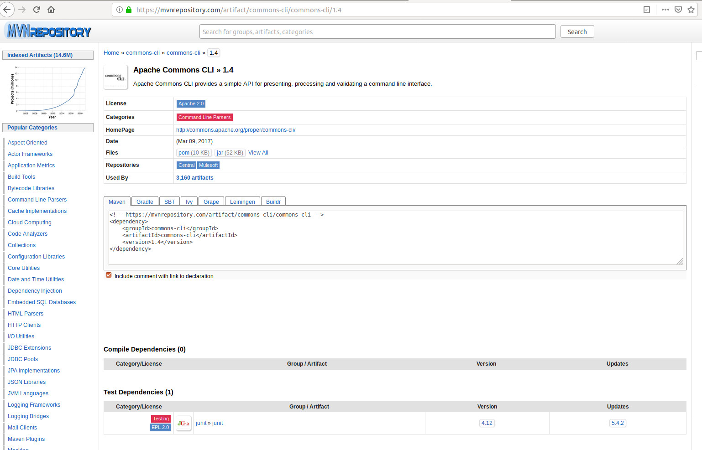

2\. Copy the XML from step 1; in our case, that is:
```
<!-- https://mvnrepository.com/artifact/commons-cli/commons-cli -->
<dependency>
    <groupId>commons-cli</groupId>
    <artifactId>commons-cli</artifactId>
    <version>1.4</version>
</dependency>
```

3\. Open the associated Maven `pom.xml` file and look for the `<dependencies>...</dependencies>` tags. Paste the contents from step #2 just before the last dependency. Save the file.

Now, if you [compile your Maven project](learn_to_code/java/maven?id=compiling-your-maven-project), the [jar artifact](learn_to_code/java/java_terms_and_concepts?id=artifact) will be automatically downloaded to [your local repository](learn_to_code/java/maven?id=the-39repository39-directory)!

**<font size="4">Adding Private Dependencies to Maven</font>**

It is also possible to utilize a private Maven repository; to do this, you will have to [configure your settings.xml file](learn_to_code/java/maven?id=settingsxml)

## Adding Variables / Properties  

In many cases, you may have many dependencies for the same cluster of jar files - for example, Akka has dozens of different, independent jar files that can be loaded through Maven, and usually their different versions and Scala versions must match. You can manage the versions with Maven properties - these must be placed in the `<properties>` tag. They can be any name that does not have any conflicts. An example:  
```
    <properties>
        <akka.version>2.6.4</akka.version>
        <akka.scala.version>2.13</akka.scala.version> 
    </properties>
```  

So instead of having to add a version in each individual [dependency](learn_to_code/java/maven?id=adding-dependencies-to-maven) entry, you can simply reference the variable using `${parameterName}` like so:  
```
        <dependency>
            <groupId>com.typesafe.akka</groupId>
            <artifactId>akka-actor-typed_${akka.scala.version}</artifactId>
            <version>${akka.version}</version>
        </dependency>
        <dependency>
          <groupId>com.typesafe.akka</groupId>
          <artifactId>akka-slf4j_${akka.scala.version}</artifactId>
          <version>${akka.version}</version>
        </dependency>
        <dependency>
          <groupId>com.typesafe.akka</groupId>
          <artifactId>akka-stream_${akka.scala.version}</artifactId>
          <version>${akka.version}</version>
        </dependency>
```  

In this example, the Akka version for all entries are 2.6.4 and the Akka Scala version is 2.13; if these need to be changed in the future they only need to be changed in one place.  

## Making the Jar Runnable

There are a few things you will have to add to your pom.xml file in order to make [your Maven-compiled Jar file](learn_to_code/java/maven?id=the-compiled-jar-file) runnable - namely, you will have to identify the class that holds the `main()` method.

To do so, you will have to add the `<mainClass>` tag under the `<properties>` tag (see [here](learn_to_code/java/maven?id=sample-pomxml) for where that is):
```
<mainClass>com.yourGroupID.ClassWithMain</mainClass>
```
* `com.yourGroupID` is the <font color="green">groupID</font>.
* `ClassWithMain` is your class with the runnable `main()` function.

You will then have to add a `<plugin>` tag under the `<plugins>` tag (see [here](learn_to_code/java/maven?id=sample-pomxml) for where that is):

```
			<plugin>
				<artifactId>maven-jar-plugin</artifactId>
				<version>3.0.2</version>
				<configuration>
					<archive>
						<manifest>
							<addClasspath>true</addClasspath>
							<classpathPrefix>lib/</classpathPrefix>
							<mainClass>${mainClass}</mainClass>
						</manifest>
					</archive>
				</configuration>
			</plugin>
```
* This can be used 'as-is' (so long as you entered the `<mainClass>` under `<properties>`) - the only thing you may want to change is the version of `maven-jar-plugin`, but you probably won't even have to do that.

Now you can run your jar file with the command `java -jar XXX.jar` (XXX is the name of your jar) and the `main()` method in your class `ClassWithMain` will run.

## Including Jar Dependencies

Sometimes you will wish to make [your Maven-compiled Jar file](learn_to_code/java/maven?id=the-compiled-jar-file) completely independent; this will mean including _all_ dependencies in your compiled jar file. To do this, include the `maven-shade-plugin` within your `<pluguns>` tag (see [here](learn_to_code/java/maven?id=sample-pomxml) for where that is):
```
			<plugin>
				<groupId>org.apache.maven.plugins</groupId>
				<artifactId>maven-shade-plugin</artifactId>
				<version>3.0.0</version>
				<executions>
					<execution>
						<phase>package</phase>
						<goals>
							<goal>shade</goal>
						</goals>
					</execution>
				</executions>
			</plugin>
```

> You can configure this to exclude certain jars and other files (a jar that can usually be excluded is junit, for example): to do so you will have to include a `<configuration>` tag under the `<plugin>` tag above. I will skip this for now, but I may circle back to this in the future and lay out here how to do that.

---

# Compiling Your Maven Project

## Package vs Install

First, you must recognize the difference between `package` and `install`:
* `package` will compile and package the code; in other words, it will create the artifact [jar file] of your compiled code, placing it in the `target/` folder.
* `install` will do everything `package` does _plus_ install the package to [your local repository](learn_to_code/java/maven?id=the-39repository39-directory) so other Maven projects can use your project.

## Specifying Clean

You can specify the `clean` keyword when compiling your Maven project, which will delete **all** components in the `target/` directory.

## Example Maven Compilation

To compile the Maven project, go into the project's root directory (which houses its [pom.xml](learn_to_code/java/maven?id=pomxml)) and type one of the following:
* `mvn package` if you wish to simply create the artifact jar file in the `target/` directory.
* `mvn install` if you wish to create the artifact jar file in the `target/` directory and then install it to [your local repository](learn_to_code/java/maven?id=the-39repository39-directory).
* `mvn clean package` if you wish to delete **everything** in the `target/` directory first and then create the artifact jar file there.
* `mvn clean install` if you wish to do the same thing as `mvn clean package` plus install it to [your local repository](learn_to_code/java/maven?id=the-39repository39-directory).

!> The first time you run this it will download a bunch of pom files - this is fine.

You should see something like this:
```
WARNING: An illegal reflective access operation has occurred
WARNING: Illegal reflective access by com.google.inject.internal.cglib.core.$ReflectUtils$1 (file:/usr/share/maven/lib/guice.jar) to method java.lang.ClassLoader.defineClass(java.lang.String,byte[],int,int,java.security.ProtectionDomain)
WARNING: Please consider reporting this to the maintainers of com.google.inject.internal.cglib.core.$ReflectUtils$1
WARNING: Use --illegal-access=warn to enable warnings of further illegal reflective access operations
WARNING: All illegal access operations will be denied in a future release
[INFO] Scanning for projects...
[INFO] 
[INFO] ------------------------------------------------------------------------
[INFO] Building SortTutorial 1.0.0-SNAPSHOT
[INFO] ------------------------------------------------------------------------
[INFO] 
[INFO] --- maven-resources-plugin:2.6:resources (default-resources) @ SortTutorial ---
[WARNING] Using platform encoding (UTF-8 actually) to copy filtered resources, i.e. build is platform dependent!
[INFO] skip non existing resourceDirectory /home/manifest/TEMP_Eclipse/SortTutorial/src/main/resources
[INFO] 
[INFO] --- maven-compiler-plugin:3.8.0:compile (default-compile) @ SortTutorial ---
[INFO] Nothing to compile - all classes are up to date
[INFO] 
[INFO] --- maven-resources-plugin:2.6:testResources (default-testResources) @ SortTutorial ---
[WARNING] Using platform encoding (UTF-8 actually) to copy filtered resources, i.e. build is platform dependent!
[INFO] skip non existing resourceDirectory /home/manifest/TEMP_Eclipse/SortTutorial/src/test/resources
[INFO] 
[INFO] --- maven-compiler-plugin:3.8.0:testCompile (default-testCompile) @ SortTutorial ---
[INFO] Nothing to compile - all classes are up to date
[INFO] 
[INFO] --- maven-surefire-plugin:2.12.4:test (default-test) @ SortTutorial ---
[INFO] Surefire report directory: /home/manifest/TEMP_Eclipse/SortTutorial/target/surefire-reports

-------------------------------------------------------
 T E S T S
-------------------------------------------------------
Running com.vandelay.industries.AppTest
Tests run: 1, Failures: 0, Errors: 0, Skipped: 0, Time elapsed: 0.007 sec

Results :

Tests run: 1, Failures: 0, Errors: 0, Skipped: 0

[INFO] 
[INFO] --- maven-jar-plugin:2.4:jar (default-jar) @ SortTutorial ---
[INFO] ------------------------------------------------------------------------
[INFO] BUILD SUCCESS
[INFO] ------------------------------------------------------------------------
[INFO] Total time: 1.106 s
[INFO] Finished at: 2019-01-14T21:36:19-05:00
[INFO] Final Memory: 11M/44M
[INFO] ------------------------------------------------------------------------
```

It did multiple things here, but most importantly: it compiled the code, created a [JAR file](learn_to_code/java/java_basics?id=jar-files), and ran unit testing on the code.

This created the `SortTutorial/target/` folder; in that folder is compile-realted files, including a [JAR file](learn_to_code/java/java_basics?id=jar-files) of your project.
<br>

## The Compiled JAR File

A [jar artifact](learn_to_code/java/java_terms_and_concepts?id=artifact) is created after the [install or package](learn_to_code/java/maven?id=example-maven-compilation) is run. The naming structure is typically {artifactID}-{Version}.jar in the `target` directory; so, for example, if your <font color="green">artifactID</font> is `integration-example` and your <font color="green">version</font> is `1.0.0-SNAPSHOT`, the created jar artifact will be `target/integration-example-1.0.0-SNAPSHOT.jar`.

## Running The Compiled JAR File

Maven makes a toy 'Hello World' program in App.java; we can run this by calling the project name and then the App class by putting the [JAR file](learn_to_code/java/java_basics?id=jar-files) on the [classpath](learn_to_code/java/java_basics?id=the-classpath); :
```
java -cp target/SortTutorial-1.0.0-SNAPSHOT.jar com.vandelay.industries.App
```
* The class is 'App'
* The package for the 'App' class is 'com.vandelay.industries'


# Maven Compiling Errors 

## Wrong Java Version

Its possible to fail with errors looking something like this:
```
...
[ERROR] COMPILATION ERROR : 
[INFO] -------------------------------------------------------------
[ERROR] Source option 5 is no longer supported. Use 6 or later.
[ERROR] Target option 1.5 is no longer supported. Use 1.6 or later.
[INFO] 2 errors 
[INFO] -------------------------------------------------------------
[INFO] ------------------------------------------------------------------------
[INFO] BUILD FAILURE
...
```

This means that your version of Maven is expecting Java 5; you need to tell it that the source code will be in Java 11 and the target (read: compiled) code should be done in Java 11.  [Change the version of Java to whatever is on your machine](learn_to_code/java/maven?id=setting-java-version), and then re-run with `mvn package` and it should compile.


## Out Of Memory Errors

You may see **out of memory** issues when compiling a maven project (specifically, `java.lang.OutOfMemoryError`). Initially, the maximum heap allocation is 256 - 512 MB, which do not accomodate large Java projects. 

Java uses something called a heap, which stores Java objects. Maven runs on the JRE and is allocated a heap from the JRE. If this heap size is not set properly for the Maven project, we can get 'out of memory' issues.

In addition, there is the concept of **Permanent Generation** (or **PermGen**) which stores representations of Java classes. We must also make sure an approprite maximum size for PermGen is set.

The `MAVEN_OPTS` environment variable can be set to address the sizing of both the heap (with the flag `-Xmx`) and the PermGen size (with the flag `-XX:MaxPermSize`). For the heap size, it accepts the size immediately after the flag, without any spacing; for the PermGen size, we must use an equals sign to set it in the flag.

Here is how we can set the environment variable so the max heap size is 1024 MB and the max permanent generation size to 128 MB (which should be enough for both):
```
export MAVEN_OPTS="-Xmx1024m -XX:MaxPermSize=128m"
```

!> If you need to set other Maven options, you MUST do it in the same line - so if you are already setting `MAVEN_OPTS`, make sure to update that instead of overwriting it with the above statement!

## Forced Updates Needed

Occasionally you may see errors like this when trying to load packages:

> was cached in the local repository, resolution will not be reattempted until the update interval of repo.yourcompany.com has elapsed or updates are forced.

This means that the versions you are trying to download vs what is in your local repository do not match.

To fix, simply re-run with the `-U` flag.

[See this link](https://stackoverflow.com/questions/4856307/when-maven-says-resolution-will-not-be-reattempted-until-the-update-interval-of) for more on this


---

# Your local Maven Repository: .m2

Maven utilizes the `.m2` directory in your home directory (that is to say, `~/.m2`). This directory houses your `settings.xml` file (which contains global settings for all maven projects you run locally) and a `~/.m2/repository` folder that holds all of the local copies of maven [artifacts](learn_to_code/java/java_terms_and_concepts?id=artifact).

## settings.xml

`settings.xml` in your `~/.m2` folder houses settings that all of your maven projects can utilize; the prominent usage of this is by declaring [private dependency repositories](learn_to_code/java/maven?id=adding-dependencies-to-maven), so you can utilize homegrown [maven artifacts](learn_to_code/java/java_terms_and_concepts?id=artifact).

The basic XML structure of this file is as follows:
```
<settings>
    <servers>
        <server>
            <id>yourcompany.private.repo.com</id>
            <username>SOME_USERNAME</username>
            <password>SOME_PASSWORD</password>
            <configuration>
                <wagonProvider>s3</wagonProvider>
            </configuration>
        </server>
    </servers>
</settings>
```
* You can list multiple repos under the `servers` tag; each individual repo needs its own `server` tag under `servers`.
* The id `yourcompany.private.repo.com` identifies the private repo you will be using. 
 * I think this can be anything you want, but in your various [pom.xml files](learn_to_code/java/maven?id=pomxml) you **must** use the same `id` in:
   * A `<repository>` tag under the `<project>` and then `<repositories>` tags.
   * Your `<repository>` tag under the `<project>` and then `<distributionManagement>` tags.
   * Your `<snapshotRepository>` tag under the `<project>` and then `<distributionManagement>`tags (if you are using `snapshotRepository`).
* You will have to replace `SOME_USERNAME` with the real user name and `SOME_PASSWORD` with the actual password.
* The `configuration` tab provides some information on what the `<id>` tag identifies; in this case, we are saying this is an Amazon s3 server.

Once this is set up, you can utilize [private Maven dependencies](learn_to_code/java/maven?id=adding-dependencies-to-maven) by referencing your private repo.

## The 'repository' Directory

The directory `repository` will be created under your `~/.m2` directory, which will house all referenced [public and private Maven dependencies](learn_to_code/java/maven?id=adding-dependencies-to-maven) as [jar artifacts](learn_to_code/java/java_terms_and_concepts?id=artifact). The advantage of this is these files only have to be downloaded once for the entire system (they are shared amongst all of your projects).

---

# Integration Testing

**Integration testing** is a bit different than unit testing for two reasons:
* Integration testing is meant to test code that interacts with foreign entities (for example, databases). 
 * Technically you can test the functionality in unit testing, but doing something like connecting to / pulling data from a database is beyond the scope of unit testing: for a pure unit test, you need to effectively avoid utilizing the foreign resource (in this case the database) and simply _simulate_ the functionality (in this example, make mock data).
* As far as Maven is concerned, integration testing runs _after_ most other phases (including the artifact build phase); you may want to test the artifact _after_ it is built, and the only way to do that is to have the code successfully compile.

## Integration Testing and pom.xml

In order to utilize integration testing you must include a specific `<plugin>` tag in [pom.xml](learn_to_code/java/maven?id=pomxml), which will be nested in the larger `<plugins>` tag which is nested in the `<build>` tag:
```
  <build>
    <plugins>
      <plugin>
        <groupId>org.apache.maven.plugins</groupId>
        <artifactId>maven-failsafe-plugin</artifactId>
        <version>3.0.0-M3</version>
        <executions>
          <execution>
            <goals>
              <goal>integration-test</goal>
              <goal>verify</goal>
            </goals>
          </execution>
        </executions>
      </plugin>
    </plugins>
  </build>
```

If you fail to include the execution goals of `integration-test` and `verify`, you cannot utilize integration testing in Maven - so make sure to include it!

## Location and Naming Conventions of IT

Here are the 3 rules for integration testing files and naming conventions:
* Maven requires you to place all integration tests under the [test](learn_to_code/java/maven?id=locations-of-files-in-maven) directory (`src/test/Java/`).
* Your integration tests _must_ have the letters `IT` in the beginning or end of the file name (IT\*.java or \*IT.java). It is case-sensitive, and it _cannot_ appear in the middle of the name.
* Your actual tests in your .java file _must_ begin with the word `test`, and it is case-sensitive.


## Running The Integration test

The goal keywords `integration-test` and `verify` can be used to run the integration test in Maven, with the following differences:
* `integration-test` will run the test but will not fail the build if one of the integration tests fails.
 * You can also use `failsafe:integration-test`
* `verify` will run the test and _will_ fail the build if one of the integration tests fails.
 * Notes `failsafe:verify` _does not work_. Use `verify`.

Example of running an integration test, which also does an install (of the package into your [.m2 directory](learn_to_code/java/maven?id=your-local-maven-repository-m2)) and runs a `clean` as well: `mvn clean install verify`

## Integration Test Results

Integration test results can be found in the folder `target/failsafe-reports`; there is a text file which will list the individual failures (if they exist) for each integration test .java file as well as an XML version of that information (which seems to be a bit more detailed). It will also create a file called `failsafe-summary.xml` which will list summary information (which will be displayed in the `mvn` results on screen and include things like number of tests completed, errors, failures, and number of tests skipped).

`failsafe-summary.xml` - as well as a text file and an XML file for each integration test class - will be generated in `target/failsafe-reports`, regardless if the tests are successful or not.

## Integration Test Example

> The following was found [on a sonatype blog](https://blog.sonatype.com/2009/06/integration-tests-with-maven-part-1-failsafe-plugin/), but the blog was a decade old when I found it and needed major tweaking to work (and only tested the jar file and not a class in the project). For your reference there are 3 parts to this blog: [the first](https://blog.sonatype.com/2009/06/integration-tests-with-maven-part-1-failsafe-plugin/), [the second](https://blog.sonatype.com/2009/06/integration-tests-with-maven-part-2-test-coverage-reports/), and [the third](https://blog.sonatype.com/2009/10/integration-tests-with-maven-part-3-case-study-flexmojos/).

Here is an integration test example.

The following is the file `pom.xml` which resides in the base directory of the project:
```
<project xmlns="http://maven.apache.org/POM/4.0.0" xmlns:xsi="http://www.w3.org/2001/XMLSchema-instance"
  xsi:schemaLocation="http://maven.apache.org/POM/4.0.0 http://maven.apache.org/maven-v4_0_0.xsd">
  <properties>
    <project.build.sourceEncoding>UTF-8</project.build.sourceEncoding>
    <maven.compiler.source>1.8</maven.compiler.source>
    <maven.compiler.target>1.8</maven.compiler.target>
    <mainClass>com.yourcompany.integrationexample.Main</mainClass>
    <platformAPI.version>1.1</platformAPI.version>
  </properties>
  <modelVersion>4.0.0</modelVersion>
  <groupId>com.yourcompany.integrationexample</groupId>
  <artifactId>integration-example</artifactId>
  <packaging>jar</packaging>
  <version>1.0.0-SNAPSHOT</version>
  <name>integration-example</name>
  <url>http://maven.apache.org</url>
  <dependencies>
    <dependency>
      <groupId>junit</groupId>
      <artifactId>junit</artifactId>
      <version>3.8.1</version>
      <scope>test</scope>
    </dependency>
  </dependencies>
  <build>
    <plugins>
      <plugin>
        <groupId>org.apache.maven.plugins</groupId>
        <artifactId>maven-failsafe-plugin</artifactId>
        <version>3.0.0-M3</version>
        <executions>
          <execution>
            <goals>
              <goal>integration-test</goal>
              <goal>verify</goal>
            </goals>
          </execution>
        </executions>
      </plugin>
    </plugins>
  </build>
</project>
```

The following is the file `Main.java` which resides in the `src/main/java/com/yourcompany/integrationexample` directory structure:
```
package com.yourcompany.integrationexample;

public class Main {
    public static void main( String[] args ) {
        DragonBorn db = new DragonBorn();

        System.exit( execute( args ) );
    }

    public static int execute( String[] args ) {

        if ( args == null ) {
            return 0;
        }
        return args.length;
    }
}
```

The following is the file `DragonBorn.java` which resides in the `src/main/java/com/yourcompany/integrationexample` directory structure:
```
package com.yourcompany.integrationexample;

public class DragonBorn {
    int skillLevel;

    public DragonBorn() {
        this.skillLevel = 0;
    }

    public void setSkill(int level) {
        this.skillLevel = level;
    }

    public int getSkill(int level) {
        return this.skillLevel;
    }
}
```

The following are the integration tests, which is the file `MainIT.java` and resides in the `src/test/java/com/yourcompany/integrationexample` directory structure:
```
package com.yourcompany.integrationexample;

import junit.framework.TestCase;

import java.io.File;

public class MainIT extends TestCase {

    public void testExecute() throws Exception {

        assertEquals( 0, execute( new String[] {} ) );
        assertEquals( 1, execute( new String[] { "one" } ) );
        assertEquals( 6, execute( new String[] { "one", "two", "three", "four", "five", "six" } ) );
    }

    public void testSkill() throws Exception {
        DragonBorn db = new DragonBorn();
        db.setSkill(100);

        assertEquals( 100, db.getSkill(100) );

        db.setSkill(0);

        assertEquals( 0, db.getSkill(0) );

    }

    private int execute( String[] args ) throws Exception {

        File jar = new File( "target/integration-example-1.0.0-SNAPSHOT.jar" );

        String[] execArgs = new String[args.length + 4];
        System.arraycopy( args, 0, execArgs, 4, args.length );
        execArgs[0] = "java";
        execArgs[1] = "-cp";
        execArgs[2] = jar.getCanonicalPath();
        execArgs[3] = "com.yourcompany.integrationexample.Main";
        Process p = Runtime.getRuntime().exec( execArgs );
        p.waitFor();
        return p.exitValue();
    }

}
```

Once you have the directory structure set up, simply run with a `mvn verify` command (make sure you are in the directory that houses `pom.xml`).

> Usually, simple tests of a class that do not contact any complex resource (such as a database) are unit tests and not integration tests; furthermore, getters and setters are usually not tested in unit tests (or integration tests); that said, getters and setters are used here just as an example.

!> Note that testing the _entire_ artifact (as in `MainIT.java` \ `testExecute()`) is usually frowned upon for integration testing as it mae require far more pieces of code to work than anticiapted. You may wish to have one integration test to test the artifact jar itself, but its best to test individual classes.

---

# Maven In Eclipse IDE

!> It appears that Maven is _very_ specific: so much so that it may be advisable to create the project with Maven _first_, _then_ import to Eclipse (or whatever IDE you are using).

Its possible to use Maven in the Eclipse IDE. Here is a short demo on using it.

## Installation of Maven in Eclipse

Maven usually comes installed in Eclipse, but if its not there for some reason, [here is how you install it](operating_systems/ubuntu/server_build?id=installing-the-eclipse-maven-add-on) in Eclipse.

## Building a New Maven Project in Eclipse

There are two ways you can initiate a Maven Project: By Clicking 'File->New->Project...' OR by right-clicking on the 'Package Explorer' area and then clicking 'New->Project...'. Both are below:<br>
<span style='width: 350px; display:inline-block'>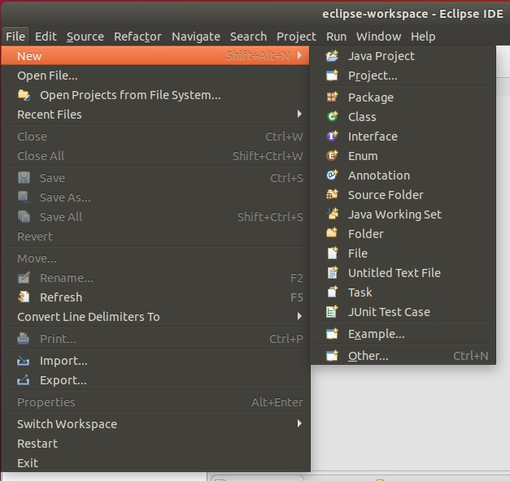</span> <span style='width: 350px; display:inline-block'>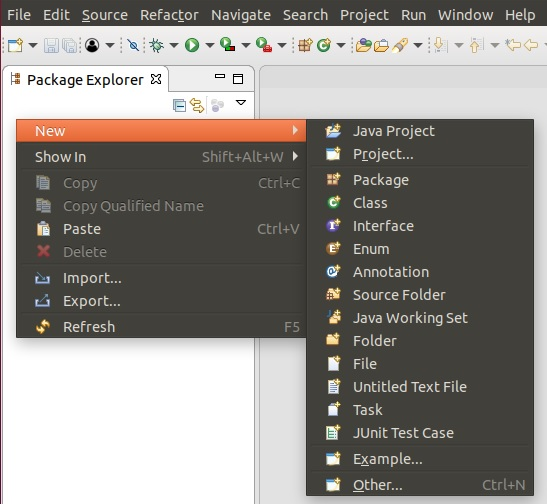</span> <br>

Now pick 'Maven'/'Maven Project':
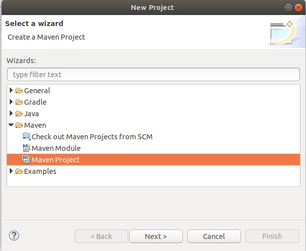

There are some options on the next screen, but I just click 'Next': <br>
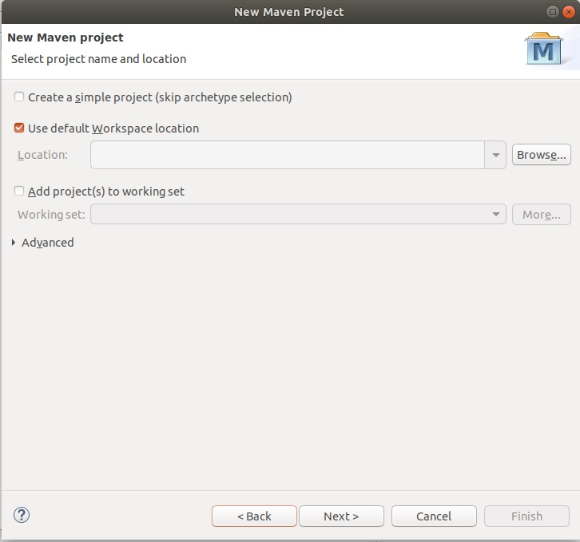

Now you will have to pick an archetype (an archetype is basically an initial code layout); if you don't know what this is, you should simply pick the default archetype (groupID 'org.apache.maven.archetype', artifact ID 'maven-archetype-quickstart', Version '1.1'). If you do not have problems, you will see the selection on the left; however [if you have problems initializing Maven](learn_to_code/java/maven?id=problems-initializing-eclipse-maven) you will see the screen on the right, and you will have to manually pick your archetype. Do so and press 'Next': <br>
<span style='width: 350px; display:inline-block'></span> <span style='width: 350px; display:inline-block'>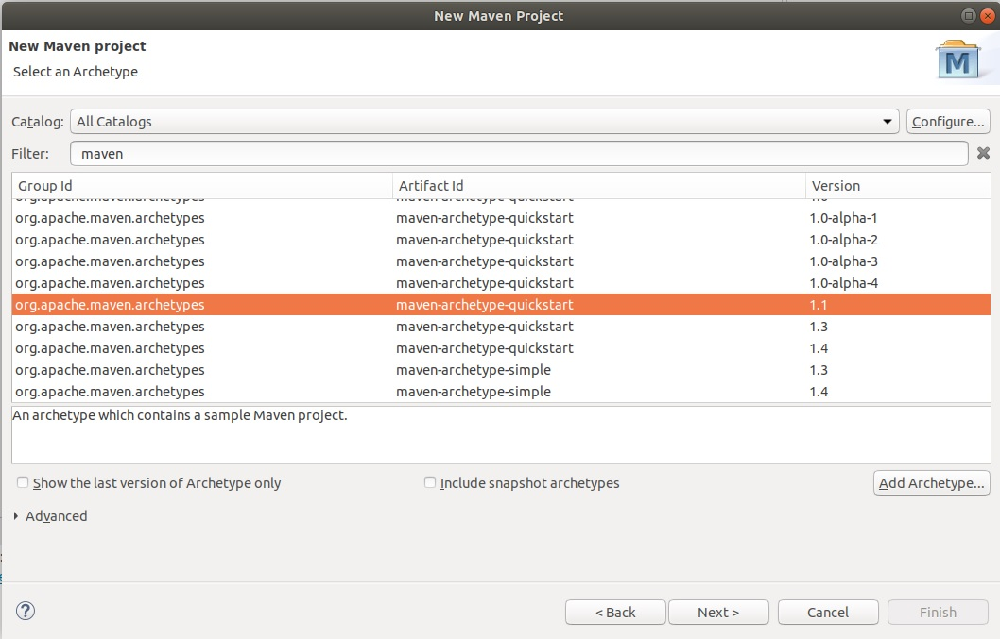</span> <br>

Finally you can fill out the unique information about your Maven project; use the information we filled in for [our project above](learn_to_code/java/maven?id=creating-a-project-with-maven) and click 'Finish': <br>
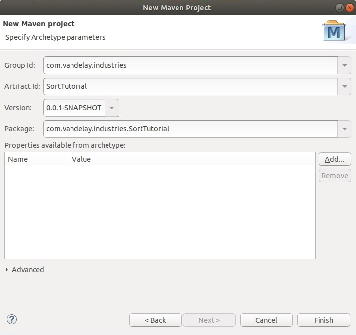

If it works, you will see the setup is the same as it was [when the command version created the project](learn_to_code/java/maven?id=creating-a-project-with-maven); even the [directories], the location of the pom.xml and generated JAR file, etc should be the same: <br>
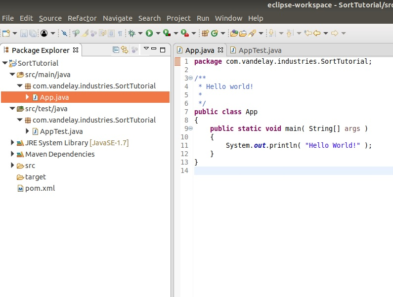

!> You may have to configure the file pom.xml for Java 11 [as you did when you compiled manually](learn_to_code/java/maven?id=compiling-your-maven-project).

### Problems Initializing Eclipse-Maven

> This section was influenced by the discission on [stackoverflow](https://stackoverflow.com/questions/15506043/create-a-maven-project-in-eclipse-complains-could-not-resolve-archetype).

Its possible that there are problems when trying to start a Maven project in Eclipse; the biggest issues seem to stem from firewall / proxy issues, so if your firewall or proxy does not allow for the connection to common Maven sites you may have to find an alternative.

When starting a Maven Project in Eclipse you may see something like this:
```
...
Could not resolve archetype org.apache.maven.archetypes:maven-archetype-webapp:RELEASE from any of the configured repositories.
Could not resolve artifact org.apache.maven.archetypes:maven-archetype-webapp:pom:RELEASE
Failed to resolve version for org.apache.maven.archetypes:maven-archetype-webapp:pom:RELEASE: Could not find metadata org.apache.maven.archetypes:maven-archetype-webapp/maven-metadata.xml in local ....
...
```

If you see errors like this, the first thing you should do is add the remote catalog http://repo1.maven.org/maven2/archetype-catalog.xml to the Maven Archetypes. To do this, Click 'Window->Preferances', then click 'Maven->Archetypes':
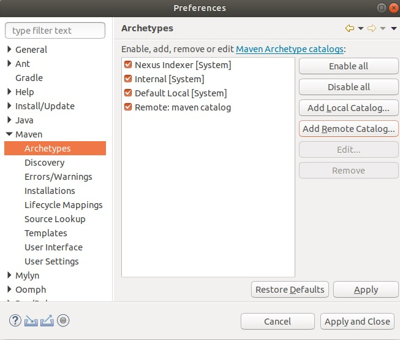

Click the 'Add Remote Catalog' button, then add  http://repo1.maven.org/maven2/archetype-catalog.xml to the 'Catalog File' and 'maven catalog' to the 'Description. Click 'Apply and Close'. <br><br>

You may also have to alter the file 'settings.xml', which is in your home directory in the folder `.m2` (so `~/.m2/settings.xml`). Add the following to that file:
```
<mirror>
  <id>ibiblio.org</id>
  <url>http://mirrors.ibiblio.org/maven2</url>
  <mirrorOf>central</mirrorOf>
</mirror>
```

You will then have to tell Eclipse to re-load this file. To do this, Click 'Window->Preferances', then click 'Maven->User Settings': <br>
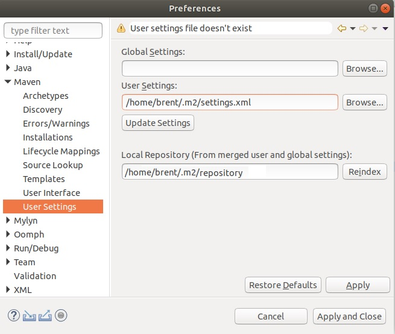

Simply click the 'Update Settings' button, then 'Apply and Close'.

If you still cannot create a Maven project, [read more about it here](https://stackoverflow.com/questions/15506043/create-a-maven-project-in-eclipse-complains-could-not-resolve-archetype).

## Running Maven In Eclipse

> This info was found [here](http://www.vogella.com/tutorials/EclipseMaven/article.html#download-the-maven-index).

To run the code as a Maven project, right-click the pom.xml file and select 'Run as...'

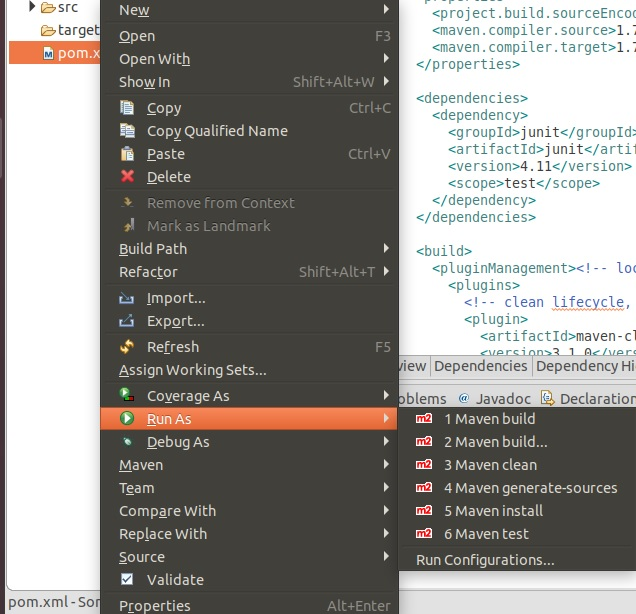


There are many options; [this article on stackoverflow](https://stackoverflow.com/questions/37999457/what-is-the-difference-between-maven-install-and-maven-build-with-m2eclipse) talks about most of them.  For our purposes, stick to 'Maven Clean' for now.

