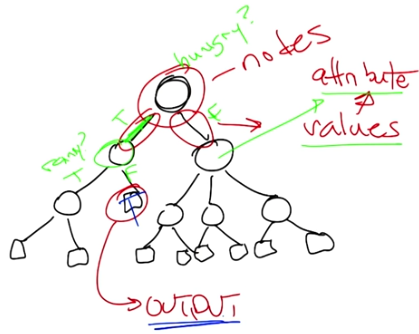
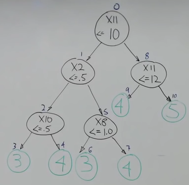
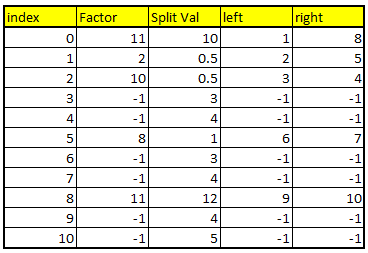

# Decision Trees

# Source Material

## Georgia Tech

Much of my knowledge about this topic came from my education at [Georgia Tech](http://www.omscs.gatech.edu/); I took extensive notes during my time there and made them available to everyone, and much (but not all) of the information in this document was originally sourced from these notes.

Specifically, the most influencial classes (and the associated professors) for this topic were [Machine Learning](http://www.omscs.gatech.edu/cs-7641-machine-learning) with [Dr. Charles Isbell](https://www.directory.gatech.edu/directory/detail/Mk95DPRrmOo06R1x3sMxDc5Y5hBjOHw389A131iCOHM%253D//isbell) and [Machine Learning for Trading](http://www.omscs.gatech.edu/cs-7646-machine-learning-trading) with [Dr. Tucker Balch](https://www.directory.gatech.edu/directory/detail/rZEvM132z2APRfGzt7hKn2kPSs5Jx%252FsPudnItHpvxpQ%253D/tucker/); these classes are freely available on [Udacity](https://www.udacity.com/), so if you wish to view them in full please create an account and check them out there.

Also, I highly suggest checking out the [Online Masters of Science - Computer Science program](http://www.omscs.gatech.edu/) at Georgia Tech; if you are in the market for a high value - yet affordable - Masters in Computer Science, this is a top choice for such a pursuit.

# Basic Concept

A decision tree is a [machine learning algorithm](learn_to_code/machine_learning/machine_learning?id=what-is-machine-learning) that can be used to make predictions based on data. A decision tree is dependent on the concept of a node; for decision trees, a **node** can be thought of as a question: depending on the answer to that question, a different line of questions are asked. The [training data](learn_to_code/machine_learning/machine_learning?id=training-data) plays a critical role in the decision tree, as each time a question/node is traversed to a lower level, potential 'answers' are eliminated. Eventually, enough answers are eliminated and an actual prediction can be made.

# Nodes

There are two types of nodes: **decision nodes** and **leaves**.

## Decision Nodes

As mentioned, a **decision node** can be thought of as a question, and depending on the answer to that question, a different line of questions are asked. Usually decision nodes are binary, but there can be more choices if the need (or want) arises. A decision node must have some sort of data structure: 
* Usually there is only one specific [factor](learn_to_code/machine_learning/machine_learning?id=key-terms-for-the-data) being investigated in a decision node.
* There is a specific value that we 'split on' (called the **split value**), effectively (and hopefully, roughly) cutting the values of the factor in half
 * If the answer is A, we take the path of A
 * If the answer is B, we follow the path of B
 * etc

A **root node** is a special type of decision node, as it is the first decision node in the tree.


## Leaves 

**Leaves** are terminal nodes that contain a label. In other words - leaves give us the answer to the classification question that was asked and are thus the output for the decision tree.


## Nodes (Example)



Above is an example of a decision tree. Decision nodes are typically represented as circles (when drawing decision trees by hand) and leaves are typically represented as square boxes.

# Exact Trees

An **exact tree** means each example in the [training data](learn_to_code/machine_learning/machine_learning?id=training-data) is represented in one leaf - so if there were 800 unique samples in the data, there would be 800 leaves.

# Determining Split Factor

There are a few ways to determine which factor we should select to 'split' on; for our purposes, we want to use the feature that segregates the data the best.

There are three ways, all of which surround information gain:
* Entropy (basically: Can you segregate the data so at least some of it is sectioned off?)
* Correlation (we will be using correlation for this task)
* Gini Index

I prefer using correlation. To do this, look at each factor in the data and see how well correlated it is with the labels. The factor that is most strongly correlated will help make the split most effectively, so pick that factor.

!>  Once you get down to ~2 rows, you may notice that many correlations may be 1 or -1; simply pick either the first or last feature that is 1 or -1.


# Decision Tree (Example)



This is an example of a decision tree taken from the [Machine Learning for Trading](http://www.omscs.gatech.edu/cs-7646-machine-learning-trading) course at GA Tech. The top line in each node are feature labels (so X11 (X eleven), X2, X8 etc represent unnamed column numbers in an example regarding wine properties vs how individual users rated them). In the example above:
* The root node is X11
 * If the value of X11 is less than 10, the feature X2 is evaluated
   * If X2 is less than .5, the feature X10 is evaluated
     * If X10 is less than .5, the answer '3' is returned
     * If X10 is greter than / equal to .5, the answer '4' is returned	 
   * If X2 is greter than / equal to .5, the feature X8 is evaluated
     * If X8 is less than 1.0, the answer '3' is returned
     * If X8 is greter than / equal to 1.0, the answer '4' is returned	 
 * If the value of X11 is greter than / equal to 10, the feature X11 is evaluated (again)
   * If X11 is less than 12, the answer '4' is returned
   * If X11 is greter than / equal to 12, the answer '5' is returned	 	 
   
> Note that some features can be used multiple times; for example, the feature X11 was used for two separate nodes.

# Basics of Building the Tree

Its possible that some features / factors are never used in the decision tree, while others are used multiple times (as in the example above). 

The most desirable trait for a decision tree is: **each node has an equal probability of being traversed from its immediate parent**. Recall that when we build the model using a decision tree, our goal is to take the training data and divide it into equal parts from the root node; then, if we consider the possible remaining 'answers' that are possible for the specific child nodes, the child node divvies up the possible results available to it equally (As best it can) amongst its own children; eventually, we will get to child nodes that only have two available choices (leaves) and the tree thus ends. 

The balance means efficiency - for example, say we had a dataset with 64 rows / entries, and each row had a y 'value' of its position (so for example, for row 56, the y value is 56). If its possible to split the data evenly at each node (and if we used two child nodes at each parent), when finding an answer we would have an expectatiion of finding an 'answer' after 5 questions (as 2^(5+1) = 64, as the '+1' is necessary as we do not have to ask a question to get to the root node). One example of these 5 questions would be:
1. <= 32?
2. <= 16?
3. <= 8?
4. <= 4?
5. <= 2?

For the sake of the argument, lets say we develop a lopsided tree where we have a leaf node for every decision; for the same 64 rows of data, we now have an expectation of having to traverse the tree 32.5 times to obtain our answer. Example: 

| Node: Greater than / equal to: | Number of nodes traversed to get answer |
| --- | --- |
| 64 | 1 |
| 63 | 2 |
| 62 | 3 |
| 61 | 4 |
| 60 | 5 |
| 59 | 6 |
| 58 | 7 |
| 57 | 8 |
| ... | ... |
| 9 | 56 |
| 8 | 57 |
| 7 | 58 |
| 6 | 59 |
| 5 | 60 |
| 4 | 61 |
| 3 | 62 |
| 2 | 63 |
| 1 | 64 |


Again, if the tree was built in this fashion it would take the traversal of 32.5 nodes (on average) to get an answer (whereas the most efficient took just 5). The balance of the tree is critical for efficiency, and in this case, efficiency means each parent node divvies the possible answers it can have evenly amongst its child nodes.

> Note that in practice, creating even probabilities of traversal amongst child nodes may not be possible, but its the goal of a properly built decision tree.

# Coding a Decision Tree

## Overview of Coding the Decision Tree

!> While its possible to make a 'node' class in object-oriented code and then simply link the nodes, this ends up being slow. Its better to use a matrix or an array-based representation (using an nd array with two dimensions).

I will use this example of a tree we will replicate using code (Python):


> Note the small numbers over each node; that will represent the array index number (with the root being 0). In addition, 'factor X11' will simply be referenced as '11' in the array.

To build a decision tree (with only two potential node choices per parent), we will use an nd array with two dimensions. Each row in the ndarray corresponds to one decision node (OR a leaf) with the following columns
* Factor
* Split val
* Left choice (which represents a position in the array OR -1)
* Right choice (which represents a position in the array OR -1)



This is the decision tree above in an array form; the index is the location in the array, and factor / split Val / left / right are other dimensions in the array (these could also be lists, and the overarching array in Python could simply reference different lists in itself).

* The left/right numbers reference an index in the ndarray
 * This ndarray is built using recursion
   * The ENTIRE left branch is built FIRST
   * THEN the right branch of the bottom-most branch
   * THEN you go up one level and do the same thing 
     * The example here going from node 4 to 5; node 4 (and 3) are leaves, so we 'pop up' one level, go right (to node 5), then we continue to go left until we hit the bottom and do it all again
* The way that leaves are represented is by using a special number to represent the factor – specifically, negative one (as -1 is not a proper array index)
 * So if we get to the row and the factor = -1, we know it’s a leaf
 * Also: the left/right values are -1 (actually they can be anything as they aren’t used when the factor == -1)
* To store the ‘answer’ for leaves, store it in the ‘Split Val’ column (as is above)

## Decision Tree Pseudocode

> This pseudocode is the JR Quinlan approach.

```
build_tree(data)
	#end the recursion if certain conditions are met – this is the first two IF statements
	
	#if there is only one row, it MUST be a leaf, and the Y value of the leaf is the ‘y’ value
	if data.shape[0]==1: return [leaf,data.y,NA,NA]
	
	#if ALL of the y values are the same, its another leaf
	if all data.y same: return [leaf,data.y,NA,NA]
	else
		#this must be a node and not a leaf
		
		#determine best feature I to split on
		#there are many ways to do this, but we will determine the best feature to use via 
		# the highest correlated feature
		i = returnHighestCorrelatedFeature(data)

		#the standard way to split the data is by using the found ‘best’ column i and find
		#   the median
		SplitVal = data[:,i].mean()
		
		#build the left and right sides of the tree
		#this next line uses the power of numpy via ‘comprehension’ (see below) 
		lefttree = build_tree(data[data[:,i]<=SplitVal])
		righttree = build_tree(data[data[:,i]>SplitVal])
		
		#we now need to determine the root
		#	i is the feature we are splitting on
		#	1 means the left tree begins in the next row (recall that the indexes will 
		#	be relative)
		 #	‘lefttree.shape[0] + 1’ is where the right tree starts; make room for the
		#		left tree and add 1 (remember shape[0] simply means the 
		#		rowcount)
		root = [i,SplitVal,1,lefttree.shape[0] + 1] 
		
		#simply append the root to the lefttree and righttree and we are done
		#append is a function in numpy for ndarrays that stacks the multiple arrays
		#	there may be an additional argument needed to indicate along which 
		#	dimension should these arrays be appended (default is axis = 0 which is 
		#	rows, which is what we want)
		return (append(root,lefttree,righttree))
```

# Random Trees

Finding the best feature _i_ to split is a computationally expensive calculation; finding the mean is also expensive. Is there a way around these operations?

What could be done is we simply select a random feature instead of finding the feature that is the highest correlated; then, we could simply take the random feature, take two random values in that feature, average them, and use that as the split value. Instead of a decision tree, this is known as a **random tree**.

This sounds crazy - doing both these things would surely reduce the correlation between the predictions and the ground truth while raising the RMSE. And it does. A single random tree is certainly not as accurate as a decision tree.

However, it is much faster than the traditional decision tree's pechant for using the midpoint of the features with the highest information gain. We can use a collection of random trees (multiple random trees are known as a **random forest**) in an [ensamble learner](learn_to_code/machine_learning/machine_learning?id=bagging-ensamble-learners). Basically, ensamble learners (aka bagging) take the results of multiple poor learners (such as random trees) and have all the learners 'vote' on the right answer. If we have enough learners (aka you have enough random trees), the aggregate of all trees can come close to matching the accuracy of the traditional decision tree while performing faster.

The randomly selected feature may work with bagging, and it turns out averaging two random numbers from the feature and using that as the split value usually works out too. While it can give you a split value towards the edge, it usually works out to be somewhere near the middle.

# Strengths and Weaknesses

Strengths
* Decision trees are faster at querying time when compared to:
 * a kNN learner
* We do _not_ have to worry about [normalizing](learn_to_code/machine_learning/machine_learning?id=normalization) the data.
* We can easily walk through the nodes and explain to users _how_ a decision was reached (whereas its difficult - or impossible - to explain how other machine learning methods arrived at their results). Banks like decision trees as they can easily explain to users why they were rejected for loans, for example.

Weaknesses
* Decision trees have a higher cost at learning time when compared to:
 * a kNN learner
 * linear regression
* Decision trees have a higher cost at querying time when compared to:
 * linear regression


