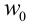
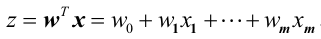
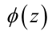
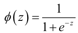
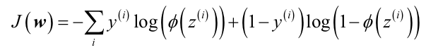
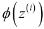

# Logistic Regression

# Source Material

## Georgia Tech

Much of my knowledge about this topic came from my education at [Georgia Tech](http://www.omscs.gatech.edu/); I took extensive notes during my time there and made them available to everyone, and much (but not all) of the information in this document was originally sourced from these notes.

Specifically, the most influencial classes (and the associated professors) for this topic were [Data and Visual Analytics](http://www.omscs.gatech.edu/cse-6242-data-visual-analytics) with [Dr. Guy Lebanon](https://www.linkedin.com/in/guylebanon/); this class is freely available on [Udacity](https://www.udacity.com/), so if you wish to view it in full, please create an account and check it out there.

Also, I highly suggest checking out the [Online Masters of Science - Computer Science program](http://www.omscs.gatech.edu/) at Georgia Tech; if you are in the market for a high value - yet affordable - Masters in Computer Science, this is a top choice for such a pursuit.

## Python Machine Learning (PACKT Book)

The 'Python Machine Learning' book by PACKT (Sebastian Raschka) helped me develop an idea on how logistic Regression (pages 56 - 68).

# Mathematics 

!> I don't have time to go into the math now, but its in the 'Python Machine Learning' book by PACKT as well as the DVA notes; suffice to say, it hinges on the sigmoid, which intersects z=0 at .5 (convinently 50%). I **WILL** flesh this out later!

# How it Works

Logistic regression is a linear model for [binary classification](learn_to_code/machine_learning/ml_key_terms?id=binary-classification) (we can convert it to a multiclass classifier with the [One-vs-Rest technique](learn_to_code/machine_learning/machine_learning?id=one-vs-rest-ovr), which [scikit-learn does this automatically](learn_to_code/python/scipy/machine_learning_in_python?id=scikit-learn-one-vs-rest) for logistic regression).

More specifically, logistic regression is an algorithm that tells us the probability of it belonging to one group; practically speaking, it will return a continuous value between \[0, 1\], and that number will represent the probability of the sample belonging to the target class (so if the return number, is, say, .13, there is a 13% chance that sample belongs to the target class, and an 87% chance it does not. If the returned value is >= .5, we say that sample belongs to the target class (and anything < .5 does not).

## Determining Weights

!> TBD

## Making The Prediction

In order to actually make a prediction, we must first determine _z_ for the [sample](learn_to_code/machine_learning/ml_key_terms?id=sample). To deterimine _z_, we find the dot product of the weights and features, and then add the bias (much like had to do in [Adaline](learn_to_code/machine_learning/adaline) - matter of fact, all gradient descent algorithms utilize a [bias weight](learn_to_code/machine_learning/ml_key_terms?id=bias-weight)).

To find _z_ for the [sample](learn_to_code/machine_learning/ml_key_terms?id=sample), we simply find the dot product of the weights and features (and add the [bias weight](learn_to_code/machine_learning/ml_key_terms?id=bias-weight), which is  below) via this formula:

Now that we have _z_ for each [sample](learn_to_code/machine_learning/ml_key_terms?id=sample), we can figure out  for each sample with the following equation:

 will tell us the probability of that sample belonging to the class (class '1').

To see how this can be worked out manually (in Python), see [here](learn_to_code/python/scipy/machine_learning_in_python?id=scikit-learn-logistic-regression) (the section "Showing How To Calculate Predictions Without 'predict_proba()'").

# Cost Function (Error)

The [cost function](learn_to_code/machine_learning/ml_key_terms?id=cost-function) for logistic regression is defined as follows (from the 'Python Machine Learning' book by PACKT (Sebastian Raschka)): 

* This assumes y can only be 0 or 1 - so this will NOT work for instances where the [One-vs-Rest technique](learn_to_code/machine_learning/machine_learning?id=one-vs-rest-ovr) was applied.
*  is the current prediction for the given [sample](learn_to_code/machine_learning/ml_key_terms?id=sample), which will be a number between \[0, 1\] which represents the probability that the sample belongs to the target class (usually class '1'). See [above](learn_to_code/machine_learning/logistic_regression?id=making-the-prediction) on how this is determined.
 * Recall that the prediction is 'what is the probability that this sample belongs to class 1', so if y = 1, the prediction should be close to 1 to be correct and closer to 0 if the prediction is not correct (conversely, if y = 0, the prediction should be close to 0 to be correct and closer to 1 if the prediction is not correct).
* This works because if the [ground truth](learn_to_code/machine_learning/ml_key_terms?id=ground-truth) y classifier is 0, the first part will be 0; conversely, if the y classifier is 1, the second part will be 0, as (1-y) will be (1-1) which is 0.
* If y _is_ 1, the first part of the equation will penalize us for a low prediction (so for example, if we predicted y=1 with a probability of .13 (meaning a low probability) and it turns out that y=1, we will be assessed a cost of log(.13) = -.886.
 * Conversely, if we predicted y=1 with high probability and it turns out to be 1, we will suffer a smaller penalty (so for example, if we predicted y=1 with a probability of .93 (meaning a high probability) and it turns out that y=1, we will be assessed a cost of log(.13) = -.032.
* If y _is_ 0, the second part of the equation will penalize us for a high prediction (so for example, if we predicted y=1 with a high probability of .93 and it turns out that y=0, we will be assessed a cost of log(1-.93) = -1.155.
 * Conversely, if we predicted y=1 with low probability and it turns out to be 0, we will suffer a smaller penalty (so for example, if we predicted y=1 with a probability of .07 and it turns out that y=0, we will be assessed a cost of log(1-.07) = -.032. 

# General Notes

* Logistic regression is a model for [classification](learn_to_code/machine_learning/machine_learning?id=classification), **not** [regression](learn_to_code/machine_learning/machine_learning?id=regression).
* Logistic regression utilizes [gradient descent](learn_to_code/machine_learning/machine_learning?id=gradient-descent).
* Logistic regression is one of the most widely used machine learning algorithms in the industry.
* Typically, [batch](learn_to_code/machine_learning/ml_key_terms?id=batch) updating is used for logistic regression.

