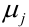

# Machine Learning

# Source Material

## Georgia Tech

Much of my knowledge about this topic came from my education at [Georgia Tech](http://www.omscs.gatech.edu/); I took extensive notes during my time there and made them available to everyone, and much (but not all) of the information in this document was originally sourced from these notes.

Specifically, the most influencial classes (and the associated professors) for this topic were [Machine Learning](http://www.omscs.gatech.edu/cs-7641-machine-learning) with [Dr. Charles Isbell](https://www.directory.gatech.edu/directory/detail/Mk95DPRrmOo06R1x3sMxDc5Y5hBjOHw389A131iCOHM%253D//isbell), [Machine Learning for Trading](http://www.omscs.gatech.edu/cs-7646-machine-learning-trading) with [Dr. Tucker Balch](https://www.directory.gatech.edu/directory/detail/rZEvM132z2APRfGzt7hKn2kPSs5Jx%252FsPudnItHpvxpQ%253D/tucker/), and [Data and Visual Analytics](http://www.omscs.gatech.edu/cse-6242-data-visual-analytics) with [Dr. Guy Lebanon](https://www.linkedin.com/in/guylebanon/); these classes are freely available on [Udacity](https://www.udacity.com/), so if you wish to view them in full please create an account and check them out there.

Also, I highly suggest checking out the [Online Masters of Science - Computer Science program](http://www.omscs.gatech.edu/) at Georgia Tech; if you are in the market for a high value - yet affordable - Masters in Computer Science, this is a top choice for such a pursuit.

# What Is Machine Learning?

**Machine Learning** (sometimes referenced as **ML**) is the act of taking a data set that has a target grouping or value, developing a predictive model (by running the data through an algorithm capable of making predictions), and then making predictions on the target grouping or value of previously unseen data.

Think of it this way: the 'data' is an Excel spreadsheet with multiple columns (the official fancy words for these in machine learning are **features** or **factors**, but are sometimes called columns due to unfamiliarity). The last column is special, as it is a target idea we are interested in ('is this growth cancerous', 'is this person likely to click this ad', 'will it snow tomorrow', 'what is the rating of this wine', 'how much will this movie make', etc). This last column is known as the **label** (Yes/No, etc) or a continuous number (profit from a movie, etc).

The ultimate goal is to develop a model -based on existing data - and then use that model later, by running data through it that does _not_ have an associated label / prediction.

!> The entire point of machine learning is to make predictions about data that we do not know how to classify or put a numerical value to.

# Key Terms (for the Data)

This has moved - please see [this document on key terms in machine learning](/learn_to_code/machine_learning/ml_key_terms).


# Training and Testing Data

In order for the machine learning algorithm to make predictions based on data, it must first see real data and how the data is classified (i.e., it must use examples where the 'prediction' is already known); this is called the **training data**. Once the algorithm cycles through the training data it will have developed a [model](learn_to_code/machine_learning/machine_learning?id=machine-learning-model) which can then be used to make predictions on data that is not classified / do not have labels.

We also need a way to see how the model performs on data that was not used in creating the model - if we cannot test the model with data that was not used, we have no idea if the model is fantastic or if its junk. Traditionally, we take a portion of the training data and call that the **testing data** (usually its 30% of the training data but it can vary); since we know the real _y_ result of all the data, we simply save the _y_ data from the test set, run the test data set through the [model](learn_to_code/machine_learning/machine_learning?id=machine-learning-model) and record the predictions (sometimes referred to as _y'_ (aka _y prime_) or even _y hat_), then compare _y_ to _y'_ and [compare the results](learn_to_code/machine_learning/evaluating_models) to see if we have a competent model.

## Training Data

This is the portion of the data from the overall dataset that we feed to the machine learning algorithm of our choice to make the [model](learn_to_code/machine_learning/machine_learning?id=machine-learning-model). Usually - but not always - the training data makes up 70% of the data we are given (with the remaining 30% to be used for [testing](learn_to_code/machine_learning/machine_learning?id=testing-data). Both the [features](learn_to_code/machine_learning/machine_learning?id=key-terms-for-the-data) as well as the [y](learn_to_code/machine_learning/machine_learning?id=key-terms-for-the-data) of the training data is fed to the machine learning algorithm to create the model.

## Testing Data

This is the portion of the data from the overall dataset that we use to [evaluate the effectiveness of the model](learn_to_code/machine_learning/evaluating_models). Using the [model](learn_to_code/machine_learning/machine_learning?id=machine-learning-model) we developed using the [training data](learn_to_code/machine_learning/machine_learning?id=testing-data), we load the [features](learn_to_code/machine_learning/machine_learning?id=key-terms-for-the-data) - but **NOT** the [y](learn_to_code/machine_learning/machine_learning?id=key-terms-for-the-data) - of the testing data through the model. The model will return [y'](learn_to_code/machine_learning/machine_learning?id=key-terms-for-the-data); to evalualte the effectiveness of the model, we simply compaire y and y' using various methods.

Usually - but not always - the testing data makes up 30% of the data we are given (with the remaining 70% to be used for [training](learn_to_code/machine_learning/machine_learning?id=testing-data). 

# Classification Vs Regression

The ultimate goal of machine learning is to make a prediction based on given data. Generally speaking, there are two 'modes' of prediction: <font color="red">classification</font> and <font color="red">regression</font>. **Classification** predicts a _discrete label_ for the given data, and **regression** predicts a _continuous numerical value_ for the data.

# Classification

As stated, classification predicts a discrete [_label_](learn_to_code/machine_learning/machine_learning?id=key-terms-for-the-data) for data. A discrete label simply identifies a 'group'; the 'group' could be male/female, yes/no, or even types of cars; in other words, a collection of data about a single entity/event/whatever enters the model, and the model spits out the grouping that element belongs to.

## Converting Labels

For the optimal performance of many machine learning libraries, its recommended to convert [labels](learn_to_code/machine_learning/ml_key_terms?id=labels) from strings to integers.

## One-vs.-Rest (OvR)

While its true that we can classify multiple descrete labels, the truth is, most algorithms cannot: they can only differentiate between 2 classifiers.

That said, there is a trick around this: a [**One-vs.-Rest**](https://en.wikipedia.org/wiki/Multiclass_classification) approach. How it works is instead of having one model to predict X classifiers, you have X models to predict X classifiers. To do this, you need to develop a model that will predict one classifier and then 'everything else' is the other option.

So to my knowledge, this is how this can be achieved. Say you have A/B/C/D classifiers. Our first model predicts if its class A or (the rest), the second model predicts if its class B or (the rest), the third model predicts if its class C or (the rest), and the fourth model predicts if its class D or (the rest). We then see how the multiple models predict each sample (so if the second model predicts 'B' for sample n, sample n will be class B).

> scikit-learn for Python does this natively for most algorithms.


# Regression

**Regression** is when the prediction made is a real number and not a discrete label (when discrete [labels](learn_to_code/machine_learning/ml_key_terms?id=labels) _are_ used, this is [classification](learn_to_code/machine_learning/machine_learning?id=classification)).

# Machine Learning Model

The way most machine algorithms work is: the [testing data](learn_to_code/machine_learning/machine_learning?id=testing-data) is put through the machine learning algorithm and  parameters (specific to the selected algorithm) are adjusted in an attempt to 'fit' the data (in other words, in an attempt to match the actual [y](learn_to_code/machine_learning/machine_learning?id=key-terms-for-the-data) data set with the proposed predicted [y'](learn_to_code/machine_learning/machine_learning?id=key-terms-for-the-data) data set). This is achieved by modifying the parameters, using the proposed parameters in conjunction with the [features](learn_to_code/machine_learning/machine_learning?id=key-terms-for-the-data), obtaining the proposed y', and comparing the results between y and y' to see if the model is improving. Once this process is complete, the paremeters that performed the best are stored. This configuration of the 'best' parameters is the basic idea behind a model.

Usually once the model is developed, we can simply run new, unseen sets of features through the model to make predictions.

# Bagging (Ensamble Learners)

An **ensamble learner** (aka bagging) takes the results of multiple poor learners (such as [random trees](learn_to_code/machine_learning/decision_trees?id=random-trees)) and have all the learners 'vote' on the right answer. In effect, machine learning algorithms that are of poor quality - but are fast - can join together and perform relatively well.

# Gradient Descent

> An example of gradient descent is the [Adaline algorithm](learn_to_code/machine_learning/adaline); the [example code is located here](learn_to_code/python/scipy/machine_learning_in_python?id=adaline).

**Gradient Descent** is an optimization algorithm that can be used to find the [weights](learn_to_code/machine_learning/ml_key_terms?id=weight) that minimize the [cost function](learn_to_code/machine_learning/ml_key_terms?id=cost-function) (when said cost function is convex). Gradient Descent uses [batch updates](learn_to_code/machine_learning/ml_key_terms?id=batch) to update its weights.

Gradient descent can be thought of as 'climbing down a hill' (on a graph), and at the very bottom of that hill is either a local or global minimum. This is done iteratively, and the 'step' size is determined by the [learning rate](learn_to_code/machine_learning/ml_key_terms?id=learning-rate) and the slope of the gradient.

Gradient Descent is described in in the PACKT book 'Python Machine Learning' by Sebastian Raschka, chapter 2,pages 34-36.

_See Also:_ [stochastic gradient descent](learn_to_code/machine_learning/machine_learning?id=stochastic-gradient-descent)


## Stochastic Gradient Descent

> An example of stochastic gradient descent is a modified form of the [Adaline algorithm](learn_to_code/machine_learning/adaline); the [example code is located here](learn_to_code/python/scipy/machine_learning_in_python?id=adaline-stochastic-gd).


**Stochastic Gradient Descent** is very similar to [gradient descent](learn_to_code/machine_learning/machine_learning?id=gradient-descent) with one key difference: instead of the weights being updated using [batch updates](learn_to_code/machine_learning/ml_key_terms?id=batch), they are updated via [on-line learning](learn_to_code/machine_learning/ml_key_terms?id=on-line-updating).

Stochastic gradient descent has these advantages:
* Much less computationally expensive on larger datasets
* Usually, stochastic gradient descent converges much faster because of the more frequent weight updates
* Error is noiser, which means it can escape shallow [local minima](learn_to_code/machine_learning/ml_key_terms?id=local-minima).
* We can use it for on-line learning (that is to say, up to the minute modeling)

!> In order for stochastic gradient descent to work well, the data _must_ be presented in random order - this means the training data set must be randomized for each [epoch](learn_to_code/machine_learning/ml_key_terms?id=epoch). See [here](learn_to_code/python/scipy/numpy?id=random-row-permutation) for how to do this in Python.


# Normalization

Many times, very large ranges in specific fields may overpower other fields in a machine learning algorithm; in order to combat this, we can **normalize** the data.

There are a few ways this can be done. The easiest is: for each [feature](learn_to_code/machine_learning/ml_key_terms?id=features), find the maximum value; then, divide every number by that max number. This will result in a range of numbers \[0, ..., 1\], where 1 represents the 'max' of the feature.

Sometimes numbers can span from negative to positive, and its possible that the (absolute)  negative values are far, far greater than the positives; if this is the case, what can be done is you can find the minimum number, find its absolute value, and then add that to all numbers in the set; then find the max and divide all numbers by that to get the range \[0, ..., 1\] (using this method, 0 will represent the lowest number). 

## Normalizing Data Post-Model

Usually, the data is normalized using the [training data](learn_to_code/machine_learning/machine_learning?id=training-data) as its base; given that, it's obvious that after the model is built we will have to somehow apply normalization to any data that enters the model (a.k.a the [testing data set](learn_to_code/machine_learning/machine_learning?id=testing-data) or samples that have no classification). In order to do this, the normalization variables used are stored, and then applied to normalizing any and all new data before it enters the model.

Say we are using [standardization](learn_to_code/machine_learning/machine_learning?id=standardization), as an example. What would be done here is the exact variables used to perform the initial standardization (the mean and the standard deviation) are simply applied to samples not used in the training data (test or otherwise).
	
So if M is the mean and S is the standard deviation, completely new vector V will have the following formula applied to it to standardize it: (V-M)/S (which is the standardization technique).

It can be shown that this is what [Python's Scikit-learn package](learn_to_code/python/scipy/machine_learning_in_python?id=scikit-learn) does with the following code (which uses [standardization](learn_to_code/machine_learning/machine_learning?id=standardization)):
```
from sklearn import datasets
from sklearn.model_selection import train_test_split
from sklearn.preprocessing import StandardScaler

if __name__ == "__main__":
	iris = datasets.load_iris()
	X = iris.data[:, [2, 3]]
	y = iris.target
	
	X_train, X_test, y_train, y_test = train_test_split(X, y, test_size=0.3, random_state=0)

	#find the parameters necessary for standardization of the training set
	sc = StandardScaler()
	sc.fit(X_train)
	
	print "The mean is {}, the number of samples are {}, and the standard deviation is {}.".format(sc.mean_, sc.n_samples_seen_, sc.scale_)
	
	#actually normalize the training set and then the testing set (using the parameters found in sc.fit() above)
	X_train_std = sc.transform(X_train)
	X_test_std = sc.transform(X_test)

	#This is just to show that the transformed values previously will be the same as if a truncated dataset is sent through 
	#(the readings are the same for the truncated data set, which means the values previously determined in sc.fit() are used)
	print X_train_std[:5]
	print sc.transform(X_train[:5])

	#This further proves that the transformed values previously will be the same as if a truncated dataset is used with the raw 
	#values used to calculate standardization (namely the mean and standard deviation)
	print X_test_std[:5]
	print (X_test[:5] - sc.mean_)/(sc.scale_)
	
```

## Normalization For Algorithms

The algorithms that need normalization are:
* Anything that uses gradient descent
 * Adaline ([Standardization](learn_to_code/python/scipy/machine_learning_in_python?id=standardization) is recommended, but others may work)
 * Neural Networks ([Standardization](learn_to_code/python/scipy/machine_learning_in_python?id=standardization) is recommended, but others may work)


## Standardization

> Standardization is good for any machine learning algorithm that uses gradient descent (like Adaline, Neural Networks, etc).

Standardization is a normalization technique that centers the data on 0, and the standard deviation is 1. To do this, use the following equation:  
, where:  
*  (read: x prime sub j) is the new feature being created (or, rather, transformed by standardization).
*  is the vector that contains the unmodified [feature](learn_to_code/machine_learning/ml_key_terms?id=features) values.
*  (read: mu sub j) is the mean of the unmodified [feature](learn_to_code/machine_learning/ml_key_terms?id=features).
*  (read: sigma sub j) is the standard deviation of the unmodified [feature](learn_to_code/machine_learning/ml_key_terms?id=features).

In other words, for each value in the feature, we want to subtract the mean of the feature and then divide that subtraction by the standard deviation of the feature.

To do this in python, [see here](learn_to_code/python/scipy/machine_learning_in_python?id=standardization); conversely, the [scikit-learn](learn_to_code/python/scipy/machine_learning_in_python?id=scikit-learn-normalization) package in Python can do this as well
