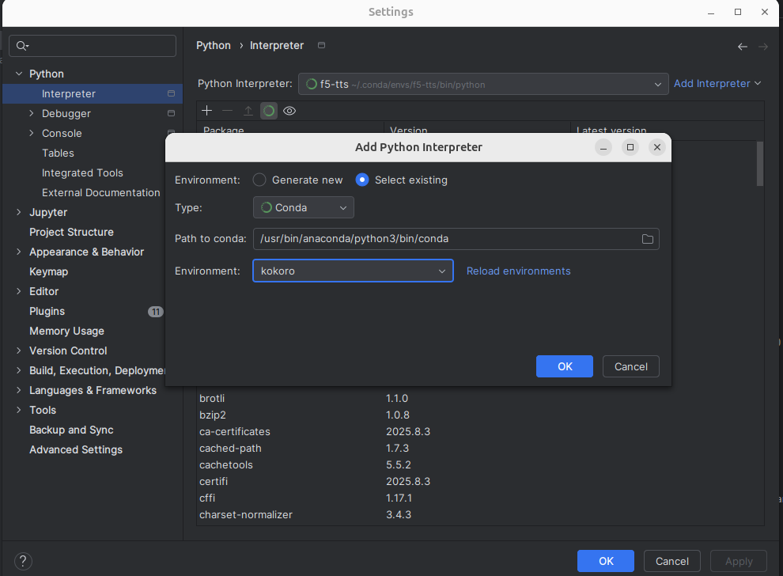
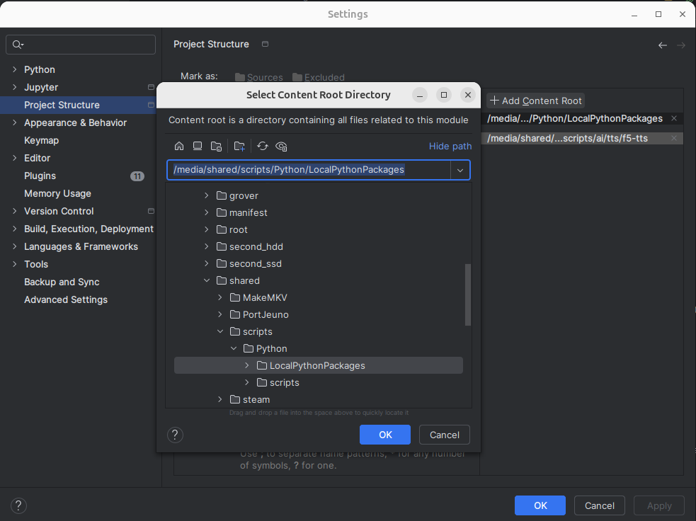

# Pycharm  

PyCharm is an IDE (Integrated Development Environment) for Python. Its always a good idea to work in an IDE; this is because there are so many features available, including:  
* syntax highlighting  
* error detection  
* method completion  
* much more  

PyCharm is made by the same makers as [IntelliJ](/learn_to_code/java/intellij), and as such, has almost exactly the same controls. I wont go over much of the controls that appear in IntelliJ - as I covered that, and they are the same - but the concepts that are unique to PyCharm will be covered here.  

# Install  

To install on Ubuntu: `snap install pycharm-community --classic`  

# Changing the Interpreter  

Usually, you will be working in a specific virtual environment within Python; or, in my case, I use [Anaconda](/learn_to_code/python/conda). You will need to set this environment for your current project. To do so:

1\. Select `File/Settings`  

2\. Select `Python` and then `Interpreter`  

3\. Click `Add Interpreter` and then `Add Local Interpreter`  

4\. You can either make a new one OR select an existing (My example is from existing)  

5\. Pick your type:
* Virtualenv  
* Conda  
* Pipeenv  
* Poetry  
* uv  
* Hatch  

6\. Pick your environment.  

  

# Add PYTHONPATH  

You can add your [PYTHONPATH](learn_to_code/python/local_packages?id=adding-to-python-path), which opens your project up to your personal Python library:  

1\. Select `File/Settings`  

2\. Select `Project Structure`  

3\. On the side you will see `Add Content Root` - click this  

4\. Select the base directory of your Python path.  

5\. Click `OK`  

6\. You should now see the path under `Add Content Root`, and it will be considered to be available for your code at this point.  

  
