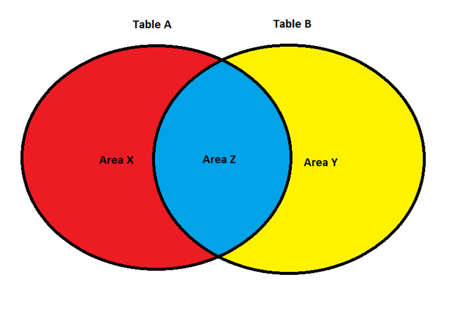

# SQL 

# Before We Begin

## Scope

The scope of this document is meant to simply get someone up and running with SQL with a reasonable amount of working knowledge. It will not get into relational database theory nor will it get too deep into the weeds (as I am not trying to write a book). 

## Assumptions

**<font size="4">SQL Implementation</font>**

Since SQL is mostly agnostic (that is to say, different flavors like [MySQL](https://www.mysql.com/) or [Oracle (Database)](https://www.oracle.com/database/) or [HP Vertica](https://www.logianalytics.com/resources/bi-encyclopedia/hp-vertica/) share mostly the same SQL syntax), this document will pertain to most instances of SQL; that said, there are slight variations between relational database implementations of SQL. These instructions will use the MySQL version of SQL (unless otherwise stated).

**<font size="4">Working MySQL Database</font>**

This document assumes you have an instance of MySQL to use; if not, you can [installed MySQL](ubuntu/package_install/mysql_install) on an [Ubuntu Linux Machine](ubuntu/server_build).

## GUI Clients

While its possible to interact with MySQL [completely from the command line](ubuntu/package_operations/mysql_maintenance?id=logging-into-the-database), I strongly suggest a GUI. My favorite is [SQLyog (for MySQL)](https://github.com/webyog/sqlyog-community) (new download [here](https://github.com/webyog/sqlyog-community/wiki/Downloads), old download [here](https://code.google.com/p/sqlyog/wiki/Downloads)), but it is only available for Windows. If you have a Mac or are on a Linux machine, [MySQL Workbench](https://www.mysql.com/products/workbench/) (download [here](https://dev.mysql.com/downloads/workbench/)) is also an option.

Finally, if you would like to use a GUI that can interact with HP Vertica or Oracle, [DBeaver](https://dbeaver.com/)(download [here](https://dbeaver.io/download/)) is available.

# SELECT Query

The <font color="blue">SELECT</font> query allows you to select data from one (or more) tables; the data is returned to your screen (if using a basic terminal), a client (like [SQLyog](https://github.com/webyog/sqlyog-community)), or a script (like [Python](learn_to_code/python/python_sql)).

The <font color="blue">SELECT</font> query is the basic query in SQL.

**<font size="4">Example of a SELECT Query</font>**
 
> <font color="blue">SELECT</font> <font color="blue"><</font>columnName1<font color="blue">\></font>, <font color="blue"><</font>columnName2<font color="blue">\></font>, <font color="blue"><</font>columnName3<font color="blue">\></font>, <font color="blue"><</font>columnName4<font color="blue">\></font>, <font color="blue">SUM</font>(<font color="blue"><</font>columnName5<font color="blue">\></font>)<br>
> <font color="blue">FROM</font> <font color="blue"><</font>tableName1<font color="blue">\></font><br>
> <font color="blue">INNER JOIN</font> <font color="blue"><</font>tableName2<font color="blue">\></font><br>
> &nbsp;&nbsp;&nbsp;&nbsp;<font color="blue">ON</font> <font color="blue"><</font>tableName2<font color="blue">\></font>.<font color="blue"><</font>UniqueIdentifierColumnName1<font color="blue">\></font> = <font color="blue"><</font>tableName2<font color="blue">\></font>.<font color="blue"><</font>UniqueIdentifierColumnName1<font color="blue">\></font> <br>
> &nbsp;&nbsp;&nbsp;&nbsp;&nbsp;&nbsp;&nbsp;&nbsp;<font color="blue">AND</font> <font color="blue"><</font>tableName2<font color="blue">\></font>.<font color="blue"><</font>UniqueIdentifierColumnName2<font color="blue">\></font> = <font color="blue"><</font>tableName2<font color="blue">\></font>.<font color="blue"><</font>UniqueIdentifierColumnName2<font color="blue">\></font><br>
> <font color="blue">WHERE</font> <font color="blue"><</font>someDateBasedColumn<font color="blue">\></font> = '2012-02-28' <font color="blue">AND</font> <font color="blue"><</font>someDateTimeBasedColumn<font color="blue">\></font> = '2012-02-28 13:00 :00' <br>
> &nbsp;&nbsp;&nbsp;&nbsp;<font color="blue">AND</font> <font color="blue"><</font>someColumnThatIsNumberBased<font color="blue">\></font> = 1234.5678<br>
> &nbsp;&nbsp;&nbsp;&nbsp;<font color="blue">AND</font> <font color="blue"><</font>someColumnThatIsTextBased<font color="blue">\></font> = 'SomeTextHere'<br>
> <font color="blue">GROUP BY</font> <font color="blue"><</font>columnName1<font color="blue">\></font>, <font color="blue"><</font>columnName2<font color="blue">\></font>, <font color="blue"><</font>columnName5<font color="blue">\></font>, <font color="blue"><</font>columnName4<font color="blue">\></font><br>
> <font color="blue">HAVING SUM</font>(<font color="blue"><</font>columnName6<font color="blue">\></font>) > 1000<br>
> <font color="blue">ORDER BY</font> <font color="blue"><</font>columnName1<font color="blue">\></font> <font color="blue">DESC</font><br>
> <font color="blue">LIMIT</font> 1000
 
 
 
The above is the basic structure for a query.  All of the words in blue are reserved words.  Note: Any time you see a <font color="blue"><</font>SomeText<font color="blue">\></font>, this can be a variety of table or column names – so this will vary based on your query.  Do NOT literally use the <font color="blue"><</font> and <font color="blue">\></font>. 
 
Typically, when you are talking about a query, its broken into “blocks” or “clauses” which are important subsections of the query.  For ease of reading in the above example, each block starts with an upper cased blue word, and it ends just before the next blue word (note: small words like <font color="blue">AND</font>, <font color="blue">OR</font>, and <font color="blue">ON</font> don’t count, and neither does official functions; you can tell if something is a function because it has an immediate (someText) right after the word in parenthesis).  The only bare bones blocks you will need are <font color="blue">SELECT</font> and <font color="blue">FROM</font>, but you will typically use the <font color="blue">WHERE</font> as well.
 
## SELECT Clause
 
The <font color="blue">SELECT</font> block lists all columns you want to display, separated with commas (note: make sure you don’t put a comma after the last column listed, I have done this many times and it WILL error out).  If you just want everything returned, use * here (this is OK if you just want a quick snapshot, but you shouldn’t use this in a script).
 
The <font color="blue">SELECT</font> block can have more than just column names, though.  It can include literal characters – so for example if you want it to have a 1 printed in each dataset, you would literally type a 1; if you wanted a character string or a date (or dateTime), you would wrap it in single quotes ‘like this!’.  It can also use functions that are defined in the database that is being used (in our case, the mySQL functions).  For example, say you have a column FirstName and a column LastName in a table, and you want to display the name in the format “Smith, John”.   This can be achieved using the <font color="blue">CONCAT</font>() function as follows  
 
> <font color="blue">SELECT</font> <font color="blue">CONCAT</font>(LastName, ‘, ‘, FirstName) FullName <font color="blue">FROM</font> someTableNameHere<br><br>
 
So in the above example, we concatenated (mashed together) the LastName column, then a comma and a space (‘, ‘ – note we had two wrap it in single quotes as they are literal characters), then the first name.<br><br>
 
Also note in the immediate example above we renamed our concatenation FullName – this way, when we run the query the name “FullName” appears as the column name in the query we run, which makes it easy to read.  You can rename any column, function result, or even table by typing a new name immediately after the column/function result/table name, as we did here when we defined FullName.  
 
The last thing we can include in the <font color="blue">SELECT</font> block are aggregate functions – otherwise known as mathematical functions such as <font color="blue">SUM</font>, <font color="blue">COUNT</font>, or <font color="blue">AVG</font> (there are more as well).  In the main example we used <font color="blue">SUM</font>(<font color="blue"><</font>columnName5<font color="blue">\></font>), which will add all of the <font color="blue"><</font>columnName5> values together in the result returned.  

!> When using aggregate functions, YOU MUST MAKE SURE YOU WANT THE DATA GROUPED BY ALL OF THE OTHER NON-AGGREGATE COLUMNS IN THE <font color="blue">SELECT</font> BLOCK.  I will go into detail about this later.  
 
Finally, sometimes you will see column names that look like this: “<font color="blue"><</font>mySchemaName<font color="blue">\></font>.<font color="blue"><</font>myTableName<font color="blue">\></font>.<font color="blue"><</font>myColumnName<font color="blue">\></font>”.  Yes, that’s one column that uses three words separated by a dot.  Sometimes, tables that you are joining (see below for an explanation of joining tables, but its basically mashing multiple tables together) use the same column name in each table; in this case, if you just use the column name without any other identifier, mySQL does not know which table’s column to use and it will just error out (and, in most cases, it doesn’t matter which table’s column you use, just pick one of them).  In these cases, you put the schema <font color="blue">AND</font> table name along with the column name to exactly identify which column you are using.
 
## FROM Clause
 
The <font color="blue">FROM</font> block is fairly straightforward- it will almost always be the word <font color="blue">FROM</font> and then the name of the table you are using.  

> Advanced topic, just for your information: sometimes you will want to use something call a Cartesian join (beyond the scope of this example); if you are using a Cartesian join you will list ALL of the tables after the <font color="blue">FROM</font> word, separating each table name with a comma.  Again, these situations are rare, in most cases you will just use <font color="blue">INNER JOIN</font>, <font color="blue">RIGHT JOIN</font>, or <font color="blue">LEFT JOIN</font>.
 
## INNER JOIN 'Clause'
 
Sometimes (actually often times) the data you need is stored across multiple tables.  In these cases you have to do something called joining the tables.  Basically what this means is joining the data on [primary keys](learn_to_code/relational_databases/database_key_terms?id=primary-key).
 
For example lets say we wanted to select the EmployeeID, name, Date, and MonthlyUnitsSold.  We would do it like this: <br>
 
> <font color="blue">SELECT</font> Employees.EmployeeID, <font color="blue">CONCAT</font>(LastName, ‘, ‘, FirstName) FullName, Date, numOfUnits <br>
> <font color="blue">FROM</font> Employees <br>
> <font color="blue">INNER JOIN</font> MonthlyUnitsSold <font color="blue">ON</font> Employees.EmployeeID = MonthlyUnitsSold.EmployeeID<br>
 
In the example above, we selected data from Employees and <font color="blue">INNER JOIN</font>ed it with data from MonthlyUnitsSold.  The word <font color="blue">ON</font> just means “use the following to join the two tables.”  After the word <font color="blue">ON</font>, we list which columns from which table should equal each other (and remember, typically you will have to specify the schema.tableName as well, although above we omitted the schema name).
 
Wait, I am confused!  The <font color="blue">SELECT</font> block has columns from BOTH Employees and MonthlyUnitsSold but we are only selecting <font color="blue">FROM</font> Employees!  What is going on?
 
In the <font color="blue">SELECT</font> block, you can list ANY column in ANY table in the <font color="blue">FROM</font> block <font color="blue">OR</font> the <font color="blue">INNER JOIN</font> block.  So, feel free to select any column from either table in the <font color="blue">SELECT</font> block!  And no, when using an <font color="blue">INNER JOIN</font>, it doesn’t matter which table is mentioned in the <font color="blue">FROM</font> statement or the <font color="blue">INNER JOIN</font> statement, so the following query will give the exact same results as the above query: 
 
> <font color="blue">SELECT</font> Employees.EmployeeID, <font color="blue">CONCAT</font>(LastName, ‘, ‘, FirstName) FullName, `Date`, numOfUnits <br>
> <font color="blue">FROM</font> MonthlyUnitsSold <br>
> <font color="blue">INNER JOIN</font> Employees <font color="blue">ON</font> Employees.EmployeeID = MonthlyUnitsSold.EmployeeID
 

**<font size="4">INNER, LEFT, and Right JOINS</font>**
 
There are more types of JOINS than just an <font color="blue">INNER JOIN</font>: <font color="blue">LEFT JOIN</font> and <font color="blue">RIGHT JOIN</font> also exist.  What is the difference between the three? 
 
An <font color="blue">INNER JOIN</font> only returns items that are in BOTH tables.  In our Employees table example, we joined the table Employees to the MonthlyUnitsSold tables on the condition that there were matching EmployeeIDs between both tables.  What happens if one table has an EmployeeID and the other table does not have that EmployeeID?  It gets thrown out – it is not used or displayed if we use the <font color="blue">INNER JOIN</font>.  What happens if you need to see not only matched EmployeeIDs but unmatched as well?
 
This is where <font color="blue">LEFT JOIN</font> and <font color="blue">RIGHT JOIN</font>s come into play.  For example, say the EmployeeID “goofy” exists in table Employees, but Goofy being Goofy, he makes no sales and thus is not represented in our MonthlyUnitsSold table when both tables are joined by using <font color="blue">INNER JOIN</font>.  However, the boss still wants goofy displayed in the result; in this case, we could use a <font color="blue">LEFT JOIN</font>, which would return everyone in the left table like this:
 
> <font color="blue">SELECT</font> Employees.EmployeeID, <font color="blue">CONCAT</font>(LastName, ‘, ‘, FirstName) FullName, `Date`, numOfUnits <br>
> <font color="blue">FROM</font> Employees <br>
> <font color="blue">LEFT JOIN</font> MonthlyUnitsSold <font color="blue">ON</font> Employees.EmployeeID = MonthlyUnitsSold.EmployeeID
 
Using the <font color="blue">LEFT JOIN</font> here instead of the <font color="blue">INNER JOIN</font> means ALL records from the left table (the table Employees, left meaning literally the table mentioned to the left of the <font color="blue">LEFT JOIN</font> statement) MUST be represented in the output, even if they don’t exist in the table on the right (in this case the table MonthlyUnitsSold).  Since we are now using a <font color="blue">LEFT JOIN</font>, goofy will now be present in the output, even though he didn’t have a match in MonthlyUnitsSold.  Since the columns `Date` and numOfUnits come from the table MonthlyUnitsSold, how will this be represented for goofy?  Easy – the system will just make both of these values <font color="blue">NULL</font> for goofy.
 
A <font color="blue">RIGHT JOIN</font> works exactly like a <font color="blue">LEFT JOIN</font>, except for all values in the right table are used.
 
Consider the following diagram that consists of two tables.  Using an <font color="blue">INNER JOIN</font>, only items that are in both table A and table B will be displayed.  Using a <font color="blue">LEFT JOIN</font>, objects that are in Area Z will be fully displayed, and objects in Area X will be displayed as well (although any information that should come from table B will just be <font color="blue">NULL</font>).  Using a <font color="blue">RIGHT JOIN</font>, objects that are in Area Z will be fully displayed, and objects in Area Y will be displayed as well (although any information that should come from table A will just be <font color="blue">NULL</font>). 


 
 
## WHERE Clause
 
The <font color="blue">WHERE</font> clause lets you restrict the returned rows.  This is helpful if your table has thousands (or millions) of rows and you only want to see a small subset of them.  Typically, you compare columns to other columns or literal numbers, dates, or text.  For example, if in our Employees table we only wanted to see employees whose first name was “John” we would do it like this:
 
> <font color="blue">SELECT</font> * <font color="blue">FROM</font> Employees <font color="blue">WHERE</font> FirstName = ‘John’
 
Now, what happens if we need to see employees with the first name John <font color="blue">AND</font> who live in PA?
 
> <font color="blue">SELECT</font> * <font color="blue">FROM</font> Employees <font color="blue">WHERE</font> FirstName = ‘John’ <font color="blue">AND</font> State = ‘PA’
 
You can just keep adding constraints with the <font color="blue">AND</font> keyword.  Note you can also use the <font color="blue">OR</font> keyword too, but it has a different meaning; <font color="blue">AND</font> is used when the statement on the left and right of the <font color="blue">AND</font> must be true; <font color="blue">OR</font> is used if either the left or right statement is true.  The scope of <font color="blue">AND</font> & <font color="blue">OR</font> is beyond this lesson – and can be difficult to master - but if you wish, research logistical <font color="blue">AND</font> & <font color="blue">OR</font> operators [at w3schools](http://www.w3schools.com/sql/sql_and_or.asp).
 
Some general notes:
* You can compare a column to another column, but both columns must be the same general data type – only compare text-based columns to other text-based columns, date-based columns to other date-based columns, datetime-based columns to other datetime-based columns, and numeric-based columns to other numeric-based columns.
* If you are comparing a column to a literal value (if you want to hard code in a number, text, or specific date or datetime), you have to check to see if you must wrap the value in single quotes.  Text, dates, and datetimes must all be wrapped in single quotes while numbers do not.  For example,
 * Text: <font color="blue">WHERE</font> FirstNameColumn = ‘John’
 * Date: <font color="blue">WHERE</font> DateOfOrder = ‘2012-02-24’
 * DateTime: <font color="blue">WHERE</font> DateTimeOfOrder = ‘2012-02-24 14:00:00’
 * Number: <font color="blue">WHERE</font> SomeNumberColumn = 1234.5678
* Literal dates must ALWAYS be in the format YYYY-MM-DD.
* Literal datetimes must ALWAYS be in the format YYYY-MM-DD HH:MM:SS, where the hours are military time.
* Comparison operators
 * EQUAL TO: =
 * LESS THAN: <
 * GREATER THAN: >
 * DOES NOT EQUAL: <>
 * LESS THAN OR EQUAL TO: <=
 * GREATER THAN OR EQUAL TO: >=
* Comparing <font color="blue">NULL</font> values is a bit different – if you want to say “SomeColumn = <font color="blue">NULL</font>” this will not work; for <font color="blue">NULL</font> and <font color="blue">NULL</font> only replace = with IS, so its “SomeColumn IS <font color="blue">NULL</font>”.  Does not equal <font color="blue">NULL</font> would be “SomeColumn IS NOT <font color="blue">NULL</font>”

 
## GROUP BY Clause
 
There are several aggregating functions available in most versions of SQL, the basics being <font color="blue">SUM</font> (add all values in this specific column), <font color="blue">AVG</font> (find the average value in this specific column), <font color="blue">MAX</font> (find the max value in this specific column), <font color="blue">MIN</font> (find the min value in this specific column), and <font color="blue">COUNT</font> (count the number or records returned).  Typically, the format is the aggregate function you want to use and the columns you want to perform the aggregate on in parenthesis.  In our example above, say we wanted to <font color="blue">SUM</font> numOfUnits.  We would do it like this:
 
> <font color="blue">SELECT</font> <font color="blue">SUM</font>(numOfUnits) <font color="blue">FROM</font> MonthlyUnitsSold
 
Now we have summed all numOfUnits, which his great.  But what if we wanted to sum the numOfUnits for each EmployeeID?  We would use the <font color="blue">GROUP BY</font> clause, which literally means “when using an aggregate function, group the data by these specific columns.”  So, to get the sum of numOfUnits for each EmployeeID we would do this
 
> <font color="blue">SELECT</font> EmployeeID, <font color="blue">SUM</font>(numOfUnits) <font color="blue">FROM</font> MonthlyUnitsSold <font color="blue">GROUP BY</font> EmployeeID
 
As a rule of thumb, the columns you use in the <font color="blue">GROUP BY</font> clause must match exactly those columns in the <font color="blue">SELECT</font> clause, minus the aggregate function (in this case, <font color="blue">SUM</font>(numOfUnits)).  Some compilers simply force you to do this; other compilers allow you to have different columns in the <font color="blue">SELECT</font> and <font color="blue">GROUP BY</font> clauses but it can lead to undesirable results, so its not recommended. 

## HAVING Clause

The <font color="blue">HAVING</font> block works exactly like the <font color="blue">WHERE</font> clause but for aggregate functions, and must only include an aggregate as one of the comparisons.  For example, say you only wanted to show EmployeeIDs that have sold more than 100 units. The SQL would look like this: <br>

> <font color="blue">SELECT</font> EmployeeID, <font color="blue">SUM</font>(numOfUnits) <br>
> <font color="blue">FROM</font> MonthlyUnitsSold <br>
> <font color="blue">GROUP BY</font> EmployeeID <br>
> <font color="blue">HAVING</font> <font color="blue">SUM</font>(numOfUnits) > 100
 
The above query will only show the EmployeeIDs that have sold more than 100 units.

Note that you must use the <font color="blue">GROUP BY</font> clause if you use the <font color="blue">HAVING</font> clause.  If you are not, ask yourself why you need the <font color="blue">HAVING</font> clause if you aren’t using the <font color="blue">GROUP BY</font> clause – as far as I know there is no reason to do so.
 
## ORDER BY Clause
 
The <font color="blue">ORDER BY</font> clause is purely used to display the data in a specific order.  The makeup of the <font color="blue">ORDER BY</font> clause is straightforward – you simply list the columns you want to <font color="blue">ORDER BY</font> separated by commas.  If you want the data to be displayed in descending order (largest to smallest, or in the case of text Z-A), say <font color="blue">DESC</font>; if you want the data in ascending order (smallest to largest, or in the name of text A-Z) say <font color="blue">ASC</font>.  For example, say you wanted to list all of our employees by descending last name but ascending first name, you would do it like this:
 
> <font color="blue">SELECT</font> * <font color="blue">FROM</font> Employees <font color="blue">ORDER BY</font> LastName <font color="blue">DESC</font>, FirstName <font color="blue">ASC</font>
 
## LIMIT Clause
 
The <font color="blue">LIMIT</font> clause is very straightforward – it simply limits the number of rows that the query returns.  This is helpful if you only want a specific (or less) number of rows to be shown.  If you wanted to display only the first row in the table Employees you could do so like this:
 
> <font color="blue">SELECT</font> * <font color="blue">FROM</font> Employees <font color="blue">LIMIT</font> 1
 
This can be particularly useful if you only want to do operations on a specific row.

# CREATE TABLE Query

The <font color="blue">CREATE TABLE</font> query allows you to create a [table](learn_to_code/relational_databases/database_key_terms?id=table) in a [schema](learn_to_code/relational_databases/database_key_terms?id=schema). 

**<font size="4">Example of a CREATE TABLE Query</font>**
 
The basic setup of a <font color="blue">CREATE TABLE </font> statement is:

> <font color="blue">CREATE TABLE </font> <font color="blue"><</font>schemaName<font color="blue">\></font>.<font color="blue"><</font>newTableName<font color="blue">\></font> (  
> &nbsp;&nbsp;&nbsp;&nbsp;<font color="blue"><</font>columnName1<font color="blue">\></font> <font color="blue"><</font>[some data type](learn_to_code/relational_databases/sql?id=mysql-data-types)<font color="blue">\></font>,  
> &nbsp;&nbsp;&nbsp;&nbsp;<font color="blue"><</font>columnName2<font color="blue">\></font> <font color="blue"><</font>[some data type](learn_to_code/relational_databases/sql?id=mysql-data-types)<font color="blue">\></font>,  
> &nbsp;&nbsp;&nbsp;&nbsp;<font color="blue"><</font>columnName3<font color="blue">\></font> <font color="blue"><</font>[some data type](learn_to_code/relational_databases/sql?id=mysql-data-types)<font color="blue">\></font>,  
> &nbsp;&nbsp;&nbsp;&nbsp;<font color="blue"><</font>columnName4<font color="blue">\></font> <font color="blue"><</font>[some data type](learn_to_code/relational_databases/sql?id=mysql-data-types)<font color="blue">\></font>,  
> &nbsp;&nbsp;&nbsp;&nbsp;<font color="blue"><</font>columnName5<font color="blue">\></font> <font color="blue"><</font>[some data type](learn_to_code/relational_databases/sql?id=mysql-data-types)<font color="blue">\></font>,  	
> &nbsp;&nbsp;&nbsp;&nbsp;<font color="blue">FOREIGN KEY </font>yourForeignKeyName(someColumnNameFromAbove) <font color="blue">REFERENCES </font>
> &nbsp;&nbsp;&nbsp;&nbsp;<font color="blue"><</font>foreignSchema<font color="blue">\></font>.<font color="blue"><</font>foreignTable<font color="blue">\></font>(<font color="blue"><</font>foreignColumnName<font color="blue">\></font>) <font color="blue">ON UPDATE </font><font color="blue"><</font>updateInstruction<font color="blue">\></font> <font color="blue">ON DELETE </font><font color="blue"><</font>deleteInstruction<font color="blue">\></font>,  
> &nbsp;&nbsp;&nbsp;&nbsp;<font color="blue"> KEY </font><font color="blue"><</font>yourIndexName<font color="blue">\></font>(<font color="blue"><</font>indexedColumnName<font color="blue">\></font>)  
> ) <font color="blue">ENGINE </font> = <font color="blue"><</font>[some engine](learn_to_code/relational_databases/sql?id=mysql-storage-engines)<font color="blue">\></font>;

And a concrete example is:  
> CREATE TABLE Merchandise.products(  
> &nbsp;&nbsp;&nbsp;&nbsp;productID int not null auto_increment primary key,  
> &nbsp;&nbsp;&nbsp;&nbsp;competitorID int,  
> &nbsp;&nbsp;&nbsp;&nbsp;productName varchar(125) not null,  
> &nbsp;&nbsp;&nbsp;&nbsp;description varchar(125),   
> &nbsp;&nbsp;&nbsp;&nbsp;fromState char(2),  
> &nbsp;&nbsp;&nbsp;&nbsp;weight double(7,4) default 0 not null,  
> &nbsp;&nbsp;&nbsp;&nbsp;price decimal(9, 2) default 0 not null,  
> &nbsp;&nbsp;&nbsp;&nbsp;dataAvailable DATE,   
> &nbsp;&nbsp;&nbsp;&nbsp;approvedDateTime DATETIME,   
> &nbsp;&nbsp;&nbsp;&nbsp;inventorID tinyint NOT NULL,  
> &nbsp;&nbsp;&nbsp;&nbsp;FOREIGN KEY personForeignKey(inventorID) REFERENCES HumanResources.Users(personID) ON UPDATE CASCADE ON DELETE RESTRICT,   
> &nbsp;&nbsp;&nbsp;&nbsp;KEY competitorIdentifier (competitorID)  
> )ENGINE=InnoDB;

http://www.mysqltutorial.org/mysql-foreign-key/
	
# MySQL Data Types

Below are the common data types for MySQL; if you wish to delve deeper, [here is the link](https://dev.mysql.com/doc/refman/5.7/en/data-types.html) to the current data types in MySQL.

A general rule of thumb is to dimension your tables properly; that is to say, use the smallest possible data type. For example, if you had one field where the number was a 0 to 10 integer, this could easily be a <font color="blue">TINYINT</font>; using an <font color="blue">INT</font> in this instance would simply waste space.

## Integer Types

> If you wish to learn more, [here](https://dev.mysql.com/doc/refman/5.7/en/numeric-types.html) is the link to numeric types and [here](https://dev.mysql.com/doc/refman/5.7/en/integer-types.html) is the link for integer types.

Below is the chart for integers in MySQL - use this to dimension your columns!

You will see a signed and unsigned value; if your integer will never be negative, you can make your column unsigned (that is to say, no possibility the number will be negative) like so:

```
SomeColumnName <font color="blue">INT</font> <font color="blue">UNSIGNED</font>
```
* This means the column `SomeColumnName` is of type <font color="blue">INT</font> and is unsigned (will never be negative).

The system must save the fact that a number is negative; if the system does not have to worry about this, it can use that bit to store a number instead (hence the max number of unsigned integers approximately doubling).

> If your number is not negative, its best to store the column as <font color="blue">UNSIGNED</font>!

| Type |	Storage (Bytes) |	Minimum Value Signed |	Minimum Value Unsigned |	Maximum Value Signed |	Maximum Value Unsigned |
| --- |	--- |	--- |	--- |	--- |	--- |
| TINYINT | 1 | -128 | 0 | 127 | 255 | 
| SMALLINT | 2 | -32768 | 0 | 32767 | 65535 | 
| MEDIUMINT | 3 | -8388608 | 0 | 8388607 | 16777215 | 
| INT | 4 | -2147483648 | 0 | 2147483647 | 4294967295 | 
| BIGINT | 8 | -2^63 | 0 | (2^63)-1 | (2^64)-1 | 

## Numbers With Decimal Points

**<font size="4">FLOAT, DOUBLE</font>**

> If you wish to learn more, [here](https://dev.mysql.com/doc/refman/5.7/en/numeric-types.html) is the link to numeric types and [here](https://dev.mysql.com/doc/refman/5.7/en/floating-point-types.html) is the link for <font color="blue">FLOAT</font> / <font color="blue">DOUBLE</font>.


If you are OK with having a floating point 'approximated', you can define a number that utilizes a decimal point as a <font color="blue">FLOAT</font> or a <font color="blue">DOUBLE</font>. A <font color="blue">FLOAT</font> takes 4 bytes and is single-precision, while a <font color="blue">DOUBLE</font> takes 8 bytes and is double-precision.

Be warned that these 'approximated' numbers shouldn't be used in comparisons; [see this article](https://dev.mysql.com/doc/refman/5.7/en/problems-with-float.html) for more info.

Examples of use would be:
```
SomeNumberColumn FLOAT
AnotherNumberColumn DOUBLE
```

Its also possible to define the maxiimum number of digits and number of places after the decimal; so instead of saying `SomeNumberColumn` <font color="blue">DOUBLE</font>, you could say `SomeNumberColumn` <font color="blue">DOUBLE</font>(**M**,**D**), where **M** is the number of digits allowed (to the right AND left of the decimal) and **D** is the number of digits allowed after the decimal. **M** must be _at least as large as_ **D**. Note that using **M** and **D** are nonstandard, so its not fully recommended (for 'approximated' data types, that is).

Typically speaking, I do not like using the 'approximated' numbers; instead, I use the Fixed-Point types, which are exact.

**<font size="4">NUMERIC, DECIMAL</font>**

> If you wish to learn more, [here](https://dev.mysql.com/doc/refman/5.7/en/numeric-types.html) is the link to numeric types and [here](https://dev.mysql.com/doc/refman/5.7/en/fixed-point-types.html) is the link for <font color="blue">DECIMAL</font> / <font color="blue">NUMERIC</font>.

!> I usually advise the use of <font color="blue">DECIMAL</font> over <font color="blue">DOUBLE</font> or <font color="blue">FLOAT</font> in most cases.

<font color="blue">DECIMAL</font> (or <font color="blue">NUMERIC</font>, its the same thing in MySQL) types are fixed-point types which represent an exact value - so if you need store something like money values (which need to be precise) you will be using <font color="blue">DECIMAL</font>.

<font color="blue">DECIMAL</font>s _require_ the use of **M** and **D** (as mentioned in the <font color="blue">FLOAT</font> / <font color="blue">DOUBLE</font> description above); so to define a <font color="blue">DECIMAL</font> we would do this like so:

```
SomeColumn DECIMAL(10,2)
```

In the above example, we will make a <font color="blue">DECIMAL</font> column called SomeColumn, which can have up to 10 digits and 2 places after the decimal.  For <font color="blue">DECIMAL</font> values, the highest **M** can be is 65.

## Time Types

> There are many more time types; to see them go [here](https://dev.mysql.com/doc/refman/5.7/en/date-and-time-types.html). To read specifically <font color="blue">DATE</font>, <font color="blue">DATETIME</font>, or <font color="blue">TIMESTAMP</font> please see [here](https://dev.mysql.com/doc/refman/5.7/en/datetime.html).

Generally speaking, all date/time strings are encapsulated in single quotes; so for example, if a datetime was being evaluated in a [WHERE statement](learn_to_code/relational_databases/sql?id=where-clause), it would look something like this:
```
WHERE someDateTimeColumn >= '2018-12-24 22:00:00'
```

**<font size="4">DATETIME</font>**

<font color="blue">DATETIME</font> is my go-to for most date (or time) related fields; its format is `'YYYY-MM-DD HH:ii:SS'`, where:
* `YYYY` is the four digit year.
* `MM` is the two digit month.
* `DD` is the two digit day.
* `HH` is the two digit hour (00 - 23).
* `ii` is the two digit minute (since MM was for month, ii is for minute).
* `SS` is the two digit second.

The range for <font color="blue">DATETIME</font> is '1000-01-01 00:00:00' to '9999-12-31 23:59:59'.

**<font size="4">DATE</font>**

<font color="blue">DATE</font> is for date strings that do not need an associated time; its format is `'YYYY-MM-DD'`, where:
* `YYYY` is the four digit year.
* `MM` is the two digit month.
* `DD` is the two digit day.

**<font size="4">TIMESTAMP</font>**

<font color="blue">TIMESTAMP</font> is very similar to <font color="blue">DATETIME</font>. Its main difference is it _also_ stores a time zone, and it is automatically converted to UTC time when stored (on the backend, although it will display to you as the local timezone). 

The downsides of the <font color="blue">TIMESTAMP</font> are:
* It has a range of '1970-01-01 00:00:01' UTC to '2038-01-09 03:14:07' UTC (<font color="blue">DATETIME</font> is far more robust in this regard).
* There are reports of its conversion producing odd results when interacting with other, non-MySQL databases.

Its upside:
* <font color="blue">TIMESTAMP</font> plays nicely with server updates when your distributed system spans timezones; so if you have a server in Seattle and a server in New York, <font color="blue">TIMESTAMP</font> is a good choice as since it stores the time as UTC there will be no irregularities when going from server to server.

The <font color="blue">TIMESTAMP</font> format is `'YYYY-MM-DD HH:ii:SS'`, where:
* `YYYY` is the four digit year.
* `MM` is the two digit month.
* `DD` is the two digit day.
* `HH` is the two digit hour (00 - 23).
* `ii` is the two digit minute (since MM was for month, ii is for minute).
* `SS` is the two digit second.

**<font size="4">TIME</font>**

<font color="blue">TIME</font> is for the times when you need to store a time with no date; its format is 'HHH:MM:SS', where:
* `HHH` is the two digit hour (it can support from -838 hours to 838 hours).
* `MM` is the two digit minute.
* `SS` is the two digit second.


**<font size="4">Formatting</font>**

> This was initially found [here](https://dev.mysql.com/doc/refman/8.0/en/date-and-time-functions.html#function_date-format).

You will occasionally have to format a date/datetime/timestamp. Here are the different masks:

| Specifier | Description | 
| --- | --- | 
| %a | Abbreviated weekday name (Sun..Sat) | 
| %b | Abbreviated month name (Jan..Dec) | 
| %c | Month, numeric (0..12) | 
| %D | Day of the month with English suffix (0th, 1st, 2nd, 3rd, …) | 
| %d | Day of the month, numeric (00..31) | 
| %e | Day of the month, numeric (0..31) | 
| %f | Microseconds (000000..999999) | 
| %H | Hour (00..23) | 
| %h | Hour (01..12) | 
| %I | Hour (01..12) | 
| %i | Minutes, numeric (00..59) | 
| %j | Day of year (001..366) | 
| %k | Hour (0..23) | 
| %l | Hour (1..12) | 
| %M | Month name (January..December) | 
| %m | Month, numeric (00..12) | 
| %p | AM or PM | 
| %r | Time, 12-hour (hh:mm:ss followed by AM or PM) | 
| %S | Seconds (00..59) | 
| %s | Seconds (00..59) | 
| %T | Time, 24-hour (hh:mm:ss) | 
| %U | Week (00..53), where Sunday is the first day of the week; WEEK() mode 0 | 
| %u | Week (00..53), where Monday is the first day of the week; WEEK() mode 1 | 
| %V | Week (01..53), where Sunday is the first day of the week; WEEK() mode 2; used with %X | 
| %v | Week (01..53), where Monday is the first day of the week; WEEK() mode 3; used with %x | 
| %W | Weekday name (Sunday..Saturday) | 
| %w | Day of the week (0=Sunday..6=Saturday) | 
| %X | Year for the week where Sunday is the first day of the week, numeric, four digits; used with %V | 
| %x | Year for the week, where Monday is the first day of the week, numeric, four digits; used with %v | 
| %Y | Year, numeric, four digits | 
| %y | Year, numeric (two digits) | 
| %% | A literal % character | 
| %x | x, for any “x” not listed above | 

## String Types

> There are many more string types; to see them go [here](https://dev.mysql.com/doc/refman/5.7/en/string-types.html). To read specifically about <font color="blue">CHAR</font> and <font color="blue">VARCHAR</font> please see [here](https://dev.mysql.com/doc/refman/5.7/en/char.html).

String types are usually a collection of characters (for example, 'Hello World' is a string). Generally speaking, all strings are encapsulated in single quotes; so for example, if a string was being evaluated in a [WHERE statement](learn_to_code/relational_databases/sql?id=where-clause), it would look something like this:
```
WHERE someStringColumn = 'John Smith'
```

**<font size="4">CHAR</font>**

<font color="blue">CHAR</font> is the basic character type; its defined by <font color="blue">CHAR</font>(N), where _N_ is the number of characters to be stored (<font color="blue">CHAR</font> stores **exactly** N characters). The number of bytes required to store a <font color="blue">CHAR</font> is equal to N.

For example, lets say you have a column where we know the character count will be constant (such as state); we could define a column as such:
```
state CHAR(2)
```

!> Under most circumstances you will not have an _exact_ count for N for all records; this means that for strings you will usually be using <font color="blue">VARCHAR</font>.

**<font size="4">VARCHAR</font>**

<font color="blue">VARCHAR</font> is like <font color="blue">CHAR</font> but with one major difference: it allows for different lengths to be stored in the back-end (so in this case, _N_ is more of a _max_ and not a constant). For example, if you declared something as <font color="blue">VARCHAR</font>(10) and then saved 'abc' to the column, it would take up 4 bytes: the number of bytes to save the character string ('abc' is 3, so 3) PLUS 1 for housekeeping (up until 255 characters; after that, 2 housekeeping bytes are used); it would _not_ take up 10 bytes in the back-end as does <font color="blue">CHAR</font>.

And example of <font color="blue">VARCHAR</font> is:
```
name VARCHAR(25)
```

!> The largest size for a <font color="blue">VARCHAR</font> is 65,535 characters.

## Large String Types

There are large string types that handle things that are A) actually binary strings or B) very large strings.

**<font size="4">TEXT</font>**

> For more on <font color="blue">TEXT</font> types, [see here](https://dev.mysql.com/doc/refman/5.7/en/blob.html). 

The <font color="blue">TEXT</font> type is similar to <font color="blue">VARCHAR</font> and is actually split into 4 subtypes:

| Data Type | Housekeeping Bytes Needed (if max characters hit) | Maximum characters | 
| --- | --- | --- | 
| TINYTEXT | 1 | 2^8 (256) | 
| TEXT | 2  | 2^16 (65,536) | 
| MEDIUMTEXT | 3 | 2^24 (16,777,216) | 
| LONGTEXT | 4 | 2^32 (4,294,967,296) | 

> Indexes don't work well with <font color="blue">TEXT</font> types.

!> It seems that <font color="blue">TINYTEXT</font> and <font color="blue">TEXT</font> may not be worth it - just use <font color="blue">VARCHAR</font> instead of these two.

**<font size="4">BLOB</font>**

> For more on <font color="blue">BLOB</font> types, [see here](https://dev.mysql.com/doc/refman/5.7/en/blob.html). 

The <font color="blue">BLOB</font> type is used for binary characters (picture files, sound files, basically anything that is not a text file). <font color="blue">BLOB</font> is split into 4 subtypes:

| Data Type | Housekeeping Bytes Needed (if max characters hit) | Maximum characters | 
| --- | --- | --- | 
| TINYBLOB | 1 | 2^8 (256) | 
| BLOB | 2  | 2^16 (65,536) | 
| MEDIUMBLOB | 3 | 2^24 (16,777,216) | 
| LONGBLOB | 4 | 2^32 (4,294,967,296) | 

> Indexes don't work well with <font color="blue">BLOB</font> types.


## ENUM Type

> For more on <font color="blue">ENUM</font> types, [see here](https://dev.mysql.com/doc/refman/5.7/en/enum.html). 

The <font color="blue">ENUM</font> (enumeration) type is used when you have only a few strings that are possible for a column; you can enter them into a column as you would a string, but the difference is 
1. The allowable strings are pre-defined.
2. The string is actually converted to an integer and its the integer that is stored on the back-end, saving space.

Since <font color="blue">ENUM</font> stores an integer on the back end, its potentially far more efficient space-wise on the back-end. 

Here is how an <font color="blue">ENUM</font> type is defined (in or example, you get to pick a color of a car):
```
carColor ENUM('white', 'black', 'brown', 'red', 'bleu', 'yellow')
```

If someone were to save 'brown' the `carColor` it would work fine, but note the `bleu` misspelling; if someone tried to save 'blue' it would _not_ be a successful save (the row **will** be discarded, so be careful).

## Other Types

There are other cool / interesting types too, like a [type that can handle JSON](https://dev.mysql.com/doc/refman/5.7/en/json.html) or [one that can handle spatial data](https://dev.mysql.com/doc/refman/5.7/en/spatial-types.html). Check them all out [here](https://dev.mysql.com/doc/refman/5.7/en/data-types.html)!

---

# MySQL Storage Engines

MySQL has a number of storage engines which can be found [here](https://dev.mysql.com/doc/refman/5.7/en/storage-engines.html). Simply put, a storage engine is a ruleset for a table; a storage engine governs things like how the table is saved on the back-end, how [transactions](learn_to_code/relational_databases/database_key_terms?id=transaction) are handled, locking (either [row-level](learn_to_code/relational_databases/database_key_terms?id=row-level-locking) or [table-level](learn_to_code/relational_databases/database_key_terms?id=table-level-locking)), etc.

## InnoDB Storage Engine

The [InnoDB storage engine](https://dev.mysql.com/doc/refman/5.6/en/innodb-introduction.html) is the default engine in MySQL. It is fully [ACID compliant](https://dev.mysql.com/doc/refman/5.6/en/mysql-acid.html) and has the following properties:
* Supports foreign keys.
* Uses [row-level locking](learn_to_code/relational_databases/database_key_terms?id=row-level-locking).
* Utilizes [transactions](learn_to_code/relational_databases/database_key_terms?id=transaction).

InnoDB is a great engine, particularly because it uses [row-level locking](learn_to_code/relational_databases/database_key_terms?id=row-level-locking); that said, it does have [some problems you must watch for](ubuntu/package_operations/mysql_troubleshooting?id=innodb-transaction-problems). Periodically, you will have to [backup the entire database](ubuntu/package_operations/mysql_maintenance?id=backup-restore-data), delete the ibdata file, and then re-build the database.

## MyISAM Storage Engine

The [MyISAM storage engine](https://dev.mysql.com/doc/refman/5.7/en/myisam-storage-engine.html) was the default engine until a few years ago. Its notable characteristics are:
* Does not support foreign keys.
* Does not support [row-level locking](learn_to_code/relational_databases/database_key_terms?id=row-level-locking) (it uses [table-level locks](learn_to_code/relational_databases/database_key_terms?id=table-level-locking) instead).
* It does not utilize [transactions](learn_to_code/relational_databases/database_key_terms?id=transaction).

## MEMORY Storage Engine

The [MEMORY storage engine](https://dev.mysql.com/doc/refman/5.7/en/memory-storage-engine.html) creates a table that is stored in memory; this means that interacting with this data will be much faster than if it were on a disk. Technically it breaks the rule of [durability](https://en.wikipedia.org/wiki/Durability_&#40;database_systems&#41;), as if the system crashes all memory is lost (including the table data). Its notable characteristics are:
* Does not support foreign keys.
* Does not support [row-level locking](learn_to_code/relational_databases/database_key_terms?id=row-level-locking) (it uses [table-level locks](learn_to_code/relational_databases/database_key_terms?id=table-level-locking) instead).
* It does not utilize [transactions](learn_to_code/relational_databases/database_key_terms?id=transaction).
* It cannot contain [blob or text data types](learn_to_code/relational_databases/sql?id=large-string-types).
* It's tables use a fixed-length row-storage format. Variable-length types such as VARCHAR are stored using a fixed length (i.e. [VARCHARs are worthless](learn_to_code/relational_databases/sql?id=string-types)).
* If the system crashes or loses power, all of the data in the table is lost (however, the [relational schema information](learn_to_code/relational_databases/database_key_terms?id=relational-schema) will remain as that is saved to disk).

Memory tables are useful if:
* You have data that doesn't need much updating but will be read constantly.
* You are trying to process data quickly in a sequential manner (i.e. you are building a temp table to deploy elsewhere).

!> When using memory tables, make **sure** to pay attention to memory usage!

## CSV Storage Engine

The [CSV storage engine](https://dev.mysql.com/doc/refman/5.7/en/csv-storage-engine.html) saves the [relational schema information](learn_to_code/relational_databases/database_key_terms?id=relational-schema) in a file with an extension .frm and the actual table data in a CSV file (both files are usually located somewhere in /var/lib/mysql, usually its /var/lib/mysql/SCHEMA_NAME/TABLE_NAME.frm and TABLE_NAME.csv). I wouldn't normally recommend the CSV storage engine, but if you want to dump a CSV file quickly, you can make a temp table, set its engine to CSV (or change it with the command `ALTER TABLE mySchemaName.myTableName ENGINE=CSV;`), and then just 'collect' the CSV file in /var/lib/mysql/SCHEMA_NAME.

# INSERT Query

!> This section is bare-bones until I finish it!

If you INSERT INTO and want to update keys that already exist, here is an example:
> <font color="blue">INSERT INTO</font> FinancialTransactionSystem.Merchants (merchantID, merchantName) 
> <font color="blue">VALUES</font> (456, 'www.pirates.com'), (457, 'Yesterday\'s')
> <font color="blue">ON DUPLICATE KEY UPDATE</font> merchantName = <font color="blue">VALUES</font>(merchantName);


If you INSERT INTO and want to ignore the insert if its a duplicate.....its best not to use INSERT IGNORE, but to rather just update the key to itself. This is because ALL errors will ber ignored; here is an example:
> <font color="blue">INSERT INTO</font> FinancialTransactionSystem.Merchants (merchantID, merchantName) 
> <font color="blue">VALUES</font> (456, 'www.pirates.com'), (457, 'Yesterday\'s')
> <font color="blue">ON DUPLICATE KEY UPDATE</font> merchantID = <font color="blue">VALUES</font>(merchantID);