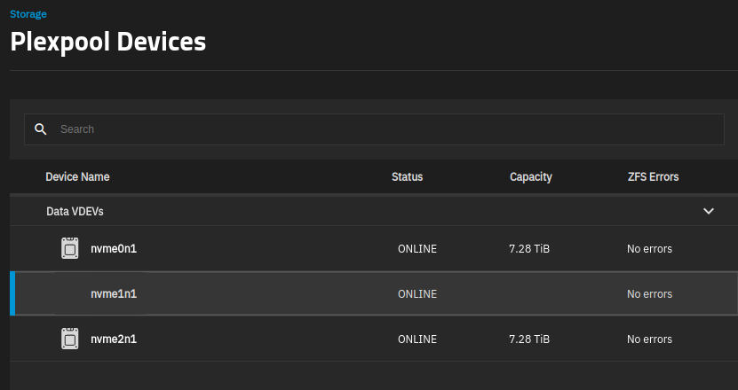
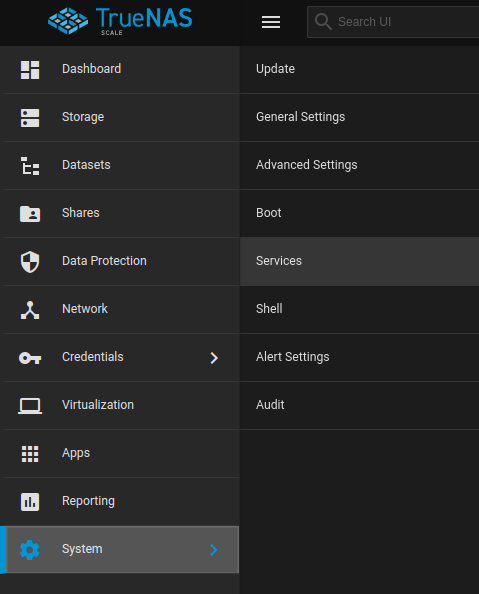
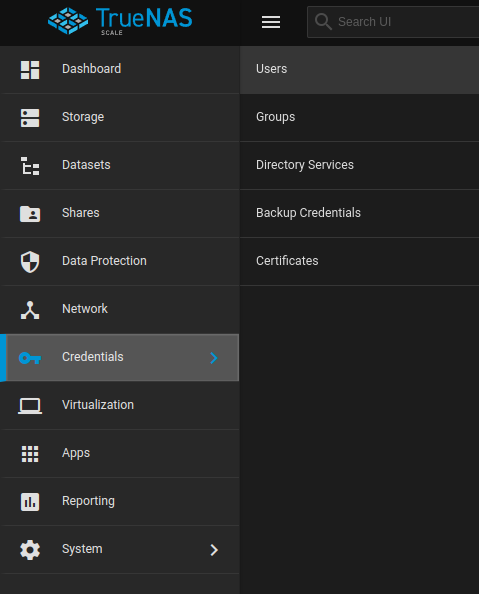
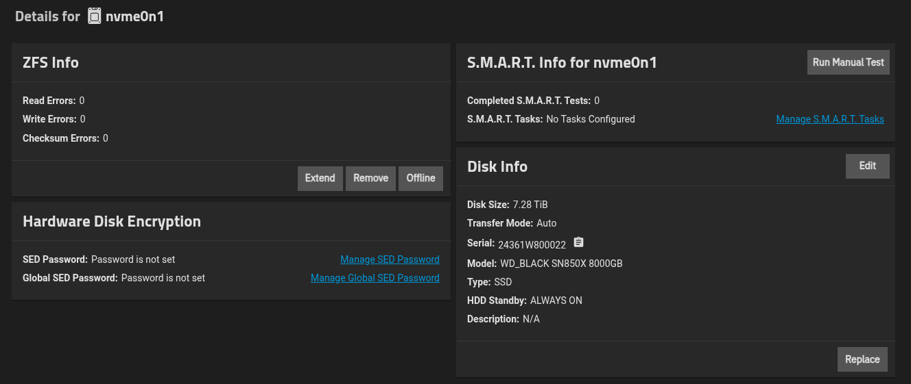
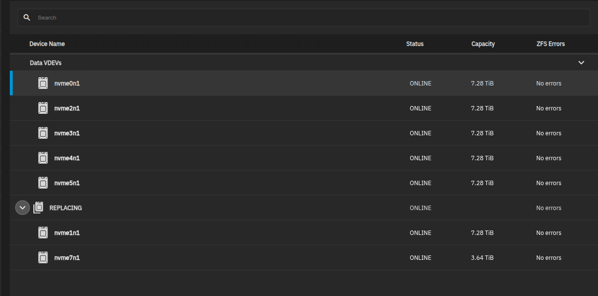
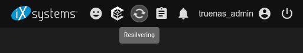

# TrueNAS Scale  

# Helpful Links  

* Official TrueNAS Scale Pages  
  * [Download link](https://www.truenas.com/download-truenas-scale/)  
  * [Documentation](https://www.truenas.com/docs/scale/)  
  * [Forums](https://forums.truenas.com/)  
  * [Discord](https://discord.gg/truenas)  
* Plex  
  * [TruesNAS on plex, good or bad?](https://www.reddit.com/r/truenas/comments/yfbwm5/truesnas_on_plex_good_or_bad/)  
  * [Plex NAS Compatibility](https://docs.google.com/spreadsheets/d/1MfYoJkiwSqCXg8cm5-Ac4oOLPRtCkgUxU0jdj3tmMPc/edit?gid=1274624273#gid=1274624273)  
  * [Unraid and Plex - Tip for massive performance boost](https://www.reddit.com/r/PleX/comments/mkkzg5/unraid_and_plex_tip_for_massive_performance_boost/)  
    * For Unraid, but may be helpful for TrueNAS as well  
* [Best NAS Software: TrueNAS vs OpenMediaVault vs Unraid](https://www.youtube.com/watch?v=xNGPAyC2iaU)  
* [HexOS](https://hexos.com/) (A new NAS bulit using TrueNAS Scale - looks promising, but its 2024-11-21 and the beta for this is in about a week and a half)  
* [How to Set Up TrueNAS Scale to Host Plex](https://techmikeny.com/blogs/techtalk/how-to-set-up-plex-on-truenas)  
  * Also walks through setting up TrueNAS Scale  
* [CLI Reference Guide](https://www.truenas.com/docs/scale/24.04/scaleclireference/)  

# What is a NAS?  

A NAS stands for 'Network Attached Storage'. Basically, its a server that is built specifically for sharing / storing files and data.  

# Hardware: TerraMaster F8 SSD Plus  

As of fall 2024, the best SSD NAS on the market for home use is the TerraMaster F8 SSD Plus - so this is the one I am using. Here are some helpful links:  
* [Default TerraMaster OS Software](https://support.terra-master.com/download/packages?product=F8%20SSD%20Plus)  
  * In case things go really, really wrong  
* [On Amazon](https://www.amazon.com/gp/product/B0D9HWLDX5/ref=ppx_yo_dt_b_asin_title_o01_s00?ie=UTF8)  
  * SSD: [SAMSUNG 990 PRO SSD 4TB](https://www.amazon.com/SAMSUNG-Computing-Workstations-MZ-V9P4T0B-AM/dp/B0CHGT1KFJ/ref=pd_bxgy_d_sccl_1/145-4132275-9256519)  
  * SSD: [WD_BLACK 8TB](https://www.amazon.com/dp/B0D9WT512W)  
* Reviews  
  * [I Tried The New TerraMaster F8 SSD Plus, Is It Any Good?](https://www.the-diy-life.com/i-tried-the-new-terramaster-f8-ssd-plus-is-it-any-good/)  
    * A contained review is [on YouTube](https://www.youtube.com/watch?v=O4gOoyTCi0o&t=117s)  
  * [TerraMaster F8 SSD Plus review: The best all-flash NAS server you can buy today](https://www.androidcentral.com/accessories/smart-home/terramaster-f8-ssd-plus-review)  
  * [Terramaster F8 SSD PLUS PLEX NAS Tests](https://www.reddit.com/r/NewMaxx/comments/1fj20x4/terramaster_f8_ssd_plus_plex_nas_tests/?rdt=57980) (also on [YouTube](https://www.youtube.com/watch?v=pD9SRaqOgRU))  
* [TerraMaster F8 SSD Plus - TrueNAS Install Log](https://forums.truenas.com/t/terramaster-f8-ssd-plus-truenas-install-log/13867/14)  
  * The short story: 
    * Here is the new list of required BIOS changes for SCALE  
      * Security → Secure Boot → Secure Boot → Disabled  
        * Required to boot TrueNAS SCALE  
      * Chipset → North Bridge → VT-d → Disabled  
        * Required to boot TrueNAS SCALE  
      * Boot → TOS Boot First → Disabled  
        * Required to enable editing the boot order  
      * And optional kernel command-line tweaks for SCALE:  `pcie_aspm=off`  
        * Reduces PCIe errors reported in console.  


# ZFS  

Unfortunately, TrueNAS - and many other NAS systems - uses the file system 'ZFS'. There is some support in Debian for ZFS, but you have to install it via:

```
apt install zfsutils-linux
```  

## ZFS: Helpful Links  

* [How do I mount a ZFS pool?](https://askubuntu.com/questions/123126/how-do-i-mount-a-zfs-pool)  


---  

# Installing  

> I used the site [techmikeny](https://techmikeny.com/blogs/techtalk/how-to-set-up-plex-on-truenas) to show me how to setup TrueNAS Scale.  

## Install: Download & Prep  

1\. [Download TrueNAS Scale](https://www.truenas.com/download-truenas-scale/)  
2\. [Use dd](operating_systems/ubuntu/linux_notes?id=bootable-usb-via-dd) to make a bootable USB drive  
  * You will need [lsblk](operating_systems/ubuntu/linux_notes?id=using-lsblk)  
  * If your current OS is not a Debian-based linux system, you will need to make this bootable USB some other way  


## Split Install Disk: Stripe    

!> TrueNAS _highly_ discourages this practice, but they are scant on the details as to why. Its been theorized that it makes recovery of the boot partition harder, but we dont know for sure. That said, while this seems to work and it seems to have no consequence to it, neither the original author of this approach nor I know if there are any negatives to this, so **do this at your own risk**.  


A frustrating aspect of a few NAS systems is one _entire_ physical disk is used for the boot-pool (where the TrueNAS OS sits), when in reality it only needs about 128 GB. This means that you will either A) lose an entire disk to the boot-pool, B) lose an entire HDD or SSD slot to a smaller disk to hold the boot-pool, or C) install the TrueNAS Scale OS to an external drive (which is not recommended).  

What if you could partition a subsection of the disk for the boot-pool, and then leave the rest of the disk for data? I started searching on if this was possible and found [a reddit post](https://www.reddit.com/r/truenas/comments/lgf75w/scalehowto_split_ssd_during_installation/) where some madlad figured out how to do just that. In his case, he is using a mirror across an arbitrary number of disks (well in his case, two, but it could be arbitrary); if your disks are large an all the same size, it may make sense to span the boot-pool across all disks you are going to mirror: _if_ you can partition a small part of the disk for the boot-pool and if its _also_ possible to use the remainder of the disk for data, well, the boot-pool space is trivial (128GB) and you wont lose an entire disk for the boot pool. For my purposes, I simply needed a 'stripe' (non-redundant data) so I figured out how to modify his directions for my purposes - so I will list that below. The only issue I had with his approach is the UUID of the disk is printed in caps, whereas in the filesystem the UUID identification is lower case - a minor nitpick, at best.


1\. When installing TrueNAS Scale, you will be prompted to, among other things , `Install/Upgrade`, `Shell`, etc. Pick `Shell`.  

2\. Enter the Bash shell: `bash`  

3\. Change the permissions on the write script so you can save your changes: `chmod +w /usr/lib/python3/dist-packages/truenas_installer/install.py`  

4\. Use the text editor vi to open the python file for editing: `vi /usr/lib/python3/dist-packages/truenas_installer/install.py`  
* Vi is a very old text editor and can be confusing; my notes on it are [here](operating_systems/ubuntu/linux_notes?id=using-vi) but if you have never used vi, you may need more help than that (but maybe not).  

5\. Look for tne entry  
```
# Create data partition
await run(["sgdisk", "-n3:0:0", "-t3:BF01", disk.device])
```  

and change it to  

```
# Create data partition
await run(["sgdisk", "-n3:0:+128GiB", "-t3:BF01", disk.device])
```  
* You are free to change the space, if you wish, by altering `+128GiB`.  
* Again, this is using vi and its troublesome for new users  
  * If you mess up the file, pressing escape typing `:quit!` and pressing return will exit vi and yo ucan start fresh.  

6\. Press escape and type `:wq!` and hit enter  
* This saves your changes  

7\. Exit the shell (you may have to do this twice): `exit`  

8\. Install TrueNAS Scale as normal.  

9\. After installation, you will need to go into the Web-based GUI (on a different desktop / laptop) and [enable SSH](operating_systems/nas/truenas_scale?id=enabling-ssh) (or, alternatively, just do this entirely on the server itself, if you have a monitor hooked up to it).  

10\. Open a terminal on a different desktop / laptop Use ssh and SSH into the TrueNAS server: `ssh truenas_admin@YOUR_NAS_IP_HERE`    
* `YOUR_NAS_IP_HERE` is the same IP that is used for the web GUI.  

11\. [become root](/operating_systems/nas/truenas_scale?id=becoming-root)  
* Note this is different than most implementations of Linux - this is `sudo su` and _not_`sudo su -`  

12\. Find each partition used in the boot pool via the command:  
```
zpool status boot-pool
```  

My output is:  
```
  pool: boot-pool
 state: ONLINE
config:

	NAME         STATE     READ WRITE CKSUM
	boot-pool    ONLINE       0     0     0
	  nvme1n1p3  ONLINE       0     0     0
```  

For me, I only had one boot-pool partition (nvme1n1p3), but other setups may have two; _if_ you have more than one, you will have to build a partition for each disk that has one of these boot-pool partitions.  

You will need to know the associated physical disk name; you can find that using [lsblk](operating_systems/ubuntu/linux_notes?id=using-lsblk), which will show you the over-arching physical disk names (i.e. `sda`, `sdb`, `sdc`, `nvme0n1`, etc), and immediately under those are its associated partitions (i.e. `sda1`, `sda2`, `nvme0n1p1`, `nvme0n1p2`, etc). To find the physical disk name, take the putput from `zpool status boot-pool` and find the listed partition's parent / over-arching physical disk name right above that.  

> My favorite way to use lsblk is `lsblk -o NAME,FSTYPE,SIZE,FSUSED,FSUSE%,MOUNTPOINTS,UUID`  

For example, here is a snippet from my `lsblk` command with my listed `nvme1n1p3` boot partition:  
```
nvme1n1                 7.3T                           
├─nvme1n1p1               1M                           
├─nvme1n1p2 vfat        512M                           D2AB-5B4C
├─nvme1n1p3 zfs_member  128G                           3094973739689950230
```  
* The over-arching physical disk name is `nvme1n1`, and all partitions end in `p1`, `p2`, `p3`, etc.  

13\. Now that we have the overarching physical disk, its clear there is unused space on it (it has a capacity of 7.3T but only has ~128G allocated). To make a new partition, we must note the last partition (p3) and know the next one will be 4. So, we will create the partitions by running `sgdisk` with `-n4` and `-t4` (since the next position is '4', these are both 4):  
```
sgdisk -n4:0:0 -t4:BF01 /dev/nvme1n1  
```  
* `nvme1n1` was my 'parent' physical disk name  

14\. Update the linux kernel table with the new partitions:  
```
partprobe
```  

If you now run `lsblk` again, it will show you the added partition; for me, `lsblk` gave:  
```
nvme1n1                 7.3T                           
├─nvme1n1p1               1M                           
├─nvme1n1p2 vfat        512M                           D2AB-5B4C
├─nvme1n1p3 zfs_member  128G                           3094973739689950230
└─nvme1n1p4 zfs_member  7.2T                           2005367658931671454
```  
* The last one, `nvme1n1p4`, was not there before, so this is the new partition we just made.  

15\. Go back to the TrueNAS Scale Web GUI and setup a 'stripe' pool. Unfortunately, you will not see our newly created poartition available there; we will need to add it manually after you set up the pool.  

16\. Going back to our console, run:  
```
zpool add POOL_NAME_HERE PARTIION_NAME_HERE  
```  
* `POOL_NAME_HERE` is the name of the pool that you are adding this to  
* `PARTIION_NAME_HERE` is the name of the new partition  

Now if you go back into the Web GUI, you _will_ see the disk listed!  

  
* The disk icon and capacity are missing, but otherwise its in working order!  

---  

# Becoming Root  

Getting root is slightly different in TrueNAS Scale; yo udo not type `sudo su -` or `su -` on the command line, you type: `sudo su`  
* Using `sudo su -` gives the error: `sudo: argv[0] mismatch, expected "/usr/bin/zsh", got "-zsh"`  

---  

# Enabling SSH  

## Enable SSH Service  

To enable the SSH service, go into the Web GUI and select `System/Services`:  

  

Then, put a check next to `Running` for SSH to run it, and a check next to `Start Automatically` for SSH if you wish that to be the case.  

> Remember that _each individual_ user must _also_ have either their `SSH password login enabled` _or_ you must set up an SSH key for them.  

## Enable SSH Login for User  

To enable a specific user's ability to use SSH, you need to do one of two things: upload a SSH (public) key for them (assuming you have the private key already), _or_ enable SSH password logins for them.  

To enable SSH password login for a specific user:  

1\. Select `Credentials/Users`:  

  

2\. Use the dropdown button next to their accout to reveal an `Edit` button - press it.  

3\. Find the `SSH password login enabled` checkbox and check it.  

4\. Press the `Save` button.  

## Upload SSH Key for User  

You can stay passwordless by uploading a public SSH key for the user:  

1\. If you have not done so, [generate a SSH private/public key pair](operating_systems/ubuntu/linux_notes?id=ssh-key-setup).  

2\. Back in the TrueNAS Scale Webn GUI, select `Credentials/Users`:  

  

3\. Use the dropdown button next to their accout to reveal an `Edit` button - press it.  

4\. Find the `Upload SSH Key` label (with a `Choose File` under said label) and press it; a popup will open and you can pick your public key file.  

5\. Opening the file should have populated the `Authorized Keys` textbox.  

6\. Press the `Save` button.  


---  

# Directory Locations  

Since this is a bit different than a standard Debian distro, I thought I would list some directory locations.  

## Pool / Dataset Locations  

Pools and Datasets are located in `/mnt/POOL/DATASET`, where `POOL` is the pool name and `DATASET` is the dataset name.  

--- 

# SMB Share  

Samba is the SMB (Server Message Block) file sharing service that lets you share files and folders from your server to other devices on your network - primarily Windows machines, but also macOS, Linux, and other platforms.
Essentially, Samba is the open-source implementation of the SMB/CIFS protocol. When you enable it on a server, it turns your server into a network file server that other computers can connect to and access shared folders, just like accessing a shared drive on a Windows server.  

Main uses:  
* File sharing  
* Media streaming  
* Time Machine  
  * macOS Time Machine backups can use SMB shares  
* General network storage  

## Installing SMBCLient  

In order to use this, you will have to install `smbclient` on your desktop / laptop. Become root, then install with: `apt install smbclient cifs-utils`  

## SMB Setup On NAS  

1\. Make sure you have created a user with `SMB User` checked.  
  * This is done via the web GUI / Credentials / Users  

2\. In the GUI, go to `Shares` and then find the section that says `Windows (SMB) Shares` and click the `Add` button  

3\. In the `Path` section, select the directory you wish to share.  

4\. Name it - it does not have to be the path name if you do not want it to be.  

5\. Ensure the `Enabled` box is checked.  

The setup on the NAS is now complete! Outside of installing the client, you will need a SMB file that holds the username and password from step one. It can be named anything you wish (it may need to start with a `.`), but the structure is:  
```text  
username=YOUR_USERNAME 
password=YOUR_PASSWORD 
domain=. 
```  
* You may also need to restrict the permissions to just yourself.  

---  

# Replacing Disks  

You can replace a disk via a process called <font color="green">resilvering</font>.  

1\. Turn off your TrueNAS server.  

2\. Install the new disk.  

3\. Power on your TrueNAS server.  

4\. Using the GUI, Click `Storage`  

5\. Click the `Manage Devices` button (in the `Topology` section)  

6\. Click on the disk you want to replace  

7\. This screen will come up - Click `Replace`:  

  

8\. You will be prompted to pick the new (free and unused) disk - do so and accept.  

9\. The disk is now being replaced - If you look at your disks, you will see a `REPLACING` dropdown and will show the old and new disks:  

  

10\. This can take a _long_ time, so be patient  
  * I replaced a 4 TiB SSD with an 8 TiB SSD (well really 3.64 / 7.28, but lets not split hairs), and it will take about 5 hours to do so  

11\. If you wish to monitor the progress, you can click on the `Resilvering` icon at the top of the GUI:  

  

Alternatively, you can also log into your TrueNAS Scale host via SSH, [become root](/operating_systems/nas/truenas_scale?id=becoming-root), and run the command: `zpool status -v`  
* It will give a message like so:  
```
  pool: MyPoolNameHere
 state: ONLINE
status: One or more devices is currently being resilvered.  The pool will
	continue to function, possibly in a degraded state.
action: Wait for the resilver to complete.
  scan: resilver in progress since Thu May 22 09:24:20 2025
	6.25T / 34.4T scanned at 3.44G/s, 3.66T / 34.4T issued at 2.01G/s
	807G resilvered, 10.66% done, 04:20:07 to go
```  

