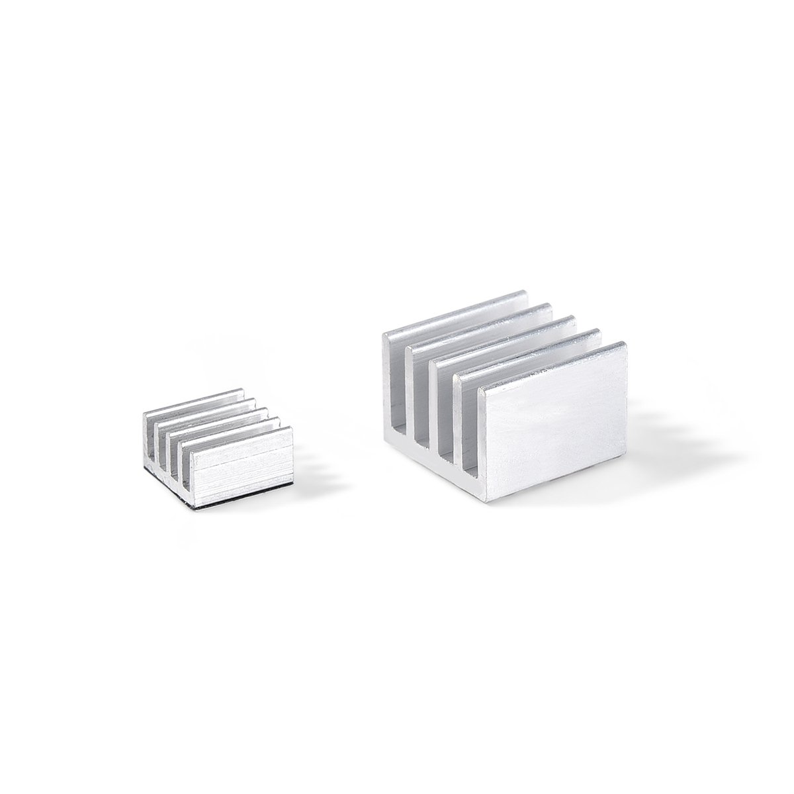
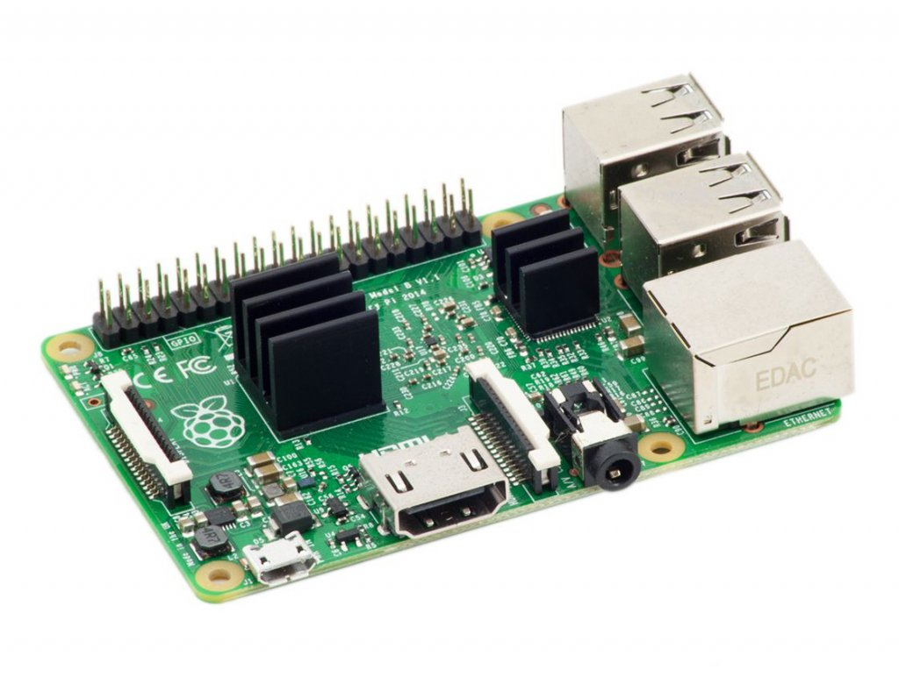
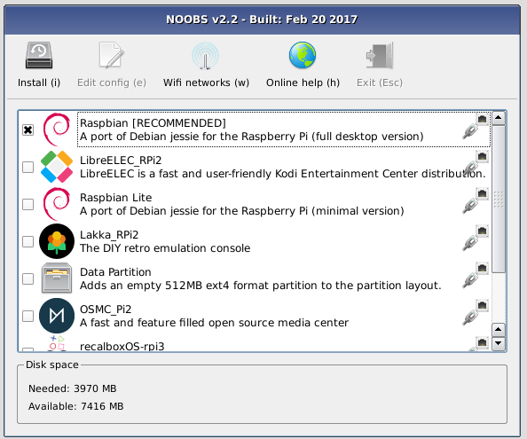

# Raspberry Pi Install

# Gathering Equipment

## Purchasing Raspberry Pi

I like to purchase an entire [Raspberry Pi kit by CanaKit](https://www.amazon.com/CanaKit-Raspberry-Premium-Clear-Supply/dp/B07BC7BMHY/ref=sr_1_3?keywords=canakit+raspberry+pi+3+b%2B+case&qid=1554304703&s=gateway&sr=8-3), which is now selling Raspberry Pi 3 (Model B+) on Amazon. There are other vendors available, though:

* [Newark element14](http://www.newark.com)
* [RS Components](http://uk.rs-online.com)
* [Egoman](http://www.egoman.com.cn)
* [Allied Electronics](http://www.alliedelec.com)
* [Pimoroni](http://shop.pimoroni.com)
* [Adafruit](http://www.adafruit.com)

## Casing Raspberry Pi

!> It's strongly recommended to case the unit _first_, _before_ even installing the heat sinks or the microSD card!

You do not 'need' a case for the Raspberry Pi, but its strongly recommended as you are far less likely to break the unit. [CanaKit](https://www.canakit.com/pi-case) has good cases.

## Applying Heat Sinks

It may be a good idea to fasten heat sinks to the unit to help prevent overheating. They can be purchased [here](https://www.amazon.com/LoveRPi-Performance-Heatsink-Raspberry-Heatsinks/dp/B018BGRDVS/ref=sr_1_4?keywords=raspberry+pi+heatsink&qid=1554305192&s=gateway&sr=8-4) for about $5 on Amazon.

This is an image of the two heat sinks you will need (or something approximating them):

The larger heat sink goes on the Broadcom CPU, and the smaller goes on the Ethernet & USB Controller; to figure out where those components are on the unit, see this pictures (which showcases black heat sinks applied to those components):

The heat sinks should have adhesive on the flat side - once the unit is in the case, simply peel the protective paper from the adhesive and then press the adhesive side against the two components mentioned above.

## Adding a Camera

If you wish to purchase a camera for the Raspberry Pi, [a cheap one is on Amazon](https://www.amazon.com/gp/product/B012V1HEP4/ref=ppx_od_dt_b_asin_title_s00?ie=UTF8&psc=1). [This](https://www.canakit.com/pi-case) video shows you how to install the camera on the CanaKit case, but if also shows you how to install it on the Raspberry Pi itself.

# Installation (of Raspbian)

!> Note that you will A) need a microSD card and B) that microSD card MUST be formatted as a FAT filesystem! The FAT formatting on Mac or Linux should work, but if you are on Windows, [use this tool](https://www.sdcard.org/downloads/formatter/) (masked from CanaKit as www.canakit.com/tools/sdformatter) if the microSD card is 32 GB or smaller and [this tool](http://www.ridgecrop.demon.co.uk/index.htm?guiformat.htm) if its 64 GB or larger (masked from CanaKit as www.canakit.com/tools/fat32format).

There are a few ways to install the 'official' OS [Raspbian](operating_systems/raspberry_pi/raspberry_pi_key_terms?id=raspbian) on a Raspberry Pi.

## Pre-check List

Before you install anything to the Raspberry Pi, please make sure you have [cased the unit](operating_systems/raspberry_pi/raspberry_pi_install?id=casing-raspberry-pi) (if using a case), then [applied heat sinks](operating_systems/raspberry_pi/raspberry_pi_install?id=applying-heat-sinks) if you wish to do this), and finally [installed the camera](operating_systems/raspberry_pi/raspberry_pi_install?id=adding-a-camera) (if you want to).

## Downloading NOOBS

!> Note that you will A) need a microSD card and B) that microSD card MUST be formatted as a FAT filesystem! The FAT formatting on Mac or Linux should work, but if yo uare on Windows, [use this tool](https://www.sdcard.org/downloads/formatter/) (masked from CanaKit as www.canakit.com/tools/sdformatter) if the microSD card is 32 GB or smaller and [this tool](http://www.ridgecrop.demon.co.uk/index.htm?guiformat.htm) if its 64 GB or larger (masked from CanaKit as www.canakit.com/tools/fat32format).

[NOOBS](operating_systems/raspberry_pi/raspberry_pi_key_terms?id=noobs) can be used to install [Raspbian](operating_systems/raspberry_pi/raspberry_pi_key_terms?id=raspbian) to a microSD card. First, make sure you have a microSD card that is formatted as FAT (see warning above). Once you have that, download NOOBS [from the official source](https://www.raspberrypi.org/downloads/noobs/).

Once you have the file downloaded, simply open the ZIP file and copy the contents to your microSD card (from your Windows PC, Mac, or Linux desktop).

> It seems the size of the microSD card determines which OSes are available. I used the same NOOBS files on identical Raspberry Pi 3 B+ units, with the only difference being one microSD was 64G and one was 128G; the 128G microSD had multiple OSes available in NOOBSm whereas the 64GB microSD only had two available.

## Booting Raspberry Pi

Plug in your mouse, keyboard, HDMI cord (Raspberry Pi has only a HDMI connection), your network cable, and finally your microSD card that holds [your downloaded, unzipped version of NOOBS](operating_systems/raspberry_pi/raspberry_pi_install?id=downloading-noobs). Note the microSD card doesn't 'click' when putting it in, and it seems to kind of sit there.

Once th eabove is done, connect the power source and the unit should start booting.

## Raspbian Installation

1\. Select the OS.  

At this point you will see a screen with several different choices for an OS; you can experiment with these, but for now we are going to pick 'Raspbian Full'. Place a check mark next to this, and then pres 'install' (it should be in the upper left). Here is an example of the screen you should see:

2\. Set Root Password.  

You will be asked to make a new password for the account 'pi' (which is the root account). The default is 'raspberry', but you should seriously consider changing this. 

3\. Set WiFi.  

*If* your unit is WiFi capable, you will be asked to select it and enter the WiFi password.

4\. Install updates.  

The system will now install updates.

# Raspberry Pi OS (For Your Desktop)

You can also [download the ISO](https://www.raspberrypi.org/downloads/raspberry-pi-desktop/) for your desktop; alternatively, you can install to a VM as well. This is helpful if you want to play around with the settings but do not want to potentially harm your Raspberry Pi unit.

