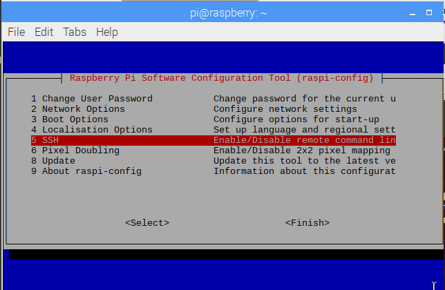

# Raspbian

<!-- My notes

aaahhhh
-->

# Initial Setup

Before you can install Raspbian, please do the following:
* [Purchase a Raspberry Pi](operating_systems/raspberry_pi/raspberry_pi_install?id=purchasing-raspberry-pi).
* [Get a case on it](operating_systems/raspberry_pi/raspberry_pi_install?id=casing-raspberry-pi).
* [Install heat sinks](operating_systems/raspberry_pi/raspberry_pi_install?id=applying-heat-sinks).
* [Add a camera](operating_systems/raspberry_pi/raspberry_pi_install?id=adding-a-camera) if you want (come on.....its $13!).
* [Install an OS (Raspbian)](operating_systems/raspberry_pi/raspberry_pi_install?id=installation-of-raspbian).


# Raspberry Pi OS (For Your Desktop)

You can also [download the ISO](https://www.raspberrypi.org/downloads/raspberry-pi-desktop/) for your desktop; alternatively, you can install to a VM as well. This is helpful if you want to play around with the settings but do not want to potentially harm your Raspberry Pi unit.

# General Rule

Raspbian is a derivative of Debian, just as Ubuntu is a derivative of Debian; therefore, most of my [Linux notes](operating_systems/ubuntu/linux_notes) will also apply to Raspbian - so please see them for help. That said, if I realize a difference between those notes and Raspbian, I will record it here.

# Initially Configuring OS

## Enabling SSH

!> Make **sure** you changed pi's password from the default before you enable SSH!

[SSH](operating_systems/ubuntu/linux_notes?id=ssh) works the same way in Raspbian, with a caveat: you must enable SSH. As of the November 2016 release, Raspbian has the SSH server disabled by default. This may be due to security - there is a default login (pi) and a default password (raspberry), so this would be an obvious problem if SSH was enabled. 

In any event, to enable SSH:

1\. Open a terminal.

2\. [Become root](/operating_systems/ubuntu/linux_notes?id=becoming-root)

3\. Get to the raspbian config screen with the following command in a terminal:
```
raspi-config
```

Here, you will have to find something that says 'SSH' and 'enable' or 'disable'; unfortunately it can be in a few places depending on the version. In one version its on the top level:  


In other implementations, you have to click 'Interfacing Options' first, and from there you will see a 'SSH' 'enable' option. Wherever it is, find it and enable it.

## Change the Hostname

For security reasons you will want to [change the hostname](operating_systems/ubuntu/linux_notes?id=changing-the-hostname). Note that the last step of running `/etc/init.d/hostname.sh start` is not applicable to Raspbian; you will have to [reboot the server](operating_systems/ubuntu/linux_notes?id=shutting-down-restarting-server) unfortunately.

## Delete pi User

!> You will be creating a new account that has root access in this section. Make _sure_ you want this account to have root access!

For security reasons, you should really consider deleting the `pi` user; it is not safe to have your account with root access publicly known. To do this we need a new root user though, so think of a new account that will have root access (I assume `uperson` below, but it can be almost anything). Steps:

1\. Open a terminal.

2\. [Become root](/operating_systems/ubuntu/linux_notes?id=becoming-root).

3\. [Add your new account](operating_systems/ubuntu/linux_notes?id=adding-a-user).

4\. [Give your new account a password](operating_systems/ubuntu/linux_notes?id=setting-a-password).

5\. Add the user to the following groups with the following commands:
```
adduser uperson adm
adduser uperson dialout
adduser uperson cdrom
adduser uperson sudo
adduser uperson audio
adduser uperson video
adduser uperson plugdev
adduser uperson games
adduser uperson users
adduser uperson input
adduser uperson netdev
adduser uperson spi
adduser uperson i2c
adduser uperson gpio
```
* switch out `uperson` for your account.

6\. Remove the `pi` user from these same groups with these commands:
```
deluser pi adm
deluser pi dialout
deluser pi cdrom
deluser pi sudo
deluser pi audio
deluser pi video
deluser pi plugdev
deluser pi games
deluser pi users
deluser pi input
deluser pi netdev
deluser pi spi
deluser pi i2c
deluser pi gpio
```

7\. Edit the file `/etc/systemd/system/autologin@.service` and find this line:

```
ExecStart=-/sbin/agetty --autologin pi --noclear %I $TERM
```

If you _do not want an autologin_, comment this out by putting a `#` at the front of the line; otherwise, change the `pi` user to your new sudo user.

!> If you did not use the [NOOBS](operating_systems/raspberry_pi/raspberry_pi_key_terms?id=noobs) guide to install Raspbian you may not have to do this step; check it out to make sure. 

8\. Edit the file `/etc/lightdm/lightdm.conf` and find this line:

```
autologin-user=pi
```

If you _do not want an autologin_, comment this out by putting a `#` at the front of the line; otherwise, change the `pi` user to your new sudo user.

!> If you did not use the [NOOBS](operating_systems/raspberry_pi/raspberry_pi_key_terms?id=noobs) guide to install Raspbian you may not have to do this step; check it out to make sure. 


9\. [Reboot the server](operating_systems/ubuntu/linux_notes?id=shutting-down-restarting-server), as there may be processes running under the `pi` account still.

10\. Change the directory to `/etc/sudoers.d/`, open the file `010_pi-nopasswd` for editing, and comment out this line (with a `#`):
```
pi ALL=(ALL) NOPASSWD: ALL
```

We do it this way (as opposed to just deleting the file) in the event that some update tries to modify this file; if it does, we will know (as opposed to a process simply creating this file again on update).

!> If you want your new sudo/root account to be able to access root without a password, you can make this file here - just replace all instances of `pi` with your `sudo`/root username.

11\. Check to see no processes are running under the `pi` account; if there are, other actions may have to be taken:
```
ps -ef | grep pi
```

12\. Delete the `pi` user:
```
userdel -r pi
```

13\. While not necessary, you can [reboot the server](operating_systems/ubuntu/linux_notes?id=shutting-down-restarting-server) again to make sure it boots properly.

# Remote Desktop

Its possible to set up a remote desktop on Raspbian; this makes it possible to interact with the desktop from another machine.

## Installing Remote Access Packages

You will need to install some packages in order to connect remotely. [These are the same as used in KVM](operating_systems/ubuntu/package_install/kvm_install?id=install-remote-access-packages), so install the packages listed there.

!> You only have to install the packages listed under the small section 'Install Remote Access Packages'.

## Connecting Remotely

To use the GUI, you will have to log into the server remotely from a desktop; if you are on an Ubuntu desktop, [use these instructions](operating_systems/ubuntu/linux_notes?id=connecting-from-ubuntu-desktop); if you are on a Windows desktop, [use these instructions](operating_systems/ubuntu/linux_notes?id=connecting-from-windows-desktop).

# MySQL (MariaDB) in Raspbian

## MariaDB Install

MariaDB replaces MySQL on Raspbian; since MariaDB is a derivative of MySQL, most of the commands are similar to the [MySQL install on Ubuntu](databases/mysql/mysql_install?id=mysql-install); in addition, the [additional packages](databases/mysql/mysql_install?id=other-packages-to-install) seem to install as well, with the exception of `libmysqlclient-dev`.

The major difference comes with the [mysqld.cnf file](databases/mysql/mysql_install?id=mysql-master-settings-mysqldcnf) - it doesn't exist in Raspbian. Instead, its configuration seems to be spread across two folders `/etc/mysql/conf.d` (which houses the `[mysql]` and `[mysqldump]` headers) and `/etc/mysql/mariadb.conf.d` (which houses many more, including some repeats).

The `bind-address` variable (talked about in the Ubuntu MySQL install [here](databases/mysql/mysql_install?id=mysql-master-settings-mysqldcnf)) is located in the file `/etc/mysql/mariadb.conf.d/50-server.cnf`, which you will have to find that line and comment it out (and after you do, do not forget to [stop](databases/mysql/mysql_maintenance?id=stopping-the-database) and then [start](databases/mysql/mysql_maintenance?id=starting-the-database) the database).

## General MariaDB Operations

The operations seem to be [the same as MySQL](databases/mysql/mysql_maintenance), so check that out for general operations.


# Anaconda (Python)

Installing Anaconda is [very similar to the Ubuntu install](operating_systems/ubuntu/server_build?id=python-anaconda-install) with one major caveat: where you get the initial file. The problem is it's an ARM based CPU (and not an x86 based CPU). The Anaconda ARM files are located [here](https://repo.continuum.io/miniconda/).

Here are some commands to quickly get the file from your system:
```
wget http://repo.continuum.io/miniconda/Miniconda-latest-Linux-armv7l.sh
chmod +x Miniconda3-latest-Linux-armv7l.sh
./Miniconda-latest-Linux-armv7l.sh
```

> There is also a `Miniconda3-latest-Linux-armv7l.sh` file, which is Python 3.

