# KVM Operational Overview
<!-- clear for public use --> 

> This doc outlines how to perform day to day operations on KVM on a Ubuntu server.

KVM (Kernel-based Virtual Machine) is a package suite that turns your host into a 'hypervisor', which has the ability to host virtual machines that can act as if they were independent servers. This is a very powerful concept, as it means you can easily make a new entity that looks, acts, and is a new server (for the most part). The only limitation is the `host` / `hypervisor` (which basically means 'the operating system on the actual physical server which controls child virtual machines') itself: CPUs and memory / RAM are limited on the host, so you can only divvy out so much before the system can no longer support more virtual machines (`VMs`).

> When discussing hosts and VMs, it can get confusing as sometimes its ambiguous if the instructions mean 'do this on the host' or 'do this inside the VM'. For the most part, I am talking about the host here when I give instructions - setting up the VM is on you (but don't worry, you can [follow these Ubuntu server instructions](operating_systems/ubuntu/server_build) to set up your VM, if you wish). If I do start talking about instructions on the VM, I will say something like 'in/on the VM' when referencing the instructions.

!> These instructions are not meant to be an exhaustive description of KVM; it is simply designed to get you up and running.

---

# Credits

This is based on the instructions first laid out by a Packers fan who agreed to allowing me to share this but did not want to be named. The Packers fan is highly skilled at Linux (and IT related fields in general), and I am in his debt for all of the knowledge I have gained from him over the years. I salute you, good sir, and thank you for everything!

---

# KVM Install

KVM requires a [configured Ubuntu server](operating_systems/ubuntu/server_build) and an [installed and configured KVM setup](operating_systems/ubuntu/package_install/kvm_install); if you need to do these things please follow these links. Also, if you would like to brush up on basic Ubuntu Linux commands [please see these instructions](operating_systems/ubuntu/linux_notes).

---

# Log In Remotely

To use the GUI, you will have to log into the server remotely from a desktop; if you are on an Ubuntu desktop, [use these instructions](operating_systems/ubuntu/linux_notes?id=connecting-from-ubuntu-desktop); if you are on a Windows desktop, [use these instructions](operating_systems/ubuntu/linux_notes?id=connecting-from-windows-desktop).

There is an alternate way to interact with the components that need a GUI; instead of connecting to the server and then running a lightweight desktop (such as xfce), you can instead forego the server desktop and utilize [the client desktop entirely](operating_systems/ubuntu/package_operations/kvm_notes?id=connecting-to-brand-new-vm-using-client-based-gui); note that you will need [a few packages installed on a Linux desktop](operating_systems/ubuntu/package_operations/kvm_notes?id=client-packages-required-no-server-gui) for this, including having a [passwordless SSH key set up between your desktop client and the server](operating_systems/ubuntu/linux_notes?id=ssh). The entire install method that bypasses `virt-manager` and xfce can be found [here](operating_systems/ubuntu/package_operations/kvm_notes?id=using-kvm-without-gui-on-server). It is _also_ possible to install a VM with absolutely **NO** GUI - [see these instructions](operating_systems/ubuntu/package_operations/kvm_notes?id=installation-with-no-gui) on how to do that!

---

# Launching KVM GUI

> The command `virt-manager` is the Ubuntu command to launch the KVM Virtual Machine Manager.

<span> </span>
> Note that there is an alternate way to interact with the components that need a GUI; instead of connecting to the server and then running a lightweight desktop (such as xfce), you can instead forego the server desktop and utilize [the client desktop entirely](operating_systems/ubuntu/package_operations/kvm_notes?id=connecting-to-brand-new-vm-using-client-based-gui); note that you will need [a few packages installed on a Linux desktop](operating_systems/ubuntu/package_operations/kvm_notes?id=client-packages-required-no-server-gui) for this, including having a [passwordless SSH key set up between your desktop client and the server](operating_systems/ubuntu/linux_notes?id=ssh). The entire install method that bypasses `virt-manager` and xfce can be found [here](operating_systems/ubuntu/package_operations/kvm_notes?id=using-kvm-without-gui-on-server). It is **_also_** possible to install a VM with absolutely **NO** GUI - [see these instructions](operating_systems/ubuntu/package_operations/kvm_notes?id=installation-with-no-gui) on how to do that!

While it may be possible to [control KVM completely from the command line](http://xmodulo.com/use-kvm-command-line-debian-ubuntu.html), using the KVM GUI makes it much easier. To launch the GUI on a server, [first you must connect to the remote desktop](operating_systems/ubuntu/linux_notes?id=connecting-to-remote-desktop). We are going to use [the xfce desktop](operating_systems/ubuntu/server_build?id=remote-desktop-packages).

Once you connect to the remote xfce desktop, you will be dumped into a terminal like so:

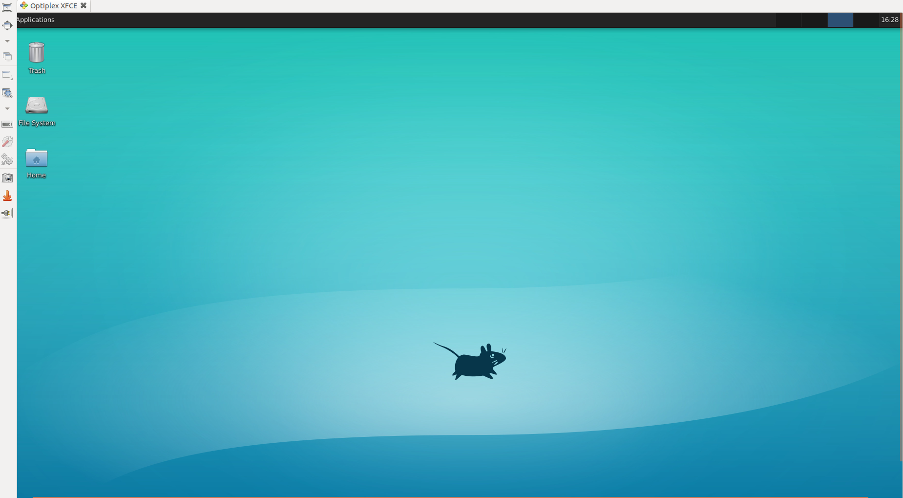

It can be a bit intimidating to know what to do next, but here is a screen shot of what exactly to do to start the KVM GUI manager:

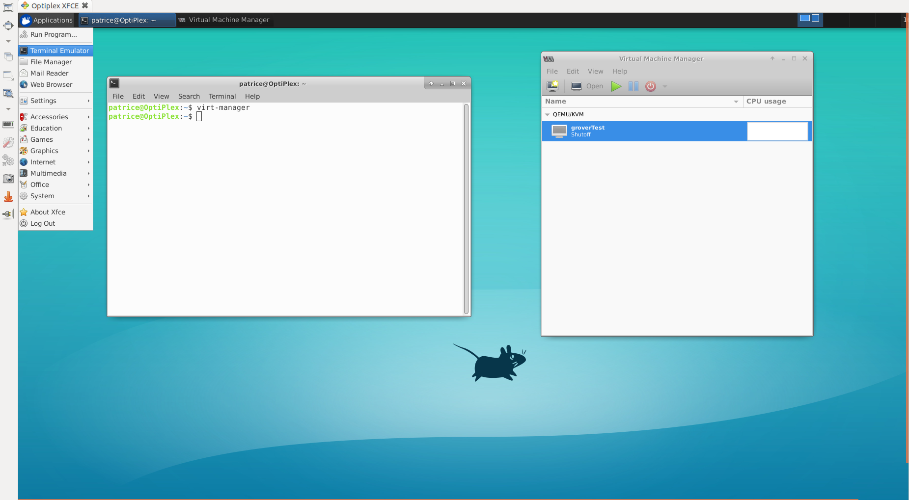
* Press the 'Applications' button, then select 'Terminal Editor'
* A terminal will open - type the command `virt-manager` and press enter (middle screen).  
  * If this does not work, it may be because its running on the host machine already - you may have to kill the process first.  
* The KVM Virtual Machine Manager opens (on the left)!

!> If there is an error and you cannot launch the terminal emulator, see [A Note On XFCE Errors](operating_systems/ubuntu/linux_notes?id=general-notes-on-connecting-remotely).

You can also launch the KVM Virtual Manager by right-clicking in the background, then selecting 'Applications', then selecting 'System', then selecting 'Virtual Machine Manager':

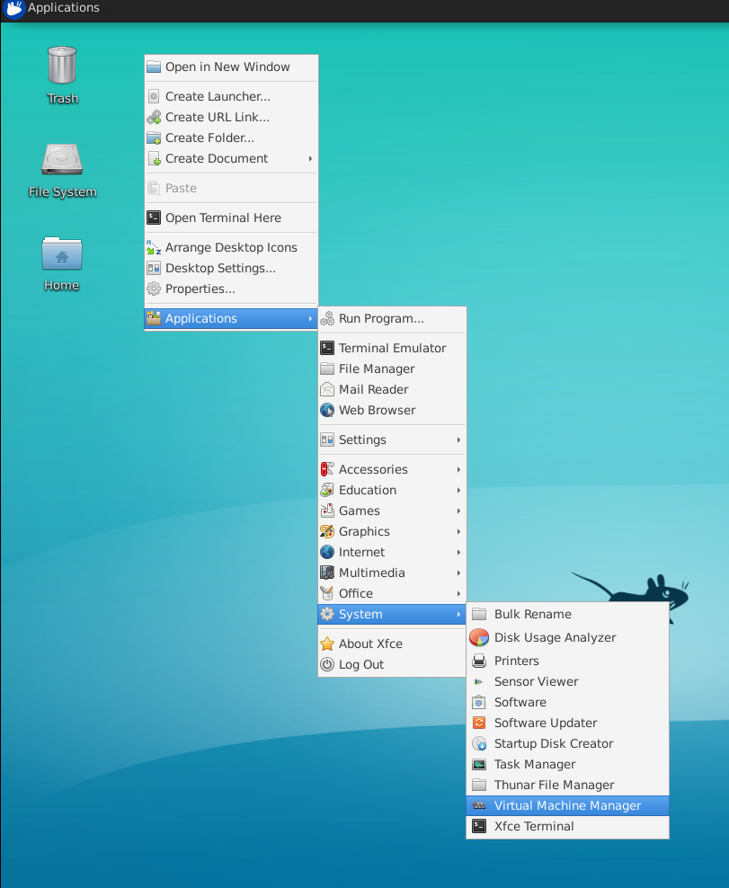


**<font size="4">Launching KVM Virtual Machine Manager from GNOME</font>**

Its also possible to manage the KVM GUI from the full-blown GNOME desktop that comes standard for the Ubuntu Desktop install. If you use a remote connection to such a setup, you can click the icon represented by several dots and the KVM GUI (if `virt-manager` is installed on the remote machine) will be available:

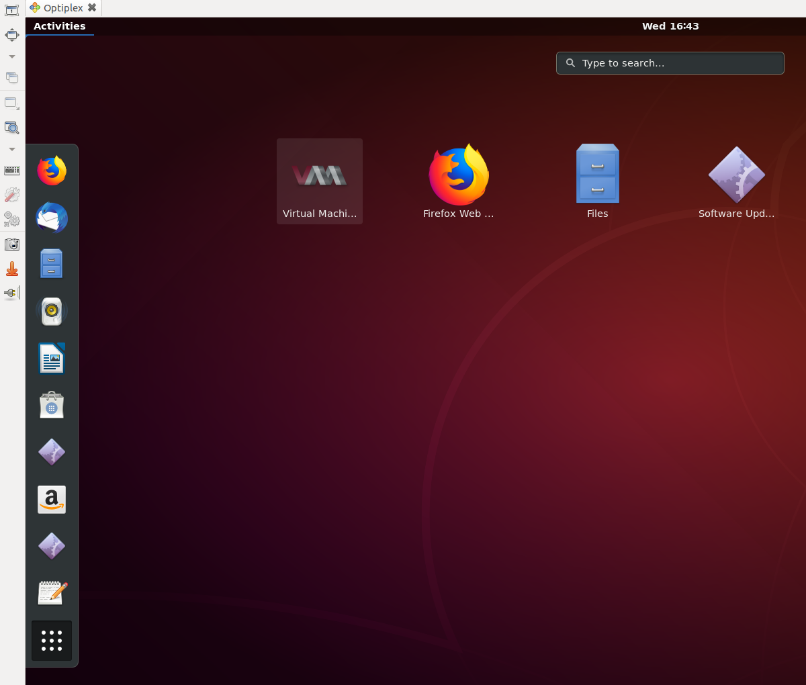

IF you can't find the icon, you are always able to type `virt-manager` in a terminal to launch the GUI.

---
# KVM Privileges

In order to run most KVM commands - in the GUI or otherwise - you must either be root or be a member of the ['libvirt'](operating_systems/ubuntu/package_install/kvm_install?id=adding-user-to-group-39libvirt39) group. If you have trouble doing, well, anything, check to see if you are in the 'libvirt' group.

---

# Privileges for KVM

If you house your .qcow2 file on a mounted external drive you may have some problems; usually ownership is strict for mounted external drives, and the _entire_ drive needs the same owner/group. One way around this is when mounting the drive, give it a specific group. Make your special UNIX accounts (the ones that need to modify files on this drive) members of this group, but also make the account 'libvirt-qemu' a member of this group as well; doing so will allow KVM to use the external drive too.

If your group name that controls the external drive is 'externalowners', you would run this command as root:
```
usermod -a -G externalowners libvirt-qemu
```


# Selecting an ISO Image

An ISO image is a disk image of an optical disk - in other words, its simply a file that ends in .iso that can act like an installation CD (and in many cases, if you have a DVD burner operational and you double click on a .iso file, you will be brought to the DVD burning software with the ISO as the source file). You can download .iso files for many different operating systems; some of the more interesting ones are here:

| Operating System | Website | Link |
| ---------------- | ------- | ---- |
| Android (64 bit) | http://www.android-x86.org/download | [Android](https://osdn.net/frs/redir.php?m=xtom_us&f=android-x86%2F69704%2Fandroid-x86_64-8.1-rc2.iso) |
| CentOS Desktop (64 bit) | https://www.centos.org/download/ | [CentOS Desktop](http://isoredirect.centos.org/centos/7/isos/x86_64/CentOS-7-x86_64-Everything-1804.iso) |
| CentOS Minimal (64 bit) | https://www.centos.org/download/ | [CentOS Minimal](http://isoredirect.centos.org/centos/7/isos/x86_64/CentOS-7-x86_64-Minimal-1804.iso) |
| openSUSE | https://www.opensuse.org/ | [openSUSE Tumbleweed](https://software.opensuse.org/distributions/tumbleweed) |
| ReactOS | https://www.reactos.org/download | [ReactOS](https://sourceforge.net/projects/reactos/files/ReactOS/0.4.10/ReactOS-0.4.10-iso.zip/download) |
| Solaris 11 | https://www.oracle.com/solaris/solaris11/ | [Solaris 11](https://www.oracle.com/technetwork/server-storage/solaris11/downloads/index.html)
| Ubuntu 16.04 Desktop (64 bit) | http://releases.ubuntu.com/16.04/ | [Ubuntu 16.04 Desktop](http://releases.ubuntu.com/16.04/ubuntu-16.04.5-desktop-amd64.iso) |
| Ubuntu 16.04 Server (64 bit) | https://www.ubuntu.com/download/server | [Ubuntu 16.04 Server](http://releases.ubuntu.com/16.04/ubuntu-16.04.5-server-amd64.iso) |
| Ubuntu 18.04 Desktop (64 bit) | https://www.ubuntu.com/download/desktop | [Ubuntu 18.04 Desktop](http://releases.ubuntu.com/18.04.1/ubuntu-18.04.1-desktop-amd64.iso) |
| Ubuntu 18.04 Server (64 bit) | https://www.ubuntu.com/download/server | [Ubuntu Server](http://releases.ubuntu.com/18.04.1/ubuntu-18.04.1-live-server-amd64.iso) |


> If you wish, you can [download the Windows 10 .iso](https://www.microsoft.com/en-us/software-download/windows10ISO) as well, but know that you will have to activate it after you install it in order to have a legitimate copy with security updates.

---

# Creating A VM in KVM (GUI)

To create a VM, click the 'Create a new virtual machine' icon (it looks like a monitor with a play button on it):


You now have to choose how you wish to install the new OS:

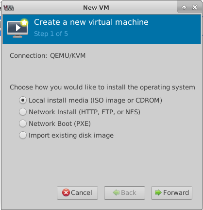

There are actually several choices to install an OS  - one of which is to import an existing disk image, which basically means 'copy some other KVM installation already performed'. We will get to that later, but for now, select 'Local install media' and then click 'Forward'.

You now have to either install from the CDROM / DVD or an ISO image. If you have an Operating system CD/DVD, you may use that, but usually (and especially if we are remote and cannot get to the CDROM) we just select the 'Use ISO image' selection:

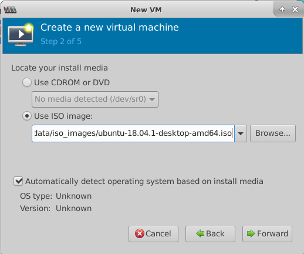

Browse for your ISO (or just type the location in directly) and click 'Forward'.

Now, we must assign the Memory (RAM, in MB) and number of CPUs that will be used by this VM:

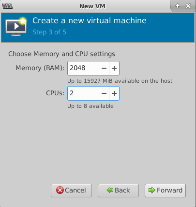

For small VMs running an Ubuntu server, I recommend 1024 MB of RAM and 1 CPU, but you are free to use what you wish. Just remember that other VMs - and the host itself - also need resources, so this is an exercise in max-min. 

You now must create a disk image (basically, a virtual hard drive). 

!> Whatever you select here will take up exactly that much space on your host's hard drive; so if you select 40 GB here - even if the actual VM needs 2 GB internally - it will still take 40 GB on your host's hard drive. Pick a size that makes sense, and don't make it unnecessarily large!

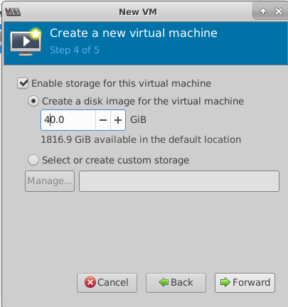

Either make your selection and click 'Forward', OR opt to save the back-end VM files to a specific location instead.

If you want to save the back-end VM files to a specific location, select the 'Select or create custom image' instead and then press the 'Manage...' button. Once there, select the directory you wish to install to (remember during the setup we made a [Virtual Machine Storage pool and named it 'VirtualMachines'](operating_systems/ubuntu/package_install/kvm_install?id=vitrual-machine-storage)? This is that). Select the 'VirtualMachines' filesystem directory (on the left).

Next, you will see the word 'Volumes' with a large green plus symbol next to it; click this 'plus' symbol and you will be prompted to add a storage volume:

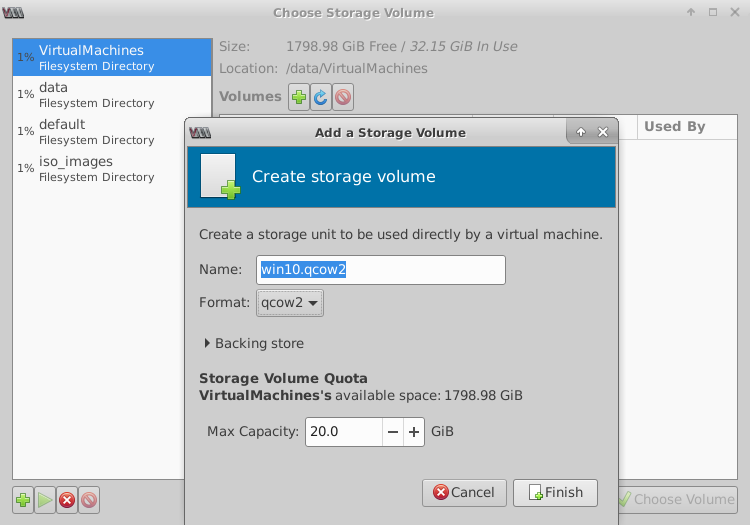

Name it (you can keep the format .qcow2, which is the default, or change it to something else if you wish), and then set the max capacity to whatever you like (again, remember this is the max size of the VM and it will take up exactly this much space on the host's hard drive). Click 'Finish'.

Select the .qcow2 file we just made and select 'Choose Volume':

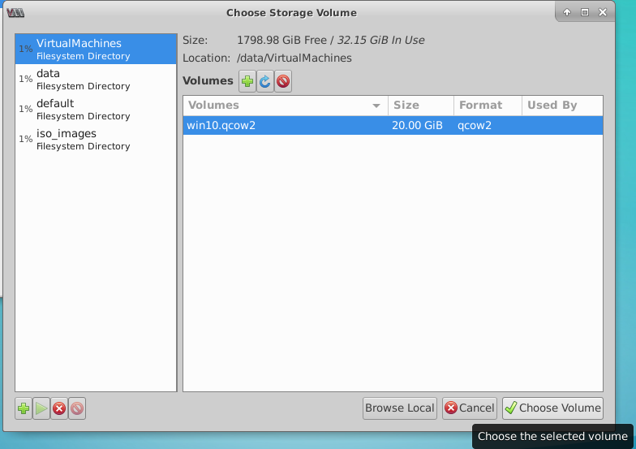


Moving on, here is the final screen of the install:

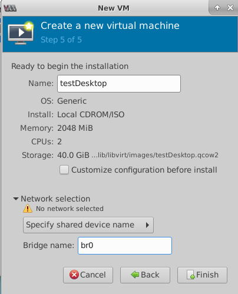

In the `Name` section is the server's name; this will display as this in the KVM GUI as well as when you type `hostname` on the VM itself.

The next section is critical - the Network section. If you leave this as NAT, it will be able to communicate with the internet but it will not be assigned an IP from your router, so no other host on the router will be able to communicate with this VM (outside of the hypervisor / host itself). Change this to 'Specify shared device name' and enter the interface name of the [bridge that you made](operating_systems/ubuntu/server_build?id=bridging) (if you do not know it but know there is a bridge, usually people name it 'br0'). Now, this VM will be able to directly interact with the router, so all hosts under the router can interact with your VM using SSH (or any other protocol).

Once you enter your bridge information, click 'Finish'. If you get a 'loading' screen of some sort (which varies with the OS you installed), it worked:

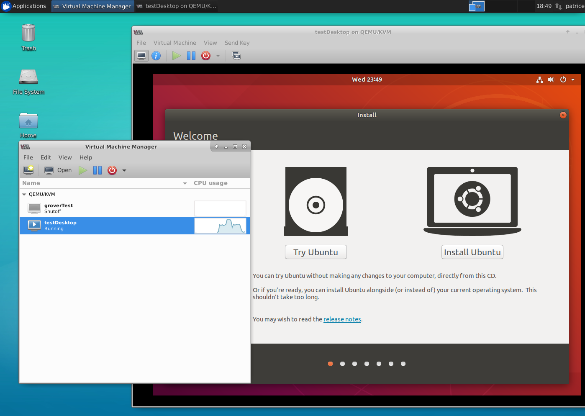

> The above shows the desktop version of Ubuntu installing in one screen, and the KVM GUI in another screen.

Now, simply follow the OS install instructions on the screen. You will be prompted to re-start when the install is complete, and when it is, you have a new, shiny VM installed and operational!

!> It can be difficult if you are saving to an external / mounted drive.

# New VM Quirks

There are a few oddities about the KVM GUI.

## Cant Move Mouse Or Keyboard

If you open a VM and your keyboard and mouse are _completely_ unresponsive inside the VM (meaning, you cannot type anything into any field inside the actual VM at all nor can you see the mouse moving), try Selecting Edit / Preferences in the KVM Virtual Machine Manager and then select the 'New VM' tab. Change the 'Graphics type' to 'VNC' and then press the 'X Close' button.


**<font size="4">If the VM is Not New</font>**

If the VM is not new, you may have to change the existing settings. In the main KVM Virtual Machine Manager, select the VM from the list and then select Edit/Virtual Machine Details:


You will now be in the VM's window; click View/Details to display all of the hardware / resource settings for the VM: 


Now select 'Display Spice' on the left, and then change the 'type' to 'VNC server':

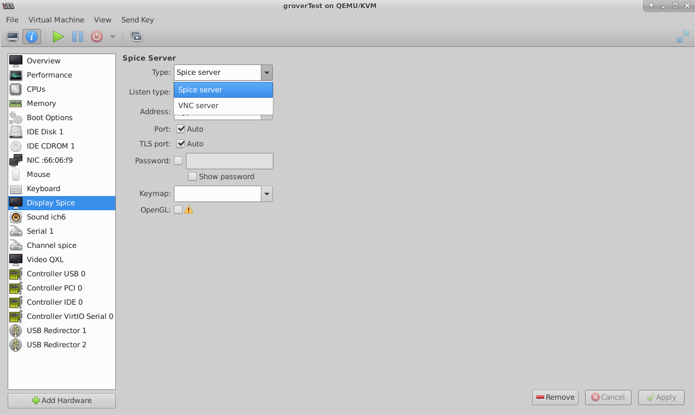

Click 'Apply' and exit.

!> Warning! Changing an existing VM may lock others out of the display, as you are changing display settings. Make sure you are not disrupting anyone else!

## Mouse Control Lost

Sometimes you may note that your mouse can no longer work outside of the VM window; if this happens, you will see a message about how to release the pointer in the header:

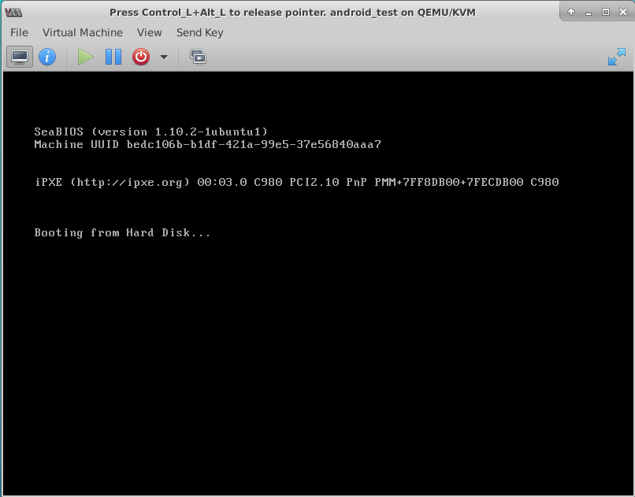

The header says Press the 'left control' and 'left alt' keys at the same time to release the pointer; if this is done, the mouse control is returned.

## VMs Stay Open 

If you close the window by clicking the 'X' in the upper right, the VM does not shut down or turn off:


> The red highlighted 'X' button doesn't shut down the VM.

The only way to power off a VM is by issuing a shutdown command in the VM itself, or by intentionally shutting it down in the Virtual Machine Manager.

If you want to view the running VM again, simply select the VM in the list and click the 'Open' button:

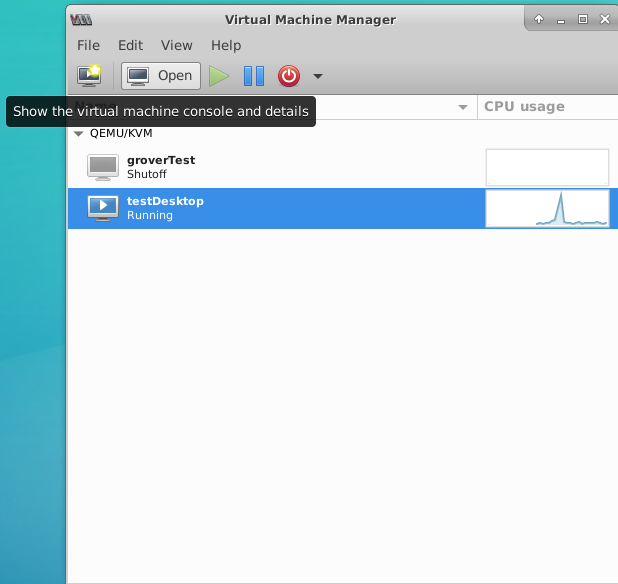

## No, Really, the VM Stays Open

Even if you close all windows and log out, the VM will still be up and running! Again, the only way to power off a VM is by issuing a shutdown command in the VM itself, or by intentionally shutting it down in the Virtual Machine Manager.

# Editing Hardware / Resource Settings

Its certainly possible to edit the hardware / resource settings of any VM, **provided the VM is powered off**. In the main KVM Virtual Machine Manager, select the VM from the list and then select Edit/Virtual Machine Details:


You will now be in the VM's window; click View/Details to display all of the hardware / resource settings for the VM: 


You are now in the basic Hardware / Resource Settings of the VM.

> Alternatively, you could have clicked on the blue-dot-with-the-white-'i' icon to open the basic Hardware / Resource Settings of the VM.

I will touch on the more important sections of the VM details below.

## Overview (KVM Settings)

The 'Overview' setting will allow you to set basic things, like the VM name and its description. 

Of note is the [UUID of the virtual machine](operating_systems/ubuntu/linux_notes?id=uuids) is displayed. Apparently it cannot be changed in the GUI, but it may be possible to edit this [in the configuration XML file](operating_systems/ubuntu/package_operations/kvm_notes?id=xml-configuration-files).

> If there is anything special to note about this VM, its best to record that information in the description.

## Changing the CPU Count

> When setting the CPU count, remember the host (and possibly other running VMs) need CPUs as well! KVM tells you how many CPUs are available _overall_ in the label 'Logical host CPUs' section.

To change the CPU count, click 'CPUs' on the right. You can also change additional settings, like the model or the CPU topology.

After you make changes, click 'Apply' to save your changes.

## Changing the RAM / Memory

> When setting the memory, remember the host (and possibly other running VMs) need memory as well! KVM tells you the total available memory _overall_ in the label 'Total host memory' section.

To change the Memory, click 'Memory' on the right. After you make changes, click 'Apply' to save your changes.

## Boot Options

Of note in this section is launching the VM when the host boots up; if 'Autostart' is checked, the VM will automatically start when the host starts!

You also have the option to have a boot menu in the VM, but usually this is not needed: usually if you want to install another OS or if there is a system error, under most circumstances you would just destroy the VM and restore it from a backup. That said, if this is not an option you can enable the boot menu here as well.

After you make changes, click 'Apply' to save your changes.

## IDE Disk 1

This is the 'hard drive' of the VM, which is actually a file on the host machine. This section tells you where this file resides on the host, as well as some other information that can be of minor use.

## IDE CDROM 1

Its possible to emulate putting a CDROM into a virtual tray, and have the VM see it as a CDROM in its own tray. To put a 'CD/DVD' into the tray, click the 'Connect' button next to 'Source Path'; a popup will appear:


!> The term 'image' here does **NOT** refer to a picture; rather, in this instance it refers to a 'state' of an OS or some other component.

You have two options: you can [select an .iso image](operating_systems/ubuntu/package_operations/kvm_notes?id=selecting-an-iso-image) and it will appear as a 'CD/DVD' in the VM, or you can actually use _the CDROM drive on the host_ as a passthrough (so, the VM will use the host's CDROM). If you select the 'Image Location' you will have to pick an image(read: not picture)/iso file, and if you pick 'Physical Device' you will have to select the CDROM drive on your host.

Also, sometimes it makes sense to 'remove' any .iso file from the virtual 'CDROM'; to do this, simply click the 'Disconnect' button next to the 'Source Path' label.

After you make changes, click 'Apply' to save your changes.

## NIC (Networking)

Its possible to change the networking options for the VM by selecting the 'NIC' on the left (note there may be some random numbers after NIC). Here is what the display looks like:

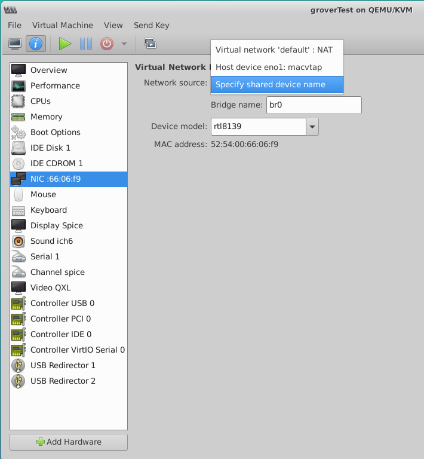

To select a new source, click 'Network source' and then select what you wish. The options are:
* The Virtual network default, NAT
 * If you select this, the VM will be able to interact with the internet, but it will be impossible for other hosts (or VMs not hosted by the host) to contact the VM directly.
* Your ethernet port
 * This will act like NAT; if bridging or bonding is active on the host server, choosing this may render your VM unable to connect to the internet at all.
* 'Specify shared device name'
 * Under most circumstances, this is the selection you will pick.
 * This option allows you to input your bridge (or bond) interface identifier.
 * To find the interface that you need to use, you can read [this on setting up a static IP](operating_systems/ubuntu/server_build?id=setting-up-the-static-ip) (note this is just showing you how to find the network interface, don't set up a static IP now), and in this section it tells you how to identify the needed network interface with an `ifconfig -a` command. In general, you want to use the network interface that has an 'inet' address that is not 127.0.0.1 (and, in most cases, will be a bridge named 'brX' where 'X' is an integer; in most cases its br0).

You can change the 'Device model' here too, but if you are unsure of what this is, leave it alone.

Finally, the [MAC address](operating_systems/ubuntu/linux_notes?id=mac-addresses) of the VM's virtual NIC is displayed. Apparently it cannot be changed in the GUI, but it may be possible to edit this [in the configuration XML file](operating_systems/ubuntu/package_operations/kvm_notes?id=xml-configuration-files).

After you make changes, click 'Apply' to save your changes.

## Adding Hardware

Apparently, its possible to add additional hardware to the VM; this is beyond the scope of this tutorial (outside of sharing a host folder with the VM), but if you want to investigate this, press the 'Add Hardware' button below the listing of settings.

## Share Host Folder With VM

> Instructions for this section were found [here](https://netsecsa.com/2018/06/16/how-to-sharing-directories-between-kvm-host-and-guest/).

Its possible to share a folder on the host with the VM; to do so, open the [hardware / resource settings tab](operating_systems/ubuntu/package_operations/kvm_notes?id=editing-hardware-resource-settings) and click the 'Add Hardware' button under the list of components on the left:


* Set the 'Driver' to 'Default'
* Set the 'Mode' to 'Mapped'
* For the 'Target Path', just pick a name that means something to this folder (I just picked 'mylabel', but you can pick any word).
* For the 'Source path', pick a folder on the host machine (I picked /data/vm_shared).

!> Whatever host folder you pick, it MUST be owned by `libvirt-qemu:kvm` ; for me, I had to run `chmod libvirt-qemu:kvm /data/vm_shared`. Alternatively, [you can simply assign libvirt-qemu to a group and set that group owner for the host folder](operating_systems/ubuntu/package_operations/kvm_notes?id=privileges-for-kvm).

From here, the setup depends on your OS in the VM.

**<font size="4">Ubuntu VMs</font>**

Steps for an Ubuntu VM (all steps performed in this subsection are performed on the VM itself, not the host):

1\. [Become root](/operating_systems/ubuntu/linux_notes?id=becoming-root) on the VM.

2\. Add the following to `/etc/modules`:
> loop <br>
> virtio <br>
> 9p <br>
> 9pnet <br>
> 9pnet_virtio

3\. Load those modules by running this command (on the VM):
```
service kmod start
```

4\. Pick a directory on the VM you want to use as a mount point (must have nothing in it); I pick `/mnt/from_host`:
```
mount mylabel /mnt/from_host -t 9p -o trans=virtio
```
* /mnt/from_host is the directory on the VM itself where we want the mount to appear.
* 'mylabel' is the 'Target Path' name you picked when setting up the Filesystem in this subsection.

5\. If you wish to automount this every time, enter the following into `/etc/fstab` on the VM:
```
mylabel /mnt/from_host            9p             trans=virtio    0       0
```

> If you have any issues, please see [this article](https://netsecsa.com/2018/06/16/how-to-sharing-directories-between-kvm-host-and-guest/) to try to resolve them.

# Back-end Files

Most of the work we have done is in the GUI, but now its time to see where all of this information is stored on the host.

The short story is each VM has at least two files: an [image file](operating_systems/ubuntu/package_install/kvm_install?id=image-files) that represents its hard drive (that is gigs in size) [which is stored here](operating_systems/ubuntu/package_operations/kvm_notes?id=base-vm-directory) and an XML configuration file [which is stored here](operating_systems/ubuntu/package_operations/kvm_notes?id=xml-configuration-files).

## Base VM Directory

The default directory that stores the VM images (aka the .qcow2 file that will potentially be gigs in size) is `/var/lib/libvirt/images/`; that said, if you set up
the [Virtual Machine Storage pool](operating_systems/ubuntu/package_install/kvm_install?id=vitrual-machine-storage) (which we named 'VirtualMachines'), you have the option of saving there instead [when you created the VM](operating_systems/ubuntu/package_operations/kvm_notes?id=creating-a-vm-in-kvm-gui).

## Image Files

The image file is the file that acts like the 'hard drive' for the VM; its located in the [base VM directory](operating_systems/ubuntu/package_operations/kvm_notes?id=base-vm-directory). By default, this file has an extension of .qcow2, but there are several other extensions it could be (if, for example, we imported a VM's image file from another hypervisor package like VirtualBox).

## XML Configuration Files

Each VM has an XML configuration file in `/etc/libvirt/qemu`; this file defines all of the possible configuration fields for the VM, specifically hardware settings.

You can also interface with this file by finding the name of the guest VM with `virsh list --all` and then opening the XML with `virsh edit NAMEOFGUEST`.

> Anything that you can change in [editing the VM in the GUI](operating_systems/ubuntu/package_operations/kvm_notes?id=editing-hardware-resource-settings) you can change by editing this XML file.

<span>  </span>
> For your reference, KVM keeps an XML configuration file in `/var/run/libvirt/qemu`, but _only when the VM is running_; this is the in-memory configuration file, and editing it is pointless. This is the XML file you get when you perform a `virsh dumpxml`, however.


# Additional 3rd Party Tools

These tools are additional tools that work outside of KVM, but can be used on its images regardless.

## libguestfs-tools

[libguestfs](http://libguestfs.org/) is a package that allows you to interact with a VM's filesystem if you can't get into the VM otherwise - in other words, this tool allows you to mount the VM's 'hard drive' / filesystem to the host, so the host can directly intact with the files that are in the VM as if those files were in the host's directory structure.

> `python-guestfs` seems to be supporting tools for `libguestfs-tools`, which extends operability to Python; [see here](http://manpages.ubuntu.com/manpages/xenial/man3/guestfs-python.3.html) for examples in Python.
<span> </span>

> Its probably best to make sure both packages `python-guestfs` and `libguestfs-tools` are installed.

!> Do NOT use these tools with live VMs! You can potentially corrupt the VM permanently!

**<font size="4">Options in libguestfs-tools</font>**

| Option | Meaning | Notes |
| ------ | ------- | ----- |
| -a | Add image | The file that follows is the image you are mounting. |
| -i | Inspector | Attempts to mount the directories as they were laid out in the VM. |
| -o allow_other | Allow Others | Allow others to see the filesystem. |
| -o uid=N -o gid=N | Set Owner | Sets the owners to the files in the VM to that of the user uid=N (as defined in the host) and belonging to group gid=N (as defined in the host). |
| --ro | Read-Only | You should never use libguestfs-tools on a working VM, but if you must, use -ro to minimize the chance of permanent corruption. |
| -r | Read-Only | Same as -ro. |
| -w | Write | Opens the filesystem for writing. |

**<font size="4">libguestfs-tools Setup and Example</font>**

Basic Setup:
```
/usr/bin/guestmount  -a <Image_File_to_be_Mounted> -i -r <DIRECTORY> 
```

An example:
```
guestmount -a guest.img -i -r /mnt/VM_Directory
```
* Mounts image 'guest.img'
* Mounts root of VM to host directory '/mnt/VM_Directory'
* (-i) Mounts directories as they were in the VM.
* (-r) means the files mounted are read-only.

**<font size="4">Unmounting Directory</font>**

When you are done, you should always unmount the VM filesystem:
```
guestunmount /mnt/VM_Directory
```

## Virtual-top

Virtual-top is similar to htop, but for KVM.

An example usage is:
```
3 domains, 1 active, 1 running, 0 sleeping, 0 paused, 2 inactive D:0 O:0 X:0
CPU: 0.0%  Mem: 2048 MB (2048 MB by guests)

   ID S RDRQ WRRQ RXBY TXBY %CPU %MEM    TIME   NAME
    1 R    0    0  801    0  0.0 12.0   4:22.74 rickyTest
    -                                           (android_test)
    -                                           (testDesktop)

```

As it can be seen, it shows basic utilization stats on the VMs on the machine (rickyTest is running, the other two are not).

To exit gracefully, hit the `q` button on the keyboard.

# Setting Static IP in VM

Its possible to set up a static IP inside your VM, and its done almost exactly as its done in a host.

The one definite difference will be the network interface; for VMs its usually `ens3` but there is no guarantee (you will have to check).

To set up a static IP for Ubuntu 16.04 and before, [use these instructions](operating_systems/ubuntu/server_build?id=static-ip-ubuntu-1604-and-below) with one variant: insert the line <br>
`allow-hotplug NETWORK_INTERFACE_HERE` before the line `iface NETWORK_INTERFACE_HERE inet static` .

To set up a static IP for Ubuntu 17.10 and above, [use these instructions](operating_systems/ubuntu/server_build?id=static-ip-ubuntu-1710-and-above).

# Changing Unique Identifiers

!> This must be done from the host and **before** the VM is defined in KVM! If its already defined, you might as well [undefine](operating_systems/ubuntu/package_operations/kvm_notes?id=remove-vm-from-kvm-manager) it right now, as KVM sets these in stone when you use `define`.

> Don't worry about these identifiers being random numbers - it is completely fine.

When creating a new VM, the VM's unique identifiers are randomized; cloning the VM will randomize them too. However, manually loading copied files may result in collisions. To combat this, we will change the unique identifiers _before_ we define the VM.

Steps:

1\. You will now have to make a new [UUID](operating_systems/ubuntu/linux_notes?id=uuids) for the new VM. Run `uuidgen` to get a new random UUID, then edit the new VM's [XML configuration file](operating_systems/ubuntu/package_operations/kvm_notes?id=xml-configuration-files) and replace the UUID with this new one.

The UUID Will look something like this in the XML file:
```
<uuid>bdec97b1-79ea-4d71-86a5-efece1c399e7</uuid>
```
Replace the UUID within the UUID tags.

2\. You will now need to generate a new [MAC address](operating_systems/ubuntu/linux_notes?id=mac-addresses) to identify the NIC; the first octet should be `02` to indicate 'this is locally assigned and not a vendor-provided MAC address'; the remaining 5 octets need to be randomized. This code can generate that on the command line (found [here](https://serverfault.com/questions/299556/how-to-generate-a-random-mac-address-from-the-linux-command-line)): 
```
tr -dc A-F0-9 < /dev/urandom | head -c 10 | sed -r 's/(..)/\1:/g;s/:$//;s/^/02:/'
```
 * Edit the new VM's [XML configuration file](operating_systems/ubuntu/package_operations/kvm_notes?id=xml-configuration-files) and replace the MAC address with this new one.

The MAC address Will look something like this in the XML file:
```
<mac address='52:54:03:65:06:f9'/>
```
Replace the MAC address within the mac address tags.

---

# Console Commands

These commands can be run on the host to interact with the VMs.

## virsh Help

To get help on virsh, use the command `virsh help`

## Listing The VMs

To list the VMs, run the command:
```
virsh list --all
```

An example output is:
```
	 Id    Name                           State
	----------------------------------------------------
	 8     Ubuntu-16.04-Server-VM3        running
	 9     Ubuntu-16.04-Server-VM2        running
	 10    Ubuntu-16.04-Server-VM         shut off
```

As it can be seen, 3 basic pieces of information are given:
* The ID of the VM
* The name of the VM
* Its current state (is it running, is it shut off, etc)

> You can also run `virsh -c qemu:///system list` to achieve this same effect.

## Starting the VM

To start a VM, either get its name from [the listing](operating_systems/ubuntu/package_operations/kvm_notes?id=listing-the-vms) and run this:
```
virsh start NAME_OF_THE_VM
```

## Reboot the VM (From Host)

To reboot a VM, either get its name or ID from [the listing](operating_systems/ubuntu/package_operations/kvm_notes?id=listing-the-vms) and run either this (from the host):
```
virsh reboot NAME_OF_THE_VM
```

Or

```
virsh reboot ID_OF_THE_VM
```

## Stopping the VM (Gracefully, From Host)

To gracefully shut down a VM, either get its name or ID from [the listing](operating_systems/ubuntu/package_operations/kvm_notes?id=listing-the-vms) and run either this (from the host):
```
virsh shutdown NAME_OF_THE_VM
```

Or

```
virsh shutdown ID_OF_THE_VM
```

## Stopping the VM (Forcefully, From Host)

To forcefully shut down a VM, either get its name or ID from [the listing](operating_systems/ubuntu/package_operations/kvm_notes?id=listing-the-vms) and run either this (from the host):
```
virsh destroy NAME_OF_THE_VM
```

Or

```
virsh destroy ID_OF_THE_VM
```

## Check the VMs Status (From the Host)

To check the VM's status, you can either run `virsh list --all` or `virt-top`.

## Add a VM To KVM Manager

The actual command is `virsh define`, but please see [the more detailed explanation](operating_systems/ubuntu/package_operations/kvm_notes?id=adding-existing-imagexml-file-to-kvm-manager).

## Remove VM From KVM Manager

!> Careful! using `virsh undefine` on a VM will completely delete the VM's [XML configuration file](operating_systems/ubuntu/package_operations/kvm_notes?id=xml-configuration-files)! The [image file](operating_systems/ubuntu/package_operations/kvm_notes?id=image-files) will remain intact.

To completely remove a VM from KVM's management package, get its name from [the listing](operating_systems/ubuntu/package_operations/kvm_notes?id=listing-the-vms) and run the following command:
```
virsh undefine NAME_OF_THE_VM
```

## Cloning a VM

!> A VM MUST [be shut down](operating_systems/ubuntu/package_operations/kvm_notes?id=stopping-the-vm-gracefully-from-host) before it can be cloned!

There is a way to quickly clone / copy a VM with the `virt-clone` command. The command creates a clone with a different UUID and MAC address, so there is no need to change these; that said, it does **not** [change the hostname](operating_systems/ubuntu/linux_notes?id=changing-the-hostname) or [change the static IP](operating_systems/ubuntu/server_build?id=setting-up-the-static-ip), so if there is a static IP on the original VM you cloned - and then you bring that clone online - there will be instant collisions. If the VM you are cloning has a static IP or if the hostname matters, you will have to [change the hostname](operating_systems/ubuntu/linux_notes?id=changing-the-hostname) and [change the static IP](operating_systems/ubuntu/server_build?id=setting-up-the-static-ip).

The actual clone command is:
```
virt-clone --original NAME_OF_THE_ORIGINAL_VM --name NAME_OF_THE_CLONED_VM --auto-clone
```
* `virt-clone` is the command
* `--original NAME_OF_THE_ORIGINAL_VM` tells us which VM is being cloned.
* `--name NAME_OF_THE_CLONED_VM` tells us the name of the new cloned VM.
* `--auto-clone` tells us just to make a new name for the image file
 * If we wanted to actually name the image file, we could say `--file /path/to/image/Newfile.qcow2` instead of `--auto-clone`

**<font size="4">Steps (for Cloned Guests with dynamic IPs):</font>**

1\. [Shut down the VM to be cloned](operating_systems/ubuntu/package_operations/kvm_notes?id=stopping-the-vm-gracefully-from-host).

2\. Clone the VM (with the clone command above).

3\. [Start the original and new cloned VMs](operating_systems/ubuntu/package_operations/kvm_notes?id=starting-the-vm).


**<font size="4">Steps (for Cloned Guests with static IPs):</font>**


1\. [Shut down the VM to be cloned](operating_systems/ubuntu/package_operations/kvm_notes?id=stopping-the-vm-gracefully-from-host).

2\. Clone the VM (with the clone command above).

3\. Just before you initially [start the VM](operating_systems/ubuntu/package_operations/kvm_notes?id=starting-the-vm), set the NIC [Network source](operating_systems/ubuntu/package_operations/kvm_notes?id=nic-networking) to "Virtual network 'default': NAT". This will ensure that this VM does not try to interface with the outside world as you change its hostname and IP.

4\. [Start the VM](operating_systems/ubuntu/package_operations/kvm_notes?id=starting-the-vm).

5\. Identify the `hostname` of the old/copied VM, and identify the new `hostname`; go inside the VM itself and [change the hostname](operating_systems/ubuntu/linux_notes?id=changing-the-hostname).
 * There will most likely be an associated IP of the hostname you changed in `/etc/hosts`, so you will have to change this old IP to the new IP of the VM.

6\. If this server is running MySQL, you must [become root](/operating_systems/ubuntu/linux_notes?id=becoming-root) on the VM, and then edit the [mysqld.cnf file](databases/mysql/mysql_install?id=mysql-master-settings-mysqldcnf) by finding the line that says `bind-address` and changing it to the new VM's IP.

7\. If there is a static IP to set, [set the static IP now](operating_systems/ubuntu/server_build?id=setting-up-the-static-ip).

8\. [Shut-down the VM](operating_systems/ubuntu/package_operations/kvm_notes?id=stopping-the-vm-gracefully-from-host).

9\. Set the NIC [Network source](operating_systems/ubuntu/package_operations/kvm_notes?id=nic-networking) of the VM to 'Specify shared device name' and enter your bridge name (most likely br0).

10\. [Re-start the VM](operating_systems/ubuntu/package_operations/kvm_notes?id=starting-the-vm). Its now operational and ready!

## Enabling the VM Console

> Some of these instructions came from [here](https://www.jaredlog.com/?p=1484).

!> When you are in the VM console, the only way to exit back to the host's terminal is by pressing `Ctrl+]` at the same time (thats `Ctrl` and `]`).

If you are on the host server and wish to directly console into a running VM, you can do so by running the command:
```
virsh console NAME_OF_THE_VM
```

However, the VM itself needs to have its output redirected. To do this, you will have to run the commands (as root in the VM):
```
systemctl enable serial-getty@ttyS0.service
systemctl start serial-getty@ttyS0.service
```

Unfortunately there is a conundrum: it's impossible to set this without logging in to the VM using other methods. There is a work-around, though!

Steps:

1\. [Shut-down the VM](operating_systems/ubuntu/package_operations/kvm_notes?id=stopping-the-vm-gracefully-from-host), 

2\. Use [guestmount](operating_systems/ubuntu/package_operations/kvm_notes?id=libguestfs-tools) to mount the VM's filesystem (I will mount it to `/data/vm_mount` for this demonstration).

!> Do NOT forget to mount it in write ('-w', **not** '-r') mode!

3\. Edit the VM's main crontab: 
```
vi /data/vm_mount/etc/crontab
```

4\. At the bottom of the file, paste the following:
> @reboot root systemctl enable serial-getty@ttyS0.service <br>
> @reboot root systemctl start serial-getty@ttyS0.service

5\. Unmount the VM filesystem:
```
guestunmount /mnt/VM_Directory
```

6\. [Re-start the VM](operating_systems/ubuntu/package_operations/kvm_notes?id=starting-the-vm).

7\. The console will now work but we now need to set it up so that the boot messages are displayed on the screen. To do this, Log into the VM itself and [become root](/operating_systems/ubuntu/linux_notes?id=becoming-root) (at this point you can console in with `virsh console NAME_OF_THE_VM`).

8\. Edit `/etc/default/grub` to tell grub2 to output the kernel messages to the serial console:
```
vi /etc/default/grub
```

9\. Find the line `GRUB_CMDLINE_LINUX_DEFAULT="quiet splash"` (or whatever line starts with `GRUB_CMDLINE_LINUX_DEFAULT=`) and comment it out with a #.

10\. Under that line, paste this line in:
> GRUB_CMDLINE_LINUX_DEFAULT="console=ttyS0"

11\. Save the file and exit.

12\. Update grub2 with the command:
```
update-grub2
```

Now, you can type `virsh console NAME_OF_THE_VM` on the host command line and it will enter the VM's console, and you will _also_ see the kernel messages during the VM boot.


## Other Command Line Commands

There are other command line commands mentioned in these notes (although they are part of larger concepts, so they are mentioned elsewhere instead):
* The command that [starts a brand new VM without an OS attached](operating_systems/ubuntu/package_operations/kvm_notes?id=starting-new-vm-with-no-os) using `virt-install`.
* The command that [utilizes a client desktop to run a GUI](operating_systems/ubuntu/package_operations/kvm_notes?id=connecting-to-brand-new-vm-using-client-based-gui) using `virt-viewer`. This is a good option if you do not want to install even a lightweight desktop GUI on your server.
* Additional [3rd party tools](operating_systems/ubuntu/package_operations/kvm_notes?id=additional-3rd-party-tools).

---

# Adding Existing Image/XML File to KVM Manager

If you have a VM's [XML configuration file](operating_systems/ubuntu/package_operations/kvm_notes?id=xml-configuration-files) and its [image file](operating_systems/ubuntu/package_operations/kvm_notes?id=image-files), you can add it to the KVM manager.

Before this is done, though, you must do a few things.

## This is Not a Restoral (Duplicate a VM)

If this is not a restoral (that is to say, this VM has never existed before but you are using another VM's XML configuration file and image to get a new VM up and running), follow these instructions to add it to the KVM manager.

1\. [Change the unique identifiers](operating_systems/ubuntu/package_operations/kvm_notes?id=changing-unique-identifiers).

!> If you forget to change the unique identifiers, you might as well [undefine](operating_systems/ubuntu/package_operations/kvm_notes?id=remove-vm-from-kvm-manager) it right now, as KVM sets these in stone when you use `define`.

2\. Find the `name` tag in the [XML configuration file](operating_systems/ubuntu/package_operations/kvm_notes?id=xml-configuration-files) and change it; it cannot match the name of any other VM built in KVM. The 'name' tag looks like this in the XML file:
```
<name>IAmAPirateARRRRRRRRR</name>
```

3\. Find the `source file` tag in the [XML configuration file](operating_systems/ubuntu/package_operations/kvm_notes?id=xml-configuration-files) and change it to the [image file](operating_systems/ubuntu/package_operations/kvm_notes?id=image-files) you are using (and is not associated with any running VM). The 'source file' tag looks like this in the XML file:
```
<source file='/var/lib/libvirt/images/pirate.qcow2'/>
```

4\. Now that the unique identifiers, the name, and the source file has been changed, its time to define the VM officially in KVM! If the path to your new [XML configuration file](operating_systems/ubuntu/package_operations/kvm_notes?id=xml-configuration-files) was /data/VirtualMachines/pirateparrot.xml, you would define the VM as:
```
virsh define /data/VirtualMachines/pirateparrot.xml
```

> The VM is now defined and visible in the KVM manager!

5\. Just before you initially [start the VM](operating_systems/ubuntu/package_operations/kvm_notes?id=starting-the-vm), set the NIC [Network source](operating_systems/ubuntu/package_operations/kvm_notes?id=nic-networking) to "Virtual network 'default': NAT". This will ensure that this VM does not try to interface with the outside world as you change its hostname and IP.

6\. [Start the VM](operating_systems/ubuntu/package_operations/kvm_notes?id=starting-the-vm).

7\. Identify the `hostname` of the old/copied VM, and identify the new `hostname`; go inside the VM itself and [change the hostname](operating_systems/ubuntu/linux_notes?id=changing-the-hostname).
 * There will most likely be an associated IP of the hostname you changed in `/etc/hosts`, so you will have to change this old IP to the new IP of the VM.

8\. If this server is running MySQL, you must [become root](/operating_systems/ubuntu/linux_notes?id=becoming-root) on the VM, and then edit the [mysqld.cnf file](databases/mysql/mysql_install?id=mysql-master-settings-mysqldcnf) by finding the line that says `bind-address` and changing it to the new VM's IP.

9\. If there is a static IP to set, [set the static IP now](operating_systems/ubuntu/server_build?id=setting-up-the-static-ip).

10\. [Shut-down the VM](operating_systems/ubuntu/package_operations/kvm_notes?id=stopping-the-vm-gracefully-from-host).

11\. Set the NIC [Network source](operating_systems/ubuntu/package_operations/kvm_notes?id=nic-networking) of the VM to 'Specify shared device name' and enter your bridge name (most likely br0).

12\. [Re-start the VM](operating_systems/ubuntu/package_operations/kvm_notes?id=starting-the-vm). Its now operational and ready!

## This is a Restoral

If this is just a restoral (that is to say, this VM previously failed, the old VM is toast, and you are simply installing its backup) OR you are just moving the VM from one host to another (and it will not run on both concurrently), follow these instructions to add it to the KVM manager.

1\. Find the `name` tag in the [XML configuration file](operating_systems/ubuntu/package_operations/kvm_notes?id=xml-configuration-files) and make sure its correct. The 'name' tag looks like this in the XML file:
```
<name>IAmAPirateARRRRRRRRR</name>
```

2\. Find the `source file` tag in the [XML configuration file](operating_systems/ubuntu/package_operations/kvm_notes?id=xml-configuration-files) and make sure its correctly pointing to the desired [image file](operating_systems/ubuntu/package_operations/kvm_notes?id=image-files). The 'source file' tag looks like this in the XML file:
```
<source file='/var/lib/libvirt/images/pirate.qcow2'/>
```

3\. Its time to define the VM officially in KVM! If the path to your [XML configuration file](operating_systems/ubuntu/package_operations/kvm_notes?id=xml-configuration-files) was /data/VirtualMachines/pirateparrot.xml, you would define the VM as:
```
virsh define /data/VirtualMachines/pirateparrot.xml
```

> The VM is now defined and visible in the KVM manager!

4\. [Start the VM](operating_systems/ubuntu/package_operations/kvm_notes?id=starting-the-vm).

---

# Backing up a VM

Steps:

1\. Get the VMs name from [the listing](operating_systems/ubuntu/package_operations/kvm_notes?id=listing-the-vms).

2\. Check all images that are tied to the VM with the command:
```
virsh domblklist NAME_OF_THE_VM
```

Something like the following will be displayed:
```
Target     Source
------------------------------------------------
hda        /var/lib/libvirt/images/pirate.qcow2
hdb        -
```

3\. [Shut-down the VM](operating_systems/ubuntu/package_operations/kvm_notes?id=stopping-the-vm-gracefully-from-host).

4\. Back up the [XML configuration file](operating_systems/ubuntu/package_operations/kvm_notes?id=xml-configuration-files). If you wish, you could probably just directly copy this file; that said, you can also get it by running:
```
virsh dumpxml NAME_OF_THE_VM > /path/to/your/backup/directory/backup.MMDDYYYYHHMM.xml
```

5\. Back up the [image file](operating_systems/ubuntu/package_operations/kvm_notes?id=image-files). You found the location of these files in step 2, so just copy them.

At this point, you can either simply back up the configuration and image files or you can [restore the VM elsewhere](operating_systems/ubuntu/package_operations/kvm_notes?id=adding-existing-imagexml-file-to-kvm-manager).

---

# XML Example

The below is an XML configuration example from an Ubuntu 18.04 host for an Ubuntu 18.04 guest VM. Its possible to make most configuration changes in the XML file, provided the VM is not currently running.

```
<!--
WARNING: THIS IS AN AUTO-GENERATED FILE. CHANGES TO IT ARE LIKELY TO BE
OVERWRITTEN AND LOST. Changes to this xml configuration should be made using:
  virsh edit pirate
or other application using the libvirt API.
-->

<domain type='kvm'>
  <name>pirate</name>
  <uuid>21583ef8-4762-43a8-a874-5431779ef5df</uuid>
  <memory unit='KiB'>2097152</memory>
  <currentMemory unit='KiB'>2097152</currentMemory>
  <vcpu placement='static'>2</vcpu>
  <os>
    <type arch='x86_64' machine='pc-i440fx-bionic'>hvm</type>
    <boot dev='hd'/>
  </os>
  <features>
    <acpi/>
    <apic/>
    <vmport state='off'/>
  </features>
  <cpu mode='custom' match='exact' check='partial'>
    <model fallback='allow'>IvyBridge-IBRS</model>
  </cpu>
  <clock offset='utc'>
    <timer name='rtc' tickpolicy='catchup'/>
    <timer name='pit' tickpolicy='delay'/>
    <timer name='hpet' present='no'/>
  </clock>
  <on_poweroff>destroy</on_poweroff>
  <on_reboot>restart</on_reboot>
  <on_crash>destroy</on_crash>
  <pm>
    <suspend-to-mem enabled='no'/>
    <suspend-to-disk enabled='no'/>
  </pm>
  <devices>
    <emulator>/usr/bin/kvm-spice</emulator>
    <disk type='file' device='disk'>
      <driver name='qemu' type='qcow2'/>
      <source file='/var/lib/libvirt/images/pirate.qcow2'/>
      <target dev='hda' bus='ide'/>
      <address type='drive' controller='0' bus='0' target='0' unit='0'/>
    </disk>
    <disk type='file' device='cdrom'>
      <driver name='qemu' type='raw'/>
      <target dev='hdb' bus='ide'/>
      <readonly/>
      <address type='drive' controller='0' bus='0' target='0' unit='1'/>
    </disk>
    <controller type='usb' index='0' model='ich9-ehci1'>
      <address type='pci' domain='0x0000' bus='0x00' slot='0x05' function='0x7'/>
    </controller>
    <controller type='usb' index='0' model='ich9-uhci1'>
      <master startport='0'/>
      <address type='pci' domain='0x0000' bus='0x00' slot='0x05' function='0x0' multifunction='on'/>
    </controller>
    <controller type='usb' index='0' model='ich9-uhci2'>
      <master startport='2'/>
      <address type='pci' domain='0x0000' bus='0x00' slot='0x05' function='0x1'/>
    </controller>
    <controller type='usb' index='0' model='ich9-uhci3'>
      <master startport='4'/>
      <address type='pci' domain='0x0000' bus='0x00' slot='0x05' function='0x2'/>
    </controller>
    <controller type='pci' index='0' model='pci-root'/>
    <controller type='ide' index='0'>
      <address type='pci' domain='0x0000' bus='0x00' slot='0x01' function='0x1'/>
    </controller>
    <controller type='virtio-serial' index='0'>
      <address type='pci' domain='0x0000' bus='0x00' slot='0x06' function='0x0'/>
    </controller>
    <interface type='bridge'>
      <mac address='02:a4:7f:da:70:f5'/>
      <source bridge='br0'/>
      <model type='rtl8139'/>
      <address type='pci' domain='0x0000' bus='0x00' slot='0x03' function='0x0'/>
    </interface>
    <serial type='pty'>
      <target type='isa-serial' port='0'>
        <model name='isa-serial'/>
      </target>
    </serial>
    <console type='pty'>
      <target type='serial' port='0'/>
    </console>
    <channel type='spicevmc'>
      <target type='virtio' name='com.redhat.spice.0'/>
      <address type='virtio-serial' controller='0' bus='0' port='1'/>
    </channel>
    <input type='mouse' bus='ps2'/>
    <input type='keyboard' bus='ps2'/>
    <graphics type='spice' autoport='yes'>
      <listen type='address'/>
      <image compression='off'/>
    </graphics>
    <sound model='ich6'>
      <address type='pci' domain='0x0000' bus='0x00' slot='0x04' function='0x0'/>
    </sound>
    <video>
      <model type='qxl' ram='65536' vram='65536' vgamem='16384' heads='1' primary='yes'/>
      <address type='pci' domain='0x0000' bus='0x00' slot='0x02' function='0x0'/>
    </video>
    <redirdev bus='usb' type='spicevmc'>
      <address type='usb' bus='0' port='1'/>
    </redirdev>
    <redirdev bus='usb' type='spicevmc'>
      <address type='usb' bus='0' port='2'/>
    </redirdev>
    <memballoon model='virtio'>
      <address type='pci' domain='0x0000' bus='0x00' slot='0x07' function='0x0'/>
    </memballoon>
  </devices>
</domain>
```

# Using KVM Without GUI On Server

> I found the bulk of this information from [netsecsa.com](https://netsecsa.com/2018/05/12/setup-headless-virtualization-server-using-qemu-kvm-in-ubuntu-18-04).

Its possible to get around not having the KVM GUI; that is to say, you may not have to install `virt-manager` on the server, and you can bypass having to [launch the KVM GUI remotely](operating_systems/ubuntu/package_operations/kvm_notes?id=launching-kvm-gui) and you can even get around [having to create a new VM in the GUI](operating_systems/ubuntu/package_operations/kvm_notes?id=creating-a-vm-in-kvm-gui). The tradeoff is you **will** need a local desktop / machine that can run a GUI, and right now, I only know of how to do this with a Linux Desktop (I am using Ubuntu Desktop 18.04 but it can be any Linux desktop). 

## Server Packages Required (No Server GUI)

In addition to [all of these packages](operating_systems/ubuntu/package_install/kvm_install?id=kvm-basic-install-steps), you will also need `ssh`. On the server, [become root](/operating_systems/ubuntu/linux_notes?id=becoming-root), [update all packages](/operating_systems/ubuntu/linux_notes?id=updating-upgrading-all-packages), and then:
```
apt-get install ssh
```

> You may not need `virt-manager`, but I have never tried this without it (I believe I was able to completely sidestep the usage of `virt-manager`, but I didn't have another server on hand to test this without `virt-manager` installed to be fully sure).

## Client Packages Required (No Server GUI)

You will need the following installed on your client / Linux desktop (i.e. from the desktop that you will be launching the alternate GUI); On the client, [become root](/operating_systems/ubuntu/linux_notes?id=becoming-root), [update all packages](/operating_systems/ubuntu/linux_notes?id=updating-upgrading-all-packages), and then:
```
apt-get install ssh
apt-get install virt-viewer
```

You will also need an [SSH key](operating_systems/ubuntu/linux_notes?id=ssh) set up on the desktop to log into the remote server without a password (as the password, for whatever reason, will absolutely not work for me using `virt-viewer`)

## Starting New VM With No OS

Now you will have to start a brand-new VM (i.e. one that is not defined) from the server.

Steps:

1\. Open a remote SSH connection to the server.

2\. [Become root](/operating_systems/ubuntu/linux_notes?id=becoming-root) on the server.

3\. Download an [.iso image](operating_systems/ubuntu/package_operations/kvm_notes?id=selecting-an-iso-image) on the server using `wget` or getting the .iso elsewhere and uploading with [scp](operating_systems/ubuntu/linux_notes?id=pushing-pulling-files-with-scp).

4\. Run the following command:
```
sudo virt-install --name myshinynewvm --ram=1028 --vcpus=1 --cpu host --hvm --disk path=/data/VirtualMachines/myshinynewvm.qcow2,size=20 --cdrom /data/iso_images/ubuntu-18.04.1-live-server-amd64.iso  --graphics spice
```
* `--name myshinynewvm` names the new VM in KVM
* `--ram=1028` sets the RAM / memory (in MB)
* `--vcpus=1` sets the number of virtual CPUs to be used
* `--cpu host` optimizes the CPU properties for the VM by exposing the host's CPU configuration to the VM.
* `--hvm` requests full hardware virtualization.
* `--disk path=/data/VirtualMachines/myshinynewvm.qcow2,size=20` defines the [image](operating_systems/ubuntu/package_operations/kvm_notes?id=image-files) that will be used by the new VM (this cannot exist before you issue this command), as well as allocates 20 (GB) of hard disk space to the VM
* `--cdrom /data/iso_images/ubuntu-18.04.1-live-server-amd64.iso` points the installation to the .iso file
* `--graphics spice` sets the graphics capabilities for a remote client
 * Note that this could also be `vnc` instead of `spice` if you prefer

5\. Ignore Warnings. You will get a few warnings - these are OK:
```
WARNING  No operating system detected, VM performance may suffer. Specify an OS with --os-variant for optimal results.
WARNING  Graphics requested but DISPLAY is not set. Not running virt-viewer.
WARNING  No console to launch for the guest, defaulting to --wait -1
```

6\. Wait (on this terminal). This terminal will now hang until you install the OS from your desktop client remotely. Once the installation is finished, you will get this message and be returned to the prompt:
```
Domain has shutdown. Continuing.
Domain creation completed.
Restarting guest.
```

7/. In another terminal (on your Linux desktop), [run virt-viewer to complete the installation](operating_systems/ubuntu/package_operations/kvm_notes?id=connecting-to-brand-new-vm-using-client-based-gui).

> It seems that if you have a bridge installed and properly set-up on the server, the [NIC](operating_systems/ubuntu/package_operations/kvm_notes?id=nic-networking) will automatically default to using the bridge.

## Connecting to Brand-New VM (Using Client-Based GUI)

!> I could not find out how to run this on Windows - the only way I know how to do this is with `virt-viewer` which is a Linux-based package.

This connects remotely to KVM running on a server; instead of using the graphics on the remote server, however, it utilizes the graphics on the client. This is advantageous if you do not want to install a GUI desktop - even a lightweight one like `xfce` - on your server.

> If this is part of an OS install on a brand new VM, you will have to [set up the new VM on the server first](operating_systems/ubuntu/package_operations/kvm_notes?id=starting-new-vm-with-no-os); otherwise, these instructions will show you how to generally connect to a remote VM's display (above and beyond text).

Make sure [you have the necessary packages installed](operating_systems/ubuntu/package_operations/kvm_notes?id=client-packages-required-no-server-gui) on your desktop, and that you have set up an [SSH key](operating_systems/ubuntu/linux_notes?id=ssh) set up on the desktop to log into the remote server without a password (as the password, for whatever reason, will absolutely not work for me using `virt-viewer`).

To launch the viewer, run this command on the client:
```
virt-viewer --connect=qemu+ssh://aa1234@192.168.1.50 --name NAME_OF_THE_VM
```
* `--connect=qemu+ssh://aa1234@127.0.0.1` means 'connect to KVM, using the server login account `aa1234` on the server `192.168.1.50`
* `--name NAME_OF_THE_VM` identifies the VM in KVM (in this case the name is NAME_OF_THE_VM)

!> Again, you will almost certainly have to have a passwordless SSH key set up for the account `aa1234` on your desktop client, as it absolutely would not take my password correctly.

You should now be logged in:

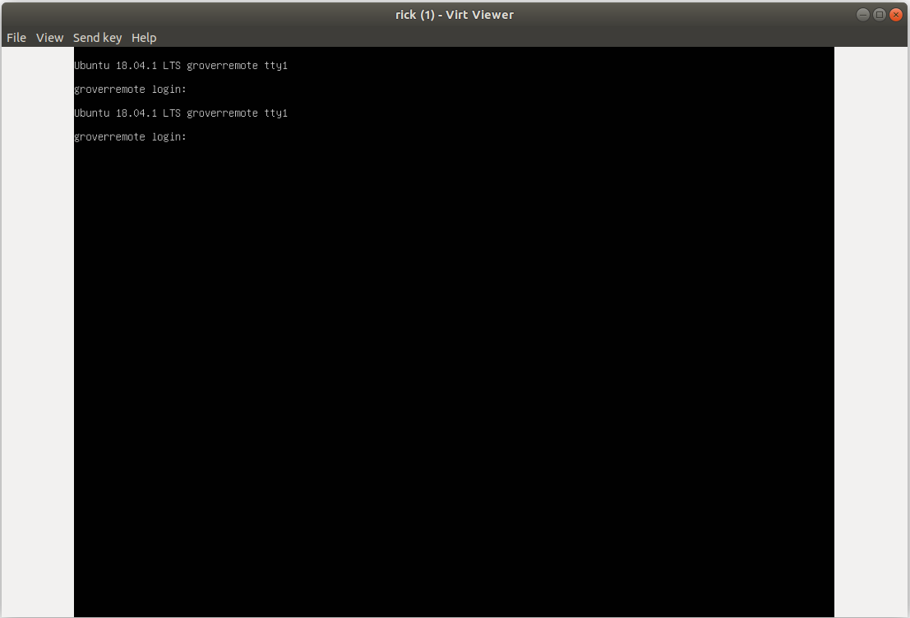

> Its possible to 'lose' control of your mouse and keyboard outside of this window. To restore the mouse/keyboard focus to your desktop, press "Alt+Ctrl".

---

# Installation with No GUI

> I first read about this concept [on fabianlee.org](https://fabianlee.org/2018/10/06/kvm-creating-an-ubuntu-vm-with-console-only-access/).

Its also possible to install a new OS on a new VM with **absolutely no** GUI whatsoever (from the server or client); the catch is that you need access to a network installer (the `--extra-args` flag - which allows us to instantly console into the setup - _requires_ the `--location` flag set, which means we are forced to use a network install and **not** install from a .iso image).

To install, find a network install location on the internet (try to look for a 'network install' location for your OS, for Ubuntu 18.04 thats "http://archive.ubuntu.com/ubuntu/dists/bionic-updates/main/installer-amd64/"). 

To create a new VM and instantly start installing an OS from the network, [become root](/operating_systems/ubuntu/linux_notes?id=becoming-root) and then run:
```
virt-install --name myshinynewvm --ram=1028 --vcpus=1 --cpu host --hvm --disk pool=default,size=20,bus=virtio,format=qcow2 --graphics none --console pty,target_type=serial --location 'http://archive.ubuntu.com/ubuntu/dists/bionic-updates/main/installer-amd64/' --extra-args 'console=ttyS0,115200n8 serial' --force
```
* `--name myshinynewvm` names the new VM in KVM
* `--ram=1028` sets the RAM / memory (in MB)
* `--vcpus=1` sets the number of virtual CPUs to be used
* `--cpu host` optimizes the CPU properties for the VM by exposing the host's CPU configuration to the VM.
* `--hvm` requests full hardware virtualization.
* `--disk pool=default,size=20,bus=virtio,format=qcow2` sets the pool (where the [image](operating_systems/ubuntu/package_operations/kvm_notes?id=image-files) will be stored), allocates 20 (GB) of hard disk space to the VM, sets the bus, and sets the [image](operating_systems/ubuntu/package_operations/kvm_notes?id=image-files) format to 'qcow2'.
* `--graphics none` is critical to avoid launching a GUI.
* `--console pty,target_type=serial` sets the console.
* `--location 'http://archive.ubuntu.com/ubuntu/dists/bionic-updates/main/installer-amd64/'` is the network install location for ubuntu 18.04
 * Unfortunately, the only way we can use the console for the install (specifically the `--extra-args` bit) is to use a network install and not an install from an .iso.
* `--extra-args 'console=ttyS0,115200n8 serial' --force` is necessary to tell the kernel in the VM to redirect the console

You will have to walk through all install steps. 

Once its done and it has restarted, you will have to [follow these steps to enable the VM console](operating_systems/ubuntu/package_operations/kvm_notes?id=enabling-the-vm-console).

> After the installation is complete, you will need to use the `escape character`; press `ctrl+]` to exit and return to your host's prompt.


**<font size="4">Popular Network Install Locations</font>**

| OS | Location |
| -- | -------- |
| Ubuntu 16.04 LTS | http://archive.ubuntu.com/ubuntu/dists/xenial-updates/main/installer-amd64/ |
| Ubuntu 18.04 LTS | http://archive.ubuntu.com/ubuntu/dists/bionic-updates/main/installer-amd64/ |


