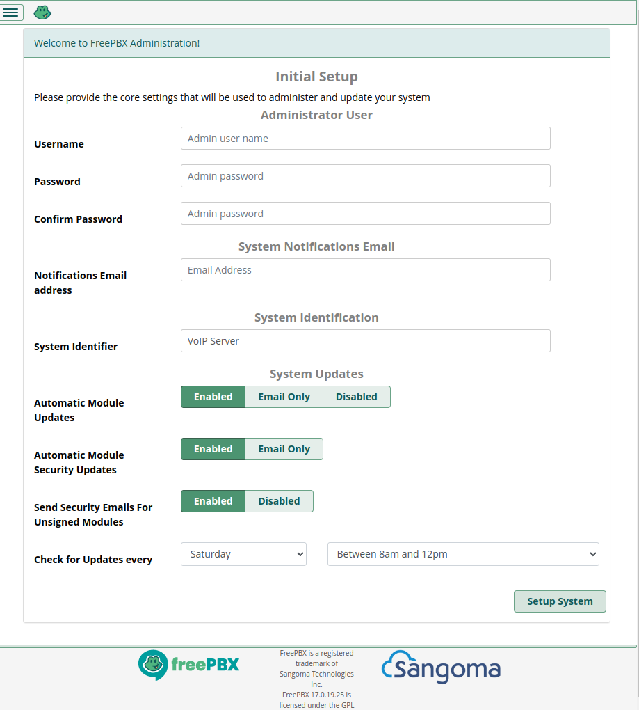

# FreePBX  

# What is FreePBX?  

<font color="green">FreePBX</font> (previously <font color="green">Asterisk Management Portal</font>, or <font color="green">AMP</font>) is a web GUI that manages a back-end [Asterisk](telephony/asterisk/) server.  

# Install  

## Initial Install  

To install, simply follow [these instructions](telephony/asterisk/asterisk_basics?id=installation). Some additional notes to FreePBX are below.  

## Asterisk Setup  

> You could do this with Asterisk commands, but we will use FreePBX for now.  

1\. Navigate to the IP of the host where you installed FreePBX - for me, this was `http://192.168.1.250/`  
* If you needed to use a different port - i.e. 7070 or something else - you can enter that a la `http://192.168.1.250:7070/`  

2\. This page should come up - fill it out:  

  

3\. You may be asked to activate the server - its up to you.  
  * Do this if you want commercial modules or support.  
  * I didnt, as this will be used in a home setting for testing.  

4\. It may ask you to sign up for SIPStation SIP Trunking Service  
  * if you want to be able to place calls to / from your PBX - and even use SMS / text messaging - you can try this out  
  * I skipped it for now, as I am still learning and dont want my free trial to run out while I am figuring out Asterisk  
  * This may be worth investigating later  

## MariaDB / MySQL  

> I have written a [SQL guide](databases/relational_databases/sql), [defined terms](databases/relational_databases/database_key_terms), as well as a [MySQL maintenance and root commands](databases/mysql/mysql_maintenance) and [MySQL Troubleshooting](databases/mysql/mysql_troubleshooting) which may be pertinent (as MariaDB is literally a forked version of MySQL).  

If you install FreePBX, it will install MariaDB (formerly MySQL). Instead of using local configuration files, Asterisk can use a database to store records, settings, etc for specific things.  

If you want to check out the database, run this on the command line (as root): `mariadb` (no username or password, if you are logged in a root).  You can then run [SQL commands](databases/relational_databases/sql); the first thing you may want to do is to [create a new user](databases/mysql/mysql_maintenance?id=creating-mysql-users); if this is a local test, you may want to make this user a super user - and don't forget to grant _all_ privileges (note, this may not be great for a production environment).  


> If you wish to be able to access mariaDB from other hosts, edit `/etc/mysql/mariadb.conf.d/50-server.cnf`, find the line that says `bind-address = 127.0.0.1`, change that to the IP of your Asterisk / MariaDB host, and then restart mariadb: `systemctl restart mariadb`.  

After you log in for the first time, the first thing you may wish to do is `SHOW DATABASES;`, which will show you the list of [schemas](databases/relational_databases/database_key_terms?id=schema) available. If you run `SHOW DATABASES;` you will see every schema. There are internal schemas to MariaDB, but there are two that are unique to Asterisk/FreePBX:  
```
asterisk
asteriskcdrdb
```  

`asterisk` is for Asterisk settings, and `asteriskcdrdb` is for [CDR records](telephony/terms?id=call-data-record-cdr).  If you want to flip back and forth between using each schema, you do that wit ha `USE` command, i.e. `USE asterisk;`.  The `asterisk` schema seemingly has 100+ tables associated with it.  

Once you pick a schema with `USE`, you can then view the tables in that schema with `SHOW TABLES;`. From there, you can now use traditional [SQL](databases/relational_databases/sql) to manipulate the tables.  

> If you wish, you can download the [MySQL Workbench - Community Edition](https://dev.mysql.com/downloads/workbench/). I could get it to work if I Selected `Database/Manage Connections` entered my info and saved it, exited MySQL Workbench, and then opened it again, selecting / double clicking the connection on the initial splash page under 'MySQL Connections'. If I selected it via `Database/Connect to Database` it would simply crash out.  

### FreePBX Asterisk Setup  

FreePBX also alters `/etc/asterisk/res_odbc.conf` to utilize MariaDB, adding two files:  
```
#include res_odbc_custom.conf
#include res_odbc_additional.conf
```  

`res_odbc_custom.conf` is blank initially, but `res_odbc_additional.conf` is populated like so:
```
[asteriskcdrdb]
enabled=>yes
dsn=>MySQL-asteriskcdrdb
pre-connect=>yes
max_connections=>5
username=>freepbxuser
password=>*SOME_PASSWORD_HERE*
database=>asteriskcdrdb
```

Conversely, the book [Asterisk: The Definitive Guide, 5th Edition](https://www.oreilly.com/library/view/asterisk-the-definitive/9781492031598/) sets up `/etc/asterisk/res_odbc.conf` like so:  
```
[asterisk]
enabled => yes
dsn => asterisk
username => asterisk
password => *SOME_PASSWORD_HERE*
pre-connect => yes
```  

# Create a PJSIP Endpoint  

To create a PJSIP endpoint:  

1\. Log in.  

2\. Go to `Connectivity/Extensions`  

3\. Go to the `SIP [chan_pjsip] Extensions` tab  

4\. Click `Add New SIP [chan_pjsip] Extension`  

