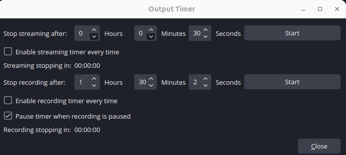

# OBS Studio  

# What is OBS Studio   

[Open Broadcaster Software (OBS) Studio](https://obsproject.com/) is an app that is primarily used for video recording and live streaming.  


# Installing OBS Studio  

To install in Ubuntu:  

1\. [Become root](/operating_systems/ubuntu/linux_notes?id=becoming-root).  

2\. [Update / Upgrade](/operating_systems/ubuntu/linux_notes?id=updating-upgrading-all-packages).  

3\. Run: `apt install obs-studio`  

> OBS Studio is also available for Mac and Windows; [check their website](https://obsproject.com/)  


# Troubleshooting  

## Failing To Initialize Device  

I have an ASUS 4K Pro; the UVC driver was seeing the device but failing to initialize it because of an unknown video format (that's a P010 format GUID - 10-bit HDR).  I was seeing this when I checked the log with `dmesg | tail -50`:  
```Linux
uvcvideo 2-9:1.1: Unknown video format 30313050-0000-0010-8000-00aa00389b71
uvcvideo 2-9:1.1: Failed to query (129) UVC probe control : 0 (exp. 26).
uvcvideo 2-9:1.1: Failed to initialize the device (-5).
```  

This is a known issue with some 4K capture devices on Linux. To fix, force reload the uvcvideo module with quirks:  
```Linux  
sudo rmmod uvcvideo
sudo modprobe uvcvideo quirks=0x280 nodrop=1 timeout=5000
```  
* You may have to run `sudo modprobe -r videobuf2_vmalloc videobuf2_v4l2 videobuf2_common videodev uvcvideo` instead of `rmmod uvcvideo`  

This works, but you will have to run this every time you restart. To permanently have this set, edit this file (named `/etc/modprobe.d/asus-tuf-fix.conf` for my capture device, name it as you wish):

```bash  
options uvcvideo quirks=0x280 nodrop=1 timeout=5000
options usbcore autosuspend=-1
```  

Then run `update-initramfs -u` and then reboot. You never have to worry about this again!  

## Ensure USB 3.0

If you want to record in 4K, ensure that you are using USB 3.0+; USB 2.0 can only do 1080p. To check, pick a part of the name of your capture device (for me this was `ASUS`) and run: `lsusb -v | grep -A 20 "ASUS"`  

If you see this, you are on USB 2.0:
```
bcdUSB               2.00
```  

If you see something higher than 3.0, you are on USB 3.0!  


# Audio / Video Setup  

In order to hook up a capture device, you must add _both_ a video _and_ and audio capture source.  

## Add Video Source  

> I first learned about this [here](https://streamshark.io/obs-guide/adding-webcam).  

To add a video source:  

1\. Click the plus (+) sign in the `Sources` area.  

2\. Select `Video Capture Device`  

3\. Name the capture device, then click `OK`  
* Make sure `Create New` is selected (it should be, its the default)  

4\. Select your device from the dropdown menu.  

5\. Select your other settings  
* You do not have to change these, but I change  
  * Resolution: `Leave Unchanged`  
  * Frame Rate: `Leave Unchanged`  
  * Video Format: `YUYV 4:2:2`  
    * This is up in the air - I sometimes change this to experiment.  


## Add Audio Source  


To add an audio source:  

1\. Click the plus (+) sign in the `Sources` area.  

2\. Select `Audio Input Capture`  

3\. Name the capture device, then click `OK`  
* Make sure `Create New` is selected (it should be, its the default)  

4\. Select your device from the dropdown menu.  

5\. Go to the `Audio Mixer` tab 
  * Your entry should now be there.   

6\. Make sure the Audio monitoring is set to `Monitor only (mute output)` if you want the sound recorded / streamed but _not_ played over your speakers _or_ its set to `Monitor and Output` if you wish the sound to be streamed / recorded _and_ you want to hear it over your speakers.  
  * There have been some reports that say you need to turn this off and then on for it to work.  


!> Be careful with your streaming source audio; OBS Studio _does not_ natively support Dolby sound, so if your audio source is using Dolby, you will just get dead air. You will have to either change the audio output of your streaming device to something not Dolby _or_ find a workaround (I have heard Dolby ProLogic can do this, but I have never tested it).  

> When recording, I noticed that sometimes its best to turn the monitor off for your capture device and to turn on `Monitor and Output` (or just `Monitor`) for the <font color="green">Mic/Aux</font> object; otherwise, the audio seems to be choppy.  

# Recording Settings  

!> Please take this section with a larger than usual grain of salt, for two reasons: one, I am far, far from an expert on this; two, I have a Nvidia GPU, so I can really crank up the settings; you may or may not be able to do that. 

There are many different opinions on this:  
* For decent settings - particularly if you do not have a decent GPU - see [movavi](https://www.movavi.com/learning-portal/best-obs-settings-for-recording.html).  
* For high quality settings, see [this article on gumlet](https://www.gumlet.com/learn/best-obs-recording-settings/).  


# 4K Settings  

> See my note above on other opinions.  

## Properties for Capture Source (4K)  

You can get to the Device Properties via right-click source (In the `Sources` box on the bottom row) → Properties.  

* Device: `Your Device`  
* Resolution: 3840x2160
* Video Format:  Y/UV 4:2:0
  * Other formats that were 'OK': `YV12`, `YU12`
    * Thanks to [jpetazzo](https://jpetazzo.github.io/2020/06/27/streaming-part-4-linux/) for this tip  
  * You can check the different available formats - and their available resolutions - with: `ffplay -list_formats all /dev/video0`  
  * Other formats:  
    * `YU12` will probably work well, but its not as efficient  
    * `YUYV 4:2:2` worked 'OK' but I couldnt get a great picture  
    * `Motion-JPEG` seemed to blend the colors too much  
* FPS: 29.97
* Frames Until timeout: 120  
  * I think this only matters if `Autoreset on Timeout` is selected, which I do not have selected.  

## Settings/Video (4K)  

You can get to these via the OBS Video Settings (Settings → Video).  

* Base Resolution: 3840x2160
* Output Resolution: 3840x2160
* Downscale Filter: Resolutions match, no downscaling required
* FPS: `29.97`  
  * At first I tried `24 NTSC` - which is the real setting for most movies - but it was a bit choppy, and `29.97` worked better.  
  * You can play with this, but most things use this FPS, even if it claims to be higher.  

## Settings/Output (4K)  

You can get to these via Settings → Output → Recording Tab.  

* Output Mode: `Advanced`  
* Type: `Standard`  
* Recording Path: A fast NVMe drive  
* Recording Format: `mkv`  
* Encoder: `NVIDIA NVENC H.265 (HEVC)`  
  * The `Video Encoder` is a bit tricky  
    * If you have a GPU, try to use `HVEC` (or `H.265`) first, then something that has `H.264` in it  
      * `HVEC` is `H.265` and is considered the successor to `H.264`  
      * `HVEC` claims better compression without a loss of quality  
      * Not all devices support `HVEC`  
    * If you do not have a GPU, you may have to use `x264`  
* Rate Control: `CQP`  
  * The `Rate Control` seems to be contentious  
    * I lean towards `CQP`  
    * `CQP` (Constant Quality Parameter) prioritizes visual quality over bitrate consistency  
      * It is said that `CQP` is a better choice if you have a good GPU  
    * [Castr](https://castr.com/blog/best-obs-settings-streaming-recording/) suggests `VBR` for recording  
    * If you do not have a good GPU, `CBR` may be better, but it may come at the cost of visual quality  
* CQ Level: 19  
  * This is from Grok  
  * Claude said 12-14  
    * lower = better quality, 12 for near-lossless  
* Keyframe Interval: 0  
  * I changed it to two to solve some jitter after the ~20 minute mark, but reverted as H.265 solved it.  
* Preset: `P7` (Quality)  
* Tuning: `High Quality`  
* Multipass: `Two Passes (Quarter Resolution)`  
* Profile: `main10`  
  * For 10-bit if HDR, otherwise main  
* Look-ahead: ON  
* Psycho Visual Tuning: ON  
* Max B-frames: 4  
* The `Audio Bitrate` is between 128-320 Kbps, but 192 Kbps is recommended.  
* The `Audio Encoder` is usually best set to AAC  

## Advanced Settings (4K)  

You can get to these via Settings → Advanced.  

* Process Priority: High  
* Color Format: NV12 (or P010 for HDR if available)  
* Color Space: Rec. 709 (or Rec. 2020 for HDR)  
* Color Range: `Limited`  

## Audio Tweaks (4K)  

Ubuntu does need some audio buffering for recording audio - so add that.  

Modern Ubuntu uses PipeWire for audio - so lets modify that to add a bit of buffering.  

Run the following:  
```
pw-metadata -n settings 0 clock.quantum 2048
```

And then restart PipeWire:  
```
systemctl --user restart pipewire-pulse  
```  

If you want, you can check to see if you changed it with:  
```
pw-metadata -n settings 0 clock.quantum
```  

This is doubling your audio buffer size, which is significant. What the numbers mean:  
* 1024 samples at 48000 Hz = 21.3ms of buffer  
* 2048 samples at 48000 Hz = 42.7ms of buffer  

So you're going from ~21ms to ~43ms of audio buffering - that's doubling the time window the system has to handle audio before a dropout occurs.  


Note that this _does_ add some lag to sound, and this may hinder gaming; if you game, you will want to revert this when you are done recording. To revert, run:
```
pw-metadata -n settings 0 clock.quantum 1024 
```  

And then restart PipeWire:  
```
systemctl --user restart pipewire-pulse  
```  

!> Remember to revert this!  

At this point, you should be done with the audio changes. However, if you are running an older version of Ubuntu that does not use PipeWire, you will have to interact with PulseAudio. Edit the file `/etc/pulse/daemon.conf` and add (or uncomment) these lines:  
```
   default-fragments = 8
   default-fragment-size-msec = 25
```  
* A comment starts with a semicolon `;` - in case you need to comment these out again.  

Finally, restart Pulse audio: `pulseaudio -k`  


# Blu-Ray Settings  

For Blu Ray, use the 4K settings, but:  
* Everywhere it says 3840x2160, use 1920x1080 instead.  
* Use a slightly lower CQ level (16)
* Encoder: `NVIDIA NVENC H.264 (Ffmpeg)`  
  * IGNORE 
* Multipass: `Single Pass`  
  * IGNORE 


# Recording Tips  

* Disable the Preview 
  * Doing this may help with processing - if you notice jitters, this is one thing that can fix it  
  * Right-click anywhere in the preview window (the big black area showing your video feed) and you'll see a checkbox for `Enable Preview` uncheck this.  
* Start Recording with a Timer  
  * Sometimes, you know you only want to record for, say, two hours  
  * To do so, Click `Tools` / `Output Timer`, then you will see this:  



  * You can enter your desired hours / minutes / seconds, and then click the `Start` button to start recording - it will stop once the timer is hit.  