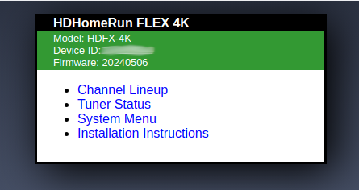
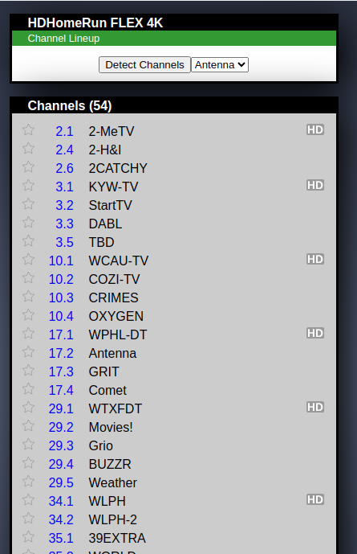
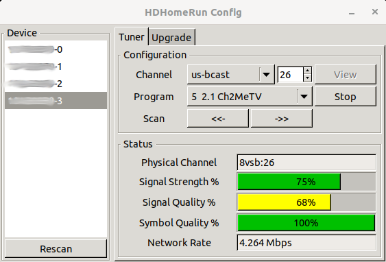
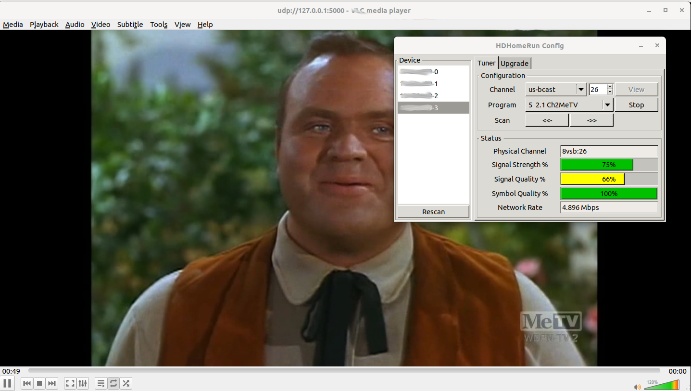

# HD HomeRun  

# Links  
* [6 Hacks on How to Boost Antenna Signal](https://installmyantenna.com.au/blog/6-hacks-on-how-to-boost-antenna-signal)  
  * [Antenna Recommendations - need channel 6 ABC Philly](https://www.reddit.com/r/ota/comments/deulrb/antenna_recommendations_need_channel_6_abc_philly/) - Some Tips in here, too  
* [AntennaWEB - Discover Your Available Stations](https://www.antennaweb.org/results)  

# What is HD HomeRun  

[HD HomeRun](https://www.silicondust.com/hdhomerun/)  is a device that accepts a signal from an antenna and allows someone to watch Live HDTV on devices connected to their home network. It also allows services like [Plex](/tools/plex/) to re-broadcast Live HDTV to all devices with the Plex service, in addition to acting as a DVR.  

# Debian CLI / GUI Installation    

You can install some Ubuntu commands / apps that interact with the HD HomeRun box. To install them, [become root](/operating_systems/ubuntu/linux_notes?id=becoming-root), then [update all packages](/operating_systems/ubuntu/linux_notes?id=updating-upgrading-all-packages), and then run:  
```
apt install hdhomerun-config
apt install hdhomerun-config-gui
```  
* `hdhomerun-config` is the command-line utility  
  * This will be `hdhomerun_config` on the command line  
* `hdhomerun-config-gui` is the GUI interface  
  * This will be `hdhomerun_config_gui` on the command line  

# Basic CLI Commands  

## Discover  

The `discover` command will find all HD HomeRun boxes on your network and show the name of the device and its IP. For example, run:  
```
hdhomerun_config discover
```

In my case, this was the output:  
```  
hdhomerun device 14AB12C7 found at 192.168.1.96  
```  
* The device is identified as `14AB12C7`, which is the device ID.    
  * The device ID is also printed on the bottom of the unit itself.  
* The IP of the device is `192.168.1.96`  


## CLI Firmware Upgrade  

To upgrade the firmware, run:
```
`hdhomerun_config ID upgrade FILENAME`  
```  
* ID is the [device ID](tools/plex/hdhomerun?id=discover)  
* FILENAME is a filename on your local linux box, probably downloaded from [here](https://info.hdhomerun.com/info/downloads#firmware)   

## All CLI Commands  

hdhomerun_config 10AB08B9
You will need the [device ID](tools/plex/hdhomerun?id=discover) for every command outside of [discover](tools/plex/hdhomerun?id=discover); that said, all commands are:
 * `hdhomerun_config discover`  
 * `hdhomerun_config ID get help`  
   * ID is the [device ID](tools/plex/hdhomerun?id=discover)  
 * `hdhomerun_config ID get ITEM`  
   * ITEM is one of the following  
     * `/hdd/debug`  
     * `/hdd/identify`  
     * `/hdd/smart`  
     * `/hdd/status`  
     * `/lineup/scan`  
     * `/sys/copyright`  
     * `/sys/debug`  
     * `/sys/features`  
     * `/sys/hwmodel`  
     * `/sys/model`  
     * `/sys/restart <resource>`  
     * `/sys/version`  
     * `/tuner<n>/channel <modulation>:<freq|ch>`  
     * `/tuner<n>/channelmap <channelmap>`  
     * `/tuner<n>/debug`  
     * `/tuner<n>/filter "0x<nnnn>-0x<nnnn> [...]"`  
     * `/tuner<n>/lockkey`  
     * `/tuner<n>/program <program number>`  
     * `/tuner<n>/status`  
     * `/tuner<n>/plpinfo`  
     * `/tuner<n>/streaminfo`  
     * `/tuner<n>/target <ip>:<port>`  
     * `/tuner<n>/vchannel <vchannel>`  
 * `hdhomerun_config ID set ITEM VALUE`  
   * ITEM is like the above  
   * VALUE is the value
 * `hdhomerun_config ID scan <tuner> [<filename>]`  
 * `hdhomerun_config ID save <tuner> <filename>`  
 * `hdhomerun_config ID upgrade FILENAME`  
   * Used to upgrade the firmware 
   * FILENAME is a filename on your local linux box, probably downloaded from [here](https://info.hdhomerun.com/info/downloads#firmware)   


# Web UI  

> The documentation says to use [http://hdhomerun.local/](http://hdhomerun.local/) or [my.hdhomerun.com](my.hdhomerun.com) for a webUI setup, but the former does not work at aoo for me and the latter seems to take me to a generic setup website that is not specific to my HD HomeRun unit, so - I have to use the IP.  

If you navigate to the IP of your HD HomeRun box (which you can find with the [discover command](tools/plex/hdhomerun?id=discover)) in a web browser, you can interact with the box in a limited fashion.  

Navigating to your IP in a browser looks something like this:  

  

You can do some limited things here:  
* View the channel listing  
  * You can actually save the stream from here, too.  
* See the tuner status  
  * The tuners are the pieces of hardware that actually stream the channel to devices  
  * There are usually 2 tuners, but some higher end devices have 4  
* System menu  
  * Shows some system info  
  * Allows you to see the log  

## Streaming Channels from the WebUI  

> This method will not allows you to watch the stream - merely save it.  

You can stream the channels from the [Web UI](tools/plex/hdhomerun?id=web-ui). Select `Channel Lineup`, then click on the channel you want to save:  

  

'Saving' this actually opens a stream that will just continuously download until you stop the download. The stream will never 'end', which is a problem with some browsers as they will auto-delete items that did not fully download. What I typically do in these situations is copy the file _before_ I stop the stream download - therefore, the file will not be removed by the web browser for being 'incomplete'.

I typically rename the file `.mkv` but you can do whatever you like.  

## WebUI Firmware Update  

Silicon dust claims `HDHomeRun products that have a pending update will show a button at the bottom of that page to start the firmware update process`, so - if you see that button, you can upgrade the firmware.  


# HD HomeRun Config GUI  

The HD HomeRun Config GUI can be opened by running `hdhomerun_config_gui` _or_ by selecting it in your applications. An example of what it looks like:  

  

The devices are the available tuners (the tuners are named the [device ID](tools/plex/hdhomerun?id=discover), a dash, and then a number that identifies the tuner itself).  Selecting a device/tuner will fill out the `Tuner` tab.  

## Watching The Stream via GUI    

On the `Tuner` tab, you can select the channel; the channel is an internal identifier you wont recognize, but you can scan through them with the `Scan` buttons Or pick one manually once you figure out what is what. If, after a few seconds, no other info loads, it means that channel is probably not in use (using `Scan` will skip these).  

!> If you pick a tuner and it already has a channel selected, it means someone else in your house is actively using that tuner - you may not want to mess with that device until they are done. Find another tuner to use!  

Each channel will have a few `Programs` (which you will probably recognize as TV channels). Once you find one, you can select `View` and it will open that stream in the default application that can handle a stream (for me, that is VLC):  

  

!> Be careful with this, as doing this seems to hold the tuner hostage until you manually set the channel back to 0. Closing the app - or VLC - will _not_ clear the channel. Make _sure_ to set the Channel back to 0 when you are done!  

## Updating Firmware via GUI  

You can also upgrade the firmware via the GUI in the `Upgrade` tab. You can download the firmware [here](https://info.hdhomerun.com/info/downloads#firmware).  


