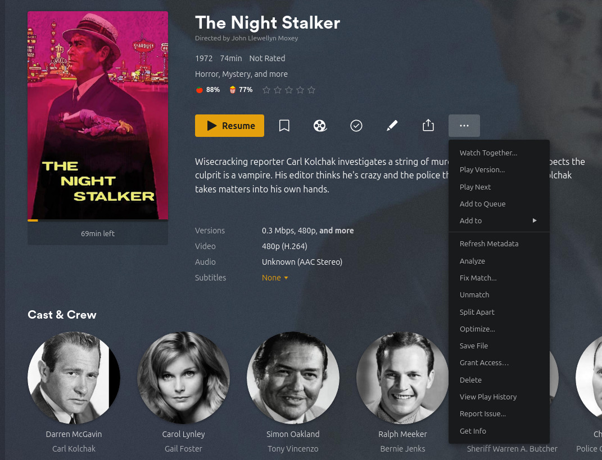

# Plex Basics  

# What is Plex  

[Plex](https://www.plex.tv/) is a tool you can install on a server that acts as a multimedia server - you can put music, movies, tv shows, and home videos on your server. Once installed, you can then download the Plex app on your phone / Roku / Smart TV / etc and watch your curated videos on these apps!  

# Quick Links (on Plex)  

* [Plex Articles](https://support.plex.tv/articles/) - This is the overview of _all_ of the articles on the Plex documentation page.  
* [Plex Install](https://support.plex.tv/articles/200288586-installation/)  
* [Movie Files (Naming and Organizing)](https://support.plex.tv/articles/categories/your-media/naming-your-movie-media-files/)  
  * [Naming and organizing your Movie files](https://support.plex.tv/articles/naming-and-organizing-your-movie-media-files/)  
* [TV Show Files (Naming and Organizing)](https://support.plex.tv/articles/categories/your-media/naming-and-organizing-tv-shows/)  
  * [Naming and Organizing Your TV Show Files](https://support.plex.tv/articles/naming-and-organizing-your-tv-show-files/)  
  * [Local Files for TV Show Trailers and Extras](https://support.plex.tv/articles/local-files-for-tv-show-trailers-and-extras/)  
  * [Local Media Assets – TV Shows](https://support.plex.tv/articles/200220717-local-media-assets-tv-shows/)  
  * [TV Theme Music & Submissions](https://support.plex.tv/articles/201572843-tv-theme-music-submissions/)
* [Personal Media Movies / Home Movies in Plex](https://support.plex.tv/articles/200265246-personal-media-movies/)  
  * [Naming Home Series Media](https://support.plex.tv/articles/200265256-naming-home-series-media/)  
* [Metadata Agents](https://support.plex.tv/articles/200241558-agents/)  
* [Scanning vs Refreshing a Library](https://support.plex.tv/articles/200289306-scanning-vs-refreshing-a-library/)  

# Basics  

## Plex Install  

> For the official Plex install instructions, [go here](https://support.plex.tv/articles/200288586-installation/).  

1\. [Become root](/operating_systems/ubuntu/linux_notes?id=becoming-root)  

2\. [Update all packages](/operating_systems/ubuntu/linux_notes?id=updating-upgrading-all-packages)  

3\. Download the Plex .deb file [here](https://www.plex.tv/media-server-downloads/?cat=computer&plat=linux)  

4\. Install the .deb file: `dpkg -i plex.deb`  
* This assumes the .deb file is named `plex.deb` - you may have to change this.  


## Plex User  

During the [installation process](/tools/plex/plex_basics?id=plex-install), Plex will create a `plex` user; the `plex` user _must_ have access to the media files you use.  


## Plex Library Directory  

By default, the [Plex installation process](/tools/plex/plex_basics?id=plex-install) uses the directory `/var/lib/plexmediaserver/Library` as the base directory for your libraries. Put all of your media under this directory!  

> You _can_ use symlinks under this directory - just make sure the [Plex user has access to the files](/tools/plex/plex_basics?id=plex-user).  


## Local Plex Website  

The local Plex website is how you administer your Plex server. _If_ you open a web browser on the server that is running plex, navigate to the website [http://127.0.0.1:32400/web/](http://127.0.0.1:32400/web/).  

That said, if you want to open this page on _other_ computers on your network, you can run `ifconfig -a` _on your plex server_; [running ifconfig](operating_systems/ubuntu/linux_notes?id=mac-addresses) will list the IP of the server next to the word `inet` (the IP that is not `127.0.0.1`).  For example, if you ran the `ifconfig -a` command on your plex server and the IP is `192.168.1.100`, you can access your local Plex server at [http://192.168.1.100:32400/web/](http://192.168.1.100:32400/web/) using any web browser that is _on the same network_ (i.e. anything on your home network).  

## Starting / Stopping Plex  

If you [installed Plex using the deb file](/tools/plex/plex_basics?id=plex-install), Plex will use [systemctl](operating_systems/ubuntu/linux_notes?id=systemctl) to start and stop its service using the service name `plexmediaserver`.  To start Plex, [become root](/operating_systems/ubuntu/linux_notes?id=becoming-root) on your Plex server and run:  
```
systemctl start plexmediaserver
```  

To stop Plex, run:  
```
systemctl stop plexmediaserver
```  

To simply check if Plex is running:  
```
systemctl status plexmediaserver
```  

## Initial Setup  

The goals of the initial setup are:  
* Create a Plex account  
* 'Claim' your Plex server  
  * Your Plex server is identified by your server's hostname - to find out what that is, open a terminal on your Plex server and type `hostname`    


1\. [Install Plex](tools/plex/plex_basics?id=plex-install)  

2\. Make sure [Plex is running](tools/plex/plex_basics?id=starting-stopping-plex)  

3\. Log on to your [local Plex website](tools/plex/plex_basics?id=local-plex-website) in a browser.  

4\. The first thing you will need to do is set up a Plex account - do so.  
  * Plex may 'get stuck' on a pricing plan - I just refresh the page and I can usually proceed (without paying for a plan, but if it makes sense for you - please do so).  

5\. Once logged in, You will need to activate your server; to start this, click 'More' on the side panel.  

6\. You now need to claim your new server under your account; after clicking 'More', you should see your server's name at the top of the menu (probably under the word 'Pinned' and above the word 'Plex' but thats not guaranteed); click your Plex server's name.    
  * This is your your Plex server's hostname  
    * To find the hostname of your Plex server, open a terminal on your Plex server and type `hostname`    

7\. Click "Claim it now"  

  

8\. Click "Claim Server"  
  * Review the other radio buttons and check boxes to see if you want to use those options  

  

## Adding a Library  

A Library is a collection of movies that you put on Plex - they can be movies, TV shows, home videos, music, or pictures. In reality, these media files are stored on your Plex server in the directory `/var/lib/plexmediaserver/Library`. Just remember - the `plex` user _must_ have access to these media files!  

To add a library:  

1\. Put movies, TV shows, home videos, music, or pictures in the directory `/var/lib/plexmediaserver/Library`  
  * Its best to group things in directories under the `Library` directory  

2\. Navigate to [your local plex website](tools/plex/plex_basics?id=local-plex-website)  

3\. Look at the side menu and click 'More >'  

4\. The side menu changes, with your Plex server hostname at the top  
  * If you hover over your server name, a 'plus' symbol will appear - click it and a menu will appear   

  


# Metadata Agents  

> This is mostly taken from [Metadata Agents](https://support.plex.tv/articles/200241558-agents/)  

"Metadata Agents" (or just "agents") are the server component that’s responsible for taking the information from the scanner and then acting on it to help bring in the rich metadata (plot summary, cast info, cover art, music album reviews, etc.) that bring your media libraries to life. In most cases, this metadata comes from online resources (such as The Movie Database, The TVDB, Last.fm, etc.). In other words, the 'agent' determines how the metadata for your movies is found and loaded into your instance of Plex.  

The agent is set when [adding a library](tools/plex/plex_basics?id=adding-a-library), but you can edit the library later and change the agent.  

## Metadata Agent Types  

There are several types of metadata agent, which correlate to the different library types:  
* Movie  
* Music (both for Artists and Albums)  
* Shows  
* Photos  

## Movie Agents    

Movie metadata agents can fetch information from local or online resources for information about your movie media. There are multiple available:
* `Plex Movie` - The default agent in current Plex Media Server installs. More info on its settings can be found in Plex's [Advanced settings Plex Movie Agent](https://support.plex.tv/articles/advanced-settings-plex-movie-agent/) article.  
* `Plex Movie (Legacy)` - This is an older, less advanced movie agent and can gather data from a variety of online resources (The Movie Database, IMDb, Rotten Tomatoes, and more).  
* `The Movie Database` - This agent gathers data only from The Movie Database.  
  * We encourage users to instead use the regular “Plex Movie” agent and simply adjust the agent options to pull desired information from The Movie Database.  
* `Personal Media` - The Personal Media agent is designed for media that won’t appear in any online database and so has no need to try to retrieve metadata from such online resources.  
  * This is primarily used for “Other Videos” libraries (home movies, corporate videos, etc.).  

## TV Show Agents  

There are several metadata agents available for TV Shows:
* `Plex Series` - The default agent in current Plex Media Server installs. More info on its settings can be found in Plex's [Advanced Settings Plex TV Series Agent](https://support.plex.tv/articles/advanced-setting-plex-tv-series-agent/) article. By default, metadata gathered will be based on info from The Movie Database, but you can adjust that for the library or a particular show, as desired.
* `TheTVDB (Legacy)` - This is the older, less advanced agent for television libraries and gathers content only from TheTVDB. (The default “Plex Series” agent can also use data from TVDB.)
* `The Movie Database (Legacy)` - Another older, less advanced one, The Movie Database agent gathers metadata only from The Movie Database and local assets. (The default “Plex Series” agent already uses data from The Movie Database by default.)
* `Personal Media Shows` - The Personal Media Shows agent is used to identify media files that haven’t been broadcast and so don’t appear in online databases. Shows scanned using this agent will be presented like a TV series. This is useful if you have a set of videos from a single event, like a wedding. If Local Media Assets is enabled for the agent, any embedded metadata in the files will be used for that show.


## Music Agents  

There are several metadata agents available for music:  
* `Plex Music` - The default agent for music libraries. It pulls in data from a variety of sources, including best-in-class AllMusic and MusicBrainz data. Note: This is a special, advanced agent and does not appear under Settings > Server > Agents for configuration. It is the default option when creating a music library, though.  
* `Last.fm` - Last.fm is an older, deprecated agent for music libraries. Note that if you choose Last.fm for your music library, it will be used as the primary agent for both artist and album metadata, but you can choose the relative priority of Personal Media and Last.fm for artists and albums independently in your server agent settings.  
* `Personal Media Artists/Albums` - The Personal Media Artists/Albums agent is designed to recognize albums that have not been released commercially and so won’t appear in online music databases. Metadata embedded in most music file formats will be read and used if Local Media Assets is enabled.  

## Photos Agents  

There is a only a single agent available for Photos. It cannot be altered and is used to recognize image files and add them to the library.


---  

# Naming Movies  

> This info was initially found on the [Plex installation page](https://support.plex.tv/articles/200288586-installation/), the [local media assets](https://support.plex.tv/articles/200220677-local-media-assets-movies/) page, the [local files for movie trailers and extras](https://support.plex.tv/articles/local-files-for-trailers-and-extras/) page.  

You will be storing your movies in the [library directory](tools/plex/plex_basics?id=plex-library-directory).  

As alluded to earlier, you will have to select the 'Movies' option when [adding the library](tools/plex/plex_basics?id=adding-a-library). Typically, libraries are based on a [directory on the server](tools/plex/plex_basics?id=plex-library-directory), so every movie file in this directory should follow the format in this section.  

Movies are named as follows:  
```
Movie_Name (Release_Year)  
```
* As an example, `e.g. Avatar (2009).mp4`  

Do you make individual directories under the main movie directory? You dont have to, but I do - the advantage is all of the other stuff that you may wish to keep with the movie itself (trailers, poster art, extras, etc) are organized well. You will have to name the directory the same as the movie - For example:
```
/Movies  
  /Avatar (2009)
    Avatar (2009).mp4
    poster.jpg
    poster-2.png
```  

You can also have different versions of the same movie (note this is different from different editions, see below) - more on this [here](https://support.plex.tv/articles/200381043-multi-version-movies/).  

> If you do not want to take advantage of the convenience of Plex's ability to scrape movie information from the web, you _could_ set the [movie agent](tools/plex/plex_basics?id=movie-agents) to `Personal Media` when [adding the library](tools/plex/plex_basics?id=adding-a-library) so none of the metadata information is pulled in from an external source. Using this agent, you will have to pull all metadata in manually (i.e. posters, trailers, etc) if you wish to have the metadata. This option will have you following all of the naming conventions here - the only difference is the metadata will not be pulled in automatically. If you do not care about format or the bells and whistles of the metadata, you can select your library as 'Other Videos' when [adding the library](tools/plex/plex_basics?id=adding-a-library); if you do this, you could simply name the movie file names [however you wish](/tools/plex/plex_basics?id=naming-other-videos), but you will lose the ability to use posters, etc etc.  


## Movie Versions  

You can have multiple versions of the same movie (say, one you ripped from DVD and one from Blu-Ray). You specify the format _after_ the year, beginning with a dot - for example:  
```
/Media
   /Movies
      /Blade Runner (1982)
         Blade Runner (1982).mp4
      /Blade Runner (1982) {edition-Director's Cut}
         Blade Runner (1982).1080p.h264 {edition-Director's Cut}.mp4
         Blade Runner (1982).1080p.hevc {edition-Director's Cut}.mkv
         Blade Runner (1982).4k.h264 {edition-Director's Cut}.mp4
         Blade Runner (1982).4k.hevc {edition-Director's Cut}.mkv
```  

Above, there are two different editions, and the Director's Cut has 4 different versions:  
* 1080p.h264  
* 1080p.hevc  
* 4k.h264  
* 4k.hevc  

You can actually name these anything you like - Plex will list them by bitrate and resolution, which it derives on its own.  

To view different versions, click the 'more' dots, then click `Play Version...`  

  

Now, pick the one that matches your specifications (Note it appears to list the same thing as both files in my example are the same file - that said, if they were different they would display differently):  

  

!> I wont go into it here, but you can also have multiple editions of the same movie - the basics of it is you append a `{edition-EDITION NAME}` to the end of the file / directory name. For more info, follow the instructions [here](https://support.plex.tv/articles/multiple-editions/); note this requires a Plex Pass.  

## Movies Across Multiple Files  

Movies that are split into several files (e.g. pt1, pt2), can be played back as a single item (in most, but not all, players) if named correctly. The split parts must be placed inside their own folder, named as usual for the movie. Name the files as follows:  
```  
/Movies/MovieName (release year)/MovieName (release year) – Split_Name.ext
```  

Where `Split_Name` is one of the following:  
* cdX  
* discX  
* diskX  
* dvdX  
* partX  
* ptX  

…and you replace X with the appropriate number (cd1, cd2, etc.).

For example:  
```
/Movies
   /The Dark Knight (2008)
      The Dark Knight (2008) - pt1.mp4
      The Dark Knight (2008) - pt2.mp4
```  

Notes:
* Not all Plex apps support playback of stacked media  
* All parts must be of the same file format (e.g. all MP4 or all MKV)  
* All parts should have identical audio and subtitle streams in the same order  
* Only stacks up to 8 parts are supported  
* "Other Videos" libraries or those using the "Plex Video Files Scanner" do not support stacked content.  


## Poster Artwork (Movies)  

Posters are typically displayed for movies on Plex app dashboards, library views, and when looking at details for the movie. Poster art is typically of 1:1.5 aspect ratio. Custom Poster artwork will be detected and used if named and stored as follows:
* `MovieName (Release Date).ext` or  
 * `Movie/MovieName (Release Date)/Custom_Poster_Name.ext`  
    * Where `Custom_Poster_Name` _must be_ one of the following:  
      * `cover`  
      * `default`  
      * `folder`  
      * `movie` (i.e, what shows up as the small image when looking at all of your movies)
      * `poster`  

For example:
```
/Movies
   /Batman Begins (2005)
      Batman Begins (2005).mkv
      poster.jpg
      poster-2.jpg
```
* Note the use of `poster-2.jpg` - you CAN have multiple posters if you wish, just number them as such.  

Sometimes, the 'Plex Movie' metadata may have some issues figuring out which movie you are referencing - therefore, you can include an ID in `{Curly brackets}`.  

So long as you’re using the current “Plex Movie” metadata agent for the library, you can include the IMDb or TheMovieDB ID number to help match the movie. It must follow the form `{[source]-[id]}` (i.e. `imdb` or `tmdb` followed by the ID).

Examples:  
```
/Movies
   /Batman Begins (2005) {imdb-tt0372784}
      Batman Begins (2005) {imdb-tt0372784}.mp4
/Movies
   /Batman Begins (2005) {tmdb-272}
      Batman Begins (2005) {tmdb-272}.mp4
```  

## Local Trailers and Extras (Movies)  

> Most of this is from the [local files for movie trailers and extras](https://support.plex.tv/articles/local-files-for-trailers-and-extras/) page.  

If you have trailers, interviews, behind the scenes videos, or other “extras” type content for your movies, you can add those.

You can organize your local extras into specific subdirectories inside the main directory named for the movie (you can also add them inline - that is described [here](https://support.plex.tv/articles/local-files-for-trailers-and-extras/)). Extras will be detected and used if named and stored as follows:  
```
Movies/MovieName (Release Date)/Extra_Directory_Type/Descriptive_name.ext  
```  

Where Extra_Directory_Type is one of:  
* Behind The Scenes  
* Deleted Scenes  
* Featurettes  
* Interviews  
* Scenes  
* Shorts  
* Trailers  
* Other  

It is recommended that you provide some sort of descriptive name for the extras filenames.

An example:  
```
/Movies
   /Avatar (2009)
      Avatar (2009).mkv
      poster.jpg
      background.jpg
      /Behind The Scenes
         Performance Capture.mkv
      /Deleted Scenes
         Bar Fight.mp4
         Lost Sister.mkv
      /Interviews
         Sigourney Weaver.mp4
         Stephen Lang.mp4
      /Scenes
         Arrival.mp4
      /Trailers
          Teaser Trailer.mp4
          Theatrical Trailer #1.mp4
          Theatrical Trailer #2.mp4
```  


---  

# Naming TV Shows  

> This info was initially found on the [Plex installation page](https://support.plex.tv/articles/200288586-installation/), [Naming and Organizing Your TV Show Files](https://support.plex.tv/articles/naming-and-organizing-your-tv-show-files/), and [Local Files for TV Show Trailers and Extras](https://support.plex.tv/articles/local-files-for-tv-show-trailers-and-extras/).  

You will be storing your TV Shows in the [library directory](tools/plex/plex_basics?id=plex-library-directory).  

As alluded to earlier, you will have to select the 'TV Shows' option when [adding the library](tools/plex/plex_basics?id=adding-a-library). Typically, libraries are based on a [directory on the server](tools/plex/plex_basics?id=plex-library-directory), so every TV show episode / file in this directory should follow the format in this section.  

TV shows should always have their own directory, with the show name as the directory name _AND_ the year the show initially aired in parenthesis (although it doesnt seem like the 'year' is a strict requirement, as many of the examples given by Plex do not have the year). Each season should have a subfolder named `Season 01`, `Season 02`, etc. The actual file of the episode should have `sXXeYY`, there the `XX` is the season number and the `YY` is the episode number.  

An example of a directory and a file name:  
```
/TV Shows/Trailer Park Boys (2001)/Season 02/Trailer Park Boys (2001) - s02e06 - Never Trust a Man with No Shirt On.mp4  
```  
* The most important bit in the file name is the appropriate season and episode number notation `s02e06`  
  * Otherwise, it does not matter if you use dashes, dots, or just spaces.

If you are using the "Plex TV Series" agent, you can optionally include the TMDB or TVDB show ID in the folder name to improve matching. If you choose to do that, it must be inside curly braces: `ShowName {tmdb-123456}` or `ShowName {tvdb-123456}`, where 123456 is the show ID.  


> If you do not want to take advantage of the convenience of Plex's ability to scrape TV series information from the web, you _could_ set the [movie agent](tools/plex/plex_basics?id=tv-show-agents) to `Personal Media Shows` when [adding the library](tools/plex/plex_basics?id=adding-a-library) so none of the metadata information is pulled in from an external source. Using this agent, you will have to pull all metadata in manually (i.e. posters, trailers, theme music, etc) if you wish to have the metadata. This option will have you following all of the naming conventions here - the only difference is the metadata will not be pulled in automatically. If you do not care about format or the bells and whistles of the metadata, you can select your library as 'Other Videos' when [adding the library](tools/plex/plex_basics?id=adding-a-library); if you do this, you could simply name the TV show file names [however you wish](/tools/plex/plex_basics?id=naming-other-videos), but you will lose the ability to use posters, etc etc.  

## Date-Based Television Shows  

TV Shows that are date-based should be named as follows:
```
/TV Shows/ShowName/Season 02/ShowName – 2011-11-15 – Optional_Info.ext
/TV Shows/ShowName/Season 02/ShowName – 15-11-2011 – Optional_Info.ext
```  

Where you specify the appropriate date. The date can use either the `YYYY-MM-DD` or `DD-MM-YYYY` formats and can use different separators:
* Dashes (2011-11-15)  
* Periods (2011.11.15)  
* Spaces (2011 11 15)  

## Miniseries  

A miniseries is really handled just like a season-based show, you simply always use "Season 01" as the season.

## Television Specials  

Shows sometimes air "specials" or other content that isn’t part of the standard season. "Specials" episodes are always part of season zero (i.e. season number “00”)  and should be placed inside a folder named either `Season 00` or `Specials`. Example:  
```
/TV Shows/ShowName/Specials/ShowName – s00e13 – Optional_Info.ext  
```  

Where you specify the correct episode numbers. If you’re unsure whether a particular episode is a Special or not, check the episode on TMDB and name it as you see it there.  

If a special you have doesn’t appear in TMDB (e.g. it’s a DVD special, behind the scenes, goof reel, etc.), you can instead add the item as an "extra" for the show.  


## TV Show Trailers and Extras  

> This was taken from [Local Files for TV Show Trailers and Extras](https://support.plex.tv/articles/local-files-for-tv-show-trailers-and-extras/)  

When using the Plex TV Series agent you can use your own trailers or extras media files. These can be organized in one of two ways to use them with Plex. Either put them "inline", alongside the TV episode (in the same season directory as the episode), or in a subdirectory of the main TV show directory.  

> Certain clients do not yet fully support TV extras but keep an eye out on our forum as our support pages will be updated once official support is available. Currently, the only clients that fully support extras at all levels are the mobile iOS and Android apps. Other apps like the web client, Android TV, Apple TV and Roku have limited support.


| Client | Show | Season | Episode |  
| --- | --- | --- | --- |  
| Android Mobile, iOS | X | X | X |  
| Plex HTPC, Smart TV’s | X | X |  |  
| Roku | X | X |  |  
| Apple TV, Android TV | X |  | X |  
| Plex Web, Desktop | X |  |  |  

You can organize your local extras into specific subdirectories inside the main directory named for the TV show. Extras will be detected and used if named and stored as follows:  
```
TV Show (Release Date)/Extra_Directory_Type/Descriptive_name.ext
```  

Where `Extra_Directory_Type` is one of:  
* Behind The Scenes  
* Deleted Scenes  
* Featurettes  
* Interviews  
* Scenes  
* Shorts  
* Trailers  
* Other  

Example:
```
/Game of Thrones
   An Interview With Emilia Clarke-interview.mkv
   /Trailers
      Trailer 1.mkv
      Trailer 2.mkv
   /Featurettes
      Special Effects.mkv
   /Season 01
      /Behind The Scenes
         A look at season 1.mkv
         Season 1 Deleted Scenes-deleted.mkv
```  

Episode extras can be located alongside the episode file. They’re indicated by using specific naming at the end of the filename. Local inline extras will be detected and used if named and stored as follows:
```
S01E01 - Episode Title-Extra_Type.ext
```  

Where -Extra_Type is one of:  
* behindthescenes  
* deleted  
* featurette  
* interview  
* scene  
* short  
* trailer  
* other  

!> The filename must end in the -Extra_Type value exactly. The hyphen is important and you cannot have spaces after it.  

Examples:
```
Game of Thrones - S01E01 - Winter is Coming.mkv
Game of Thrones - S01E01 - Winter is Coming-deleted.mkv
Game of Thrones - S01E01 - Winter is Coming-featurette.mkv  
```  

You can add multiple-episode extras of the same type by adding a number index to the end of the suffix:
```
Game of Thrones - S01E01 - Winter is Coming-deleted1.mkv
Game of Thrones - S01E01 - Winter is Coming-deleted2.mkv
Game of Thrones - S01E01 - Winter is Coming-deleted3.mkv
```  

## Poster Artwork (TV)  

> Taken from [Local Media Assets – TV Shows](https://support.plex.tv/articles/200220717-local-media-assets-tv-shows/).  

Posters are typically displayed for items on Plex App dashboards, library views, and when looking at details for the series or season. Poster art typically uses a 1:1.5 aspect ratio. Custom posters can be added to either the entire series or an individual season for the series. To do this, name the files as follows:

To add a custom poster image for the series itself, name the image file as follows:
```
/TV Shows/ShowName/Custom_ShowPoster_Name.ext
```  
Where Custom_Poster_Name can be:
* folder  
* poster  
* show

For example:  
```
/TV Shows
   /Heroes
      /Season 01
         Heroes - s01e01 - Genesis.mp4
      show.jpg
```  

More than one poster image can be included. The poster used can be selected in the Plex Web App. For multiple items to be scanned, they should be named as follows:
```
Custom_ShowPoster_Name-X.ext
```  

Where -X is a number.

Example:  
```  
/TV Shows
   /Heroes
      /Season 01
         Heroes - s01e01 - Genesis.mp4
      show.jpg
      show-2.jpg
      show-3.jpg
```  


To add a custom poster image for particular Seasons in a show, name the image file as follows:
```
/TV Shows/ShowName/Season XX/SeasonXX.ext
```  

Where `XX` is the season number. If you’re specifying the poster for a "Specials" season, use season-specials-poster instead.

Example:  
```
/TV Shows
   /Heroes
      /Season 01
         Heroes - s01e01 - Genesis.avi
         Season01.jpg
```  

## Episode Artwork  

Each episode can have its own artwork. Typically, this will be a representative screenshot from the actual episode itself. These are usually displayed on the details page for an episode. As episode art typically comes from the episode itself, it will usually be either 4:3 or 16:9 aspect ratio. The artwork to display for an episode can be specified using an image file named identically to the episode file and placed alongside it:
```
/TV Shows
   /Heroes
      /Season 01
         Heroes - s01e01 - Genesis.mp4
         Heroes - s01e01 - Genesis.jpg
```  

## Local Theme Songs  

> More on this can be found [here](https://support.plex.tv/articles/201572843-tv-theme-music-submissions/) although I dont understand why it would have to be submitted.  

Many Plex Apps can play the theme song for a series when viewing that series in your library if a theme song is available. You may use your own MP3 file for the show theme song. To do so, simply place a "theme.mp3" audio file inside the main show directory:
```
/TV Shows
   /Heroes
      /Season 01
         Heroes - s01e01 - Genesis.avi
      theme.mp3
```  

## Full Example - TV Show  

Below is an example of extensive use of the various local files you can specify for television sections:
```
/TV Shows
   /Heroes
      /Season 01
         Heroes - s01e01 - Genesis.avi
         Heroes - s01e01 - Genesis.jpg
         Heroes - s01e02 - Don't Look Back.mp4
         Season01.jpg
         Season01b.png
      /Season 2
         Heroes - s02e01 - Four Months Later.mkv
         Heroes - s02e02 - Lizards.mkv
         Heroes - s02e03 - Kindred.avi
         Season02-bannera.tbn
         Season02-bannerb.jpeg
      art.png
      background-1.jpg
      background-2.tbn
      banner.jpg
      show-1.jpg
      show-2.png
      theme.mp3
```  

# Naming Other Videos  

> Some of the info here is from [Naming Home Series Media](https://support.plex.tv/articles/200265256-naming-home-series-media/).  

Sometimes, your videos will have no metadata available anywhere else (i.e. no record of it will be on, say, IMDB, as an example). This is true for all of your family videos, personal videos, movies or TV series where you do _not_ want Plex to pull in the metadata, etc etc. For these videos, you will save them in the [library directory](tools/plex/plex_basics?id=plex-library-directory), and you will select the 'Other Videos' type when [adding the library](tools/plex/plex_basics?id=adding-a-library).  

There is no mandated structure for these videos, so you are free to name them as you wish.  I would suggest organizing them in a logical directory structure in the [library directory](tools/plex/plex_basics?id=plex-library-directory), though.  

It should be noted that if these videos have embedded metadata in the video file itself, Plex _can and will_ access that - and, in some cases, use it.  

## Formatting Behind Other Videos  

So...you completely have the option to keep the naming convention fully unstructured. That said, you _can_ organize it a bit. The recommended thing to do is select 'TV Shows' when [adding the library](tools/plex/plex_basics?id=adding-a-library), and setting the [movie agent](tools/plex/plex_basics?id=tv-show-agents) to 'Personal Media Shows'. Using this method, you can, as an example, set up your home family videos like a TV show (using all [conventions when setting up a TV show](tools/plex/plex_basics?id=naming-tv-shows)).  You can set up the 'Seasons' any way you like; for example, in this setup, the 'Seasons' are years in the 'Christmas' album:  
```
/Home Movies
   /Christmas
      /2012
         Christmas - s2012e01 - Getting Ready.m4v
         Christmas - s2012e02 - Stuffing the Stockings.m4v
         Christmas - s2012e03 - Christmas Morning.m4v
      /2013
         Christmas - s2013e01 - Kids Unwrapping Presents.m4v
```  

In this example, these "episodes" will be presented as follows:  
* "Show" Name: Christmas  
* Series: 2012  
* Episodes: Episode 1, Episode 2, Episode 3


---  

# TV / DVR  

> To use these features, you _must_ have a [Plex Pass](https://www.plex.tv/plex-pass/).  

You can use Plex to watch over-the-air TV - _provided_ you have a [Plex Pass](https://www.plex.tv/plex-pass/) _and_ you have one of the [DVR Tuners or Antennas](https://support.plex.tv/articles/225877427-supported-dvr-tuners-and-antennas/) that will work with Plex.  

## Setting Up the TV Tuner and / or Antenna  

I opted to get the [SiliconDust HDHomeRun Flex Duo](https://www.amazon.com/dp/B092KM482V) TV tuner; its SUPER simple - just hook an antenna into it as well as an ethernet cable, and it will just be 'on' without you having to do anything else (I am assuming it broadcasts on a specific port and this is how other things find it on your netork, but that is just a guess). Also note the network connection _must_ be wired - there is no wifi option (and I have heard this is true for all of these types of devices). 

The antenna is sold separately, but you can get an [outdoor antenna](https://www.amazon.com/dp/B076WXB3KR?ref=ppx_yo2ov_dt_b_fed_asin_title) or [one that sits inside by the window](https://www.amazon.com/Winegard-FlatWave-FL5500A-Amplified-Ultra-Thin/dp/B00BN5Z2WM/ref=sr_1_3?th=1).  Personally, I have had some success with an [Attic Yagi](https://www.amazon.com/dp/B0024R4B5C?ref=ppx_yo2ov_dt_b_fed_asin_title) (also works outdoor) - this antenna was able to (sometimes) pick up low VHF signals that are troublesome to get (lookin at you, 6ABC). You also have the option to get _two_ antennas and use a bi-directional splitter (or combiner), having both feed the input to your TV tuner - just make sure the length of the coaxial cable from each antenna to the splitter / combiner is the _same_ length (so if one has a 20 ft coaxial cable, **the other should also** use a 20 ft coaxial cable), otherwise you will have phase issues.  

> For more tips on setting up your antenna, see [Channel 6 ABC's](https://6abc.com/having-trouble-watching-6abc-with-your-digital-antenna-try-some-of-these-solutions/1788650/) notes on the sobject. Also, [AntennaWeb](https://www.antennaweb.org/) is a good resource to find where the closest radio towers are in your area (point your antennas in the direction of these towers), and [rabbitears](https://www.rabbitears.info/) will tell you the channels (and signals) you can get in your area.

