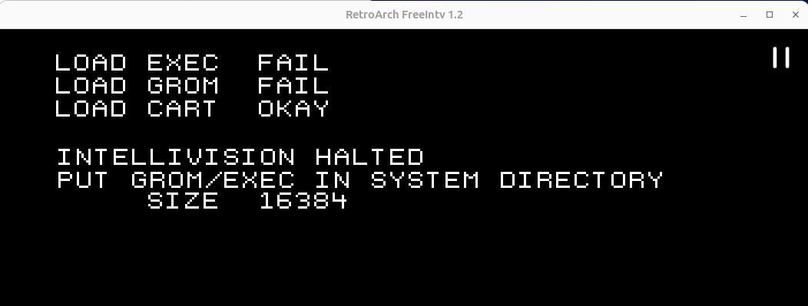
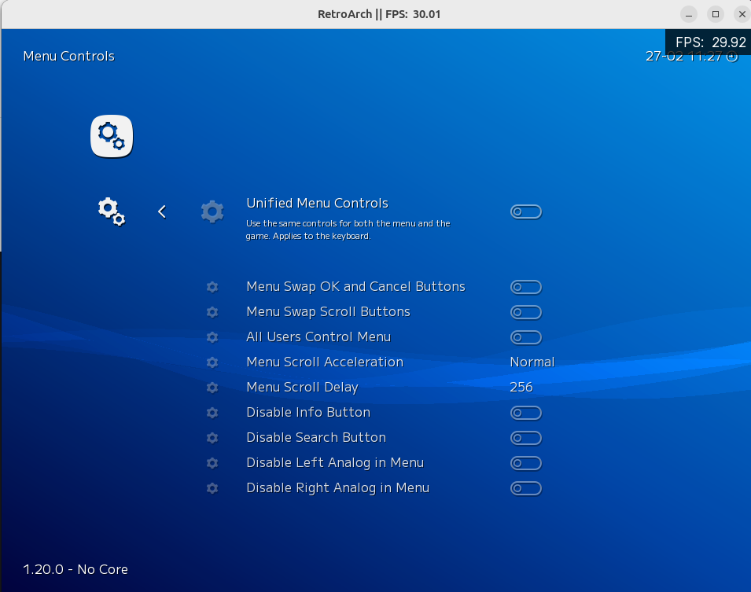
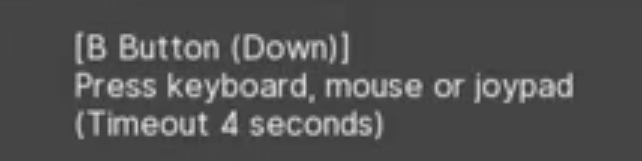
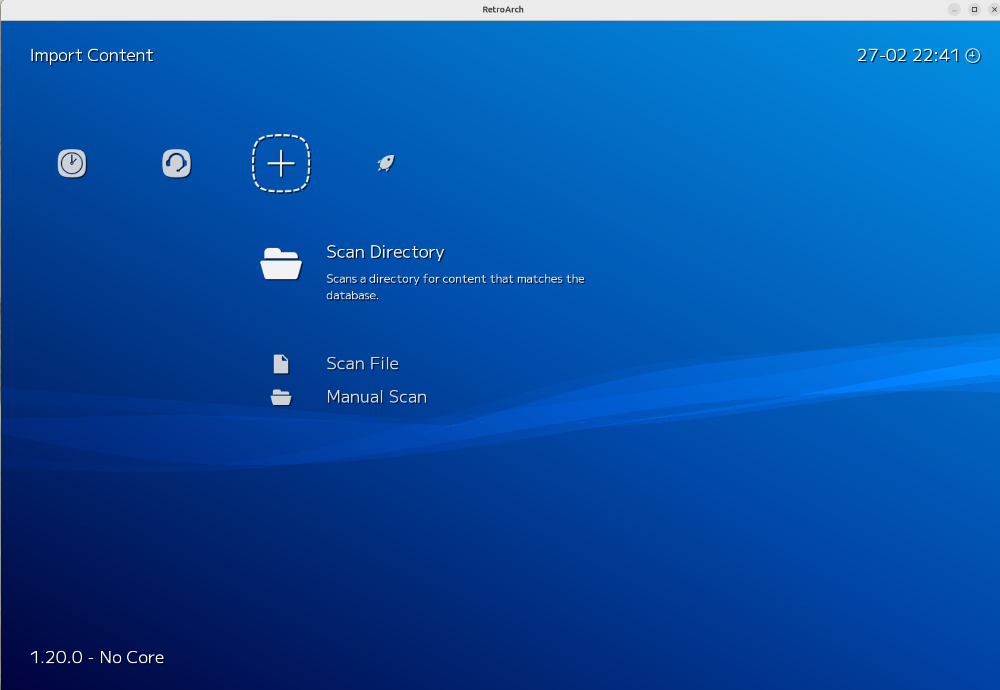
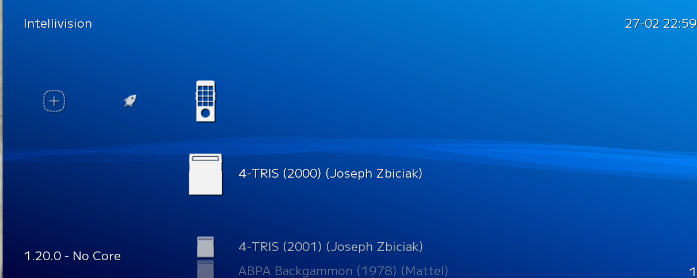

# RetroArch  

# What is RetroArch  


# Resources   

* [RetroArch Starter Guide](https://www.youtube.com/watch?v=icGYGriNkF4)  
  * Start at 14:45  
* [RetroArch Starter Guide](https://retrogamecorps.com/2022/02/28/retroarch-starter-guide/)  
* Guides on Libretro  
  * [Installing RetroArch on Linux](https://docs.libretro.com/guides/install-gnu/)
  * [Getting started with arcade emulation](https://docs.libretro.com/guides/arcade-getting-started/)  
  * There are tons of other good guides here, too  

## Saved For Later  

* [What exactly is Retro Arch? (Reddit)](https://www.reddit.com/r/RetroArch/comments/uddchg/what_exactly_is_retro_arch/?rdt=34458)  
* [How to Install RetroArch on Ubuntu 24.04/22.04/20.04](https://linuxcapable.com/how-to-install-retroarch-on-ubuntu-linux/)  
* [How to install and use RetroArch](https://simpler-website.pages.dev/2022/01/retroarch/)  
* [RetroArch Starter Guide](https://retrogamecorps.com/2022/02/28/retroarch-starter-guide/)  
* [docs.libretro.com - Sony - PlayStation 2 (Play!)](https://docs.libretro.com/library/play/)
* [Complete retroarch/libretro bios pack "2024" (latest with geolith core bios)](https://www.reddit.com/r/Roms/comments/1d8qi0d/complete_retroarchlibretro_bios_pack_2024_latest/)  
* [Download Bios For Retroarch](https://retroarchemu.gitlab.io/bios/)  
* [RetroArch Starter Guide (YouTube)](https://www.youtube.com/watch?v=icGYGriNkF4)  
* [The Open-source PlayStation 3 Emulator](https://rpcs3.net/)  
* [Getting started with arcade emulation](https://docs.libretro.com/guides/arcade-getting-started/)  


# RetroArch Files  

## Local Base  

The local files are located: 
* For Linux: `~/.config/retroarch`  
* For Android: either `storage/emulated/0/RetroArch` or `data/data/com.retroarch`  

## Changing Default Locations  

You can change the default location of _any_ folder by going into `Settings/Directory` and then picking the directory you wish to alter (you can also see the current setting here as well, which is helpful).  

> You will notice that _most_ of the default directories are in your home directory (i.e. `~/.config/retroarch`); that said, there may be a few that are global (i.e. `Cores`, `Core Info`). These do not _have_ to be global, but if you have multiple people using the PC, it may be preferable.   

## retroarch.cfg  

`retroarch.cfg`, located in the [local base directory](tools/retroarch/retroarch_basics?id=local-base), is a file that contains most of the settings of RetroArch.  


## Saves  

'Saves' seem to be a directory for specific ROMs. It is a directory called `saves` and is located in the [local base directory](tools/retroarch/retroarch_basics?id=local-base).  

## Save States (Location)  

'States' is a directory in the [local base directory](tools/retroarch/retroarch_basics?id=local-base) that stores your save states.  

## System (Location)  

'System' is a directory in the [local base directory](tools/retroarch/retroarch_basics?id=local-base) that stores your BIOS files.  

> This is just a default - you _can_ tell RetroArch to store the BIOS files elsewhere in the settings (i.e. the `system_directory` setting in [retroarch.cfg](tools/retroarch/retroarch_basics?id=retroarchcfg)).  

---  

# Games  

## Game Files  

Games are generally referred to as 'ROMs'. They are known as a 'ROM' because the games are extracted from the 'read-only memory' (i.e. ROM) chips inside a game cartridge. That said, games have many different file extensions, including (but not limited to):  
* .zip  
* .7z  
* .int  
* .iso  
* .cdi  
* .nes  

> Games are often zipped - for larger / complicated games its best to leave these zipped, but for smaller games (NES, etc), it may be best to unzip them (although you do not have to).  

## Where to Get ROMs  

Since most of these are copyrighted, I cant list where to get them directly. Often they are sold on Amazon for about 60 dollars - search for `retropie games` and you will find SD cards sold for retropie that have 10k+ games on them; you just need to figure out where the games are contained on the SD card and then you have them. These often come with the disclaimer that you need to delete the games you have not actually purchased directly from the game maker.  

## Game File Names  

When naming games, its good to use the <font color="green">No Intro Naming Convention</font>.

`Name of game (Region(s)) (Other Information).(extension)`  

For example:  
* `Street Fighter II (USA) (Rev 1)`    
* `Street Fighter II (J) (V1.5)`  


## Building Game Libraries  

RetroArch can play games from dozens of platforms (Nontendo, SNES, Genesis, Atari, and even stuff like arcade games and game from Gamecube, PS2, etc). You will have to organize your games somehow. What I like to do is have a main folder that contains all of my games with subfolders for each platform (i.e. Nintendo, Genesis, Atari, etc). You may break them out further (for example, I have a 'nes' folder for my Nintendo games, which contains folders that group the games under them). Your game ROMs will be stored in the appropriate directories.  

> You will also want a `BIOS` folder for BIOS files, but - you can place them all in this folder (no need to separate by platform). The default location for these is the ['system' folder](tools/retroarch/retroarch_basics?id=system-location).   

---  

# Cores  

Every emulated game platform requires a core. The available cores are listed on Libretro, but some of the popular ones are:  
* [Arcade - MAME 2003](https://docs.libretro.com/library/mame_2003/)  
* [Arcade - MAME 2003+](https://docs.libretro.com/library/mame2003_plus/)  
* [Arcade - MAME 2010](https://docs.libretro.com/library/mame_2010/)  
* [Arcade - FinalBurn Neo](https://docs.libretro.com/library/fbneo/)  
* [NES](https://docs.libretro.com/library/compatibility/nes/)  
* [Super NES](https://docs.libretro.com/library/compatibility/snes/)  
* [Mattel Intellivision](https://docs.libretro.com/library/freeintv/)  
* [Atari 800/5200](https://docs.libretro.com/library/atari800/)  
* [Sega - MS/GG/MD/CD (Genesis Plus GX)](https://docs.libretro.com/library/genesis_plus_gx/)  
* [Sony PS1](https://docs.libretro.com/library/beetle_psx_hw/)  
* [Sony PS2](https://docs.libretro.com/library/play/)  
* ... and others, including different versions of the above  

Some systems need 'BIOS' files, which are needed for the system (BIOs files system files that are embedded in a console that allow the games to run). BIOS files are needed at times, but not always.  

> BIOs files are also copyrighted, similar to ROMs.  

## Downloading Cores  

If you wish to use a specific gaming platform (i.e. NES, Genesis, Neo-Geo, MAME Arcade, etc), you _must_ download its core first. 

The list is intimidating, but here is my list (borrowed heavily from the [RetroArch Starter Guide](https://retrogamecorps.com/2022/02/28/retroarch-starter-guide/)):  
```
Arcade (FB Alpha 2012) -- for low-end devices
Arcade (FinalBurn Neo) -- fighting games and beat'em ups
Arcade (MAME 2003-Plus) -- all-around arcade emulation
Atari - 2600 (Stella)
Atari - 5200 (a5200)
Commodore Amiga (PUAE)
DOS (DosBox-Pure)
Mattel - Intellivision (FreeIntv)
Minecraft (Craft)
NEC PCE/TG-16/PCE-CD/TG-CD (Beetle PCE)
Nintendo DS (melonDS)
Nintendo GB/GBC (Gambatte)
Nintendo GBA (gpSP or mGBA)
Nintendo NES (Nestopia or fceumm)
Nintendo SNES (Snes9x Current)
Nintendo 64 (ParaLLEl or Mupen64Plus)
Nintendo GameCube/Wii (Dolphin)
Nintendo Virtual Boy (Beetle VB)
ScummVM -- point-and-click PC games
Sega Dreamcast (Flycast)
Sega Master System/Genesis/CD (Genesis Plus GX)
Sega 32x (PicoDrive)
Sega Saturn (YabaSanshiro or Beetle Saturn)
Sinclair - ZX Spectrum (Fuse)
SNK Neo Geo (FinalBurn Neo)
Sony PlayStation (DuckStation, SwanStation, or PCSX ReARMed)
Sony PlayStation 2 (PCSX2)
Sony Playstation Portable (PPSSPP)
```  


To download a core:  

1\. Go to `Main Menu\Core Downloader`  

2\. Click on a core to download.  


## Updating Cores  

To update the cores (and this will have to be done at least once, but should be done periodically):  

1\. Go to `Main Menu`  

2\. Go to `Online Updater`  

3\. Select `Update Installed Cores`  

---  

# BIOS  

For some game consoles you will need a BIOS file (or a few BIOS files); for example, when I tried playing an Intellivision game I got this:  

  

Apparently, there is a file named `grom` and one named `exec` that I need to put in the [system directory](tools/retroarch/retroarch_basics?id=system-location)  

> Where can you get BIOS files? I never fully found out, but [this thread on Reddit](https://www.reddit.com/r/Roms/comments/1d8qi0d/complete_retroarchlibretro_bios_pack_2024_latest/) may have the answer.  

---


# Menu 

To go through the menu, you will - at least initially - have to use a combination of the mouse and your keyboard arrows. Note that once you enter a menu option, sometimes the only way to get out of it is by clicking the mouse and not the directional pad (i.e. once you are in a menu, you may have to use the mouse to get out of it). For example, in the below screenshot, I clicked on the `Settings` icon and then `Input` and then `Menu Controls` - to get out of it, I had to click the 'double gear' icon with the mouse, and then the other 'double gear' icon to get back to the main menu:  

  

> Using [a controller](tools/retroarch/retroarch_basics?id=controllers) makes this **much easier**, as you can use the `A` button to confirm and the `B` button to cancel / go back.  

---  

# Controllers  

## Pairing a Controller  

!> If you have Steam installed, Steam can and will interfere with the controllers - even if Steam is not running. If your controller does not work, you may have to open steam and go to `Steam/Settings`, then find the `Controller` section, then toggle on one (ore more) of the following: `Enable Steam input for Switch Pro controllers`, `Enable Steam input for Xbox controllers`, or `Enable Steam input for generic controllers`. The one you need is indicated by what RetroArch thinks it is: when you turn on the controller, RetroArch will pop up with a message like `Pro Controller not configured` or `Xbox Controller not configured` - this will give you a clue as to what you need to toggle on. Unfortunately, you may have to leave Steam running when you want to play RetroArch. As a note, other guides say to _turn these off_, but in my case, they _were_ off and I had to turn them on / leave Steam running for the controllers to work.  


Most controllers will work with RetroArch (even PLaystation controllers); they simply need to be paired to RetroArch. Most controllers are plug and play, but if they arent, you can configure it.  

1\. Plug the controller in / connect via Bluetooth.  

2\. Navigate to Settings (the 'double gear' icon), then 'Input' (a controller icon), then 'RetroPad Binds' (another controller icon), then 'Port 1 Controls' (or whatever controller 'port' you wish to use).  

3\. Select 'Set All Controls'  
* Once you do this, RetroArch will put a popup on the screen, telling you to press specific buttons on the controller - this will map these buttons to the controller. An example:  
  
 * If you make a mistake, you can individually map the button.  

> If you wish, you can go into `Input\Menu Controls\Menu Swap OK and Cancel Buttons`, as RetroArch assumes old style for OK (button `A`) and Cancel (button `B`), but modern controllers swap these.  


## Setting Hotkeys  

Its nice to set controller hotkeys. to do so:

1\. Go to `Settings\Input\Hotkeys`  

What I use:  

| Idea | Keyboard | Controller |   
| --- | --- | --- |   
| RetroArch Menu | `F1` | `X` |   
| Quit (Game) | `q` | Start |   
| Toggle FPS | `F3` |  |   
| Load State | F4 | Left Shoulder (L1) |   
| Save State | F2 | Right Shoulder (R1) |   
| Next Save State Slot | F7 | Up |   
| Previous Save State Slot | F6 | Down |   
| Pause | `p` | `A` |   
| Reset | `h` | `B` |   
| Fast Forward | `space` | Right Fire (R2) |   
| Rewind | `r` | Left Fire (L2) |   
| Hotkey Enable |  | Select |   
* Your `Hotkey Enable` button is _critical_ - without it, you cannot issue any of the above commands with the controller  
  * You can still issue commands with the keyboard, even without the hotkey enabled  
  * To issue any command with the controller, you must hold the `Hotkey` (in my case, select) and _then_ press the additional key.  
* To remove a binding, click the `Y` button on the controller.  
* To add a key binding, click the appropriate topic with the mouse.  

## Connecting Already Paired Controllers  

Once paired and your hotkeys set, RetroArch is usually pretty good about automatically detecting a controller that is connected (either via Bluetooth or a wired connection). That said, I find that connecting the controller _before RetroArch is launched_ is better, as if you connect the controller while RetroArch is running, the directional pad will not work and you will have to restart RetroArch. Your mileage may vary.  

---  

# Playlists  

Playlists are where your games are listed.  

## Importing Games  

Navigate to the Import Content (+) symbol a la:  
  

You could just use `Scan Directory`, but you only want to do this if you have unzipped ROM files that have a unique file extention.  If, however, your ROMS are zipped _or_ their extention is not unique to that console, a manual scan is better.  

To perform a manual scan:  

1\. Select `Manual Scan`  

2\. For `Content Directory`, select the folder that contains your ROMs  
  * This should be a folder that contains ROMs of ONE console type  

3\. Select `<Scan This Directory>`  

4\. Select `System Name` - here you will select a console (NEX, Genesis, Playstation, etc)  

5\. Select `Default Core` - here you will select a core (that you hopefully previously downloaded)  

6\. Select any other options you would like.  

7\. Select `Start Scan`  

At this point, a new 'Header' will appear in the top row - since I imported Intellivision games, I got an Intellivision controller to appear, along with all of my games!  
  

## Importing Arcade Games  

Importing arcade games is mostly the same as [importing any game in other systems](tools/retroarch/retroarch_basics?id=importing-games), with two caveats:  
* Generally, you can leave the games zipped  
* Setting the 'Arcade DAT file'  

Chances are, you downloaded your arcade games from a common source; most of these common sources use the same name for the zip file (for example, the Japanese version of 'The Simpsons' for 2 players is `simps2pj.zip`). 'The Simpsons' is almost straightforward, but not all are - because of this, there exist .xml files that convert these common file names to one more recognizable in English; the [retrogamecorps page](https://retrogamecorps.com/2022/02/28/retroarch-starter-guide/) suggests you use [this xml file](https://github.com/libretro/mame2003-libretro/blob/master/metadata/mame2003.xml). Save that file somewhere on your hard drive. When [importing any game in other systems](tools/retroarch/retroarch_basics?id=importing-games), select `Arcade DATA File` during setup and select this file. the games displayed will now have a more recognizable English name!  


## Playlist Locations  

Once created via [importing games](tools/retroarch/retroarch_basics?id=importing-games), a `.lpl` file is saved in `~/.config/retroarch/playlists` - it will be named after the system you selected. This file will house all of the games you just imported via the manual scan. 

It has a bunch of things in there, but the critical ones (as far as individual games are concerned) are:  
```
    {
      "path": "/home/user/ROMs/snes/Street Fighter II - The World Warrior.smc",
      "label": "Street Fighter II - The World Warrior",
      "core_path": "DETECT",
      "core_name": "DETECT",
      "crc32": "00000000|crc",
      "db_name": "Nintendo - Super Nintendo Entertainment System.lpl"
    },
```
* path - the path to the ROM file.  
* Label - What the ROM file will show as in the menu.  

## Organizing Playlists  

Your ROM collection may get unwieldly. To combat this, what I like to do is create a directory in the playlists directory (i.e. a 'stored' directory a la `~/.config/retroarch/playlists/stored`) and store my .lpl files in there; if I want that listing to show up, I quite RetroArch, copy the target .lpl file to the `~/.config/retroarch/playlists` directory, and then restart RetroArch.  This is a decent way to manage playlists!


---  

# Troubleshooting  

## Choppy Gameplay (Nvidia)  

If you have choppy gameplay and you have a NVidia GPU, you will want to turn off Vsync. To do so:

1\. Go to `Settings\Video\Synchronization`  

2\. Toggle `Vertical Sync (VSync)` to 'off'  
