# Linux Quick Reference
<!-- clear for public use -->

# Before We Begin

## Purpose of Notes

The purpose of these notes is to explain some basic Ubuntu Lunix / Debian commands. While most of these commands will work for CentOS or Red Hat (or others), there is no guarantee they will work.

## Account References

Please note that there are a few times I reference user accounts (or other things) that will be unique; I try to make this obvious, but the three items that may not be obvious are `uperson`, `aa1234`, and `zz6789`; if you see anything that says one of these three words, I am referencing a user account (usually your own). If you see `uperson` or `aa1234`, substitute your own account in, and if you see `zz6789` I am usually referencing your account on a foreign system.

# A Note On Unique Identifiers

There are a few unique identifiers that are used to identify systems. I will go over a few of these now.

## UUIDs

UUIDs (or, in Microsfot-speak, GUIDs) are universally unique identifiers; they are a 128-bit number that, in theory, uniquely identify items (although there is no true way of guaranteeing they are unique). UUIDs are practically used to uniquely identify items.

An example of a UUID would be `67ca4724-b2ef-4949-a95a-45a1afde16ad`.

Under most circumstances, a UUID cannot be changed. There are two times this is not true: its possible to hack the UUID, and virtual machine hypervisors have the ability to change a VMs UUID (as, by their nature, there is no physical portion of a VM that can be tied to a UUID).

## MAC Addresses

A media access control address (MAC address) is a unique identifier assigned to a network interface controller (NIC); usually, they are hard-coded into the network device (a WiFi card, an Ethernet card, etc). Routers use the MAC address to identify the device connecting to it, as each NIC - in theory - has a unique MAC address.

The format of a MAC address is an octet if 6 hexadecimal numbers separated by a colin. An example would be `02:DC:92:31:7C:ED`.

Under most circumstances, a MAC address cannot be changed. There are two times this is not true: its possible to hack the MAC address, and virtual machine hypervisors have the ability to change a VMs WiFi / ethernet MAC address (as, by their nature, there is no physical portion of a VM that can be tied to a MAC address).

To find your MAC address, run the command `ifconfig -a`; an example is below:
```
enp2s0: flags=4163<UP,BROADCAST,RUNNING,MULTICAST>  mtu 1500
        inet 192.168.1.101  netmask 255.255.255.0  broadcast 192.168.1.255
        ether d8:ce:3a:2c:56:43  txqueuelen 1000  (Ethernet)
        RX packets 12251873  bytes 15417520234 (15.4 GB)
        RX errors 0  dropped 0  overruns 0  frame 0
        TX packets 8948782  bytes 8716419846 (8.7 GB)
        TX errors 0  dropped 0 overruns 0  carrier 0  collisions 0
```

The MAC address of this etnernet connection is `d8:ce:3a:2c:56:43` (its identifiable as its the only octet with 6 groupings separated by ':' in the data dump). You may have multiple MAC addresses listed (as each connection that represents a card (ethernet or WiFi) has a MAC address assigned by the manufacturer), but the one the router sees is the one that is connected to the router (look for the network interface that has an IP which is visible to other VMs or hosts - that is your external MAC address).

# Becoming Root

In most circumstances, one would simply type the following to access the Root account (if one was granted Root permissions):
```
sudo su -
```

## Knowing Who You Are - whoami

The `whoami` command is important any time you are switching to and from root (or anything else, for that matter); sometimes, you forget what account you are logged in as.  To check, simply type this at a command line and it will tell you:
```
whoami
```

# Updating / Upgrading All Packages

Typically, its important to update all packages before installing any new package (note: this does not actually change them, it simply updates info on them).  This is done by [becoming root](/ubuntu/linux_notes?id=becoming-root) and then running the following:
```
apt-get update
```

Occasionally, you should update all packages which actually modifies all packages. To do this, [become root](/ubuntu/linux_notes?id=becoming-root) and then running the following:
```
apt-get upgrade
```

**<font size="4">Problems With Updating/Upgrading</font>** <br>

Rarely, you may get an error like this when you run the update/upgrade (as an example)
> Internal Error, No file name for libapt-pkg4.12. 

If you get an error similar to this, [follow these instructions](http://askubuntu.com/questions/178879/apt-get-broken-cannot-fix-or-remove-libapt-pkg4-12) to correct this error:
```
dpkg --configure -a
apt-get -f install
apt-get update
apt-get upgrade
```

---

# Using VI

vi is an old text editor you will use to edit files in Ubuntu. vi is run from the terminal and has two modes: 
* Edit mode - edit mode allows you to edit the file
* Command mode - command mode allows you to navigate the file or quit / save.
 * To enter command mode from edit mode, just press the escape button.
 * Commands
   * Edit mode - <pressing the escape button> exits the edit mode and enters command mode
   * Command mode (type/press the command in quotes below, but don't type the quotes):
     * "Shift+G" - takes you to bottom of the file.
     * "i" - pressing i will enter edit mode, inserting text before the highlighted character.
     * "Shift+A" - pressing shift+A will go to the end of the current line and then enter edit mode.
     * "x" - pressing x in command mode will delete the character that is highlighted
     * "dd" - pressing d twice deletes the entire current line.
     * ":quit!" - typing this quits vi without saving.
     * ":wq!" - typing this will save the file and quit out of vi.

---

# Manipulating Directories

## Show Current Directory

To see the current directory you are in, type: `pwd`

## Changing Directories

To change the current directory, type: `cd DIRECTORY`.

For example, to change the directory to /opt/app, type: `cd /opt/app`.

It should also be noted that the `..` has special meaning: up one level. For example, if we were in the directory /opt/app/ and we typed `cd ..`, we would go up one level and would be in /opt. If we were in /opt/app nad typed `cd ../..`, we would be back at `/`.

## Listing Items in a Directory

The basic command to list all items in the current directory is `ls`; `ls` can be used to show everything in the directory (outside of hidden files and directories which start with a dot, but you can use the -a flag to show them if you wish).

Some popular `ls` option flags are:

| Flag      | Description      |
| ------------- |-------------|
| -a, --all   | Do not ignore entries starting with . (a dot).   |
| -c      | with -lt: sort by, and show, ctime (time of last modification of file status information); with -l: show ctime and sort by name; otherwise: sort by ctime, newest first            |
| -k, --kibibytes       | default to 1024-byte blocks for disk usage (do not use with -h)      |
| -h, --human-readable       | with -l and/or -s, print human readable sizes (e.g., 1K 234M 2G) (do not use with -k)      |
| -l       | use a long listing format      |
| -r, --reverse       | reverse order while sorting      |
| -t       | sort by modification time, newest first      |
| -X       | sort alphabetically by entry extension      |

> Of particular interest is the -c option, which forces the time displayed as 'last accessed' time; without -c, the 'modified time' is displayed instead.

You can also list a directory **OR** filename after the `ls` command to get a remote directory or single filename info. For example, this shows the info for everything in the directory that contains the string '20120131', using a long listing format, in reverse order, by modification time:
```
ls -lcrt *20120131*
```

## Making A Directory

If you want to make a directory, the command is `mkdir`. A helpful flag is `-p` which builds the inner directories.

For example, if dirA exists but dirB does not exist, and we want to ultimately build dirC, this command will build both dirB and dirC at the same time:
```
mkdir -p /dirA/dirB/dirC
```

## Copying Files

The base command to copy a file is `cp`. Files that are copied are left intact.

Some popular `cp` option flags are:

| Flag      | Description      |
| ------------- |-------------|
| -p   | preserve the specified attributes (default: mode,ownership,timestamps), if possible additional attributes: context, links, xattr, all   |
| -i, --interactive       | prompt before overwrite (overrides a previous -n option)      |
| -n, --no-clobber       | do not overwrite an existing file (overrides a previous -i option)      |
| -R, -r, --recursive      | copy directories recursively            |

It should be noted that wildcards in file names can be used too.

This example copies the /home/user/TEST.txt file to /home/user/TEST2.txt:
```
cp /home/user/TEST.txt /home/user/TEST2.txt
```

Example: Copy all Python files in the current directory to a backup directory:
```
cp *.py /home/user/python_backups
```

Example: Copy all files in /home/user/Pictures/ to the /backups/pics/ directory:
```
cp /home/user/Pictures/* /backups/pics/
```

Example: Copy all files and directories (and all of their files) from /home/user/Pictures/ to /backups/Pictures/ :
```
cp -r /home/user/Pictures/ /backups/
```

!> This is different than the previous example; in this example, it copies the ENTIRE directory - contents and name - to /backups/. If the Pictures directory did not exist before in /backups/ it does now, and all sub-directories (and their contents) in Pictures are copied too. In the previous example, only the files (but not the sub-directories) were copied, and the initial directory itself was not copied in the previous example (in the previous example, the final resting place was /backups/pics/ and not /backups/pics/Pictures/).
 
## Moving Files

The base command to copy a file is `mv`. The initial file is destroyed and moved to the location you specify.

Some popular `mv` option flags are:

| Flag      | Description      |
| ------------- |-------------|
| -i, --interactive       | prompt before overwrite (overrides a previous -n option)      |
| -n, --no-clobber       | do not overwrite an existing file (overrides a previous -i option)      |
| -t, --target-directory=_destination_       | Move all sources into the directory destination.      |


> By its nature, `mv` is recursive for directories.


Example: Rename the file (in the current directory) TEST.txt to TEST3.txt:
```
mv TEST.txt TEST3.txt
```

Example: Move TEST.txt (in the current directory) into the directory Pictures:
```
mv TEST.txt Pictures
```

Example: Move a file from the current directory to /home/user/Pictures and rename it 'picturetest.txt':
```
mv TEST.txt /home/user/Pictures/picturetest.txt
```

Example: Move two files into the /home/user/Pictures directory (NOTE with the -t flag, the target directory is first):
```
mv -t /home/user/Pictures TEST.txt TEST2.txt
```

Example: Same as above (move two files into the /home/user/Pictures directory) but do not use -t (so we have to place the target directory last):
```
mv TEST.txt TEST2.txt /home/user/Pictures
```

Example: /home/user/Pictures is a directory; **IF** /home/user/Photos exists, /home/user/Pictures move into /home/user/Photos; if /home/user/Photos does not exist, /home/user/Pictures is renamed to /home/user/Photos. The takeaway is if the target directory exists, the moved directory is moved into the target directory; if the target directory does not exist, the moved directory is renamed as the target directory.
```
mv /home/user/Pictures /home/user/Photos
```

## Deleting \ Removing Files and Directories

The command `rm` can delete files and directories, with a catch: directories cannot be removed without the -r or -d flag.

Some popular `rm` option flags are:

| Flag      | Description      |
| ------------- |-------------|
| -i       | prompt before every removal      |
| -r, -R, --recursive       | remove directories and their contents recursively      |
| -d, --dir       | remove empty directories      |

Example: delete file TEST.txt
```
rm TEST.txt
```

Example: delete directory /home/user/Photos:
```
rm -r /home/user/Photos
```

Example: delete everything in the current directory:
```
rm -r *
```

!> Be VERY careful with `rm -r *` - make SURE you know your current directory, as if you do this in / you basically just deleted the server! Moral of the story is ALWAYS use `pwd` to see your current directory before using `rm -r *`.

---

# Piping and Redirection

> For more info please see [Ryan's Tutorials](https://ryanstutorials.net/linuxtutorial/piping.php).

You have the ability to redirect output from the command line to various things, namely: files and other commands. We will focus on a few here

## Redirecting to a File

Use the greater than `>` sign after a command to redirect its output to a file (instead of to your screen).

> In reality, its actually a `1>` and not ust a `>`; `1>` means 'redirect the standard output to a file', but since this is the default its understood when we truncate it to simply `>`.

for example, lets say we were to run the following command:
```
ls -la /home/aa1234
```

This would print the contents of the directory to the screen. Now lets say that we wanted to save this to a file instead. We could use the `>` after the command, and then write a file name to recdirect to after that like so:
```
ls -la /home/aa1234 > /home/aa1234/myOutput.txt
```

Instead of printing the results of `ls -la /home/aa1234` to the screen, it is instead printed to the file `/home/aa1234/myOutput.txt` which you can view later.

Using the `>` operator will overwrite the file its writing to if it exists. What if we want to append to a file? This is the purpose of `>>`: the `>>` does not overwrite the file, but instead appends to the end of the file.

Finally, if we wanted to redirect the errors to a file, we could use `2>`, which means 'print the errors to this file'.

We can use both too, as in this example:
```
perl myPerlScript.pl 1> myoutput.txt 2> myErrors.log
```

Anything that is printed out normally by myPerlScript.pl will be captured in myoutput.txt, and any errors will be sent to myErrors.log.

We can also direct both using & (&1 means 'redirect to standard output' and &2 means 'redirect to standard error'). Say we wanted to save BOTH regular output and the errors to the same file. We could say
```
perl myPerlScript.pl 1> myresults.txt 2>&1
```

This means 'print the standard output to myresults.txt, but also print standard errors to the standard output' (which, coincidently, prints to myresults.txt).

**<font size="4">Re-directing to /dev/null</font>**

If you do not care about the output at all, you can simply send it all to /dev/null; `/dev/null` is a special 'destination' in the filesystem that acts as a black hole (things that are sent to that 'file' are never used); you can send things to /dev/null if you do not care about them and want to avoid their output from being emailed or written to a file.

For example, if we had a [cron entry](ubuntu/linux_notes?id=cron-basic-automation) that we did not care about the printed output, printed results, or errors (and we did not care about their errors being emailed to us, which can unnecessarily burden the system), we could redirect both their standard output AND errors to /dev/null; an [example cron entry](ubuntu/linux_notes?id=cron-examples) that does just that is:
```
0 9 * * 1 /usr/bin/find /data -mtime +15 -exec rm {} \; > /dev/null 2>&1
```
* The standard output is re-directed to /dev/null with `> /dev/null`, and the errors are sent to the standard output (which is in turn sent to /dev/null) with `2>&1`.

## Piping

The pipe `|` is a special character that takes the output from the left of the pipe and uses it as input for the right.

For example, lets say we wanted to list all files in the current directory, but ignore the files that have the word 'loop' in them; we can do this by:
```
ls -la | grep -v loop
```

This will take the output from `ls -la` and run it through the grep (in this case, the grep returns all lines that do not contain the word 'loop' in them).

---

# Keep Terminal Open

If you have problems with your terminal timing out, you can run a bash script to keep it open (until you press `ctrl + c`). Simply type this in the terminal:
```
while true; do date; sleep 30; done
```

To exit, press `ctrl + c`.

---

# Checking Space

## Check Space of a Directory

The command to check hard disk space is `du` (disk usage). 

Some useful flags
* -k = block size (in kilobytes)
* -h = human readable sizes (it will list a number and then K/M/G/T)
* -c = gives a total as the last line
* -s = summary (seems to be VERY similar to -c)
* -b = forces size in bytes
* -a = all (also lists files)

If you want to list a specific directory, list it after the flags; otherwise, it will just do the current directory.

**<font size="4">DU Examples</font>**

To see the summary of space taken up by a particular directory (in kilobytes), run
```
du -sk /home/uperson
```

To see the space taken up by all directories under the current directory (in kilobytes), run
```
du -k
```

## Check Space Remaining

The command `df` (disk filesystem) can be used to check the free disk space on all mounted filesystems.

The flags are the same as `du`.

**<font size="4">DF Example</font>**

Check free space:
```
df -k
```

## Checking memory

To see the RAM / main memory statistics, type the following:
```
free -t -m
```

This displays the memory in megabytes.

An example:

|        |      total   |     used    |    free   |   shared | buff/cache |  available |
|--------|--------|--------|--------|--------|--------|--------|
|Mem:    |      15938  |      2526   |     8715   |      673  |      4696  |     12429 |
|Swap:   |        975  |         0   |      975   |           |            |           |
|Total:  |      16914  |      2526   |     9691   |           |            |           |

In the example above, there is a total of 16914 MB of memory; the main memory has 8715 free and is using only 2526 MB of memory.

---

# Systemctl

> For more info on systemctl, see [linux.com](https://www.linux.com/learn/understanding-and-using-systemd), and another good resource is [here](https://www.digitalocean.com/community/tutorials/systemd-essentials-working-with-services-units-and-the-journal).

`systemctl` is a command suite of tools that can be used to manage the system; many things can be started, stopped, and investigated with `systemctl`.

To see a list of things that can be managed by `systemctl`, run:
```
systemctl list-units --all
```

## List Systemctl Services

This will list all 'unit' services; if you know of a service, you can look for it using the direct name or wildcards; for example, if you were looking for the mysql service you could type:
```
systemctl list-units mysql*
```

If you have MySQL running, it would return:

```
UNIT          LOAD   ACTIVE SUB     DESCRIPTION
mysql.service loaded active running MySQL Community Server
```

## See Systemctl Statuses

We could see if MySQL was running with a `status` command:
```
systemctl status mysql.service
```

Which would return:
```
● mysql.service - MySQL Community Server
   Loaded: loaded (/lib/systemd/system/mysql.service; enabled; vendor preset: enabled)
   Active: active (running) since Mon 2018-11-05 14:41:54 EST; 4 days ago
 Main PID: 1234 (mysqld)
    Tasks: 28 (limit: 4915)
   CGroup: /system.slice/mysql.service
           └─1234 /usr/sbin/mysqld --daemonize --pid-file=/run/mysqld/mysqld.pid

Nov 05 14:41:47 OptiPlex systemd[1]: Starting MySQL Community Server...
Nov 05 14:41:54 OptiPlex systemd[1]: Started MySQL Community Server.
```

This tells us some basic info, such as its pid and when the service was started.

## Start a Systemctl Service

We could start a service by issuing a `start` command:
```
systemctl start mysql.service
```

## Stop a Systemctl Service

We could stop a service by issuing a `stop` command:
```
systemctl stop mysql.service
```

## Re-start a Systemctl Service

We could stop - and then start again - a service by issuing a single `restart` command:
```
systemctl restart mysql.service
```

## Re-load a Systemctl Service

`reload` does not stop or restart the service; rather, it simply re-reads its configuration files:
```
systemctl reload mysql.service
```

> Under most circumstances you are better off with a `restart` over a `reload`.

---

# Shutting Down / Restarting Server

!> **Caution** you (or someone you know) needs to be present at the server when shutting down a host server; otherwise, you will not be able to turn it back on! Never issue a `poweroff` to a host server remotely - use `reboot` remotely instead.

To shut down the server - without a reboot - run:
```
systemctl poweroff
```
* System users are notified of the shutdown.

To reboot the server, run:
```
systemctl reboot
```
* System users are notified of the reboot.

# Process Handling

A **process** can be thought of as a running program. Each process has a process ID (aka **PID**) which is a number that uniquely identifies the running process.

## Displaying Running Processes

To get a list of all running processes, simply type `ps -ef` (there are many more flags but we will keep it simple). An example output is:

| UID | PID | PPID | C | STIME | TTY | TIME | CMD |
|-----|-----|------|---|-------|-----|------|-----|
| root |     9926  |   2 | 0 | 14:41 | ?  |      `00:00:00` | [kworker/u17:1] |
|root   |  10445  |   2 | 0 | 14:45 | ?    |    `00:00:00` | [kworker/u16:0] |
|aa1234 | 11829 | 25124 |  0 | 14:55 | pts/0 |   `00:00:00` | ps -ef |
|root  |   18936 |    1 | 0 | 12:16 | ? |       `00:00:00` | /usr/sbin/sshd -D |
|root |    23330 | 1514 | 0 | 12:35 | ? |       `00:00:00` | gdm-session-worker [pam/gdm-password] |
|aa1234 | 23334 |    1 | 0 | 12:35 | ?     |   `00:00:00` | /lib/systemd/systemd --user |
|aa1234 | 23335 | 23334 | 0 | 12:35 | ?     |   `00:00:00` | (sd-pam) |
|aa1234 | 23348 |     1 | 0 | 12:35 | ?     |   `00:00:00` | /usr/bin/gnome-keyring-daemon --daemonize --login |
|aa1234 | 23352 | 23330 | 0 | 12:35 | tty2  |   `00:00:00` | /usr/lib/gdm3/gdm-x-session --run-script env GNOME_SHELL_SESSION_MODE=ubuntu gnome-session --session=ubuntu |
|aa1234 | 23354 | 23352 | 1 | 12:35 | tty2  |   `00:01:41` | /usr/lib/xorg/Xorg vt2 -displayfd 3 -auth /run/user/1002/gdm/Xauthority -background none -noreset -keeptty -verbose 3 |
* UID is the user running the process
* PID is the process ID (unique to the running process)
* PPID is the parent PID (aka the process that launched this process)
* STIME is the start time of the process
* TTY is the name of the console that launched the process
* TIME is the amount of CPU time, in minutes, dedicated to this process (note this is NOT time as it is generally understood)
* CMD is the actual command launched

> grep can be used to narrow down the processes; so for example `ps -ef | grep aa1234` would show only the processes by aa1234.

## Terminating a Process

A process can be terminated with the `kill` command. Generally speaking there are two 'flags' most used with `kill`: -9 and -15. -15 is graceful, and -9 is forceful (i.e. immediately terminate the process).

Example: immediately terminate process ID 1533:
```
kill -9 1533
```

!> Always be careful when terminating processes; check the PID twice before killing any process.

---

# Checking CPUs

## Getting General CPU Info

To get general CPU info - like the model name of the processor - cat the /proc/cpuinfo file:
```
cat /proc/cpuinfo
```

## Get the CPU count

To get the CPU count, run:
```
cat /proc/cpuinfo | grep processor | wc -l
```

## Check CPU Utilization

The first method we can use gets the CPU utilization per process; note that thiese %CPU numbers will certainly add up to over 100%, as this is a percentage of a single core (so if there were 8 cores, in theory this could add to 800%).

To check the CPU Utilization on a per process basis (as discussed [here](http://www.cyberciti.biz/faq/unix-command-to-find-cpu-utilization/)):
```
ps -e -o pcpu -o pid -o user -o args
```

Another improved method is to use the `sar` command.

> The `sar` command requires the installation of the package `sysstat`.

Run this command to see overall CPU utilization:
```
sar -u 2 -t 1
```

This will tell you the % of all CPUs used by the user, the system, how much of the CPUs are idle, and a grand average. It will also tell you the CPU count in the header information.


---

# Changing Update Sources: sources.list

The file /etc/apt/sources.list holds the locations of the repositories that should be checked when an update/upgrade is run. 

Alternatively, one may keep source.list as-is and add files in the directory /etc/apt/sources.list.d/ instead (matter of fact, its preferred to use files in the directory and to not edit sources.list). The only caveat to using the directory approach is the files must end in .list (and use the one-line-style format as found from the [sources.list man page](http://manpages.Ubuntu.com/manpages/bionic/en/man5/sources.list.5.html) OR use the Deb822-style format and end in .sources (I personally like the one-line-style that ends in .list).

As it is explained on the [sources.list man page](http://manpages.Ubuntu.com/manpages/bionic/en/man5/sources.list.5.html), the format for two one-line-style entries using the deb and deb-src types is:

> deb [ option1=value1 option2=value2 ] uri suite [component1] [component2] [...] <br>
> deb-src [ option1=value1 option2=value2 ] uri suite [component1] [component2] [...]

* The uri is the location of the repository (usually http or https)
* The suite are things like XXX (where XXX is the Ubuntu version aka 'bionic' for 18.04), XXX-security, XXX-updates, XXX-backports
* The components are things like main, restricted, universe, and multiverse 

## deb vs deb-src

Each source must have a specified type, and for Debian Ubuntu the options are either deb or deb-src.

According to [stackexchange](https://unix.stackexchange.com/questions/20504/the-difference-between-deb-versus-deb-src-in-sources-list#20505), the vast majority of the time we will only use deb; deb-src is for times when you want to compile / inspect the code yourself a la `apt-get source package`.

## sources.list suites

It seems these are different 'buckets' of packages; furthermore, it seems only one suite is listed at a time (so if two different suites need to get info from the same spot, its listed twice, once for each suite). The suites all contain the name of the main Ubuntu version XXX (where XXX is the Ubuntu version aka 'bionic' for 18.04). [Ask Ubuntu](https://askubuntu.com/questions/401941/what-is-the-difference-between-security-updates-proposed-and-backports-in-etc/401960) seems to discuss this:
* **XXX** (not listed, but seems to have one line for ALL sources)
* **XXX-security** - These are obviously the only ones you will have to enable if your computer is connected to the Internet in order to keep you secure. Enabling this is smart. Even if you don't connect to the Internet, it won't hurt. 
* **XXX-proposed** - The proposed updates are updates which are waiting to be moved into the recommended updates queue after some testing. They may never reach recommended or they may be replaced with a more recent update.  Enabling the proposed updates repository can break your system. It is not recommended for inexperienced users.
* **XXX-updates** - These updates contain non-critical updates which can remove major annoyances and broken packages, but which do not affect your security. Other than fixing some, they do not enable any features. Enabling this is generally a good idea. The amount to download as well as the changes are not too big, but it improves your system stability in various ways. 
* **XXX-backports** - Backported updates are pieces of software which come from a newer major release. Thus, they can contain new features, but may also break compatibility with their older version. However, they are compiled specifically for your version of Ubuntu. In effect it saves you the hassle of broken dependencies and major downloads. Enabling this is reasonable if you want new features but don't want your system to be unstable. 

## sources.list components

And what of the components / what do they mean? According to [networkworld](https://www.networkworld.com/article/3305810/linux/how-to-list-repositories-on-linux.html), here are the meanings for a few of them:
* main – officially supported, open-source software. Canonical provides official support for these packages. Every open-source software package included in the default installation is included along with some other important packages.
* restricted – officially supported, closed-source software – e.g., hardware drivers -- supported for the length of the release.
* universe – community-maintained, open-source. The majority of the Ubuntu software comes from this repository. Canonical does not provide official support or updates.
* multiverse – unsupported, closed-source and patent-encumbered software.

---

# Changing Local DNS Mappings: /etc/hosts

In order to change the local DNS mappings, we need to understand what a hostname is; the hostname is simply the name of the machine we are on, and we can find it with the command `hostname`:
```
hostname
```

If you want the [FQDN](https://en.wikipedia.org/wiki/Fully_qualified_domain_name) of your server, type:
```
hostname -f
```

If you want only the domain of your server, type:
```
hostname -d
```

Its possible to locally map a name to an IP. This is helpful when you want to use a name instead of an IP for things like local web addresses, local servers, etc. You can also override official DNS entries here as well.

The file you have to edit is `/etc/hosts`, and an example looks something like this:
```
127.0.0.1       localhost
192.168.1.130   dell-wagenseller.vandalay.com dell-wagenseller
192.168.1.170   wagenseller.mop.main
192.168.1.195   wagenseller.optimized.main


# The following lines are desirable for IPv6 capable hosts
::1     ip6-localhost ip6-loopback
fe00::0 ip6-localnet
ff00::0 ip6-mcastprefix
ff02::1 ip6-allnodes
ff02::2 ip6-allrouters
```


The FQDNs wagenseller.mop.main and wagenseller.optimized.main are meaningless outside of the local computer (as IPs that start with 192.168.X.X are usually internal to whatever router you are on), but behind the router they would go to 192.168.1.170 and 192.168.1.195 respectively.

This computer we ran this on has a hostname of dell-wagenseller, its [FQDN](https://en.wikipedia.org/wiki/Fully_qualified_domain_name) is dell-wagenseller.vandalay.com, and its IP is 192.168.1.130 (we are going to pretend that dell-wagenseller.vandalay.com is a real, reachable place on the internet, even though its not). For entries that have a real FQDN, the format is:
```
IP	FQDN	HOSTNAME
```

For simple mappings for other computers, its just `IP MASKNAME`.

---

# Changing the Hostname

Its very rare that you would have to change the `hostname` of a computer, but here are steps to do so if it is necessary.

[The last section](/ubuntu/linux_notes?id=changing-local-dns-mappings-etchosts) taught us how to find the `hostname`, the FQDN, and the domain.

Now that we know how to find the `hostname` information, here is how we can change it:

1\. [Become root](/ubuntu/linux_notes?id=becoming-root).

2\. Note the hostname by typing `hostname` on the command line.

3\. Edit the name in the file `/etc/hostname` using the editor of your choice (there should only be one line, which is the hostname).

4\. Using the name you found in step 2, edit the file `/etc/hosts` and look for all places that list the name. At the very least, the second line will most likely contain the current hostname, and it should exist once more in this file as well.  Change all places that list the hostname found in step #2.

5\. Run the following: 
```
/etc/init.d/hostname.sh start
```

---

# The Profile

Every user has a .profile file; it is usually located in /home/YOURLOGINHERE/.profile

There are other locations for .profile too:
* Root's file is in /root/.profile
* Everyone sources in the master profile, which is /etc/profile (with no dot).

The profile file houses your personal setup on Linux as well as a bunch of environment variables you want to set.

## Sourcing Your Profile

To 'source' in a file, you are loading the files variables and settings to memory for your persional session.

Every time you make changes to your .profile, they will not take effect until you log out; fortunately you can source in your .profile immediately without logging out by typing the following:
```
source ~/.profile
```

You can also source in a file with a dot like so:
```
. ~/.profile
```

## Variables in .profile

You can store variables in your .profile (which we do in various degrees in the [server build document](ubuntu/server_build)). The basic way to do this is opening your profile and putting a variable at the end like so:
```
TESTVAR="This is a TEST!";export TESTVAR
```
* The name of the variable is TESTVAR
* If the value has spaces in it (like the one above) you MUST wrap it in " or '.
* The `export` actually makes the variable visible - its important.
* The `;` indicates the end of the command; really, we could have made this two commands (the definition and the export), but it makes sense to define variables on one line.
* If need be, we can comment out the variable with a `#` in the front.

Once the variable is [sourced in](/ubuntu/linux_notes?id=sourcing-your-profile), you can display it with an echo command:
```
echo $TESTVAR
```
* While you do NOT use the `$` in the file .profile, you MUST use `$` when referencing it elsewhere.

## Aliases in .profile

Sometimes, you will have to type commands over and over again, and the commands can be lengthy; if you ever have a command that you will repeatedly type that you have trouble remembering, you can create a much smaller `alias` in your .profile file.

As an example, edit your /home/aa1234/.profile file and add the following at the end of the file:
> alias beroot='sudo su -'

The basic format is:
* The word `alias` is the first word.
* The word you want to be the new 'command' you are writing (in our case its beroot, but it can be any alphanumeric word).
* The `=` sign.
* The command that will _actually_ be executed, wrapped in single quotes.

Once you [source in](/ubuntu/linux_notes?id=sourcing-your-profile) your .profile file, you will now be able to type the command (in our case `beroot`) and it will actually execute the substituted command instead!

## Functions in .profile

Much like aliases, You can also have functions in your profile. Here is an example that combines 3 normal git commands:

```
function shortgit { git add --all;git commit -m "$1";git push -u origin master; }
export -f shortgit
```

The basic format is:
* The word `function` is the first word.
* The name of the new function.
* The command that will _actually_ be executed, wrapped in curly braces `{ }` and separated by semicolons `;`.
 * Note that the variables are denoted with a $(N), where N is a number; the example above is `$1`
 * You can have as many variables as you like, but just remember they will be sequential ($1, $2, $3.....$N), and they will be separated by spaces.
* The export of the function

Once you [source in](/ubuntu/linux_notes?id=sourcing-your-profile) your .profile file, you will now be able to type the command (in our case `shortgit`) and it will actually execute the substituted commands instead!

We would call this by typing `shortgit "This is the commit message"` at the terminal.

## .profile Security

While you can put variables and aliases in your .profile, its usually safer / more portable (meaning, you can copy the file and easily move elsewhere) to put any additional variables in another environment file, use [chmod](ubuntu/linux_notes?id=changing-file-permissions) to set the file's permissions to 600 (so only you can read and write to the file) in order to prevent othe people from potentially seeing any passwords in the file, and then sourcing in this additional file in your .profile.

To do this, create an environment file in your home directory:
```
touch /home/aa1234/.myenvironment.env
```

Then, change the permissions with the command `chmod 600 /home/aa1234/.myenvironment.env` so no one else can read its contents.

Next, edit the file /home/aa1234/.myenvironment.env and add whatever you wish; for our example, the contents could be:
> TESTVAR="This is a TEST!";export TESTVAR <br>
> alias testls='ls -la'

Finally, source in this new file in your actual .profile; open the file `/home/aa1234/.profile` add this at the bottom, and save/quit:
> . /home/aa1234/.myenvironment.env


---

# Adding / Modifying Users

> For most group commands, unless you are doing it to yourself, you will have to [become root](/ubuntu/linux_notes?id=becoming-root).

<span> </span>
> This section assumes the user account is 'uperson'.

## Adding a User
To add a user, run this command in the terminal (replace "uperson" with the login account): 
```
useradd -c "Users Name" -d /home/uperson -e "" -f 0 -m -s /bin/bash uperson
```

## Setting a Password
To set their password, run this command (you will be prompted to enter their new password):
```
passwd uperson
```

## Force Password Change

To force a user to change their password on login we can use the `chage` command. The -d flag means the number of days since January 1st, 1970 when the password was last changed; setting this to 0 forces a password change.

To do this for user `uperson` its:
```
chage -d 0 uperson
```

## Changing a User's Default Shell

The shell is a way to style the terminal (and add additional functionality).  The following changes the uperson account's shell to /bin/bash:
```
usermod -s /bin/bash uperson
```

## Changing a Users UID

Each user has a uid, which is a number that uniquely identifies them on the system. This number can be changed. Its rare that the uid would ever have to be changed; the only time it would ever have to be changed is if a foreign entity manages users. To change a users uid to 123456 for user uperson:
```
usermod -u 123456 uperson
```

!> You cannot be logged in to the account uperson when this is done.  This is a bit problematic for admins if there is only one admin built.


## Setting a User as Admin
!> DO NOT DO THIS STEP UNLESS YOU WANT TO DEFINE THIS USER AS AN ADMIN.

To set the user as an admin (aka have the ability to use the sudo command to switch to the root user), run the commands (cannot all be done at once unfortunately): 
```
adduser uperson adm 
adduser uperson sudo 
adduser uperson lpadmin 
adduser uperson sambashare
```

## Deleting a User

To delete a user is `userdel`; to delete the user's home directory as well use the -r flag. 

An example of deleting user `uperson` and their home directory:
```
userdel -r uperson
```

## Changing Ownership of Files

The command `chown` can change the ownership of files. If the user's login is `uperson`, one can change the owner of the file fileName.txt to uperson with:
```
chown uperson fileName.txt
```

If we wanted to change the owner of all files in /temp to uperson, we could use -R (recursive, so all sub-directories and files are also changed) and a *:
```
chown -R uperson /temp/*
```

We can also change the group at the same time; for example if we wanted uperson to own file fileName.txt and we wanted group newGroup to also own fileName.txt, we could do this by:
```
chown uperson:newGroup fileName.txt
```

## Getting User's UID And Groups

There is a very simple way to get a user's UID, their [primary group](/ubuntu/linux_notes?id=primary-and-secondary-groups) ID, and all of their [secondary groups](/ubuntu/linux_notes?id=primary-and-secondary-groups): using the `id` command.

The format is `id uperson`; for example, if we type:
```
id aa1234
```

Something like this is returned:
```
uid=1002(aa1234) gid=1004(trusted) groups=1004(trusted),1005(shady)
```

The user's uid is 1002, the primary group ID (gid) is 1004 (which is the group 'trusted'); finally, ALL groups are listed (primary first, followed by all secondaries - in this case the only secondary is called 'shady' and it has a group ID of 1005).

## Unlocking a User

Occasionally, a user will try to log in too many times with the wrong password and will lock their account. To unlock an account - assuming the account is `uperson` - [become root](/ubuntu/linux_notes?id=becoming-root), then run:
```
pam_tally --user=uperson --reset
```
---

# Adding / Modifying Groups

> For most group commands, unless you are doing it to yourself, you will have to [become root](/ubuntu/linux_notes?id=becoming-root).

Groups add users to collections, and can be used to control user's access. Each file and directory can be accessed by root, its owner, and anyone in its group - so groups can be a powerful thing.

## Listing Existing Groups

To see the existing groups, simply display the file /etc/group (we do this with the `cat` command):
```
cat /etc/group
```

This tells us a few things about the group. A selected sample:

```
adm:x:4:syslog,aa1234
tty:x:5:
disk:x:6:
lp:x:7:
mail:x:8:
news:x:9:
uucp:x:10:
man:x:12:
tape:x:26:
sudo:x:27:aa1234
www-data:x:33:
sambashare:x:126:aa1234
vboxusers:x:127:
aa1234:x:1002:
zz9876:x:1003:
mygroup:x:1005:zz9876,aa1234
```
* The first entry is the group name
* The second entry is some form of password (which is rarely used for groups anymore)
* The third entry is the group ID (GID), which is a number that uniquely identifies the group
* The last entry is a comma-separated listing of all users in that group.
 * Note, for example, that the only user in `sudo` is aa1234
 * The group 'mygroup' has both users zz9876 and aa1234 as members

## Creating a New Group
> We will assume you want to add a new group MyGroupName for the person uperson

To create a new group: 
```
groupadd MyGroupName
```

To add an existing user to a group: 
```
usermod -a -G MyGroupName uperson
```

To change the group owner of a file / directory (note - the -R means recursive, so take -R out if you don't want all subchildren effected): 
```
chgrp -R MyGroupName MyFileOrFolderNameOrStar
```

## Changing a Group Name

To change the group name, use this format:
```
groupmod --new-name NEW_GROUP_NAME OLD_GROUP_NAME
```

The upside of this is it keeps its group ID, so it will not affect access.

## Primary and Secondary Groups

Every user has a single primary group and then none / one / multiple secondary groups. The only real difference between a primary group and a secondary group is when a user creates a file, the group associated with that file is the user's primary group. This is the only difference.

## Adding Users To Groups

To change a user uperson's primary group to `myprimarygroup`, run:
```
usermod -g myprimarygroup uperson
```

To add a user to a secondary group `secondarygroup`:
```
usermod -a -G secondarygroup uperson
```

## Remove User From A Group

The command to remove a user from a group is `deluser`; if we are removing user `uperson` from group `mygroup` then the command would be:
```
deluser uperson mygroup
```

!> You cannot remove a user from their primary group - you can only change their [primary group](/ubuntu/linux_notes?id=primary-and-secondary-groups). Every user built also has a group built with their username, so if you must, change their group back to the group that matches their user name.

## Deleting A Group

The command to delete a group is `delgroup`; if we are removing group `mygroup` then the command would be:
```
delgroup mygroup
```

!> The deleted group must be empty / not contain any users; to see if its empty or not, [list the users in the group](/ubuntu/linux_notes?id=listing-existing-groups).

## Changing Group of a File

Every file has an associated group. its possible to change a file's group ownership with the command `chgrp`. `chgrp` works much like [chown](/ubuntu/linux_notes?id=changing-ownership-of-files) in how files can be changed and how directories can be changed recursively - when in doubt, use methods similar to [chown](/ubuntu/linux_notes?id=changing-ownership-of-files).

Example of changing the group of all files and directories in the current directory recursively:
```
chgrp -R groupName *
```

---

# Changing File Permissions

## Permission Basics

You can set the read, write, and executable permissions for each file and directory. The shorthand is rwx (read/write/execute); each file has 3 groupings of rwx - one for the owner, one for its group, and one for everyone else.

We can see the rwx with a `ls` command; for example,

| Permissions | ----- | Owner | Group  | Size (in KB) | Date | File Name |
| ----- | ----- | ----- | -----  | ----- | ----- | ----- |
| drwxr-xr-x | 3 | aa1234 | trusted  |    4096 | May  4  2018 | temp_VMs |
| -rw-r--r-- | 1 | aa1234 | trusted  |       0 | Nov  8 13:08 | TEST.txt |
| drwx------ | 4 | aa1234 | trusted  |    4096 | Jun 13 17:58 | .thunderbird |
| drwxr-xr-x | 3 | aa1234 | trusted  |    4096 | May  6  2018 | .tooling |
| -rwxrwxrwx | 1 | aa1234 | trusted  |   46125 | Aug 21  2016 | 'Ubuntu Install Instructions (Desktop 16.0.4).docx' |

The first row are the permissions; as you can see, there are 3 groupings of rwx (with a potential 'd' in the front - a 'd' means its a directory). The first triplet is for the owner, the second is for the group, and the third is for everyone else.

Using this example:
* The directory 'temp_VMs' is readable/writable/executable by the owner, is readable/executable by group members, and is readable/executable by everyone else.
* The file 'TEST.txt' is readable/writable by the owner, is readable by group members, and is readable by everyone else.
* The directory '.thunderbird' is readable/writable/executable by the owner, group members have no access at all, and everyone else has no access to this folder.
* The directory '.tooling' is readable/writable/executable by the owner, is readable/executable by group members, and is readable/executable by everyone else.
* The file 'Ubuntu Install Instructions (Desktop 16.0.4).docx' is readable/writable/executable by the owner, is readable/writable/executable by group members, and is readable/writable/executable by everyone else.

> If a directory is not executable, you cannot enter it! A directory must be executable in order to use `cd` on it.

The triplets can be represented by a number from 0 to 7 (so a '5' would mean its readable and executable but not writable); the numbers and what they represent are below:

| # | Permission | rwx |
| --- | --- | --- |
| 7 | read, write and execute | rwx |
| 6 | read and write | rw- |
| 5 | read and execute | r-x |
| 4 | read only | r-- |
| 3 | write and execute | -wx |
| 2 | write only | -w- |
| 1 | execute only | --x |
| 0 | none | --- |

We can think of each triplet as representing one (0 to 7) number: to re-write the `ls` results above using the 0 to 7 scheme we get:

| Permissions | Permissions (0 to 7 Scheme) | File Name |
| ----- | ----- | ----- |
| drwxr-xr-x | 755 | temp_VMs |
| -rw-r--r-- | 644 | TEST.txt |
| drwx------ | 700 | .thunderbird |
| drwxr-xr-x | 755 | .tooling |
| -rwxrwxrwx | 777 | 'Ubuntu Install Instructions (Desktop 16.0.4).docx' |

## Special File Designator

When running the `ls` command, we see one character in front of the permissions; this is the `special file` designator. Here are the possible values of this and what they mean:

| Value | Meaning |
| ----- | ------- |
| - | This item is a regular file. |
| d | This item is a directory. |
| c | This item is a character device. |
| l | This item is a symlink. |
| p | This item is a named pipe. |
| s | This item is a socket. |
| b | This item is a block device. |
| D | This item is a door, which is not native to Linux and has been ported from elsewhere. |


## Changing Permissions

The command to change permissions is `chmod`; outside of the (0 to 7) triplets, `chmod` works much like [chown](/ubuntu/linux_notes?id=changing-ownership-of-files) in how files can be changed and how directories can be changed recursively - when in doubt, use methods similar to [chown](/ubuntu/linux_notes?id=changing-ownership-of-files).

The format is:
```
chmod permissions filename
```

An example is changing the permissions of TEST.txt to rwx-r-xr-x:
```
chmod 755 TEST.txt
```

Another example is changing permissions to rwxrwx--x for all files in the current directory recursively; to do this, we would type:
```
chmod -R 771 *
```

---

# File Shortcuts / Symlinks

You can create links to files, much like you can in Windows (shortcuts): in Linux, they are called links, and they can either be hard links or soft links / symbolic links /symlinks.

> In this section, filesystems are referenced. A filesystem is a way that an operating system organizes files on a disk, and they can be things like harddrives, USB thumb drives, and other things that can store files.

<span></span>
> A good explanation of hard links and symlinks can be found [on YouTube](https://www.youtube.com/watch?v=aO0OkNxDJ3c).

**<font size="4">Soft Links / Symbolic Links / Symlinks</font>**


Soft Links / Symbolic Links / Symlinks (these names are interchangeable) simply reference another file; they simply point to another file. They take very little space and can span filesystems. Opening symlinks and changing their contents will change the contents of the original file, as the link is pointing to the original file.

The basic setup of creating a symlink is:
```
ln -s TargetFileOrDirectory NewSymLinkPathAndDirectory
```
* `ln` is the command to make the link
* The '-s' flag means we are making a symlink.
* TargetFileOrDirectory is the **full** path to the file (or directory) to which we are linking.
 * A good rule of thumb is to always use the **full** path - if you are in the directory and just use the filename or relative directory name, the link in the new location will also try to use the local name but it will obviously fail and be a broken link.
* NewSymLinkPathAndDirectory is the **full** path to the link you are creating.
 * If the link is to a directory, the new name should not have an extension.
 * IF the link is to a file, the link should share the file extenstion of the target.

Example: Make a symlink to the directory /home/aa1234/photos and store the new link in /home/aa1234/temp/myphotos:
```
ln -s /home/aa1234/photos /home/aa1234/temp/myphotos
```

If we were to navigate to /home/aa1234/temp with a `cd /home/aa1234/temp` and then type `ls -la` it would display the following:
> lrwxrwxrwx 1 aa1234 aa1234 23 Nov 11 12:17 <font color="#34E2E2"><b>myphotos</b></font> -&gt; <font color="#729FCF"><b>/home/aa1234/photos</b></font>

This is showing us that the directory is myphotos, but the '->' means its a link and the 'real' directory is '/home/aa1234/photos'. If we were to navigate to '/home/aa1234/temp/myphotos', performing a `pwd` (which just gives us our current directory) would indeed show '/home/aa1234/temp/myphotos', even though we are actually in '/home/aa1234/photos'. If we went up one directory with a `cd ..` it would still show us as in '/home/aa1234/temp'. Traversing the symlink directory means it acts _exactly_ like a real directory. 

> Note that if your terminal supports color, the link above will be in blue; if the link was broken, however, it would be red. IF you see a red link it means its broken (the target does not exist) and will not work.

We can now treat '/home/aa1234/temp/myphotos' as we would '/home/aa1234/photos', with the exception of a delete/move/rename; if you were to delete the symlink with a `rm /home/aa1234/temp/myphotos`, only the symlink is deleted - the real directory '/home/aa1234/photos' will remain. That said, if you were to delete (or otherwise move or rename) the real directory '/home/aa1234/photos', the symlink '/home/aa1234/temp/myphotos' would remain and be a broken link.

!> This is why you must be careful with deleting, renaming, or moving files or directories; if they had a symlink made using them as a base, the link will remain but will be broken.

We can also create softlinks of files too:
```
ln -s /home/aa1234/TEST.txt /home/aa1234/temp/TEST.txt
```
* Note that we _still_ had to use the _full_ path for the target /home/aa1234/TEST.txt here; this is critical.

We could now use the file '/home/aa1234/temp/TEST.txt' as we would '/home/aa1234/TEST.txt': we can open the symlink, view it, and change its contents and '/home/aa1234/TEST.txt' would also change. If we were to delete the link '/home/aa1234/temp/TEST.txt', the base file '/home/aa1234/TEST.txt' would remain intact. If we were to delete (or otherwise move or rename) the base file '/home/aa1234/TEST.txt', though, '/home/aa1234/temp/TEST.txt' would still exist but it would be a broken link.

**<font size="4">Hard Links</font>**

> Under most circumstances, you will want to create symlinks and not hard links as the limitations to being bound to one partition make hard links cumbersome; that said, there are a few specific times hard links are preferable.

In contrast to a symlink, a _hard link_ does not point to the original file itself; rather, it points to the same physical location in the filesystem. This is a nuanced point, but whereas if the original file in a symlink is deleted, moved, or renamed it would break the symlink; a hard link, on the other hand, would still work as the link points to the _location_ on the disk and not the original file itself; in this sense, hard links have a bit more freedom over symlinks as they are harder to break. Even if you deleted the original file completely, the hard link would still work perfectly fine.

They have less freedom in another sense, though, as a hard link **cannot** span filesystems (whereas a symlink can); what this means is you cannot create a hard link if the location of the original file and the location of the hard link span filesystems (meaning, they are on different partitions, one is on a USB thumb drive and the other is on your hard disk, etc). Hard links **must** be on the same disk.

Hard links act as symlinks otherwise: if you change the hard link, you also change the original file and vice versa.

To create a hard link, simply omit the '-s' flag from the `ln` command:
```
ln /home/aa1234/TEST.txt /home/aa1234/temp/TEST.txt
```
* Unlike symlinks, you do **not** need the full path to the file to whatever we are linking to; since we are pointing to a location on the hard disk and not a file, there is no ambiguity with the original file name as it does not matter.

---

# Packages

A 'package' can be thought of as a piece of software for Linux / Ubuntu. There are several operations you can perform on packages.

## Searching For A Package

You can search for a package using the following command:
```
apt-cache policy NAME_OF_PACKAGE
```

This will return _all possible_ packages with that name, installed or not; so this search is effectively a search through all possible packages.

> You can use \* too, so `apt-cache policy mysql*` would return all potential packages you could install concerning MySQL.

**<font size="4">'apt-cache policy' Package Example</font>**

For example, if I type `apt-cache policy mysql-common*` the following is returned:
```
mysql-common-5.6:
  Installed: (none)
  Candidate: (none)
  Version table:
mysql-common:
  Installed: 5.8+1.0.4
  Candidate: 5.8+1.0.4
  Version table:
 *** 5.8+1.0.4 500
        500 http://us.archive.ubuntu.com/ubuntu bionic/main amd64 Packages
        500 http://us.archive.ubuntu.com/ubuntu bionic/main i386 Packages
        100 /var/lib/dpkg/status
```

There are two possible packages that have this name: `mysql-common-5.6` and `mysql-common`. `mysql-common-5.6` is not installed and there is no candidate. `mysql-common` IS installed (version `5.8+1.0.4` is displayed, meaning its installed) and the most recent candidate is `5.8+1.0.4` (and since both are the same thing, this package is up to date on my machine).

## Searching Only Installed Packages

To search for only _installed_ packages, this command can be used
```
apt list --installed
```

You can include names (and the * wildcard) as well on the end to search for installed packages with specific names:
```
apt list --installed mysql*
```

## Installing A Package

If you wish to install a particular package, the first thing you must do is [become root](/ubuntu/linux_notes?id=becoming-root) and then update the package list, so run `apt-get update` .

Once that is done, [locate the package you wish to install](/ubuntu/linux_notes?id=searching-for-a-package) and then run the following:
```
apt-get install NAME_OF_PACKAGE
```

## Installing A Non-Listed Package

Sometimes, you will find and download a .deb file from the internet that you have to manually install that does not exist when you [search through packages](/ubuntu/linux_notes?id=searching-for-a-package); in these instances you cannot use the [normal package install](/ubuntu/linux_notes?id=installing-a-package) and you must use the `dpkg` command.

Care must be used when using `dpkg`, as it is a primitive version of `apt-get install` in the sense that it will **not** install packages it depends on; if a package is not installed that it needs, it will simply tell you you need to install the package and then fail. When using `dpkg`, be aware of this in case it happens.

Once you have the .deb filename and location and wish to install it using `dpkg`, [become root](/ubuntu/linux_notes?id=becoming-root), update the package list with `apt-get update`, and then run the following:
```
dpkg -i LOCATION_AND_FILE_NAME_HERE.deb
```

**<font size="4">Installing a Non-Listed Package WITH Dependency Support</font>**

> This requires the package `gdebi` to be installed.

There is a way to install a non-listed / internet downloaded .deb file that will also install dependencies - the `gdebi` command. An example is:
```
gdebi LOCATION_AND_FILE_NAME_HERE.deb
```

## Converting a .RPM to .DEB

!> To do this you must have the package `alien` installed

.rpm is for 'Red Hat Linux' distributions of Linux; .deb is for 'Debian Linux' distributions (Ubuntu is a Debian distribution). In some cases you can get ahold of a .rpm package but not a .deb package; its possible to convert a .rpm file to a .deb file which we can then install [with these instructions](/ubuntu/linux_notes?id=installing-a-non-listed-package).

To convert:
```
alien LOCATION_AND_FILE_NAME_HERE.rpm
```

We can also convert a .deb file to a .rpm:
```
alien -r LOCATION_AND_FILE_NAME_HERE.deb
```

## Upgrade Specific Package

Usually, an [update / upgrade](/ubuntu/linux_notes?id=updating-upgrading-all-packages) will update all packages, but there are times when you do not want to use a blanket upgrade and you only want to upgrade a specific package. 

First, you must [become root](/ubuntu/linux_notes?id=becoming-root), then update the package list with `apt-get update`; then, to update a specific package, run the following:
```
apt-get install --only-upgrade NAME_OF_PACKAGE
```

## Removing A Package

If you wish to install a particular package, the first thing you must do is [become root](/ubuntu/linux_notes?id=becoming-root) and then update the package list, so run `apt-get update` .

To remove the package, run:
```
apt-get --purge remove NAME_OF_PACKAGE
```

There may be packages that were installed to support this package (the system automatically marks which packages were manually added OR were added only as support for other packages that were manually added); if there are packages that were not manually added AND do not support any other existing packages, this command will delete these packages:
```
apt-get --purge autoremove
```

!> There still may be some user-level configuration info left behind - [see this post on Ask Ubuntu](https://askubuntu.com/questions/151941/how-can-you-completely-remove-a-package#151943) for more information.

---

# snap Packages

> For more on snap, [see here](https://itsfoss.com/use-snap-packages-ubuntu-16-04/).

`snap` is a new packaging system (I am not sure exactly how it interacts with traditional [packages](ubuntu/linux_notes?id=packages)). The main advantages of snap seem to be:
* **All** dependencies are contained in the snap file, whereas .deb files do not.
* Snap packages automatically update themselves.
* There are claims that snap is more secure (although there is evidence to suggest otherwise).

Each individual snap is a read-only [squashfs](https://en.wikipedia.org/wiki/SquashFS) filesystem image; therefore, it will show up in [/dev](ubuntu/linux_notes?id=dev) as separate disks called 'loopX' (where 'X' is an integer).

> For most snap commands you will have to [be root](/ubuntu/linux_notes?id=becoming-root).

## Installing snap

To install snap itself, [become root](/ubuntu/linux_notes?id=becoming-root), and then run:
```
apt-get update
apt-get install snapd
```

## Finding Packages with snap

To find packages to install with snap, run:
```
snap find packageName
```

Fortunately, the search will return all matching packages using some back-end search magic.

For example, if we try `snap find mysql` the following is returned:
```
Name                Version          Publisher        Notes    Summary
mysql-experimental  5.7.16           ltangvald        -        Experimental MySQL Community snap
mysql               5.7.17           ltangvald        -        Experimental MySQL Community snap
smonitor            0.0.2beta-amd64  jes              -        Monitoring of server states (and other things)
datagrip            2018.2.4         jetbrains✓       classic  IntelliJ-based IDE for databases and SQL
sync-and-dump-s3    0.9              scorching+shade  -        Sync aws s3 buckets and Upload dumps of mysql and mongodb
restore-dump-s3     1.017            scorching+shade  -        Restore dumps of mysql and mongodb from aws s3 buckets
nextcloud           13.0.7snap1      nextcloud✓       -        Nextcloud Server - A safe home for all your data
dbeaver-ce          5.2.4            rasul-dbeaver    -        Universal Database Tool
gogs                0.1              vtuson           -        golang based git server and ui
audovia             3.7.1.2          songbuilder      -        Database application for making music using JFugue MusicStrings
squirrelsql         3.8.1            jibel            -        A Java SQL client for any JDBC compliant database
```

As it can be seen, related packages - even if they do not have MySQL in the name, like datagrip (which is a SQL editor) - are listed.

If you wish to get more info on a specific snap package, run:
```
snap info packageName
```

## Installing Packages With snap

To install a package with snap, find a package and then run:
```
snap install packageName
```

Note that in some cases, packages are installed with the classic confinement and may not work within the standard snap security sandbox; to install these you need to put a --classic at the end like so:
```
snap install packageName --classic
```

In some cases, the packages may not be fully tested, so you have to install an 'edge' version (where 'edge' means 'experimental'). to do so include '--edge':
```
snap install --edge packageName
```

## Installing snap Packages Offline

Its possible to download a snap package and then install it later (or copy the file and install it elsewhere). First, download the target package with:
```
snap download packageName
```

This will download two files to your working directory: a .assert file and a .snap file. To install the snap package, run:
```
snap ack packageName.assert
snap install packageName.snap
```
* You will either have to have the files in the working directory or use their paths in the two lines above.

## View Installed snap Packages

If you want to show all snap packages listed, run:
```
snap list
```

## Upgrading snap Packages

Snap packages are upgraded automatically every so often, but to see which packages are ready to be upgraded run:
```
snap refresh --list
```

And to actually upgrade a snap package, run:
```
snap refresh packageName
```

## Downgrading snap Packages

If you wish to downgrade a snap package for whatever reason, run:
```
snap revert packageName
```

## Removing snap Packages

To delete / remove a snap package, run:
```
snap remove packageName
```

## Running snap Packages

Run snap packages as you would any other command.

## Snap Permissions and Interfaces

> This info was originally [on techfunia](https://www.techfunia.com/a-guide-to-snap-permissions-and-interfaces/) and [on the official snap documentation](https://docs.snapcraft.io/interface-management/6154).

Every snap package is placed in a sandbox, which can be quite restrictive; for instance, most snap packages do not have the ability to open any file outside of your home directory! This can be a headache, but there is a work-around: changing the snap interfaces.

To investigate the interfaces, simply type the following (we will use the package 'notepadqq' as an example):
```
snap interfaces notepadqq
```

For me, this yielded the following:
```
Slot              Plug
:browser-support  discord,gnome-characters,minecraft,notepadqq,spotify
:desktop          discord,gimp,gnome-calculator,gnome-characters,gnome-logs,gnome-system-monitor,minecraft,notepad-plus-plus,notepadqq,spotify,vlc
:desktop-legacy   discord,gimp,gnome-calculator,gnome-characters,gnome-logs,gnome-system-monitor,minecraft,notepad-plus-plus,notepadqq,vlc
:gsettings        discord,gimp,gnome-calculator,gnome-characters,gnome-logs,gnome-system-monitor,notepadqq,spotify
:home             discord,gimp,gnome-characters,gnome-logs,minecraft,notepad-plus-plus,notepadqq,spotify,vlc
:network-bind     minecraft,notepadqq,vlc
:opengl           discord,gimp,minecraft,notepad-plus-plus,notepadqq,spotify,vlc
:optical-drive    notepadqq,vlc
:unity7           discord,gimp,gnome-calculator,gnome-characters,gnome-logs,gnome-system-monitor,notepadqq,spotify,vlc
:x11              discord,gimp,minecraft,notepad-plus-plus,notepadqq,spotify,vlc
-                 notepadqq:media-hub
-                 notepadqq:network-manager
-                 notepadqq:removable-media
```

Notice how the plug 'notepadqq:removable-media' has a '-' slot; this means that notepadqq does not have permissions to interact with removable-media (which is pretty much everything that is not your home directory). We need to change this.

To connect a snap to a slot, the general command is this:
```
snap connect <snap>:<plug interface> <snap>:<slot interface>
```

For our specific instance, the command to connect the snap 'notepadqq' to the slot/interface 'removable-media' is this:
```
snap connect notepadqq:removable-media :removable-media
```
* Note that we did not specify the second <snap> as we wanted to reference the system's slot, and in that case we leave it blank.

notepadqq can not access files outside of our home directory! If we run `snap interfaces notepadqq` again we see that its connected:
```
Slot              Plug
:browser-support  discord,gnome-characters,minecraft,notepadqq,spotify
:desktop          discord,gimp,gnome-calculator,gnome-characters,gnome-logs,gnome-system-monitor,minecraft,notepad-plus-plus,notepadqq,spotify,vlc
:desktop-legacy   discord,gimp,gnome-calculator,gnome-characters,gnome-logs,gnome-system-monitor,minecraft,notepad-plus-plus,notepadqq,vlc
:gsettings        discord,gimp,gnome-calculator,gnome-characters,gnome-logs,gnome-system-monitor,notepadqq,spotify
:home             discord,gimp,gnome-characters,gnome-logs,minecraft,notepad-plus-plus,notepadqq,spotify,vlc
:network-bind     minecraft,notepadqq,vlc
:opengl           discord,gimp,minecraft,notepad-plus-plus,notepadqq,spotify,vlc
:optical-drive    notepadqq,vlc
:removable-media  notepadqq,vlc
:unity7           discord,gimp,gnome-calculator,gnome-characters,gnome-logs,gnome-system-monitor,notepadqq,spotify,vlc
:x11              discord,gimp,minecraft,notepad-plus-plus,notepadqq,spotify,vlc
-                 notepadqq:media-hub
-                 notepadqq:network-manager
```

---

# SSH
There is a way to configure a "paswordless" link from one server to another: using ssh.  How SSH works is it creates a "lock" and a "key" that, if the key fits in the lock, the connection is considered legitimate - otherwise, it is not legitimate and is rejected.

SSH is a very common method of connecting computers; even if you never set up a key to log in automatically, you should at least install ssh on your machine so you can access other machines remotely - or even your own machine from another computer (although without the keys set up you will need to enter your password).

!> Care should be taken with this - if this is a local machine with a desktop version running that accesses the internet via a browser (OR a machine that is not regulated by the rules and regulations of your company), install SSH (its useful and you can still use it with a password) but it is not advised to set up the private key for passwordless entry to production servers.  If your local machine is ever compromised, the attacker will be able to access the production server.

## More On The SSH Lock and Key
The "lock" is a file hidden in your home folder on your computer, with permissions 700 or 600 so no one else can access it but you. The "key" can is public (although it still must have permissions 600 or 700 or else it will not work), and you put the "key" file on the remote server you are accessing. If the public "key" file on the remote server and the hidden "lock" file on your computer complement each other, you can automatically use ssh (or scp) commands to interact with the other server without using a password.
> I used the term "lock" above, but both files are actually referenced as a "public key" (my "key" above) and a "private key" (my "lock" above).  

## SSH Key Setup

> For the purposes of this explanation, the "local" machine is your machine (even if its an actual server, I will call it the local machine), and the "server" is a foreign machine to which you are connecting. Also, we are going to consider 'aa1234' to be our logged-in account on our local machine and the account we are using on the foreign server is zz9876; finally, the remote IP is 123.456.789.999. This explanation was inspired from [this source](http://tuxvoid.blogspot.com/2008/01/how-to-ssh-or-scp-without-password.html).

Assumptions
* It is strongly encouraged to use "rsa" over "dsa" ("rsa" encryption is stronger, and OpenSSH is deprecating dsa); "rsa" is usually the default.
* At one point you will be instructed to name something "authorized_keys"; in *very* old instances (pre 2001) you may have to use "authorized_keys2", but this only on very old systems - you probably can stick with authorized_keys.
* These instructions assume that ssh is configured properly on the remote server; you can test this by attempting to run the command that asks you to log in to the foreign server.
* These instructions assume you have an account on the foreign server.

!> Do not do this as root - use your own account for this.

Steps

1\. Open a terminal on your local machine, navigate to your home directory, and create a folder called .ssh (for our example we are using the account aa1234 as your login, so change it for yours): 

```
mkdir /home/aa1234/.ssh
```

2\. Change the permissions on the .ssh folder to be restrictive (700 - do NOT do 600): 

```
chmod 700 /home/aa1234/.ssh
```

3\. Open a terminal on the server.  You can actually use SSH to do this now without your local machine having SSH configured (it must be installed, though) - you will just have to use your password.  Run this command to connect to the foreign server, replacing 'zz9876' with your account on the foreign server and '123.456.789.999' with the foreign server's IP: 

```
ssh zz9876@123.456.789.999
```

> * The account used for the foreign server can be different than the one used to log in to the local machine, so long as the public key you place on the server matches the private key on your local machine (otherwise you will be prompted for your password) <br>
> * If this is the first time you are connecting, you will be prompted about the authority of the foreign host not being able to be established, and will ask about a key fingerprint.  Say 'yes' and continue.  After the .ssh folder is established on the foreign server you will not be required to do this again, so long as the OS isn't upgraded / changed on the foreign server (if it is you will have to do this again). <br>
> * You will be prompted to enter the password of the account you are using on the foreign server. <br>
> * If this does not work (and you know SSH is installed correctly on the foreign server and you know you have a valid account and its password), there is a problem with the SSH running either on your local machine or the foreign server. <br>
> * Your terminal should now be a terminal for the foreign server (and will be until you exit - be careful!). 

4\. Now that you are connected to the foreign server, navigate to your home directory and create the .ssh folder as we did for our local machine (it may already be created - also make sure this folder is owned by your account): 

```
mkdir /home/zz9876/.ssh
```

5\. On the foreign server, change the permissions on the .ssh folder to be restrictive (as we did on the local machine): 

```
chmod 700 /home/zz9876/.ssh
```

6\. Log out of the foreign server by running the command:  `exit` .  Note this may be "logout" for some servers.  Your terminal should now return to your local machine.

7\. Back on your local machine, create the public and private key by running the following command (note: it may ask you for a passphrase, only enter one if you want to use this passphrase the very first time you set up a ssh connection to a specific server):

```
cd ~/.ssh
ssh-keygen -t rsa -b 4096 -f id_rsa
```
* We use '-b 4096' to specify the key size (in bytes); the standard is at least 2048, but 4096 is recommended.
* '-f id_rsa' simply specifies the private key name we are creating (id_rsa); this is why we changed the directory to your HOME/.ssh folder.

8\. Two files should have been created In the .ssh folder: id_rsa (or otherwise known as the private key) and id_rsa.pub (otherwise known as the public key). Change their file permissions to 600: 

```
chmod 700 /home/aa1234/.ssh/*
```

9\. We must now copy the id_rsa.pub file to the foreign server.  To do this we will use another command available in SSH, called SCP.  This command will push the file id_rsa.pub to the foreign server from our local machine.  Run this command:

```
scp /home/aa1234/.ssh/id_rsa.pub zz9876@123.456.789.999:/home/zz9876/.ssh
```

> * The file /home/aa1234/.ssh/id_rsa.pub is the file we are pushing to the foreign server. <br>
> * The directory /home/zz9876/.ssh is the destination folder for the file

10\.	Use SSH to log back in to the remote server: 

```
ssh zz9876@123.456.789.999
```

11\. You are now in the foreign server.  Navigate to the .ssh folder: 

```
cd /home/zz9876/.ssh
```

12\. Rename the file id_rsa.pub to "authorized_keys" (no extension): 

```
mv id_rsa.pub authorized_keys
```

13\. If "authorized_keys" already exists, open id_rsa.pub, copy the last line, and past it as the last line in the existing "authorized_keys" file.

14\. Set the permissions of "authorized_keys" to 600:

```
chmod 600 /home/zz9876/.ssh/*
```

15\. Log out of the foreign server: `exit`

16\. The setup should now be complete!  You can now test it out - run: 

```
ssh zz9876@123.456.789.999
```

* If you get in without being prompted for a password, the SSH setup was successful,  If you are prompted for a password the setup failed.  If something went wrong, check to make sure your home directory on both the foreign server and your local machine is set to 700, make sure both .ssh folders are set to permissions 700, make sure the contents of the .ssh folder are set to permissions 600, and make sure your authorized_keys file on the foreign server is set to 600.  Check to see if you are set to the owner of your home directory on the foreign server (sometimes you are not).  If this doesn't work, copy authorized_keys and save it as authorized_keys2 (so now you have two files in .ssh on the remote server, one for SSH and one for SSH2). 
* Don't forget to log out with an 'exit' command!
* You can now use the SCP command without a password (covered earlier) as well.

## Setting Up Multiple Keys

Its possible to set up multiple keys for either A) multiple logins to the same server, B) logins to multiple servers, or C) some combination of 'A' and 'B'. In order to do this we must do a few things.

!> You should be your own account for this - _NOT_ root!  

> Note that `~` represents the directory of your home folder; so `~` really means `/home/yourLoginHere`, where your login (and home directory) is `yourLoginHere`.

1\. Make sure you have [set up a SSH key and it is working properly](ubuntu/linux_notes?id=ssh-key-setup).

3\. Make a new directory in your `.ssh` folder (you can call it whatever you want, but we will call it `serverA_userA`; to do this run: `mkdir ~/.ssh/serverA_userA`.

4\. Change the user setting for the folder: `chmod 700 ~/.ssh/serverA_userA`

5\. Move your `id_rsa` and `id_rsa.pub` to the folder made in step 3. Note I also change the name of these files to make what they are unambiguous:
```
mv ~/.ssh/id_rsa ~/.ssh/serverA_userA/serverA_userA_rsa
mv ~/.ssh/id_rsa.pub ~/.ssh/serverA_userA/serverA_userA_rsa.pub
```

6\. Make sure that any `id_rsa` and `id_rsa.pub` file in your initial `~/.ssh` folder is either renamed, moved, or deleted (otherwise the system may try to use this as a default).

7\. Make a file in your `~/.ssh` folder named 'config': `touch ~/.ssh/config`

8\. Set the permissions of the `config` file to `700`: `chmod 700 ~/.ssh/config`

9\. Place your connection information - which will contain the location of the private key file - in the `config` file. Here is an example of that config file:


> <font color="blue">Host</font> someshortname realname.example.com  
> &nbsp;&nbsp;&nbsp;&nbsp;<font color="blue">HostName</font> realname.example.com  
> &nbsp;&nbsp;&nbsp;&nbsp;<font color="blue">IdentityFile</font> ~/.ssh/somefolder/realname_rsa  
> &nbsp;&nbsp;&nbsp;&nbsp;<font color="blue">User</font> remoteusernameX  
> &nbsp;&nbsp;&nbsp;&nbsp;<font color="blue">IdentitiesOnly yes</font>  
>  <br>
> <font color="blue">Host</font> serverA 10.0.0.1  
> &nbsp;&nbsp;&nbsp;&nbsp;<font color="blue">HostName</font> 10.0.0.1  
> &nbsp;&nbsp;&nbsp;&nbsp;<font color="blue">IdentityFile</font> ~/.ssh/serverA_userA/serverA_userA_rsa  
> &nbsp;&nbsp;&nbsp;&nbsp;<font color="blue">User</font> userA  
> &nbsp;&nbsp;&nbsp;&nbsp;<font color="blue">IdentitiesOnly yes</font>  
>  <br>
> <font color="blue">Host</font> serverA 10.0.0.1  
> &nbsp;&nbsp;&nbsp;&nbsp;<font color="blue">HostName</font> 10.0.0.1  
> &nbsp;&nbsp;&nbsp;&nbsp;<font color="blue">IdentityFile</font> ~/.ssh/serverA_userB/serverA_userB_rsa  
> &nbsp;&nbsp;&nbsp;&nbsp;<font color="blue">User</font> userB  
> &nbsp;&nbsp;&nbsp;&nbsp;<font color="blue">IdentitiesOnly yes</font>  
>  <br>
> <font color="blue">Host</font> serverB 10.0.0.2  
> &nbsp;&nbsp;&nbsp;&nbsp;<font color="blue">HostName</font> 10.0.0.2  
> &nbsp;&nbsp;&nbsp;&nbsp;<font color="blue">IdentityFile</font> ~/.ssh/serverB_userC/serverB_userC_rsa  
> &nbsp;&nbsp;&nbsp;&nbsp;<font color="blue">User</font> userC  
> &nbsp;&nbsp;&nbsp;&nbsp;<font color="blue">IdentitiesOnly yes</font>  
>  <br>
> <font color="blue">Host</font> serverC 10.0.0.3  
> &nbsp;&nbsp;&nbsp;&nbsp;<font color="blue">HostName</font> 10.0.0.3  
> &nbsp;&nbsp;&nbsp;&nbsp;<font color="blue">IdentityFile</font> ~/.ssh/serverC_userA/serverC_userA_rsa  
> &nbsp;&nbsp;&nbsp;&nbsp;<font color="blue">User</font> userA  
> &nbsp;&nbsp;&nbsp;&nbsp;<font color="blue">IdentitiesOnly yes</font>  
>  <br>
> <font color="blue">Host</font> serverC 10.0.0.3  
> &nbsp;&nbsp;&nbsp;&nbsp;<font color="blue">HostName</font> 10.0.0.3  
> &nbsp;&nbsp;&nbsp;&nbsp;<font color="blue">IdentityFile</font> ~/.ssh/serverC_userB/serverC_userB_rsa  
> &nbsp;&nbsp;&nbsp;&nbsp;<font color="blue">User</font> userB  
> &nbsp;&nbsp;&nbsp;&nbsp;<font color="blue">IdentitiesOnly yes</font>  

* The general idea is there is one entry per server/user combination.  
* Anything in blue are keywords and are necessary; anything not in blue you will have to provide.
* `remoteusernameX` is the user name on the _remote_ server.
* `IdentityFile` contains the location of the private key used for user `remoteusernameX`.
* `IdentitiesOnly yes` attempts to disallow the use of the file `~/.ssh/id_rsa` if you forgot to delete that file.

10\. Test out your SSH connection(s).


!> You MUST make sure that any `id_rsa` and `id_rsa.pub` file in your initial `~/.ssh` folder is either renamed, moved, or deleted; otherwise the system may try to use this as a default!

> If you want an example on how to do this with GitHub, [here](https://stackoverflow.com/questions/2419566/best-way-to-use-multiple-ssh-private-keys-on-one-client/3828682#3828682) is a good example of that.

## Pushing / Pulling Files With SCP

> The `-q` option in scp disables the progress meter as well as warning and diagnostic messages from ssh.

We demonstrated above on how to push a file to a remote server with the following command:

```
scp -q /home/aa1234/.ssh/id_rsa.pub zz9876@123.456.789.999:/home/zz9876/.ssh
```

If you wanted to copy a file from the server to your local machine, you could run this kind of command (note - this is for a demonstration only, don't run this now)
```
scp -q zz9876@123.456.789.999:/home/zz9876/testFileInHomeDirectory.txt /home/aa1234
```

If you wanted to copy several files from the foreign server at once:
```
scp -q zz9876@123.456.789.999:/home/zz9876/* /home/aa1234
```

* Note for a pull, the structure is a bit different.
 * The file /home/zz9876/testFileInHomeDirectory.txt is being pulled from the remote server.
 * The file will be put in the directory /home/aa1234 on our local machine.

You can also run commands on the foreign server and have their results sent to your screen (which can be scraped by a language such as perl); for example, to get the file contents of the remote /home/zz9876 directory, run: 
```
ssh zz9876@123.456.789.999 ls -la /home/zz9876
```

## Using SFTP

SFTP (Secure FTP) is a part of the SSH bundle - it works similar to ftp.

> When using SFTP, the directory you were in before entering SFTP is critical, as all files that are to be pulled from your base server must be located here, and all files you pull from the remote server will be saved here.

SFTP works like SSH in the sense that once you enter it, you are on the foreign server until you exit explicitly. To enter the server (assuming you are username uperson and the server IP is 192.168.1.1), type the following:
```
sftp uperson@192.168.1.1
```
If passwordless keys are set up you will be placed into the server, and if not you will have to give a password.

You are now on the server; you can run limited commands like `cd` and `ls -ltr`. 

**<font size="4">Pushing Files to Server with SFTP</font>**

To push file 'desktopText.txt' to the server, type:
```
put desktopText.txt
```
* Note you are hopefully in the folder that contains desktopText.txt before you connected with sftp.

**<font size="4">Getting Files From the Server with SFTP</font>**

To get a file from the server, type:
```
get remoteFile.txt
```
* The file will get saved to whatever your current directory is back on your home base machine.

To get multiple files from the server, type:
```
mget *.py
```
* This gets all the python files.

**<font size="4">Exiting SFTP</font>**

To exit SFTP, type:
```
bye
```
## Managing Remote Host ID Changing

Sometimes an OS will be reinstalled on a remote machine and you will get something like this:
```
@@@@@@@@@@@@@@@@@@@@@@@@@@@@@@@@@@@@@@@@@@@@@@@@@@@@@@@@@@@
@    WARNING: REMOTE HOST IDENTIFICATION HAS CHANGED!     @
@@@@@@@@@@@@@@@@@@@@@@@@@@@@@@@@@@@@@@@@@@@@@@@@@@@@@@@@@@@
IT IS POSSIBLE THAT SOMEONE IS DOING SOMETHING NASTY!
Someone could be eavesdropping on you right now (man-in-the-middle attack)!
It is also possible that the RSA host key has just been changed.
The fingerprint for the RSA key sent by the remote host is
30:c1:5d:e2:f0:c2:7c:9f:61:35:47:e2:ef:66:ef:6c.
Please contact your system administrator.
Add correct host key in /home/aa1234/.ssh/known_hosts to get rid of this message.
Offending key in /home/aa1234/.ssh/known_hosts:7
```

There are two ways to fix this. The first is noting the number at the end of the line `Offending key in /home/aa1234/.ssh/known_hosts:7`, putting a 'd' at the end of it, and then running:
```
sed -i '7d' ~/.ssh/known_hosts
```
 * Change the '7d' to whatever number it is plus 'd'

The second method is noting the IP of the remote system (we will say its 168.0.0.1) and then running the command:
```
ssh-keygen -R 168.0.0.1
```
 * Change `168.0.0.1` to the remote IP or hostname.

---

# Using SSHFS

Using SSHFS

!> Please note using SSHFS may be against your company's security policy.

> For more information, please visit [here](http://embraceubuntu.com/2005/10/28/how-to-mount-a-remote-ssh-filesystem-using-sshfs/) or [here](https://www.digitalocean.com/community/tutorials/how-to-use-sshfs-to-mount-remote-file-systems-over-ssh).

SSHFS is a combination of SSH and FTP: its main purpose is to create a semi-permanent (or permanent) connection to a foreign server but have it appear as a local directory.  The advantages are native processes see it as a local directory and can treat it as such, and it is more secure than FTP.  Unlike SSH, SSHFS can only be used for file manipulation (SSH can run commands).

The process of making a foreign directory appear to be a local directory to the operating system is called “mounting”.  Coincidentally, the term “unmount” means to remove the link the system has to the foreign server directory.

Much like SSH, it is not recommended for a local desktop to be permanently mounted to a production server; if your desktop is ever compromised, the malicious entity can also take control of your mounted drives, which could be disastrous if they overwrite your code with malicious code and it is unknowingly run.  Server to server mounts are a bit more secure (and what a permanent mount is made for) but they still carry some risk (desktops are higher due to the nature of browsing the Internet and installing more untrusted programs).

For the purposes of this explanation, the “local” machine is your machine (even if its an actual server, I will call it the local machine), and the “server” is a foreign machine to which you are connecting.

Make sure the SSH package is installed; as root, update and then run `apt-get install sshfs`.

For the purposes of this explanation, we are going to consider our logged-in account on our local machine is `geralt`, the account we are using on the foreign server is `uperson`, and the foreign server IP is `155.165.204.146`. These instructions assume you have an account on the foreign server.

## SSHFS: Mounting

Select a directory to use as a mount point; in other words, pick a directory that will be a “portal” to the foreign server.  This directory will act as the level above the foreign server's base directory you chose to mount to.  For our purposes we are going to select the local folder `/media/Robin`.

Make sure you either own or have write privileges to the folder you select (in our case to `/media/Robin`).  If you do not, you will not be able to interact with the folder.

To mount the foreign server directory `/home/uperson` to our local `/media/Robin` directory, run this command: 
```
sshfs uperson@155.174.20.116:/home/uperson /media/Robin
```

While this works, its better to expressly identify the user who is doing the mapping: this can be achieved by using the flag '-o uid=X' (where X is a integer representing a uid). To get the uid, use the `id` command (for example, `id uperson`) which will return the desired users uid. Once you have this info you can use the sshfs mount with the following command:
```
sshfs -o uid=1002 uperson@155.174.20.116:/home/uperson /media/Robin
```

The foreign directory should now be visible as a local folder!  To access the contents of the remote drive simply interact with the foreign contents as if they were in the /media/Robin folder.

## SSHFS: Unmounting

When you are finished working, it is a good idea to unmount the directory.  In the event some malicious entity takes control if your machine, leaving these links open may pose a security threat (especially if its to a production node).

To unmount, run: 
```
fusermount -u /media/Robin
```

## SSHFS: Permanently Mounting a Directory

!> Again, take caution with this – permanent mounts left open are easier for malicious entities to take advantage of than mounting / unmounting on an as-needed basis.  Permanent mounting is only recommended for server-server connections (where the restrictions on potentially malicious software are more prevalent as well as not having internet browsers installed), connections to test servers (that have no actual information about how to connect to a live server including passwords, SSH private keys, etc) or to systems that are public or read only.

Steps:
1\. [Become root](/ubuntu/linux_notes?id=becoming-root)

2\. Open the file /etc/fstab (you will have to open and edit this as root in a terminal session, so you have to use vi or something similar):
```
vi /etc/fstab
```

3\. Make a new line at the end of the fstab file and enter the following (change `uperson` to the foreign account, the IP to the foreign IP, and the foreign folder to whatever you are using):
> uperson@155.174.20.116:/home/uperson /media/Robin

4\. Save the file and exit.

5\. You may have to reboot (not always, check).

# Interacting With WiFi

> I used [this](https://askubuntu.com/questions/461825/how-to-connect-to-wifi-from-the-command-line) article as a launching point for interacting with wife from the command line.

## WiFi SSID Vs WiFi Interface

There are two naming conventions used: the WiFi SSID and the WiFi interface.  The WiFi SSID is the name of the broadcasted network and the WiFi interface is the interface listed with the `ifconfig -a`. 

To get the WiFi interface, type `ifconfig -a`. An example:
```
wlx00e02dc210e0: flags=4163<UP,BROADCAST,RUNNING,MULTICAST>  mtu 1500
        inet 192.168.1.18  netmask 255.255.255.0  broadcast 192.168.1.255
        inet6 fe80::eafc:121b:3cca:269f  prefixlen 64  scopeid 0x20<link>
        ether 00:e0:2d:c2:10:e0  txqueuelen 1000  (Ethernet)
        RX packets 183523  bytes 42902013 (42.9 MB)
        RX errors 0  dropped 1  overruns 0  frame 0
        TX packets 30280  bytes 18577836 (18.5 MB)
        TX errors 0  dropped 0 overruns 0  carrier 0  collisions 0

```
In the above example, the WiFi interface is wlx00e02dc210e0.

## Initial Package

To interact with WiFi you will use the package `network-manager`. After installation, you may have to run network manager once via this command (as root):
```
NetworkManager
```

## See Saved Connections

To see a list of saved connections (this will give the network SSID):
```
nmcli c
```

## See Available WiFi Hotspots

To see a list of available WiFi hotspot WiFi SSIDs:
```
nmcli d wifi list
```

## Connect to a Wireless Network

To connect to a known wireless network with the SSID:
```
nmcli device wifi connect SSID-NETWORK-NAME-HERE password NETWORK-PASSWORD-HERE
```

To connect to a known wireless network with the WiFi Interface:
```
nmcli d connect WIFI_INTERFACE
```

## Disconnect From a Wireless Network

To disconnect, you will need the WiFi interface (from `ifconifg -a`):
```
nmcli d disconnect WIFI_INTERFACE
```

---

# Switching Java Versions

Occasionally, you will have to switch versions of java; for example, if the Java version on deck is not at least 1.7, the PyDev plugin for Eclipse will not work.

To do so, open a terminal and run: 
```
update-alternatives --config java
```

You will now be presented with a list of java versions installed (will be listed as option 0, 1, 2, 3...).  Pick the option number you want and press enter.

To make sure the version of java switched, run: 
```
java -version
```

---

# File Hashes

A hash is a long, alphanumeric string that represents a file. There are many hashing functions, and what they do is accept the file contents as input, and using their algorithm, develops a 'hash' that uniquely represents the file.

For example, lets say we have a file called 'test.txt' and its contents are (in exactly **ONE** line - so do **NOT** press 'Enter' at the end):
```
Did you SEE the dragon?
```

If we were to run this through a `sha1` hashing algorithm, we could do it like this:
```
sha1sum /home/aa1234/test.txt
```

The result would be:
```
fdc7b9c0843ee6647eaa7b0d548a427147f28bf3  test.txt
```

The result `fdc7b9c0843ee6647eaa7b0d548a427147f28bf3` is the result of the hash; this uniquely identifies the contents of this file (the name can change and it would not change the hash). If we were to change the file and make the word SEE lowercase like so:
```
Did you see the dragon?
```

The results of the hash are now:
```
c502f3e3ac85e8cf45828c064beb127cd7a6e4e9  test.txt
```

Note that this is a COMPLETELY different hash, with that small change; matter of fact, adding, subracting, or even changing ONE character fundamentally alters the hash.

There are some unique properties of this that are highly useful:
* The hash character count will always stay constant - in the case of the `sha1sum` algorithm it is always 40 characters in length, if the file has 20 characters in it or two million.
* The probability of two different file contents producing the same hash is VERY low.
* The name of the file does affect the hash.
* The hash is one-way (meaning, it's impossible to go backwards) - so for example, knowing the hash is `fdc7b9c0843ee6647eaa7b0d548a427147f28bf3` there is absolutely no way we can find out the original text was 'Did you SEE the dragon?'
 * This is useful for passwords and this fact is actually used - oftentimes a password itself is not saved, but its hash is. Since there is no way to determine the password from the hash the actual password is safe, and all one has to do is store the hash and every time the user logs in we run the potential password through the hash function and see if it matches what is saved.
* If the contents of the file are altered - at all - a completely different hash is made. This means it can be used as a security check, with websites printing the hash numbers next to the download, with the thought that if a malicious actor alters the executable at any point, you will be able to compare the hashes to see if its the same file.

This is the very basics of the concept of a hash, but there is more to read out there if you are interested.

The basic hashing packages on Linux are:
* `md5sum`
* `sha1sum`
* `sha256sum`
* `sha512sum`

And each of them offer a more complex hash over and above the last. If you see a hash that says 'md5', use `md5sum`; if you see a hash that says 'sha256', use `sha256sum` etc etc.

> `sha256sum` and `sha512sum` may require you to install the `hashalot` package.

If you wanted to simply run some text through a hashing function you could do this using `echo` like so:
```
echo "Did you SEE the dragon?" | sha1sum
```

An alternative would be to use the stdin `<<<` characters:
```
sha1sum <<<"Did you see the dragon?"
```

> The newline character `\n` can intefere with hashing; our file did not have a newline in it (we never pressed 'Enter' in the file), but if we did, we would need to include a `-n` flag in the echo command to accomodate the newline. 

!> If the hash is ever wrong and you do not know why, it probably has something to do with a newline character!


---

# Searching Files

This section is geared towards general file searching.

## Searching For Files: Find

To find a file in Linux, the basic structure is:
```
find /path/to/base/directory -name foo.txt
```

The `-name` flag specifies the name of the file we are looking for (it also accepts the wildcard \*).

If you only want to find directories (and not files), you would use the `-type d` flag:
```
find /path/to/base/directory -type d -name foo*
```
(Conversely, if you only wanted files you could use `type -f`.)


You can also perform actions on the found files with the `-exec` flag; for example, if we wanted to delete all files we find we can run this:
```
find /path/to/base/directory -name foo.* -exec rm i {} \;
```

Anything that comes after the `-exec` flag is a command line command; in this case its `rm` (with the -i flag, which means 'ask me if I want to delete the file before its deleted'). the `{}` is simply a variable holder (so each file found will be put in place of the `{}`), and the `\;` simply means 'this is the end of the executable'.

You can search by file modification time with `-mtime`; the units are in days, and the + means 'more than X days ago' and the - means 'less than X days ago'. For example, the following would find files named foo\* but only if they were modified less than 3 days ago:
```
find /path/to/base/directory -name foo.* -mtime -3
```

Conversely, if we wanted to find files modified more than 5 days ago would use a plus sign:
```
find /path/to/base/directory -name foo.* -mtime +5
```

Finally, we can search by [permissions](ubuntu/linux_notes?id=changing-file-permissions) with the `-perm` flag. For example, if we wanted to search for all files with permissions 755, we would do this; 
```
find /path/to/base/directory -perm 755
```

## Searching Through Files: grep

The `grep` command searches through files for keywords you specify; this can be very powerful when searching. Unlike the [find command](ubuntu/linux_notes?id=searching-for-files-find), `grep` actually looks through the file contents itself for words.

Here are a few flags for `grep`:

| Flag | Meaning |
| ---- | ------- |
| -a | Process a binary file as if it were a text file. |
| -A X | Return the found line PLUS X lines after it (where X is an integer). |
| -B X | Return the found line PLUS X lines before it (where X is an integer). |
| -C X | Return the found line PLUS X lines before it AND X lines after it (where X is an integer); this is a combination of A and B. |
| -c | Instead of returning the found lines, simply return a count of how many times it was found (Words MUST be wrapped in quotes). |
| -E | Use extended regular expressions - more on that [here](https://www.guru99.com/linux-regular-expressions.html). |
| -i | Makes grep case insensitive (grep is natively case-sensitive). |
| -n | Show the line number in the file where the match was found. |
| -r | Recursively look through all sub-directories. |
| -R | Recursively look through all sub-directories AND follow symbolic links (which -r does not do). |
| -v | Inverts the output (print what _doesn't_ match). |

* -v can be helpful to weed out commented lines

A simple example would be if we wanted to search all files in /home/aa1234 for the word 'dragon', we could do this by:
```
grep -ivR "dragon" /home/aa1234/*
```

> You can nest `grep`s with pipes; so for example, if we wanted to find all lines that have the word 'dragon' but wanted to weed out lines with the word 'puff', we could do this like so:
```
grep -i 'dragon' * | grep -vi 'puff'
``` 

`Regular Expressions` are a way to match text using patterns; its very powerful but takes some getting used to. `grep` can use regular expressions if the `-E` flag is set; for more on regular expressions, [please go here](https://www.guru99.com/linux-regular-expressions.html).

## sed

`sed` is a command that is built for text altering; its far more complicated than I care to get into (so I will shamelessly say go to [this digitalocean article](https://www.digitalocean.com/community/tutorials/the-basics-of-using-the-sed-stream-editor-to-manipulate-text-in-linux) to read more on it), but I will go the bare bones you will need to know.

`sed`, by default, takes options and commands and prints the results to the screen. This can be important in some situations, but there is one that is hugely beneficial: finding strings in files and replacing them.

## Replacing Strings in Files

`sed` can actually use a regular expression as a command and perform a string replacement on a file. An example of this is:
```
sed -i 's/shoes/sneakers/g' /home/aa1234/myFile.txt
```

This command:
* The '-i' flag specifies 'we wish to make in-place changes to the file which will be permanent.'
* 's/shoes/sneakers/g' is a [regular expression](https://www.guru99.com/linux-regular-expressions.html), which is a 'command' that finds text (and in some cases replaces it); in this case, we are saying find the word `shoes` and replace it with the word `sneakers` everywhere this combination exists in the file.
* The file we are searching through is '/home/aa1234/myFile.txt'.

Running a command on a file that changes it can be scary, so we can change the option '-i' to '-i.bak' and `sed` will make a backup copy of the file first (which will have an extenstion '.bak'), and then make changes to the original file. Here is an example of that:
```
sed -i.bak 's/shoes/sneakers/g' /home/aa1234/myFile.txt
```

[Regular expressions](https://www.guru99.com/linux-regular-expressions.html) are a powerful concept to find - and in some cases, replace - strings. Their basic format is `s/text to find/text to replace/g` (the 's' and 'g' actually do have meanings and can be changed, but for now just leave them as-is). Note that its pretty easy to screw up a regular expression; to that end, you should **always** escape (meaning: use a `\` in front of) **any** character that is not alphanumeric; these inclue, but are certainly not limited to, `. ! @ $ # % ^ & * - _ + / < > \ ? ' "`.

For example, if we wanted to replace all file references from '/adidas/shoes.txt' to '/adidas/sneakers.txt', we would have to escape the `/` and `.` like so:
```
's/\/adidas\/shoes\.txt/\/adidas\/sneakers\.txt/g'
```

Regular expressions are not just built as a simple text replacement (as we use it above): it can do a whole host of things, like 'replace just one instance of this' or 'find a pattern with these characters repeated' or 'only match if this is found at the end of the entire text'; to deal with these complex situations, non alphanumeric characters are used, so we have to escape these characters to indicate 'we want you to interpret this literally' (but, of course, if you do want to use them please do so with caution).

!> If you want to try out the full power of [regular expressions](https://www.guru99.com/linux-regular-expressions.html) I encourage you to do so, but I also encourage you to back up the target files you are changing and to test your expression to see if its changing what you intend it to change. Regular expressions are powerful but things can and do quickly go wrong with them.

**Find / Replace Strings using 'find' and 'sed'</font>**

The commands `find` and `sed` are a powerful combo when you need to search multiple files and replace text within them (its **strongly** advised you use the '-i.bak' option for sed). An example is:
```
find /path/to/use -type f -exec sed -i.bak 's/shoes/sneakers/g' {} \;
```

This command:
* Uses `find` to find files
 * the /path/to/use is the base path to start the search (it searches itself and all child directories).
 * '-type f' means 'we are looking through files'
 * '-exec' means 'execute the following command'
* Uses `sed` for the find and replace
 * '-i.bak' means 'back-up the file (with a '.bak' extension) before making changes to the file
 * The sed 'command' is the regular expression 's/shoes/sneakers/g', which is saying 'find all instances of the word 'shoes' and replace them with the word 'sneakers'.
* The `{}` is a variable holder for the `find` command; this effectively loops through all files found and places their name where `{}` is, and in turn `sed` will run its regular expression on that file.
* The `\;` just means 'end of the command' and is needed for the `find` command.

## Words Count: wc

The `wc` command can be useful, as it lists the number of lines, words, and characters in a file.  An example is
```
wc /home/aa1234/test.txt
```

It could potentially list something like ` 1  5 24 test.txt`, which would mean: 1 line, 5 words, and 24 characters

If you use wildcards, it will list all files found AND a grand total; for example, if we run this:
```
wc *.doc
```

This is potentially returned:
```
    81   1097  43008 UNIX.doc
   112   1177  46080 Python Description.doc
    86   1076  47104 Machine Learning.doc
   279   3350 136192 total
```

---

# Compacting / Uncompacting Files

## Zip: Adding Files 

> This deals with files that end in .zip

The `zip` command creates a .zip file (or adds to an existing .zip file).

Example: Add 3 files to the new (or existing) zip file myZipFile.zip:
```
zip myZipFile.zip file.txt file.mp3 file.py
```

Example: Add (or update) file.txt to the existing .zip file myZipFile.zip:
```
zip –u myZipFile.zip file.txt
```

Example:  Add (or update) directory myDirectory to the existing .zip file myZipFile.zip (keeps the integrity if the directory structure in the .zip file, but only from itself and down (so it does not capture parent directories)):
```
zip –r filename.zip myDirectory
```

## Unzip: Extracting Files

> This deals with files that end in .zip

The `unzip` command unzips a .zip file.  The -d flag tells unzip where to extract the files.

Example: unzip the contents of /home/user/somefile.zip into /home/aa1234/unzip_folder:
```
unzip /home/user/somefile.zip -d /home/aa1234/unzip_folder
```

## gzip: Zipping One File

> This deals with files that end in .gz but NOT .tar.gz - for .tar.gz use the tar command instead.

gzip is very simple and only compresses one file at a time (if you want multiple files, use tar instead). To gzip the file 'TEST.txt', run:
```
gzip TEST.txt
```

The file TEST.txt disappears and the file TEST.txt.gz is created (the original file is consumed in the process).

If you wanted to keep the original file while using gzip, you would run something like this:
```
gzip -c TEST.txt > TEST.txt.gz
```

## gunzip: Unzipping One File

> This deals with files that end in .gz but NOT .tar.gz - for .tar.gz use the tar command instead.

The counterpoint to `gzip` is `gunzip`, which decompresses .gz (but not tar.gz) files; the decompressed file is deleted in the process. To do a simple decompress of a .gz file, we can run either
```
gzip -d TEST.txt.gz
```

OR we could run

```
gunzip TEST.txt.gz
```

There are a few flags for gunzip too:

| Flag | Meaning |
| ---- | ------- |
| -k | keep the .gz file as well as the uncompressed file |
| -f | force an over-write if the file already exists |

## TAR Archive Files

> For more information, [visit this site](https://www.tecmint.com/18-tar-command-examples-in-linux/).

A tar (tape archive) file is probably the most common compression scheme for Linux; it can be very efficient at compression, it can compress multiple files, and it can preserve directory structures.

tar can compress and decompress collections of files and has a few flags:

| Flag | Meaning |
| ---- | ------- |
| -c | indicates we are creating a new file |
| -r | indicates we are appending to an existing a new file |
| -x | indicates we are extracting from an existing compressed file |
| -t | indicates we simply want to list the files in the compressed file |
| -v | verbosely show the .tar file progress |
| -f | file name of the archive file |
| -z | indicates we are working with a [gzip](ubuntu/linux_notes?id=gzip-zipping-one-file) (a .tar.gz or .tgz) file |
| -j | indicates we are working with a bzip (.tar.bz2) file |

Usually, 
* One flag of c, r, x, or t is present, but never a combination.
* One flag of z, j, or neither is present, but never a combination of z and j.
 * If z or j is missing, you are working with a tar (.tar) file only.
* f is usually present

!> the flags do NOT need a dash '-' in the beginning; under some circumstances it acutally causes an error, so the dash is usually omitted.

> For all of our examples, we will assume the base of the tar file name is 'myTarFile'

Example: Create a tar gzipped file from the contents of the directory /data/metrics
```
tar cvzf myCompressedFile.tar.gz /data/metrics
```

Example: Create a tar bzip2 file from the contents of the directory /data/metrics
```
tar cvjf myCompressedFile.tar.bz2 /data/metrics
```

Example: Decompress a tar file
```
tar xvf myFileCollection.tar
```

Example: Decompress a tar bzip2 file
```
tar xvjf myCompressedFile.tar.bz2
```

Example: Decompress a tar gz file
```
tar xvzf myCompressedFile.tar.gz
```

Example: Decompress a tar bzip2 file to the directory /home/aaa1234
```
tar xvjf myCompressedFile.tar.bz2 -c /home/aaa1234
```

Example: List all files in a tar bzip2 file
```
tar tvjf myCompressedFile.tar.bz2
```

Example: Extract a single file from a tar bzip2 file
```
tar xvjf myCompressedFile.tar.bz2 mySingleFile.txt
```

Example: Extract multiple files from a tar bzip2 file
```
tar xvjf myCompressedFile.tar.bz2 "myFirstFile.txt" "mySecondFile.txt" "myThirdFile.txt"
```

**<font size="4">A Note on TAR, GZIP, and BZIP2 Files</font>**

When using `tar`, you have the option of making a .tar (tar), .tar.gz (gzip), or .tar.bz2 (bzip) file. Here are the main differences:
* Tar files (.tar), by themselves, are not really compressed - its just a collection of files (that are not compressed) into a single file.
* Gzip files (.tar.gz or .tgz) are a collection of files that are compressed.
* Bzip2 files (.tar.bz2) are a collection of files that are compressed; they are compressed with more efficiency than a gzip file would be, but the tradeoff is bzip2 is much slower at compressing and decompressing a file when compared to gzip.

## grep and Zipped Files

The command `grep` will not work on .zip files; however, the command `zipgrep` will work exactly like `grep` on .zip files.

A simple example:
```
zipgrep "my text fo find" zippedFile.zip
```

## grep and Gzipped Files

The command `grep` will not work on .gz files; however, the command `zgrep` will work exactly like `grep` on .gz files.

A simple example:
```
zgrep 'text to find' auth.log.3.gz
```

Unfortunately, this does _not_ work on .tar.gz files as they are binary files. You can use the -a flag with zgrep as a work around:
```
zgrep -a 'text to find' compressedFile.tar.gz
```

!> Using `zgrep -a` may result in binary information being sent to your terminal. That's not really a good idea if you're running a terminal that interprets the output stream (such as VT/DEC or many others).

## grep and Bzipped Files

The command `grep` will not work on .bz2 files; however, the command `bzgrep` will work exactly like `grep` on .bz2 files.

A simple example:
```
bzgrep 'text to find' someFile.bz2
```

Unfortunately, this does _not_ work on .tar.bz2 files as they are binary files. You can use the -a flag with bzgrep as a work around:
```
bzgrep -a 'text to find' compressedFile.tar.bz2
```

!> Using `bzgrep -a` may result in binary information being sent to your terminal. That's not really a good idea if you're running a terminal that interprets the output stream (such as VT/DEC or many others).

---

# Checking Network Traffic

## Check Connections - Netstat

`netstat` allows you to see all connections to your host. Some common flags are:

| Flag | Meaning |
| ---  |  ---    |
| -a   | See both listening and non-listening (for TCP this means established connections) sockets. |
| -e   | See more info - specifically, user and i-node info. |
| -u   | See only UDP Connections |
| -t   | See only TCP Connections |
| -r   | See the kernel routing table |
| -p   | Shows the [process ID](/ubuntu/linux_notes?id=process-handling) and name of program |
| -n   | Print addresses as IPs and not symbolic host, port, or user names. |


At the very least I like using -t or -u (or both), as without these options it prints hundreds of Active UNIX domain socket connections (which use I-Node); that said, if you need these Active UNIX domain sockets do not use -t or -u.

In addition, the -p flag is VERY helpful when determining what process is using what socket, and the -e flag allows us to see the associated user.

Example: `netstat -tup`
```
Proto Recv-Q Send-Q Local Address           Foreign Address         State       PID/Program name    
tcp       32      0 10.30.10.6:60294        162.125.4.7:https       CLOSE_WAIT  2356/dropbox        
tcp        0      0 wagenseller.lenov:57526 lga34s18-in-f14.1:https ESTABLISHED 3425/firefox        
tcp        0      0 wagenseller.lenov:35744 a104-118-190-54.de:http TIME_WAIT   -                   
tcp       32      0 wagenseller.lenov:58740 162.125.32.135:https    CLOSE_WAIT  2356/dropbox        
tcp        0      0 wagenseller.lenov:46862 wagenseller.optiple:ssh ESTABLISHED 10527/ssh           
tcp        1      0 localhost:36646         localhost:31749         CLOSE_WAIT  2370/ruby           
tcp        0      0 wagenseller.lenov:49930 162.125.18.133:https    ESTABLISHED 2356/dropbox        
tcp        0      0 wagenseller.lenov:56242 ec2-52-70-179-230:https ESTABLISHED 13278/aa1234 --pi 
tcp        0      0 localhost:31743         localhost:41806         ESTABLISHED 2370/ruby           
tcp       32      0 wagenseller.lenov:46796 162.125.8.3:https       CLOSE_WAIT  2356/dropbox        
tcp        1      0 10.30.10.6:53696        ec2-52-4-250-115.:https CLOSE_WAIT  2356/dropbox        
tcp       32      0 wagenseller.lenov:45058 162.125.8.3:https       CLOSE_WAIT  2356/dropbox        
tcp        0      0 localhost:41806         localhost:31743         ESTABLISHED 2727/exe            
tcp        0      0 wagenseller.lenov:44278 cache.google.com:https  ESTABLISHED 3425/firefox        
tcp        0      0 wagenseller.lenov:49960 162.125.18.133:https    ESTABLISHED 2356/dropbox 
```

---

# Reverse IP Lookup

To look up the FQDN of an IP, use host (and replace `62.75.160.144` with the target IP):
```
host 62.75.160.144
```

You can also use dig, which gives more information:
```
dig 62.75.160.144
```

If you wanted to use a specific DNS server to do the lookup, you can specify it using the @ symbol; here we use ns.hosteurope.com:
```
dig @ns.hosteurope.com 62.75.160.144
```

> For a list of Free and public DNS servers, [see this list](https://www.lifewire.com/free-and-public-dns-servers-2626062) or [this one](https://twitgoo.com/best-free-dns-servers/).


!> If you get 'status: REFUSED' in the header, see [this discussion](https://serverfault.com/questions/122081/dig-returns-status-refused-for-external-queries).

---

# Security

## Clearing Command History

Sometimes you will wish to clear your command history, especially if you were forced to send a password in a command line. To clear your history, run:
```
history -c
```

## Monitoring Netstat

!> This is far from a proactive solution, but checking netstat occasionally is helpful.

You can occasionally [check netstat](ubuntu/linux_notes?id=check-connections-netstat) to see your active connections - if anything looks wrong, take action.

## Monitoring auth.log

!> This is far from a proactive solution, but checking manually checking auth.log occasionally is helpful; a better solution is to use the package [fail2ban](ubuntu/linux_notes?id=monitoring-ssh-logins-with-fail2ban) which does this automatically.

The file `/var/log/auth.log` keeps track of all login information; below are some key words that can be scanned to see what's going on on the server:
* Failed password
* session closed for user 
* session opened for user
* Invalid user 
* authentication failure

Unfortunately, the active file `/var/log/auth.log` is in binary format, so while you can use `cat` its difficult to `grep` anything using conventional methods. We can use the translate function `tr` to alter the binary into a more-reabable format (explained on [stackoverflow](https://stackoverflow.com/questions/9988379/how-to-grep-a-text-file-which-contains-some-binary-data#9988534)):

`tr '[\000-\011\013-\037\177-\377]' '.' </var/log/auth.log | grep 'authentication failure'`

The above will work as expected.

Another way to do this with just `grep` (and no `tr`) is to use the -a flag for grep (-a processes a binary file as if it were text).
```
grep -a 'authentication' /var/log/auth.log
```

!> Using `grep -a` may result in binary information being sent to your terminal. That's not really a good idea if you're running a terminal that interprets the output stream (such as VT/DEC or many others).

The file `/var/log/auth.log` does occasionally roll-over (you will see `auth.log.1`, `auth.log.2.gz`, `auth.log.3.gz`, `auth.log.4.gz`, etc). These files are _not_ binary files so normal grep (or zgrep, if its compressed as is log.2+) will work on them.

While knowing where these logs are is helpful, the package [fail2ban](ubuntu/linux_notes?id=monitoring-ssh-logins-with-fail2ban) should be used to automatically watch ssh login attempts.

## Monitoring SSH Logins With fail2ban

> I initially found `fail2ban` on [Ask Ubuntu](https://askubuntu.com/questions/178016/how-do-i-keep-track-of-failed-ssh-log-in-attempts).

`fail2ban` is a package that can be loaded with `apt-get`. This package is helpful as it can guard against brute force attacks on SSH: it constantly monitors [/var/log/auth.log](ubuntu/linux_notes?id=monitoring-authlog) for failed login attempts; if 5 (or more) are made within a specific timeframe, the IP is banned for 5 minutes (effectively slowing brute force attacks).

To install, [become root](/ubuntu/linux_notes?id=becoming-root), run an `apt-get update`, and then run:
```
apt-get install fail2ban
```

---

# CRON: Basic Automation

> For a more detailed description of the cron, [see this tutorial](https://www.tutorialspoint.com/unix_commands/crontab.htm).

The cron can be thought of as a scheduler for Linux: You can place command entries in it, and at the specified time the command is run. This is particularly helpful when you write scripts (Perl, Python, Bash, etc) and make a cron entry for them. These entries will run as long as the server is powered on - it does not matter if you are logged in or not.

To open your contab, type the following in a command terminal:
```
crontab -e
```

The first time you enter your crontab, you will have to pick your crontab editor:
```
Select an editor.  To change later, run 'select-editor'.
  1. /bin/nano        ---- easiest
  2. /usr/bin/vim.tiny
  3. /bin/ed
Choose 1-3 [1]:
```

If you know [vi](ubuntu/linux_notes?id=using-vi), choose option 2; otherwise select 1 (the easiest) or 3.

## CRON Entries

You can now enter entries into your cron. It has this format:
```
# m h  dom mon dow   command
minute hour day_of_month month day_of_week command
```

Notes on configuration of the minute / hour / day_of_month / month / day_of_week, which determines when the command will run:
* Different values
 * The minutes can range from 0 to 59.
 * The hours can range from 0 to 23 (midnight to 11 PM).
 * The day of the month can range from 1 to 31.
 * The months can range from 1 to 12.
 * The day of the week can range from 0 to 6, where 0 = Sunday and 6 = Saturday.
* The asterisk \* indicates *all* values; for example, if there is a \* in the hour slot, it will happen every hour.
* You can have a comma separated list (with **absolutely no** spaces) for any of the values; for example, if '3,6,52' is listed under minutes, the script will run 3 minutes after the hour AS WELL AS 6 minutes after the hour AND 52 minutes after the hour.
* You can have a range using a dash; for example, if '0-6' is listed under hours, it will run every hour for midnight to 6 AM.
* You can use a \*/X, where X is an integer, to say 'run this every X units'; for example, if this was \*/3 minutes, it would run every 3 minutes (minute 0, then 3, then 6, then 9, then 12, then 15....).

> The cron emails the user the output / results of the commands it runs be default. Its possible to silence this if we redirect the output to a log file or to /dev/null: this is done by placing a '` > /dev/null 2>&1`' at the end of the command line in the cron.

## CRON Examples

An example of a crontab is below:
```

# m h  dom mon dow   command
# $(date +\%Y-\%m-\%d-\%H-\%M)
30 22 * * 0 . /home/aa1234/.profile; perl /home/aa1234/RunScriptA.pl -p 0
15 06 * * * . /home/aa1234/.profile; perl /home/aa1234/RunScriptB.pl "$(date +\%Y-\%m-\%d)"
06,16,26,36,46,56 * * * * . /home/aa1234/.profile; python /home/aa1234/RunScriptC.py
10 */3 * * * . /home/aa1234/.profile; python /home/aa1234/RunScriptD.py -o 2 -s 1
*/2 * * * * . /home/aa1234/.profile; perl /home/aa1234/RunScriptE.pl -a 1
00 5,11,17,22 * * * . /home/aa1234/.profile; /home/aa1234/RunScriptF.py -a 1
9 7 * * * /home/aa1234/RunScriptG.pl 0  > /dev/null 2>&1
0 9 * * 1 /usr/bin/find /data -mtime +15 -exec rm {} \; > /dev/null 2>&1
```

!> Note the use of `. /home/aa1234/.profile;` ; we are sourcing in our profile here in the first command, and in the second we are issuing the actual command. If your script relies on _anything_ in your [.profle](ubuntu/linux_notes?id=the-profile) you **must** source in your .profile like this for each line its needed.

Recap on the cron above:
* RunScriptA.pl runs every Sunday at 10:30 PM.
* RunScriptB.pl runs every day at 06:15 AM; in addition, it sends the current date as a parameter.
 * The pattern `"$()"` means 'run this command and return the results'; in our case, we are running the command `date +\%Y-\%m-\%d` and using the results as a parameter sent to RunScriptB.pl.
* RunScriptC.py runs every hour at minutes 06, 16, 26, 36, 46, and 56.
* RunScriptD.py runs every 3 hours (at 10 minutes after the hour) with the parameters '-o 2 -s 1'.
* RunScriptE.pl runs every 2 minutes with the parameters '-a 1'.
* RunScriptF.py runs at the top of the hour (0) for the hours 5, 11, 17, and 22.
* RunScriptG.pl runs every day at 7:09 AM; it passes a '0' to itself as a parameter and utilizes '` > /dev/null 2>&1`' so it does not email the user of its results.
* The last entry runs every Monday at 9:00 AM; instead of running a script, it runs the [find](ubuntu/linux_notes?id=searching-for-files-find) command, which searches the /data folder for any file older than 15 days old; once it does, it deletes those files. This also utilizes '` > /dev/null 2>&1`' so it does not email the user of its results.

## Backing Up The CRON

Its a good idea to occasionally back up your cron; to do so, run:
```
crontab -l  > backup_cron_"$(date +\%Y-\%m-\%d)".txt
```

`crontab -l` simply displays the cron to the screen, but we are re-directing the output to the file `backup_cron_"$(date +\%Y-\%m-\%d)".txt` (see directly above on the usage for `"$(date +\%Y-\%m-\%d)"`).

---

# Mounting / Unmounting Drives

To use any device - including hard drives, USB Memory sticks, keyboards, cdroms, etc - it must first be mounted. In this turorial, I am only going to discuss mounting filesystems (a `filesystem` is a way that an operating system organizes files on a disk). Filesystems are things like harddrives, USB thumb drives, and other things that can store files. To `mount` a filesystem means to make the filesystem accessible from the Linux directory tree (i.e., the / is the root directory, and /home and /dev are branches in the / directory tree).

Under most circumstances this is now handled automatically, but if you ever need to manipulate devices (mostly USB thumb drives) you may need to perform some work in this area.

## /dev

> I only talk about /dev very briefly, but for more detailed infomration please [visit stackexchange](https://unix.stackexchange.com/questions/18239/understanding-dev-and-its-subdirs-and-files#18534).

In Linux, everything is represented as a 'file' - including things like filesystems, RAM memory, bluetooth interfaces, cdroms, etc. Most (if not all) of these are located in the /dev directory. It is in here that all filesystems are represented. If you ran `ls -la /dev | grep disk` it would show you all of the disk devices available (the 'loopx' devices are associated with [snap](ubuntu/linux_notes?id=snap-packages)).

> Keep in mind, if you ever need to mount other things (like cdroms) you will do something similar for them.

Running `ls -la /dev | grep disk` for me gave me these results (I cut out most of the 'loop' entries):
```
brw-rw----   1 root     disk        7,  48 Nov  8 07:11 loop48
brw-rw----   1 root     disk        7,  49 Nov  8 07:11 loop49
brw-rw----   1 root     disk        7,   5 Nov  8 07:11 loop5
brw-rw----   1 root     disk        7,  50 Nov  8 17:56 loop50
brw-rw----   1 root     disk        7,  51 Nov  9 19:26 loop51
brw-rw----   1 root     disk        7,   6 Nov  8 07:11 loop6
brw-rw----   1 root     disk        7,   7 Nov  8 07:11 loop7
brw-rw----   1 root     disk        7,   8 Nov  8 07:11 loop8
brw-rw----   1 root     disk        7,   9 Nov  8 07:11 loop9
crw-rw----   1 root     disk       10, 237 Nov  8 07:11 loop-control
brw-rw----   1 root     disk        8,   0 Nov  8 07:11 sda
brw-rw----   1 root     disk        8,   1 Nov  8 07:11 sda1
brw-rw----   1 root     disk        8,   2 Nov  8 07:11 sda2
brw-rw----   1 root     disk        8,   3 Nov  8 07:11 sda3
brw-rw----   1 root     disk        8,  16 Nov  8 07:11 sdb
brw-rw----   1 root     disk        8,  32 Nov  8 12:38 sdc
brw-rw----   1 root     disk        8,  33 Nov  8 12:38 sdc1
brw-rw----   1 root     disk        8,  48 Nov 10 12:46 sdd
brw-rw----   1 root     disk        8,  49 Nov 10 12:46 sdd1
crw-rw----   1 root     disk       21,   0 Nov  8 07:11 sg0
crw-rw----   1 root     disk       21,   2 Nov  8 07:11 sg2
crw-rw----   1 root     disk       21,   3 Nov  8 12:38 sg3
crw-rw----   1 root     disk       21,   4 Nov 10 12:46 sg4
```

When running ls-la on b/c files (block devices and character devices, respectively) the 'file size' is not the actual file size, but instead tells us about the driver. The first number indicates which driver is responsible for the device (called the major), and the other number allows a driver to drive several devices (called a minor number). All of the places where major is 8 (sda, sda1/2/3, sdb, sdc, sdc1, sdd, sdd1) are filesystems (specifically, sda / sda1/2/3 is my hard drive, sdc/sdc1 is a USB, and sdd/sdd1 is another USB thumb drive). For filesystems, the listing with major 8 and name with no number is the 'main' disk, and its associated names with numbers are partitions on that disk (so for example, sdd is a USB thumb drive and sdd1 is the partition on that USB thumb drive).

!> For our purposes of mounting filesystems, we are only concerned with things that have their [special file designator](ubuntu/linux_notes?id=special-file-designator) set to 'b'.

## Using Find Disk (fdisk)

> I only give the very basics, but for a more detailed explanation see this [How-To Geek](https://www.howtogeek.com/106873/how-to-use-fdisk-to-manage-partitions-on-linux/) article.

We now need to look at our disks to determine which to mount. we can list all available disks with:
```
sudo fdisk -l
```

> You will see many `/dev/loopX` disks - ignore these, these are for [snap](ubuntu/linux_notes?id=snap-packages).

For me this returned the following (truncated):

```
Disk /dev/sda: 1.8 TiB, 2000398934016 bytes, 3907029168 sectors
Units: sectors of 1 * 512 = 512 bytes
Sector size (logical/physical): 512 bytes / 4096 bytes
I/O size (minimum/optimal): 4096 bytes / 4096 bytes
Disklabel type: gpt
Disk identifier: 34EEBE9E-0B00-49E9-87A2-DFB6F4AA7FDD

Device       Start        End    Sectors  Size Type
/dev/sda1     2048    1050623    1048576  512M EFI System
/dev/sda2  1050624    2549759    1499136  732M Linux filesystem
/dev/sda3  2549760 3907028991 3904479232  1.8T Linux filesystem


Disk /dev/sdc: 231.4 GiB, 248437014528 bytes, 485228544 sectors
Units: sectors of 1 * 512 = 512 bytes
Sector size (logical/physical): 512 bytes / 512 bytes
I/O size (minimum/optimal): 512 bytes / 512 bytes
Disklabel type: dos
Disk identifier: 0x00000000

Device     Boot Start       End   Sectors   Size Id Type
/dev/sdc1          32 485228543 485228512 231.4G  c W95 FAT32 (LBA)


Disk /dev/sdd: 1.9 GiB, 2021654528 bytes, 3948544 sectors
Units: sectors of 1 * 512 = 512 bytes
Sector size (logical/physical): 512 bytes / 512 bytes
I/O size (minimum/optimal): 512 bytes / 512 bytes
Disklabel type: dos
Disk identifier: 0xc3072e18

Device     Boot Start     End Sectors  Size Id Type
/dev/sdd1  *       88 3948543 3948456  1.9G  7 HPFS/NTFS/exFAT
```

> If you know of a specific device to investigate (say, /dev/sda) you can limit it to one response with `fdisk -l /dev/sd`

sda is my main hard drive; sdc is a USB thumb drive, and sdd is another thumb drive. 

If I unmount the USB thumb drive under sdd and run `fdisk -l /dev/sdd` I get `fdisk: cannot open /dev/sdd: No medium found`. However, sdd still exists in /dev (that said, if I remove the USB stick physically it disappears completely). 

!> The main takeaway is: items that are displayed in `ls -la /dev | grep disk`, have a [special file designator](ubuntu/linux_notes?id=special-file-designator) set to 'b', have major = 8, and are not displayed using `fdisk -l` are harddrives / USB thumb drives / etc not mounted and are potentially mountable.

## Using lsblk

!> For more info on lsblk, [see this tutorial](https://www.howtoforge.com/linux-lsblk-command/)

Another way of looking at all filesystems is using the `lsblk` command (and I like using the -a option, which will show all filesystems, mounted and unmounted). If I run the command `lsblk -a | grep -v loop` (with the 'grep -v loop' portion to eliminate the [snap](ubuntu/linux_notes?id=snap-packages) entries), I get the following:
```
NAME                    MAJ:MIN RM   SIZE RO TYPE  MOUNTPOINT
sda                       8:0    0   1.8T  0 disk  
├─sda1                    8:1    0   512M  0 part  /boot/efi
├─sda2                    8:2    0   732M  0 part  /boot
└─sda3                    8:3    0   1.8T  0 part  
  └─sda3_crypt          253:0    0   1.8T  0 crypt 
    ├─ubuntu--vg-root   253:1    0   1.8T  0 lvm   /
    └─ubuntu--vg-swap_1 253:2    0   976M  0 lvm   [SWAP]
sdb                       8:16   1         0 disk  
sdc                       8:32   1 231.4G  0 disk  
└─sdc1                    8:33   1 231.4G  0 part  /media/aa1234/PARTYBOAT
sdd                       8:48   1         0 disk  
└─sdd1                    8:49   1   1.9G  0 part 
sr0                      11:0    1  1024M  0 rom   
```
This tells you:
* The name of the filesystem.
* The major:minor identifiers (remember, we are interested in the '8' majors).
* IF its removeable or not (RM).
* The size
* The type (notice every mounted disk MUST have a partition or 'part')
* Where its mounted in the directory tree

For me:
* sda is my main hard disk, and it has 3 partitions (sda1/2/3)
* sdb is some device that never mounts and I am not sure what it is (I suspect its a USB port replicator)
* sdc is a USB that is mounted (and its partition - the thing that is accessible from the directory tree - is sdc1 and is located in /media/aa1234/PARTYBOAT)
* sdd is an unmounted USB
 * Notice how the partition under this USB has no mountpoint - this is not mounted but can be
 * If there was NO partition here, we would have to create one which may end up wiping the disk
* sr0, which is my cdrom drive (there is no disk in it currently, so its not mounted)

> The disks themselves are not mounted - in the directory tree or otherwise - but partitions under them are. If a disk has no partitions it is not visable nor usable in the directory tree!


## Mounting a Filesystem

> For a more detailed explanation of how to mount filesystems, please see the article . In addition, you can read about it on [bleeping computer](https://www.bleepingcomputer.com/tutorials/introduction-to-mounting-filesystems-in-linux/) as well (although this is from 2005 so its a bit dated), and a full listing of 'type' and options can be found on [tutorialspoint](http://www.tutorialspoint.com/unix_commands/mount.htm).

!> You must [become root](/ubuntu/linux_notes?id=becoming-root) for most mounting operations.

To review, everything on the computer - from hard drives to USB thumb drives to keyboards to monitors to bluetooth connection devices - can be viewed as a file, and most of these items are in /dev. In order to use these devices, they must first be mounted.

We are going to specifically talk about mounting filesystems (harddisks, UBS thumb drives, etc). 

To see everything mounted, simply type `mount` on a terminal (since [snap](ubuntu/linux_notes?id=snap-packages) may have hundreds of things mounted, it may be better to remove these items from the listing by typing `mount | grep -v snap`). The results will show: device, where its mounted (on your filesystem), the type, and then settings. As an example, here is my USB thumb drive entry:
```
/dev/sdc1 on /media/aa1234/PARTYBOAT type vfat (rw,nosuid,nodev,relatime,uid=1002,gid=1004,fmask=0022,dmask=0022,codepage=437,iocharset=iso8859-1,shortname=mixed,showexec,utf8,flush,errors=remount-ro,uhelper=udisks2)
```

The device is `/dev/sdc1`, its mounted to the directory `/media/aa1234/PARTYBOAT` (so if we went to the directory /media/aaa/PARTYBOAT it would show the contents of the USB thumb drive), its type is vfat, and then it lists a bunch of options. Of particular note in the options are:
* User (uid=1002), which specifies the owner via the [uid](ubuntu/linux_notes?id=getting-user39s-uid-and-groups) (which in my case is user 'aa1234').
* Group (gid=1004), which specifies the group via the [gid](ubuntu/linux_notes?id=getting-user39s-uid-and-groups) (which in my case is group 'aa1234').

Now, lets get to mounting an unmounted partition. We found that sdd1 is an unmounted partition using [the command lsblk](ubuntu/linux_notes?id=using-lsblk). We will mount sdd1.

To mount, we must first pick an _existing_ directory to mount to; in our case, we will pick /media/usb. We first make this directory (and then change its ownership to our user) with:
```
mkdir -p /media/usb
chown aa1234:aa1234 /media/usb
```

We can now mount this directory. We can do this with the following command:
```
mount -t fuseblk /dev/sdd1 /media/usb -o uid=1002,gid=1004,utf8,dmask=027,fmask=137
```
* I know the type is fuseblk, so I specified '-t fuseblk'; however, sometimes you may not know this. Its possible to not include '-t fuseblk' entirely and the system will figure it out. There are no guarantees it will do it correctly, but it usually will.
* We determined we can mount the partition /dev/sdd1 using [the command lsblk](ubuntu/linux_notes?id=using-lsblk)
* The '-o' specifies options; leave 'utf8,dmask=027,fmask=137' as is, but
 * uid is the uid of the user we want to associate with the mount; leaving this blank will associate it with root, but its better to [find the uid of the user you wish to associate this with](ubuntu/linux_notes?id=getting-user39s-uid-and-groups).
 * gid is the gid of the group we want to associate with the mount; leaving this blank will associate it with root, but you can [find the gid of the group you wish to associate this with](ubuntu/linux_notes?id=getting-user39s-uid-and-groups).

We can now access the USB thumb drive if we navigate to /media/usb.

## Unmounting a Filesystem

!> Before unmounting a drive, make SURE you are not using ANY file on the mounted filesystem; also, make sure you are not in the mounted directory.

Unmounting is pretty straightforward; in most cases you simply need the directory you mounted to (we will use the /media/usb directory, as this is what we used in the example for [mounting](ubuntu/linux_notes?id=mounting-a-filesystem)):
```
umount /media/usb
```

Sometimes this does not work, and you need to force the unmount; in these cases use the '-f' (force) flag:
```
umount -f /media/usb
```

!> Forcing an unmount comes with a HUGE caution - you can end up corrupting any open files, create errors in a running process, or otherwise cause data loss. Its best to wait for whaetver process is using the filesystem to finish first, if that is at all possible!

## Auto-Mounting Filesystems (Upon Plug-In)

The system will usually auto-mount a USB or external hard drive simply by plugging it in. The system will mount the USB / external hard drive under /media/uperson, where 'uperson' is the current user logged in. It will also automatically create a folder in /media/uperson and mount it to that folder.

If you wish to change the owner - or the location of the mount point - you will have to [unmount it](ubuntu/linux_notes?id=unmounting-a-filesystem) and then [re-mount it](ubuntu/linux_notes?id=mounting-a-filesystem) using the instructions listed.


## Auto-Mounting On Boot

> Much of this info was obtained from [askubuntu](https://askubuntu.com/questions/164926/how-to-make-partitions-mount-at-startup) and [omaroid.com](http://www.omaroid.com/fstab-permission-masks-explained/).

!> It is CRITICAL to note that if anything ever happens to a drive mounted in /etc/fstab, Ubuntu will not boot properly and the system will boot into emergency mode!

If you wish to mount a device (like an external drive) on boot, you can do this through editing the file `/etc/fstab`. First, though, you must get the UUID and FSTYPE with the [lsblk](ubuntu/linux_notes?id=using-lsblk) command:
```
lsblk -o NAME,FSTYPE,UUID
```

This will list the name (you WILL need the name with a number at the end), the filesystem, and the UUID. 

We now have to edit `/etc/fstab` and put the mount information at the bottom (for the purposes of this example, we will say the NAME=sdb2, FSTYPE=ntfs,UUID=1234567D87654321, and we are mounting the drive to /mnt/newdrive).

Open the `/etc/fstab` file and put this at the end of the file:
```
UUID=1234567D87654321 /mnt/newdrive ntfs umask=0007,uid=1000,gid=1002 0 0
```

This:
* Mounts the disk with UUID 1234567D87654321 to /mnt/newdrive
* Makes the filesystem type to 'ntfs'
* Sets the uid to 1000 (see more on uids [here](ubuntu/linux_notes?id=getting-users-uid-and-groups)).
* Sets the gid to 1002 (see more on gids [here](ubuntu/linux_notes?id=getting-users-uid-and-groups)).
* Sets the file permissions for everything to 0007

The file permissions are wacky for this and do NOT follow what `chmod` uses; the first represents the fact that its an octal permission, and then the last three are Person/Group/All (like normal), but the numbers are different. Please see this chart from omaroid.com: 

|  * *   | *0* | *1* | *2* | *3* | *4* | *5* | *6* | *7* |
| --- | --- | --- | --- | --- | --- | --- | --- | --- |
| *r* | +   | +   | +   | +   | –   | –   | –   | –   |
| *w* | +   | +   | -   | -   | +   | +   | –   | –   |
| *x* | +   | -   | +   | -   | +   | -   | +   | –   |

So when we set `umask=0007`, its the equivalent of setting chmod 770.

> When setting `umask`, you CANNOT change the file permissions via `chmod` on the mounted directory (or anything under it) - not even root can. So be happy applying these permissions to the entire disk you are mounting if you use umount.

---

# Using OpenConnect

OpenConnect is a VPN system, very similar to Cisco's AnyConnect. [This is how to install it](ubuntu/server_build?id=install-openconnect), but to connect simply:

1\. [Become root](/ubuntu/linux_notes?id=becoming-root).

2\. Connect to your server (if your server is `my.companies.openconnect.server.com`): `openconnect my.companies.openconnect.server.com`

3\. Enter your login and password.

4\. Let it sit in the terminal; unfortunately this means the window must stay open indefinitely. However, that said, you may be able to [send the process to the background](ubuntu/linux_notes?id=sending-running-process-to-background) which would mean you could exit that terminal.

!> OpenConnect seems tempramental; if you exit it (wih `Ctrl z` or by killing the process) you may have to restart your desktop / laptop for OpenConnect to work again!

---

# Sending Process To Background

Unfortunately, closing your terminal can stop all processes you launched from that terminal. Fortunately, there are ways around this.

## Using Disown

IF you know a process will run far longer than you care to keep the terminal open, you can simply add an `&disown` at the end of the line when you run the command. For example, if you are running a super long perl script 'myscript.pl' and that script has a flag '-p 1', you would type this to run the script and immediately disown it:
```
./myscript.pl -p 1 &disown
```

You would be immediately kicked back to the prompt; if you were to [check the running processes](ubuntu/linux_notes?id=displaying-running-processes) you would see it running.

# Using nohup

If you wish to run a script / command in the background - with the output and errors to be stored to two different flies - you can use `nohup`. 
```
nohup /home/aa1234/myscript.pl 1>/home/aa1234/myscript.log 2>/home/aa1234/myscript.err &disown
```
* The Perl script '/home/aa1234/myscript.pl' is run
* All regular output is sent to '/home/aa1234/myscript.log'
 * The `1>` indicates a redirect for standard output
* All errors are sent to '/home/aa1234/myscript.err'
 * The `2>` indicates a redirect for errors
* &disown is used here, as it was done when we [used disown](ubuntu/linux_notes?id=using-disown) above. If you do not include `&disown` it will not run in the background.

We could run this without the log and error files:
```
nohup /home/aa1234/myscript.pl &disown
```
* Since we did not specify a file, both output and errors are sent to a file the working directory called 'nohup.out'


## Sending Running Process To Background

If you launched a process, didn't realize it would take so long, and you need to clsoe the terminal, there is a way to send it to the background.

Steps:

1\. Press ctrl+z
* This will give you the terminal back.

2\. Now, run these two commands:
```
bg
disown -h
```

The process is now in the background, so you can close the terminal. To confirm, open another terminal and [check the running processes](ubuntu/linux_notes?id=displaying-running-processes) to see it running.

---

# Connecting To Remote Desktop

Its possible to connect to an Ubuntu desktop remotely - here are a few ways to do so.

## Connecting From Ubuntu Desktop

The package `remmina` can be used to connect to remote desktops from an Ubuntu desktop.

To install (you must [be root](/ubuntu/linux_notes?id=becoming-root)):
```
apt-get install xrdp
apt-get install xorgxrdp
apt-get install remmina
```
* `xrdp` and `xorgxrdp` are required for the remote desktop protocol; they are necessary to run Remmina.
* `remmina` is the client to connect remotely.

**<font size="4">Notes On Connecting to Various Remote Desktops</font>**

Remote Ubuntu Desktops
* To use the protocol 'RDP - Remote Desktop Protocol', the packages `xrdp` and `xorgxrdp` must be installed on the remote desktop (and in some cases, `xrdp-pulseaudio-installer` as well).
 * You will also need a desktop client installed; if you are running the Ubuntu Desktop on the remote machine that will be the default, but if not install 
* To use the protocol 'SFTP - Secure File Transfer', the package `ssh` must be installed on the remote desktop.
* Make sure xrdp is running on the remote server; to do so, run `service xrdp status` on the remote server; if its installed but inactive / not running, start it with `service xrdp start`

**<font size="4">Launching Remmina and Creating a Connection</font>**

To run, simply run `remmina` from the command line and a GUI should pop up:

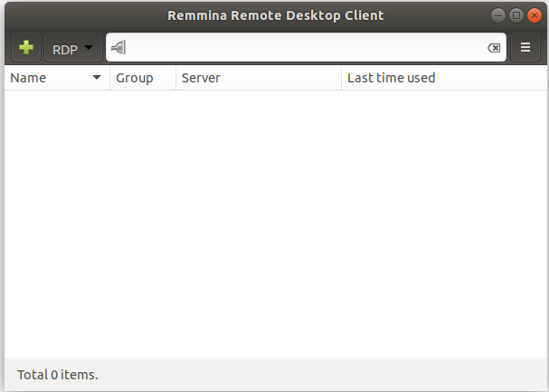

We need to add a connection; click on the green plus sign to add a connection:

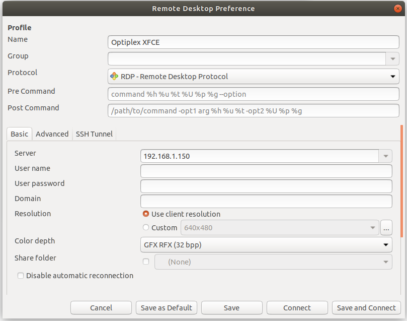

Basic Setup:
* Choose a `Name` that is appropriate.
* Select a `Protocol`; there are 4 selections, but the most common one will be `RDP - Remote Desktop Protocol` (with the secondary being `SFTP - Secure File Transfer`); for now, select `RDP - Remote Desktop Protocol`.
* Put either the FQDN or IP of the remote server you are connecting to in the `Server` field.
* You are free to put in a `User name` and `User password`, but I usually leave them blank.
* If the window is too large (or too small), Select `Custom` in the `Resolution` field and pick what would be the best choice for you.
* The `Color depth` selects the color detail; its best to use the lowest setting that you can tolerate here as this may slow down the refresh rate of the screen.

You also have a choice in what desktop you wish to run; if you do not wish to use the default, click on the `Advanced` tab. There are many options here, but you can use the `Startup program` option to pick which Desktop is launched (in the image below, we elect to bypass the default and use [xfce](ubuntu/server_build?id=remote-desktop-packages), which is a desktop that has a very small footprint on Ubuntu:

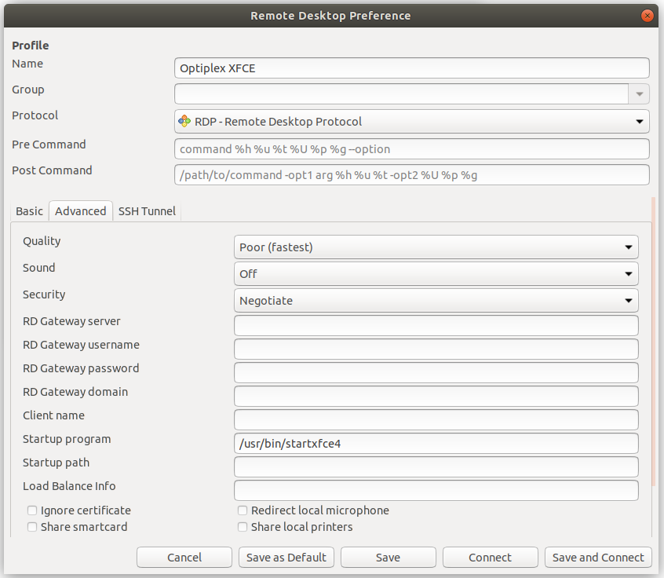

If we click 'Save', we can now view this item in our save list:

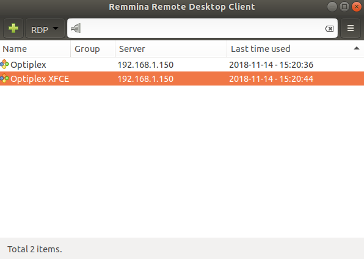

> The top option will use the default desktop, and the bottom option will use the xfce desktop on the server known as 'Optiplex'.

## Connecting From Windows Desktop

To connect remotely from a Windows desktop, you can use the program `Remote Desktop` (or type `mstsc` in a terminal to bring it up):

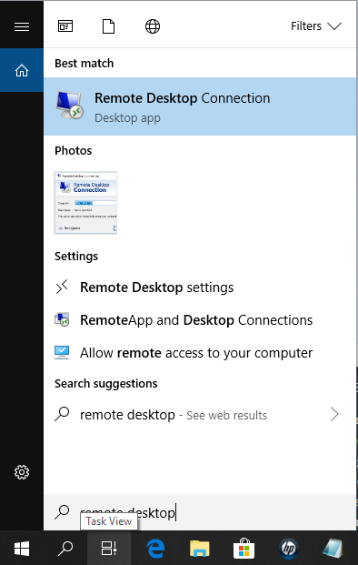

Launching the program will yield:

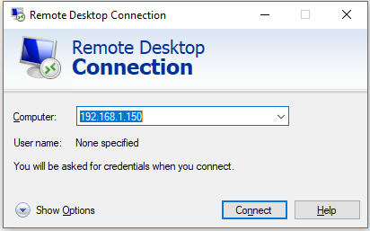

Simply type the IP of the server and click 'Connect'!

## General Notes On Connecting Remotely

There are a few oddities when connecting to an Ubuntu GUI remotely that must be mentioned.

**<font size="4">A Note On XFCE Errors</font>**

In some cases, xfce has an error and you can't use the terminal editor; instead, launch the xfce terminal and you should be able to issue commands:

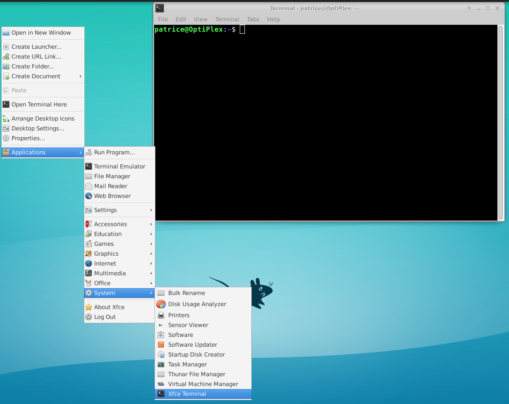

<br>
**<font size="4">A Note On Launching Remote Ubuntu Connections</font>**

If you elect to connect to a remote Ubuntu Desktop - where the Ubuntu Desktop was installed by default - it will default to the GNOME desktop; however, it will be a condensed form, where the 'favorites' will not automatically list, and will only list the icons when you press the 'Activities' button:

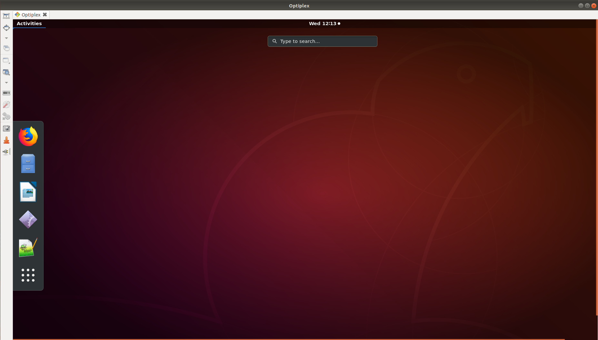

<br>
**<font size="4">A Note On Logging In To A GNOME Ubuntu Desktop</font>**

When logging in to a GNOME Ubuntu desktop, you will have a constant window popping up asking to authenticate the creation of a color something-or-other. You can enter your password multiple times and it will not go away; just keep pressing cancel and it will eventually go away:

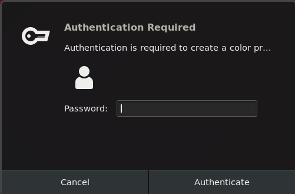

<br>
**<font size="4">Warning: Always Log Out Manually!</font>**

Simply closing the window does not log the user out; you have to manually select 'log out' to officially log the client out of the remote desktop:

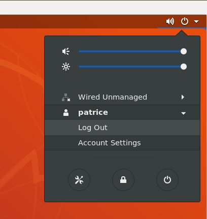

---

# Desktop Specific

This section is specific to the desktop version of Ubuntu.

## Opening a Terminal

To initially start the terminal, press Ctrl AND Alt and “t” (all three buttons at once) and a terminal screen will open.

## Enabling Right-Click File Creation

For some strange reason, Ubuntu 18.04 removed the ability to right click and save a new file in nautilus; fortunately there is a workaround.

Open a terminal and go to your `~/Templates` directory; run the following commands:
```
cd ~/Templates
touch Text\ File.txt
```

Now if you right-click you have the option of creating a new document!

You can add different file types here, like `Markdown\ File.md` or `Python\ File.py`.

## Locking Icons to Favorites (aka the old 'Launcher')

Take note of the icons lined up on the left side of the screen – this is much like the Windows task bar which appears at the bottom of a Windows screen and displays visible running programs.

Its possible to lock (or unlock) items to this grouping. If you right click on that and select “Add to Favorites" (This used to be "Lock to Launcher”), the icon will permanently be there, allowing you to click it instead of having to find the program every time.

## Creating Executable Icons

> Root is not necessary for this

Sometimes, [locking items to your favorites](ubuntu/linux_notes?id=locking-icons-to-favorites-aka-the-old-39launcher39) does not work as intended; when this happens you must manually create an executable icon. Here is how to do that.

1\. Create a file called YourFile.txt
* You can name this whatever you wish, but it must end in .txt for now.

2\. Download / locate an icon you wish to use. Note that most images you download will be a jpg/jpeg, which cannot handle transparent backgrounds.  If you care about this, [you can make the background of an image transparent using Gimp](http://graphicdesign.stackexchange.com/questions/5446/making-the-background-of-an-image-transparent-in-gimp).

3\. Open your ‘YourFile.txt’ file and enter the following:
> [Desktop Entry] <br>
> Type=Application <br>
> Name=TheNameAsItWillAppearWhenYouHoverYourMouseOverIt <br>
> Comment=SomeCommentForThis <br>
> Icon=/location/to/your/icon/name.gifOrPngEtc <br>
> Exec= ExecuteCommand <br>
> Terminal=false <br>
> Categories=Some;categories;of;your;choosing; <br>
> StartupWMClass=TheNameAsItWillAppearWhenYouHoverYourMouseOverIt

* You have some freedom over the 'Name', but its a good idea that 'Name' and 'StartupWMClass' are the same.
* You can describe the program in a few words in 'Comment' 
* 'Icon' MUST be the path and image name you are using.
* 'Exec' MUST be the command-line executable text (for example, if this was launching gimp this would be `gimp`).
* 'Categories' are just some key words separated by semicolons (and also ending with one); you have alot of freedom here to list what you wish.

4\. Change the file name from ‘YourFile.txt’ to ‘YourFile.desktop’

5\. Change the permissions so the file is executable.

6\. Double-click ‘YourFile.desktop’ from the nautilus file explorer.

* You will see this image: 
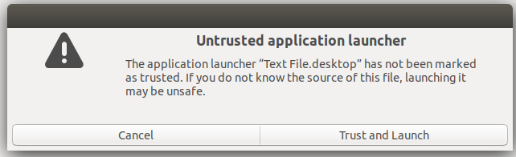
 * Press 'Trust and Launch'.

7\. You should now have a launchable image that you can put in your favorites or your desktop!

> After you completely finish these steps, you can delete the initial image used.

## Connecting Remotely

Please see how to [connect to a remote desktop using Remmina](ubuntu/linux_notes?id=connecting-from-ubuntu-desktop).

## Desktop Unusual Commands

There are many programs that are launched by icons and not from the command line; I wanted to list these commands here in the event they are ever needed.

|Command | Program Command Launches |
| --- | --- |
| nautilus | The Ubuntu file explorer |
| notepad-plus-plus | Notepad++ |
| vlc | VLC Media Player |
| remmina | Remmina, a remote desktop client. |
| mysql-workbench | MySQL Workbench client. |


