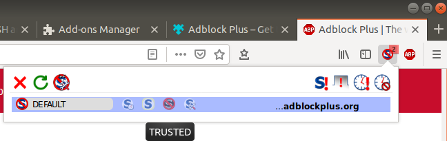

# Server Build
<!-- clear for public use -->

# Overview

This page is to help you set up an Ubuntu server. It lays out several installs that I find helpful.

!> This setup assumes you have installed Ubuntu Linux on a server and now you have to install various packages.

# Before We Start (Notes On This Section)

This is a page dedicated to installing various packages (in a Linux/Debian/Ubuntu environment). This assumes you currently have an Ubuntu / Debian OS.

## Section Indicators

There are codes to indicate which sections you will need for what your server must do. Sections marked with:
* <span style='width: 20px; display:inline-block'>:card_index:</span> are required for servers that will house a database.
* <span style='width: 20px; display:inline-block'>:open_file_folder:</span> are required for servers that will interact with a database (not hosting one, but simply interacting with one).
* <span style='width: 20px; display:inline-block'>:snake:</span> are required for servers that will run Perl or Python code.
* <span style='width: 20px; display:inline-block'>:satellite:</span> are required for servers that will run the Apache web server.
* <span style='width: 20px; display:inline-block'>:bangbang:</span> are optional (or situational).
* <span style='width: 20px; display:inline-block'>:frog:</span> are for desktop versions of Ubuntu only.


## UNIX / Linux Help

I have written a short document on some critical Linux commands / ideas - if you wish to read it, [its located here](/ubuntu/linux_notes).

## Running Terminal Commands
If anything must be run on the command line, it will be included in a code block as such:
```
ls -ltr
```

Anything in code blocks such as this must be run on the Linux command line (unless otherwise specified); if there are multiple lines, run the commands in that order.  Occasionally, you may see an inline code as well like this: `ls -ltr`.

## Text Entry into Files
If you have to enter anything into a file, these lines will appear like this:
> Enter this line into the file. <br>
> Also enter this one

Finally, it is assumed that for the setup you will [be root](/ubuntu/linux_notes?id=becoming-root) unless otherwise stated.

## Getting (and Installing) the ISO 

The ISO image is the 'install' package - most operating systems use an ISO image for an install. Determine if you want a server implementation or a desktop; once you [download the Ubuntu ISO](https://www.ubuntu.com/#download), the traditional thing to do is burn its contents to a DVD (double clicking the ISO will usually prompt your DVD burner software to do this).

Once the DVD is made, simply put it in the DVD drive and boot from CD; from there just follow the instructions. Once this is complete, you will have an Ubuntu system operational!

# Setting up the Static IP

> If the IP you are using is a static IP, follow these steps.

!> if you are using DCHP (dynamic IP, which is probably what you have if you did not request a static IP) and set up your system as a static, it will work until the IP changes.  If your system suddenly loses connectivity to the internet and you set it up as a static IP try un-doing these steps in case you actually have a dynamic IP.

!> If this is done remote you may lose connection; if this happens, you will NOT be able to interact with this server further! Make SURE you are physically near this server before doing this or else you will not be able to interact with the server until you (or someone you know) can physically get to this server!

You will need your current IP configuration, as well as the static IP (if you don't know it, these instructions assume the router already assigned it to you via dhcp - but make sure this is the case).

You will need a bunch of different IPs (whereas the static IP is simply one of them); to get the IPs you will need, use the command: `ifconfig –a`

Here is an example:
```
enp2s0: flags=4163<UP,BROADCAST,RUNNING,MULTICAST>  mtu 1500
        inet 192.168.1.160  netmask 255.255.255.0  broadcast 192.168.1.255
        ether d6:ce:a8:2c:53:45  txqueuelen 1000  (Ethernet)
        RX packets 1781846  bytes 2394915320 (2.3 GB)
        RX errors 0  dropped 0  overruns 0  frame 0
        TX packets 1058312  bytes 186362562 (186.3 MB)
        TX errors 0  dropped 0 overruns 0  carrier 0  collisions 0
```
* Take note of the following IP values:
 * inet addr (the above is 192.168.1.160, which is your IP address; this will eventually be the static IP address) 
 * Bcast addr (the above is 192.168.1.255)
 * Mask address (the above is 255.255.255.0)
* You will also need to get the network interface; in the example above its `enp2s0` but it will probably be `eth0` or `eno1` for you (there are no guarantees). The rule of thumb is its the IP after 'inet' that is not 127.0.0.1.

## Static IP (Ubuntu 16.04 and Below)

!> These steps changed in Ubuntu 17.10 when the move to NetworkManager / netplan was enforced; If you have a version of Ubuntu at or above 17.10, use [these instructions](ubuntu/server_build?id=static-ip-ubuntu-1710-and-above) instead!

** Steps:

1\. [Become root](/ubuntu/linux_notes?id=becoming-root)

2\. Take note of the IPs you will need (as detailed [above](ubuntu/server_build?id=setting-up-the-static-ip).)

3\. Edit the /etc/network/interfaces file with the vi editor:
```
vi /etc/network/interfaces
```

4\. Find - and then comment out - the following line by placing a # at the beginning of it:
> iface NETWORK_INTERFACE_HERE inet dhcp

* You will have to put in your NETWORK_INTERFACE_HERE above

5\. Add these lines after the commented line above:
> iface NETWORK_INTERFACE_HERE inet static <br>
> address YOUR_INET_ADDRESS_HERE <br>
> netmask YOUR_MASK_ADDRESS_HERE <br>
> gateway YOUR_INET_ADDRESS_WITH_THE_LAST_NUMBER_REPLACED_BY_ONE_HERE <br>
> network YOUR_INET_ADDRESS_WITH_THE_LAST_NUMBER_REPLACED_BY_ZERO_HERE <br>
> broadcast YOUR_BCAST_ADDRESS_HERE <br>
> dns-nameservers 172.27.1.20 172.27.17.16 172.27.17.17 <br>
> dns-search YOUR_COMPANYS_DNS_SEARCH_IP_OR_FQDN

6\. Save and exit vi

7\. Type this command

!> If this is done remote you WILL lose connection!

```
ifdown NETWORK_INTERFACE_HERE
```

8\. Type this command to bring the connection back up:

!> This will have to be done locally, i.e. not remotely.

```
ifup NETWORK_INTERFACE_HERE
```

## Static IP (Ubuntu 17.10 and Above)

!> These steps changed in Ubuntu 17.10 when the move to NetworkManager / netplan was enforced; If you have a version of Ubuntu below 17.10, use [these instructions](ubuntu/server_build?id=static-ip-ubuntu-1604-and-below) instead!

** Steps:

1\. [Become root](/ubuntu/linux_notes?id=becoming-root)

2\. Take note of the IPs you will need (as detailed [above](ubuntu/server_build?id=setting-up-the-static-ip).)

3\. Go into the directory `/etc/netplan`, find the file that ends in .yaml (for me it was `01-network-manager-all.yaml`, but it could be different for you), and back it up:
```
cd /etc/netplan
ls -la *.yaml
cp 01-network-manager-all.yaml 01-network-manager-all.yaml.bak
```

4\. Make sure the file looks like this:
```
# Let networkd manage all devices on this system
network:
  version: 2
  renderer: networkd
  ethernets:
  #declare the interface used y the bridge device
    NETWORK_INTERFACE_HERE:
     dhcp4: no
     dhcp6: no
     addresses: [YOUR_INET_ADDRESS_HERE/24]
     gateway4: YOUR_INET_ADDRESS_WITH_THE_LAST_NUMBER_REPLACED_BY_ONE_HERE
     nameservers:
       addresses: [8.8.8.8,8.8.4.4]
```
* Note **indents (the leading spaces and / or tabs) are are critical in .yaml files - so make sure they are exact.**
* Replace the word NETWORK\_INTERFACE\_HERE with the interface you found [here](ubuntu/server_build?id=setting-up-the-static-ip).
* 'dhcp' basically means 'ask for a random IP', but since we are getting a static IP we set this to no for 4 and 6.
* Replace the word YOUR\_INET\_ADDRESS\_HERE with the inet address you found [here](ubuntu/server_build?id=setting-up-the-static-ip).
* The addresses for the nameservers are a bit tricky; 8.8.8.8 and 8.8.4.4 are public Google DNS servers and will work for most applications
* If you need more examples for configuring this .yaml, [see this page](https://cloudinit.readthedocs.io/en/latest/topics/network-config-format-v2.html#examples).
* If you want another example of how to set up a static IP, [see this page](https://arador.com/how-to-configure-a-static-ip-address-in-ubuntu-18-04/).

5\. Save and exit

6\. Re-boot the server
```
systemctl reboot
```

7\. Test with a `ping` command; I use `ping android.com`. If the ping can get through, the static IP worked!

```
PING android.com (172.217.11.36) 56(84) bytes of data.
64 bytes from lga25s61-in-f4.1e100.net (172.217.11.36): icmp_seq=1 ttl=53 time=18.0 ms
64 bytes from lga25s61-in-f4.1e100.net (172.217.11.36): icmp_seq=2 ttl=53 time=15.6 ms
64 bytes from lga25s61-in-f4.1e100.net (172.217.11.36): icmp_seq=3 ttl=53 time=15.8 ms
64 bytes from lga25s61-in-f4.1e100.net (172.217.11.36): icmp_seq=4 ttl=53 time=13.9 ms
64 bytes from lga25s61-in-f4.1e100.net (172.217.11.36): icmp_seq=5 ttl=53 time=16.5 ms
^C
--- android.com ping statistics ---
5 packets transmitted, 5 received, 0% packet loss, time 4006ms
rtt min/avg/max/mdev = 13.992/16.011/18.039/1.315 ms
```

---

# Bonding
<span style='width: 20px; display:inline-block'>:bangbang:</span> <span style='width: 20px; display:inline-block'>:crystal_ball:</span>

`Bonding` is basically the idea that we 'bond' together network interfaces in the host so they appear as one interface; you can read more on it at [Steve's Solaris/Linux experiences](http://stivesso.blogspot.com/2014/07/linux-kvm-network-bridge-over-bonded.html).

> Bonding is only necessary if there are multiple, active internet connections; if this is not the case, bonding is usually unnecessary.


## Bonding (Ubuntu 16.04 and Before)

!> If you are on Ubuntu 17.10 or later, [use these instructions](ubuntu/server_build?id=bonding-ubuntu-1710-and-after) instead!

Steps:

1\. [Become root](/ubuntu/linux_notes?id=becoming-root).

2\. [Update all packages](/ubuntu/linux_notes?id=updating-upgrading-all-packages).

3\. Install necessary packages. We will need a few tools to set up the bonding, so install the following:
```
apt-get install ifenslave-2.6
apt-get install ethtool
```
* ifenslave-2.6 is need to bond one interface
* ethtool is needed to check out the interface

4\. Set the host server to have a static IP. For home networks this is usually done within your router, but behind enterprise routers you may have to [follow these instructions](ubuntu/server_build?id=setting-up-the-static-ip). 

> Take note of the static IP for the host.

5\. Run `ifconfig -a` to view all interfaces. For my home system this was:
```
eno1: flags=4099<UP,BROADCAST,MULTICAST>  mtu 1500
        ether b3:ca:4d:95:3d:8e  txqueuelen 1000  (Ethernet)
        RX packets 0  bytes 0 (0.0 B)
        RX errors 0  dropped 0  overruns 0  frame 0
        TX packets 0  bytes 0 (0.0 B)
        TX errors 0  dropped 0 overruns 0  carrier 0  collisions 0
        device interrupt 20  memory 0xf7c00000-f7c20000  

lo: flags=73<UP,LOOPBACK,RUNNING>  mtu 65536
        inet 127.0.0.1  netmask 255.0.0.0
        inet6 ::1  prefixlen 128  scopeid 0x10<host>
        loop  txqueuelen 1000  (Local Loopback)
        RX packets 917  bytes 71828 (71.8 KB)
        RX errors 0  dropped 0  overruns 0  frame 0
        TX packets 917  bytes 71828 (71.8 KB)
        TX errors 0  dropped 0 overruns 0  carrier 0  collisions 0

virbr0: flags=4099<UP,BROADCAST,MULTICAST>  mtu 1500
        inet 192.168.122.1  netmask 255.255.255.0  broadcast 192.168.122.255
        ether 74:5e:00:2c:10:ae  txqueuelen 1000  (Ethernet)
        RX packets 37285  bytes 2098388 (2.0 MB)
        RX errors 0  dropped 0  overruns 0  frame 0
        TX packets 74509  bytes 112138527 (112.1 MB)
        TX errors 0  dropped 0 overruns 0  carrier 0  collisions 0

virbr0-nic: flags=4098<BROADCAST,MULTICAST>  mtu 1500
        ether 74:5e:00:2c:10:ae  txqueuelen 1000  (Ethernet)
        RX packets 0  bytes 0 (0.0 B)
        RX errors 0  dropped 0  overruns 0  frame 0
        TX packets 0  bytes 0 (0.0 B)
        TX errors 0  dropped 0 overruns 0  carrier 0  collisions 0

wlx00e02dc210e0: flags=4163<UP,BROADCAST,RUNNING,MULTICAST>  mtu 1500
        inet 192.168.1.133  netmask 255.255.255.0  broadcast 192.168.1.255
        inet6 fe80::eafc:121b:3cca:269f  prefixlen 64  scopeid 0x20<link>
        ether 03:e8:a5:c6:10:e4  txqueuelen 1000  (Ethernet)
        RX packets 833040  bytes 1089624115 (1.0 GB)
        RX errors 0  dropped 2  overruns 0  frame 0
        TX packets 455562  bytes 66128963 (66.1 MB)
        TX errors 0  dropped 0 overruns 0  carrier 0  collisions 0
```

Usually your `interface` is the one with the `inet` IP that is not 127.0.0.1; in this case there are two (interfaces virbr0 and wlx00e02dc210e0). Since `virbr0` is a virtual interface for KVM, wlx00e02dc210e0 must be the interface for my host that connects to the router (and it is - this is my WiFi interface).

> Your interface will probably be `enp2s0`, `eth0`, or `eno1` but it can vary - use the above method to find your interface.

6\. Check the link. Running the command `ethtool <interface>` should give you a message like `Link detected: yes`; an example is:
```
ethtool eno1
```

7\. Open the file `/etc/modules` for editing and add the following to the bottom of the file (then save/exit):

> bonding

8\. Stop networking, then load the bonding kernal module:
```
service networking stop
modprobe bonding
```

9\. Back-up the file `/etc/network/interfaces` and then open it for editing (with vi):
```
cp /etc/network/interfaces /etc/network/interfaces.orig
vi /etc/network/interfaces
```

You will see something like this in the file (this should already exist in the file):
```
# The loopback network interface <br>
auto lo
iface lo inet loopback
```

You will have to add the following to the end of the file `/etc/network/interfaces`:
```
# The primary network interface
auto INTERFACE_GOES_HERE
iface INTERFACE_GOES_HERE inet manual
bond-master bond0
bond-primary INTERFACE_GOES_HERE

auto bond0
iface bond0 inet static
        address STATIC_IP_GOES_HERE
        netmask YOUR_MASK_ADDRESS_HERE
        network YOUR_INET_ADDRESS_WITH_THE_LAST_NUMBER_REPLACED_BY_ZERO_HERE
        gateway YOUR_INET_ADDRESS_WITH_THE_LAST_NUMBER_REPLACED_BY_ONE_HERE
        dns-nameservers 8.8.8.8
        bond-mode active-backup
        bond-miimon 100
        bond-slaves none
```

* The INTERFACE\_GOES\_HERE is the interface you found in step 5 (its probably `enp2s0`, `eth0`, or `eno1` but it could be something else).
* The STATIC\_IP\_GOES\_HERE is the static IP of the host server you found /set-up in step 5.
* The netmask is probably 255.255.255.0, but change it if its not.
* The gateway is the IP to get into your router; its usually 10.0.0.1 or 192.168.1.1 for home routers; check for your company's routers.
* The dns-nameservers is a listing of servers that can be used for DNS work; this can be any server built for this, including external public servers (8.8.8.8 is a DNS public server for Google).

10\. Reboot server and then bring the networking back up as well as bond0.
```
systemctl reboot
```

Then

```
service networking start
ifup bond0
```


11\. Test If it worked; run `cat /proc/net/bonding/bond0` and see if you get something similar to the following:

```
Ethernet Channel Bonding Driver: v3.7.1 (April 27, 2011)

Bonding Mode: fault-tolerance (active-backup)
Primary Slave: eno1 (primary_reselect always)
Currently Active Slave: eno1
MII Status: up
MII Polling Interval (ms): 100
Up Delay (ms): 0
Down Delay (ms): 0

Slave Interface: eno1
MII Status: up
Speed: 1000 Mbps
Duplex: full
Link Failure Count: 0
Permanent HW addr: 88:51:fb:40:26:99
Slave queue ID: 0
```

## Bonding (Ubuntu 17.10 and After)

!> If you are on Ubuntu 16.04 or earlier, [use these instructions](ubuntu/server_build?id=bonding-ubuntu-1604-and-before) instead!

!> Unfortunately, I could not get bonding to work in 18.04, so this is a stub for now.

---

# Bridging
<span style='width: 20px; display:inline-block'>:bangbang:</span>

In some cases, packages (usually virtualization software like [KVM](ubuntu/package_install/kvm_install) or VirtualBox) need to get their own IP from the router; `bridging` allows packages to get their own IP from the router, and it allows them to interact with the router almost as if they are their own entity / server.

> Under most circumstances, WiFi connections **will not work with bridging** as their drivers do not support it (see the note under 'Bridged Networking' [here](https://help.ubuntu.com/community/KVM/Networking)). Keep this in mind if you are trying to bridge a WiFi connection!

## Bridging (Ubuntu 16.04 and Before)

!> If you are on Ubuntu 17.10 or later, [use these instructions](ubuntu/server_build?id=bridging-ubuntu-1710-and-after) instead!


Steps:

1\. [Become root](/ubuntu/linux_notes?id=becoming-root).

2\. [Update all packages](/ubuntu/linux_notes?id=updating-upgrading-all-packages).

3\. Install supporing packages
```
apt-get install qemu
apt-get install libcap2-bin
```

4\. Back-up original interfaces file: `cp /etc/network/interfaces /etc/network/interfaces.bak`

5\. Edit the interface file.
```
vi /etc/network/interfaces
```

The file should look like the following:
```
# The loopback network interface
auto lo
iface lo inet loopback

# The primary network interface
auto INTERFACE_GOES_HERE
iface INTERFACE_GOES_HERE inet manual
bond-master bond0
bond-primary INTERFACE_GOES_HERE

auto bond0
        iface bond0 inet manual
        bond-mode active-backup
        bond-miimon 100
        bond-slaves none

auto br0
iface br0 inet static
        address STATIC_IP_GOES_HERE
        netmask 255.255.255.0
        network YOUR_INET_ADDRESS_WITH_THE_LAST_NUMBER_REPLACED_BY_ZERO_HERE
        gateway YOUR_INET_ADDRESS_WITH_THE_LAST_NUMBER_REPLACED_BY_ONE_HERE
        dns-nameservers 8.8.8.8
        bridge_ports bond0
        bridge_stp off
        bridge_fd 0
        bridge_maxwait 0
```
* The INTERFACE\_GOES\_HERE is the interface you found [using this method](ubuntu/server_build?id=setting-up-the-static-ip).
* The STATIC\_IP\_GOES\_HERE is the static IP you found [using this method](ubuntu/server_build?id=setting-up-the-static-ip)
* The netmask is probably 255.255.255.0, but change it if its not; [this is how you find it](ubuntu/server_build?id=setting-up-the-static-ip)
* The gateway is the IP to get into your router; its usually 10.0.0.1 or 192.168.1.1 for home routers.
* The dns-nameservers is a listing of servers that can be used for DNS work; this can be any server built for this, including external public servers (8.8.8.8 is a DNS public server for Google).

6\. Restart Server; for Ubuntu 14.04 and below the command to do this is `shutdown -g0 -r`; for Ubuntu 16.04 use `shutdown -r 0`

## Bridging (Ubuntu 17.10 and After)

> [These instructions from webby.land](https://webby.land/2018/04/27/bridging-under-ubuntu-18-04/) can be used as a base for making a bridge in Ubuntu 18.04 and beyond.

!> These steps changed in Ubuntu 17.10 when the move to NetworkManager / netplan was enforced and the file `/etc/network/interfaces` was depricated; If you have a version of Ubuntu below 17.10, use [these instructions](ubuntu/server_build?id=bridging-ubuntu-1604-and-before) instead!

!> These instructions do NOT use bonding, as I cannt get bonding to work yet in 18.04.


Steps:

1\. [Become root](/ubuntu/linux_notes?id=becoming-root)

2\. Take note of the IPs you will need (as detailed [here](ubuntu/server_build?id=setting-up-the-static-ip).)

3\. Go into the directory `/etc/netplan`, find the file that ends in .yaml (for me it was `01-network-manager-all.yaml`, but it could be different for you), and back it up:
```
cd /etc/netplan
ls -la *.yaml
cp 01-network-manager-all.yaml 01-network-manager-all.yaml.bak
```

4\. Make sure the file looks like this:
```
# Let networkd manage all devices on this system
network:
  version: 2
  renderer: networkd
  ethernets:
  #declare the interface used by the bridge device
    NETWORK_INTERFACE_HERE:
     dhcp4: no
     dhcp6: no
  bridges:
    br0:
     interfaces: [NETWORK_INTERFACE_HERE]
     dhcp4: no
     addresses: [YOUR_INET_ADDRESS_HERE/24]
     gateway4: YOUR_INET_ADDRESS_WITH_THE_LAST_NUMBER_REPLACED_BY_ONE_HERE
     nameservers:
       addresses: [8.8.8.8,8.8.4.4]
```
* Note **indents (the leading spaces and / or tabs) are are critical in .yaml files - so make sure they are exact.**
* If you have previously set up a static IP, this will replace that file.
* Replace the word NETWORK\_INTERFACE\_HERE with the interface you found [here](ubuntu/server_build?id=setting-up-the-static-ip).
* 'dhcp' basically means 'ask for a random IP', but since we are getting a static IP we set this to 'no' for 4 and 6.
* Replace the word YOUR\_INET\_ADDRESS\_HERE with the inet address you found [here](ubuntu/server_build?id=setting-up-the-static-ip), which should be your static IP.
 * and, yes, leave that '/24' exactly as you see it.
* The gateway is the IP to get into your router; its usually 10.0.0.1 or 192.168.1.1 for home routers.
* The addresses for the nameservers are a bit tricky; 8.8.8.8 and 8.8.4.4 are public Google DNS servers and will work for most applications.
* If you need more examples for configuring this .yaml, [see this page](https://cloudinit.readthedocs.io/en/latest/topics/network-config-format-v2.html#examples).

5\. Save and exit

6\. Re-boot the server
```
systemctl reboot
```

7\. Test with a `ping` command; I use `ping android.com`. If the ping can get through, the static IP worked!

```
PING android.com (172.217.11.36) 56(84) bytes of data.
64 bytes from lga25s61-in-f4.1e100.net (172.217.11.36): icmp_seq=1 ttl=53 time=18.0 ms
64 bytes from lga25s61-in-f4.1e100.net (172.217.11.36): icmp_seq=2 ttl=53 time=15.6 ms
64 bytes from lga25s61-in-f4.1e100.net (172.217.11.36): icmp_seq=3 ttl=53 time=15.8 ms
64 bytes from lga25s61-in-f4.1e100.net (172.217.11.36): icmp_seq=4 ttl=53 time=13.9 ms
64 bytes from lga25s61-in-f4.1e100.net (172.217.11.36): icmp_seq=5 ttl=53 time=16.5 ms
^C
--- android.com ping statistics ---
5 packets transmitted, 5 received, 0% packet loss, time 4006ms
rtt min/avg/max/mdev = 13.992/16.011/18.039/1.315 ms
```

---

# Installing SSH
<span style='width: 20px; display:inline-block'>:heart:</span>

> If you would like further reading on SSH, [please go here](/ubuntu/linux_notes?id=ssh).

SSH is critical for interacting with the host remotely (using [PuTTY](https://www.chiark.greenend.org.uk/~sgtatham/putty/) or [WinSCP](https://winscp.net/eng/index.php), for example). Make sure the SSH package is installed:

1\. [Become root](/ubuntu/linux_notes?id=becoming-root)

2\. [Update all packages](/ubuntu/linux_notes?id=updating-upgrading-all-packages)

3\. Install SSH

```
apt-get install ssh
```

# Installing WiFi Capabilities
<span style='width: 20px; display:inline-block'>:bangbang:</span>

The command to interact with the WiFi in Ubuntu is `nmcli`, but you actually need to install network manager first:

```
apt-get install network-manager
```

After it is installed, you may have to run network manager once before you can start using nmcli:

```
NetworkManager
```

For more info on how to set up and interact with nmcli, [please go here](/ubuntu/linux_notes?id=interacting-with-wifi).

# Setting up the Proxy in wgetrc

The http proxy must also be entered in a file called 'wgetrc' in /etc. If we do not do this, the wget command that is used by many programs (apt-get, CPAN, etc) will not work if we are behind a firewall.

## wgetrc Setup

1\. [Become root](/ubuntu/linux_notes?id=becoming-root)

2\. Open the wgetrc file in vi: 

```
vi /etc/wgetrc
```

3\. Find the line that is commented out that defines the http proxy and ftp proxy - it should be commented out (a hash # as the first character in the line); delete both entire lines, and then paste your proxies in using this format:

> http_proxy = http://YOUR_PROXY_HERE:PORT <br>
> ftp_proxy = http://YOUR_PROXY_HERE:PORT

4\. Press the escape button

5\. Type the following (which quits and saves): `:wq!`


> If you wish, you can edit the .profile file in your directory (the file `/home/YOUR_USERNAME_HERE/.profile`) and place the http_proxy there as well.

!> Occasionally you may have to empty this proxy.  To do this, simply set it to null by running: `export http_proxy=`

---

# Setting up the Proxy in apt.conf

The http proxy must also be entered in a file called apt.conf; if you do not do this, the 'apt-get install' command may not work properly.

## apt.conf Setup
1\. [Become root](/ubuntu/linux_notes?id=becoming-root)

2\. Change directory

```
cd /etc/apt
```

3\. See if the file exists: `ls -la apt.conf` ; if - and only if - it does not exist run this command to create it: `touch /etc/apt/apt.conf`

4\. Open the file in vi: 

```
vi /etc/apt/apt.conf
```

5\. Add these lines on the last lines of the file:

```
Acquire::http::Proxy "http://YOUR_PROXY_HERE:PORT";
```

6\. Press the escape button

7\. Type the following (which quits and saves): `:wq!`

!> If you ever have to run updates and you have this set, you may need to unset this to run the updates.

---

# Updating and Upgrading Packages
<span style='width: 20px; display:inline-block'>:heart:</span>

Typically, its important to update all packages before installing any new package (note: this does not actually change them, it simply updates info on them).  This is done by [becoming root](/ubuntu/linux_notes?id=becoming-root) and then running the following:
```
apt-get update
```

Occasionally, you should update all packages which actually modifies all packages. To do this, [become root](/ubuntu/linux_notes?id=becoming-root) and then running the following:
```
apt-get upgrade
```

If you wish to read more on this, [please do so here](/ubuntu/linux_notes?id=updating-upgrading-all-packages).

---

# Install Random Packages
<span style='width: 20px; display:inline-block'>:heart:</span>

These are some packages that we will need on the server for various things:
* ssh is for ssh
* libaio1 is for the Oracle instantclient
* unzip is for unzipping various packages
* mysql-client is for the mysql-client, which will be used on most servers (even if the MySQL server itself is not used; the client is for connecting to both the local and remote databases)
* libmysqlclient-dev further supports mysql-client
* net-tools is for important networking tools (like ifconfig).

Run:
```
apt-get install ssh
apt-get install libaio1
apt-get install unzip
apt-get install mysql-client
apt-get install libmysqlclient-dev
apt-get install net-tools
```

---


# User Accounts and Settings

> If you need to add users, [here is how you add a user](/ubuntu/linux_notes?id=adding-a-user), [set a password](/ubuntu/linux_notes?id=setting-a-password), [changing a user's shell](/ubuntu/linux_notes?id=changing-a-user39s-default-shell), or [setting a user as admin](/ubuntu/linux_notes?id=setting-a-user-as-admin).

**<font size="4">A Generic Account** <br>

The generic account uses the account login 'uperson'. To get the uperson account set up:

1\. [Become root](/ubuntu/linux_notes?id=becoming-root)

2\. Add the uperson user:

```
useradd -d /home/uperson -m -c "User Person's Name Here" uperson
usermod -s /bin/bash uperson
passwd uperson
```

3\. Consider [setting up a SSH key](ubuntu/linux_notes?id=ssh) for uperson.

4\. Consider [setting up uperson's profile](ubuntu/linux_notes?id=the-profile).


---

# Oracle Instant Client
<span style='width: 20px; display:inline-block'>:snake:</span> <span style='width: 20px; display:inline-block'>:open_file_folder:</span> <span style='width: 20px; display:inline-block'>:satellite:</span>

The Oracle instantclient is needed to connect to the back-end of Oracle databases.

## Oracle Instant Client Setup

1\. [Become root](/ubuntu/linux_notes?id=becoming-root)

2\. Navigate to /usr/local/lib and then get the instantclient packages using sftp.

3\. Confirm all packages exist by performing `ls -ltr`  (should see 5 packages)

4\. Unzip each package - they will automatically unpack into an instantclient_XX_X directory (currently this will be a directory called instantclient_12_1)

```
unzip instantclient-basic.zip
unzip instantclient-jdbc.zip
unzip instantclient-odbc.zip
unzip instantclient-sdk.zip
unzip instantclient-sqlplus.zip
```

5\. Confirm instantclient_12_1 directory exists by performing `ls -ltr`

6\. Remove instantclient packages

```
rm instantclient*zip
```

> this will only remove the instantclient zip files!

7\.  Now we must install the current tnsnames.ora file; navigate to /usr/local/lib/instantclient_12_1 and load your tnsnames.ora file here.

> Your organization will probably have a pre-built TNSNAMES.ORA file.

8\. Check if libaio1 is installed: `dpkg -s libaio1 | grep Status`
 * If installed you will see:
> Status: install ok installed
 * IF NOT installed you will see:
> Package `libaio1' is not installed and no info is available.
 * If libaio1 not installed run the following command (else skip):

```
apt-get install libaio1
```

9\. Create symlink for libclntsh.so:

```
cd /usr/local/lib/instantclient_12_1
ln -s /usr/local/lib/instantclient_12_1/libclntsh.so.12.1 libclntsh.so
```

10\. Now link the instantclient_12_1 package to /usr/local
```
cd /usr/local
ln -s /usr/local/lib/instantclient_12_1 instantclient
```

---

# Install Perl Packages
<span style='width: 20px; display:inline-block'>:snake:</span>

These are the various Perl packages I like.

Run:
```
apt-get install build-essential
apt-get install libdbd-mysql-perl
apt-get install libdbi-perl
apt-get install libproc-background-perl
apt-get install libdate-calc-perl
apt-get install libxml-parser-perl
```

---

# Build-essential Package
<span style='width: 20px; display:inline-block'>:snake:</span>

The build-essential package is necessary to compile perl packages

To check, run:
```
dpkg -s build-essential | grep Status
```

If it is not installed, run
```
apt-get update
apt-get install build-essential
```

---

# Perl DBD::Oracle Setup
<span style='width: 20px; display:inline-block'>:snake:</span> <span style='width: 20px; display:inline-block'>:open_file_folder:</span>

DBD::Oracle is needed for Perl.

1\. [Become root](/ubuntu/linux_notes?id=becoming-root)

2\. Make a temp directory and switch to that directory

```
mkdir -p /var/tmp/modules
cd /var/tmp/modules
```

3\. Set https proxy (if you need to / if yo uare behind a firewall):

```
export https_proxy=http://YOUR_PROXY_HERE:PORT
```

4\. Get the DBD-Oracle package using wget:

```
wget https://cpan.metacpan.org/authors/id/P/PY/PYTHIAN/DBD-Oracle-1.74.tar.gz
```

!> Always check manually to see if this is newest package

5\. Uncompress package and then change directory into the newly created directory
```

tar xvfz DBD-Oracle-1.74.tar.gz
cd DBD-Oracle-1.74
```

6\. Export ORACLE_HOME, PATH, LD_LIBRARY_PATH, and TNS_ADMIN variables

```
export ORACLE_HOME=/usr/local/instantclient
export PATH=$PATH:$ORACLE_HOME
export LD_LIBRARY_PATH=$ORACLE_HOME
export TNS_ADMIN=$ORACLE_HOME
```

7\. Compile the code and watch for any strange errors:

```
perl Makefile.PL
make
make test
make install
```

8\. Validate a Perl script can connect to Oracle DB via a Perl script.

---

# Python: Anaconda Install
<span style='width: 20px; display:inline-block'>:snake:</span>

!> WARNING - This will be an installation that will work alongside the already installed version of Python - so there will be concurrent versions installed on the server, one in `/usr/bin/python` and the one we are installing now, which is `/usr/bin/anaconda/python2.7/bin/python`. If you have downloaded any other additional Python packages - or installed any Python packages - to the native version of Python you will have to re-install them again after you follow these instructions.

Anaconda is a version of Python that enables Python to use powerful data analysis tools (SciPy, Pandas, Numpy, Matplotlib to name a few). We are going to install the version that supports Python 2.7.

While its possible to add all of these tools to Python on a one-by-one basis, using Anaconda makes it far easier to install these add-ons.

## Downloading Anaconda

To download Anaconda, [go here](https://www.anaconda.com/download/) and select the linux 64 bit (x86) installer (it should end in .sh). If you do not have access to our code repository, this is how you can get the download file.

## Installing Anaconda
<span style='width: 20px; display:inline-block'>:snake:</span>

1\. [Become root](/ubuntu/linux_notes?id=becoming-root)

2\. [Update all packages](/ubuntu/linux_notes?id=updating-upgrading-all-packages)

3\. Save the downloaded Anaconda file to your home directory.

4\. Run the file:

```
bash Anaconda.sh
```

5\. You will be prompted to select where to install (**note: the directory CANNOT exist!**).  Input location / install to: `/usr/bin/anaconda/python2.7`
 * `/usr/bin/anaconda/python2.7` is just my preference - if its not yours, don't use it.
 * When prompted to append the Anaconda2 install location to PATH, do it
 * When prompted to install Microsoft VSCode, say NO

6\. Source in your path (usually in the .bashrc file): `source ~/.bashrc`

7\. Install python-qt4 (for matplotlib):

```
apt-get install python-qt4
```

8\. Remove the install file:

```
rm /home/YOUR_LOGIN_HERE/Anaconda.sh
```

## Changing the PATH for Python
<span style='width: 20px; display:inline-block'>:snake:</span>

In order for this new version of Python to be the default on the server, we must edit every user's PATH variable to explicitly point to the path we just installed. Everyone on the server that will use Anaconda will have to do this.

Setup:

1\. Edit the .bashrc file in your home directory: 

```
vi ~/.bashrc
```

2\. Add these two lines at the bottom:

> PATH=/usr/bin/anaconda/python2.7/bin:$PATH <br>
> export PATH

3\. Quit and save: `wq!`

4\. Source in the .bashrc file: 

```
source ~/.bashrc
```

## Adding to Python PATH
<span style='width: 20px; display:inline-block'>:snake:</span>

There is a second PATH variable that we can alter - PYTHONPATH. This path is different from the previous one: whereas [the one above](ubuntu/server_build?id=changing-the-path-for-python) pointed the server to the new version of Python, this PYTHONPATH allows us to build Python functions in the designated folder, then we can import them into other Python scripts with a simple `import` at the top of the file.

As an example, We are going to add /home/YOUR_LOGIN_HERE/GeneralPythonFunctions to the PYTHONPATH, so any Python function we write in this folder can be quickly imported into other Python scripts with the `import` function in Python.

Setup:

1\. Edit the .bashrc file in your home directory: 

```
vi ~/.bashrc
```

2\. Add these two lines at the bottom:
> PYTHONPATH=/home/YOUR_LOGIN_HERE/GeneralPythonFunctions:$PYTHONPATH <br>
> export PYTHONPATH

3\. Press escape, then type this to save and quit: `wq!`

4\. Source in the .bashrc file: 

```
source ~/.bashrc
```

!> You will have to do this for all users that will use this functionality in Python.

## Uninstalling Anaconda
<span style='width: 20px; display:inline-block'>:snake:</span> <span style='width: 20px; display:inline-block'>:bangbang:</span>

!> If you remove Anaconda after installing Python packages, you will have to re-install those packages.

If you must uninstall Anaconda, simply remove the folder 
```
rm -r /usr/bin/anaconda
```

Find the PATH lines we entered into our .bashrc file for each user that entered it:

1\. Edit the .bashrc file in your home directory: 

```
vi ~/.bashrc
```

2\. Seek out and delete these 2 lines:
> PATH=/usr/bin/anaconda/python2.7/bin:$PATH <br>
> export PATH

3\. Seek out and delete these 2 lines (if they exist):
> PYTHONPATH=/home/YOUR_LOGIN_HERE/GeneralPythonFunctions:$PYTHONPATH <br>
> export PYTHONPATH

4\. Press escape, then type this to save and quit: `wq!`
5\. Source in the .bashrc file: 

```
source ~/.bashrc
```

6\. Change the .bashrc file for EVERY user that made these changes.

---

# Python Supporting Packages
<span style='width: 20px; display:inline-block'>:snake:</span>

These packages are meant to support Python.

## Install Python PIP

Python PIP is the official method to install Python packages; when possible, use PIP to install anything related to Python.

1\. [Become root](/ubuntu/linux_notes?id=becoming-root)

2\. [Update all packages](/ubuntu/linux_notes?id=updating-upgrading-all-packages)

3\. Install python-pip:

```
apt-get install python-pip
```

## Install MySQL for Python
<span style='width: 20px; display:inline-block'>:snake:</span> <span style='width: 20px; display:inline-block'>:open_file_folder:</span>

> The base of these install instructions were originally [found here](https://dev.mysql.com/doc/connector-python/en/connector-python-introduction.html).

If we wish to use the MySQL connector in Python (specifically the package `mysql.connector`), we must install the MySQL connector module.

We can download it [from here](http://dev.mysql.com/downloads/connector/python/) - when prompted to select the operating system select **Platform Independent**, and make sure to get the ZIP file; I initially downloaded the .deb file but it didn't play well - either with Anaconda or in general. The tar file had some problems too, so just use the platform independent / zip file.

Setup:

1\. [Become root](/ubuntu/linux_notes?id=becoming-root)

2\. Create a temp directory where we can unzip this file (we use `/home/YOUR_LOGIN_HERE/tmp/mysql-connector`) and then change to it:

```
mkdir -p /home/YOUR_LOGIN_HERE/tmp/mysql-connector
chown YOUR_LOGIN_HERE:YOUR_LOGIN_HERE /home/YOUR_LOGIN_HERE/tmp/mysql-connector
cd /home/YOUR_LOGIN_HERE/tmp/mysql-connector
```

3\. Download the MySQL connector install file and save it to `/home/YOUR_LOGIN_HERE/tmp/mysql-connector`.

4\. Unzip the install package to our temp directory (you will simply delete this directory later; the name `mysql-connector-python.zip` is assumed but it can be different):

```
unzip mysql-connector-python.zip
```

5\. Change to the directory we just created and run the install script:

```
cd mysql-connector-python-2.1.5
python setup.py install
```

!> The directory above may be different - you may have to check it and see the actual name of the directory.

6\. Remove the setup folder:

```
cd /home/YOUR_LOGIN_HERE/tmp
rm -r /home/YOUR_LOGIN_HERE/tmp/mysql-connector
```

## Install HP Vertica for Python
<span style='width: 20px; display:inline-block'>:snake:</span> <span style='width: 20px; display:inline-block'>:open_file_folder:</span>

> The base of these install instructions were originally [found here](https://my.vertica.com/docs/7.2.x/HTML/Content/python_client/install_uninstall.html) and [more supporting documentation is here](https://my.vertica.com/docs/7.2.x/HTML/Content/python_client/index.html).

If we wish to use the HP Vertica connector in Python, we must install the HP Vertica connector module.

We can download it [from here](https://my.vertica.com/search/downloads/python/). You will be dumped to another page; for me, I picked 'Client Drivers 8.0.x' (as that is what works for our PRIDE HP Vertica database, but that may change), and then I found the header 'Vertica 8.0.x', then 'Linux'; I picked the tar file (the driver 'ODBC, JDBC, Python, and vsql'); my filename was vertica-client-8.0.1-0.x86_64.tar.gz. This may change in the future - it may be a different version of Vertica - but you should stick with 'Linux' and tar.gz files.


Setup:

1\. [Become root](/ubuntu/linux_notes?id=becoming-root).

2\. [Install Python PIP](/ubuntu/server_build?id=install-python-pip), if you have not done so already.

3\. Create a temp directory where we can untar this file (we use `/home/YOUR_LOGIN_HERE/tmp/vertica`) and then change to it:

```
mkdir -p /home/YOUR_LOGIN_HERE/tmp/vertica
chown YOUR_LOGIN_HERE:YOUR_LOGIN_HERE /home/YOUR_LOGIN_HERE/tmp/vertica
cd /home/YOUR_LOGIN_HERE/tmp/vertica
```

4\. Get the remote the HP Vertica client install file and save to `/home/YOUR_LOGIN_HERE/tmp/vertica`:

5\. Untar the file (assuming the file name is `vertica-client.tar.gz`):

```
tar xvzf vertica-client.tar.gz
```

> There will be a bunch of 'wheel' files in the directory at this point.

6\. Run pip to install:

```
pip install --no-index -f /home/YOUR_LOGIN_HERE/tmp/vertica/opt/vertica/Python hp-vertica-client 
```

7\. Remove the setup folder:

```
cd /home/YOUR_LOGIN_HERE/tmp
rm -r /home/YOUR_LOGIN_HERE/tmp/vertica
```

## Install Oracle for Python
<span style='width: 20px; display:inline-block'>:snake:</span> <span style='width: 20px; display:inline-block'>:open_file_folder:</span>

> The base of these install instructions were originally found in 3 places: [here](http://stackoverflow.com/questions/7300321/how-to-use-pythons-pip-to-download-and-keep-the-zipped-files-for-a-package) and [here](https://oracle.github.io/python-cx_Oracle/ ) and [here](http://stackoverflow.com/questions/15031694/installing-python-packages-from-local-file-system-folder-with-pip).

If we wish to use the Oracle client in Python, we must install the Oracle client module.

Setup:

1\. [Become root](/ubuntu/linux_notes?id=becoming-root).

2\. [Install Python PIP](/ubuntu/server_build?id=install-python-pip), if you have not done so already.

3\. [Install the Oracle instantclient](/ubuntu/server_build?id=oracle-instant-client)

4\. Set the variable ORACLE_HOME (this does not seem to matter once cx_Oracle is installed, but it MUST be set during the install).  ORACLE_HOME MUST point to the folder that contains the Oracle instant client; to do this (assuming you installed the Oracle instant client to the '/usr/local/instantclient' directory):

```
export ORACLE_HOME=/usr/local/instantclient
```

5\. Find a version of 'cx_Oracle'; This CAN be done fully on the server using pip:

!> Your company's firewall may block portions of the install; I will show what to do if this happens.

```
python -m pip install cx_Oracle
```

 * Note the above will install the current 'live' version; if you want the latest (and potentially buggy) package, run:

 ```
python -m pip install cx_Oracle --pre
 ```

6\. If step 5 times out, you can download the cx_Oracle tar.gz file and then manually load it.  Note that I could only find this on sourceforge on the internet and I did not trust it; you can do this, but do it at your own risk.

 * You can do this to avoid sourceforge: I ran the pip command on an Ubuntu server that was not behind a firewall, and included a flag to download the tar.gz file and not delete it (I chose the folder '/home/YOUR_LOGIN_HERE/tmp/cx_Oracle').  Note that I forget which exact line I used so I will list both, but if it downloads you are good (try one, and if it fails try the other):

```
python -m pip install --download="/home/YOUR_LOGIN_HERE/tmp/cx_Oracle" cx_Oracle
#-OR-
pip install --download="/home/YOUR_LOGIN_HERE/tmp/cx_Oracle" cx_Oracle
```

 * From here, I simply copied the file to the other servers and then ran the pip on the local file downloaded above (note: I saved the file to /home/YOUR_LOGIN_HERE/tmp/cx_Oracle and the file downloaded was called cx_Oracle-5.3.tar.gz):

```
pip install /home/YOUR_LOGIN_HERE/tmp/cx_Oracle/cx_Oracle.tar.gz
```

7\. As long as you set ORACLE_HOME properly, you should be done - but test it with a script.

8\. Remove the setup folder

```
cd /home/YOUR_LOGIN_HERE/tmp
rm -r /home/YOUR_LOGIN_HERE/tmp/cx_Oracle
```

### Set-up TNS_ADMIN for Python
<span style='width: 20px; display:inline-block'>:snake:</span> <span style='width: 20px; display:inline-block'>:open_file_folder:</span>

For every user that will use the Oracle client in Python, some other variables must be set in the environment file (.env file) - namely LD_LIBRARY_PATH and TNS_ADMIN. Make an environment file in your home directory that starts with a dot (so, for example, .myenvironment.env) and copy the following 4 lines into this file:
> \#\# SETUP TNS_ADMIN so tnsnames.ora is sourced in <br>
> export TNS_ADMIN=/usr/local/instantclient <br>
> export LD_LIBRARY_PATH=/usr/local/instantclient <br>
> PATH=$PATH:/usr/local/instantclient

Save the file and close. Now go into the .profile file in your home directory and add this at the end, save, and close:
```
. "$HOME/.myenvironment.env"
```

## OpenCV for Python
<span style='width: 20px; display:inline-block'>:rotating_light:</span> <span style='width: 20px; display:inline-block'>:snake:</span> <span style='width: 20px; display:inline-block'>:bangbang:</span>

OpenCV is image processing software for Python - it can do things like facial recognition.

**<font size="4">Manual OpenCV Install Attempt</font>** <br>
The base of these install instructions were originally found in 2 places: [here](https://docs.opencv.org/2.4/doc/tutorials/introduction/linux_install/linux_install.html) and [here](http://milq.github.io/install-opencv-ubuntu-debian/). The first link is the official way; I tried this and it simply did not install (although it said it did). The second way suggests running apt-get install python-opencv, but the problem is it installs to the default Python location (not where Anaconda is); in addition this seems to be an older release. These attempts ended in failure.

**<font size="4">Working OpenCV Install</font>** <br>

This method was found [on YouTube](https://www.youtube.com/watch?time_continue=66&v=zWPtHhGc3GI):

1\. [Become root](/ubuntu/linux_notes?id=becoming-root).

2\. [Install Python PIP](/ubuntu/server_build?id=install-python-pip), if you have not done so already.

3\. [Update all packages](/ubuntu/linux_notes?id=updating-upgrading-all-packages)

4\. Install libopencv-dev:

```
apt-get install libopencv-dev
```

5\. Simply use pip to install openCV:

```
python -m pip install opencv-python
```

6\. To test, open your python and type import cv2. If this works, it worked!

> Note that if you installed using pip, there are XML files called 'cascades' that are important that may not be installed with pip. They ARE in the manual download method though, so you may want to download that anyway if only to extract these XML files for later use.

Further Tutorials:
* https://realpython.com/face-recognition-with-python/
* http://gregblogs.com/computer-vision-cropping-faces-from-images-using-opencv2/

---

# Remote Desktop Packages
<span style='width: 20px; display:inline-block'>:bangbang:</span>

> Before adding these, make sure there is actually a need for remote desktop management. There are really only few times it makes sense (to manage KVM, for example).

Its possible to connect to a GUI Desktop version of this server; to do so, we are going to install a few things that will allow us to remotely launch a desktop that will run on this machine. 

First, we must [be root](/ubuntu/linux_notes?id=becoming-root) and [update all packages](/ubuntu/linux_notes?id=updating-upgrading-all-packages); then install these packages on the server:
```
apt-get install xfce4 xfce4-goodies
apt-get install xrdp xorgxrdp
```
* `xrdp` allows remote desktop connection (this is needed to connect to xfce4 remotely); `xorgxrdp` is needed for this as well.
* `xfce4` is a light Desktop application users can use to interact with the KVM GUI remotely (which also uses `xfce4-goodies`).

> If you this is an Ubuntu Desktop and you want to connect to remote desktops, you will need to install `xrdp` and `xorgxrdp` at a minimum to do so (and possibly `xrdp-pulseaudio-installer`, but I am not certain about this).

Make sure xrdp is running on all servers that will connect to a remote host or be a remote host itself; to do so, run:
```
service xrdp status
```

If it is installed but inactive / not running, start it with:
```
service xrdp start
```


---

# Apache
<span style='width: 20px; display:inline-block'>:satellite:</span>

A common web server is Apache. Apache is a free web server available on Windows and Linux.

## Install Apache
<span style='width: 20px; display:inline-block'>:satellite:</span>

First, check if Apache is running with: `ps -ef | grep apache`

If Apache is not running its probably not installed - install it:
```
apt install apache2-bin
apt install apache2
```

Apache should start automatically, but if it does not, run this to start it:
```
apache2 -k start
```

## The Apache Document Root

Apache has a 'root' directory on Ubuntu (which acts as the 'base' web site root). For versions of Ubuntu under 14.04, this was /var/www, and for Ubuntu 14.04+ the default base is /var/www/html. This web document root directory can be changed, but that is beyond the scope of this documentation.

For example, say you had the file hello.html in /var/www/html; if your website was www.mywebsite.com and you navigated to www.mywebsite.com/hello.html, that HTML file would load in your browser. If you created a folder 'myfolder' in /var/www/html and then made a file called 'helloworld.html' in that directory, you could navigate to www.mywebsite.com/myfolder/helloworld.html and helloworld.html would render in your browser.

Anything under this root directory can potentially be seen externally, so be careful with what you place here.

---

# PHP Oracle Setup
<span style='width: 20px; display:inline-block'>:satellite:</span> <span style='width: 20px; display:inline-block'>:open_file_folder:</span>

This will enable us to connect from PHP to an Oracle DB (using OCI8 on Ubuntu).

1\. If you have not already, [install the Oracle instantclient](/ubuntu/server_build?id=oracle-instant-client)

2\. [Become root](/ubuntu/linux_notes?id=becoming-root)

3\. [Update all packages](/ubuntu/linux_notes?id=updating-upgrading-all-packages)

4\. Validate the version of PHP to make sure PHP 7 is installed:

```
php --version
```

5\. Install supporting PHP packages:

```
apt-get install php7.0-dev
apt-get install libaio-dev
apt-get install php-pear
```

6\. Set the pear proxy (if you need to set a proxy):

```
pear config-set http_proxy http://YOUR_PROXY_HERE:PORT/
```

7\. Install the oci8 extension: `pecl install oci8`

 * This will ask for Oracle Home Directory - give the path of the instant client: 

```
instantclient,/usr/local/instantclient
```

> This is telling pecl that its an instantclient and then giving the path to the instantclient directory. <br>
> If you get an error saying:  No releases available for package "pecl.php.net/oci8", make **SURE** the proxy is set correctly! <br>
> If the installation is successful, you should see messages like "Build Process completed successfully"

8\. Add the oracle oci8.so to php.ini (can also be done using vi to add "extension=oci8.so" under the OCI section in each file):

```
echo "extension=oci8.so" >> /etc/php/7.0/cli/php.ini 
echo "extension=oci8.so" >> /etc/php/7.0/apache2/php.ini 
```

9\. Restart apache

```
systemctl restart apache2 
```

10\. Validate it worked. Create the file 'phpinfo.php' in /var/www/html and add following line using vi:
> <?php phpinfo(); ?>

 * Save the file and then open a web browser and navigate to the phpinfo file ( in our case it is localhost/phpinfo.php ) <br>
 * Search for oci8 and you should find oci8 block with variables ( this means you have successfully compiled PHP with the oci8 extension )

11\. Test connecting to an oracle instance using oci_connect() in PHP. To do so, create the file phpconnect.php file in /var/www/html and add the following code:

	```
	<?php
	error_reporting(E_ALL); 
	ini_set('display_errors', 1);

		$db = "(DESCRIPTION =
		    (ADDRESS = (PROTOCOL = TCP) (HOST = YOUR_ORACLE_HOST) (PORT = YOUR_PORT))
		    (CONNECT_DATA = (SERVER = DEDICATED) (SERVICE_NAME = YOUR_SERVICE_NAME))
		  )";

		$conn = oci_connect("USER", "PASSWORD", $db);
		if (!$conn) {
		   $m = oci_error();
		   echo $m['message'], "\n";
		   exit;
		}
		else {
		   print "Connected to Oracle!";
		}
		// Close the Oracle connection
		oci_close($conn);

	?>
	```
!> You will need to change the USER, PASSWORD, and database settings.
 * Save the file and exit
 * Open a web browser and navigate to the phpconnect.php file ( in our case it is localhost/phpconnect.php )
 * If it worked you will see a screen with the message:  `Connect to Oracle!`
 * If there was an issue you might see an error like `Fatal error: Uncaught Error: Call to undefined function oci_connect() in /var/www/html/phpconnect.php:10`

12\. Once testing is complete the phpinfo.php and phpconnect.php files need to be removed.

---

# MySQL Setup
<span style='width: 20px; display:inline-block'>:card_index:</span>

MySQL setup [is discussed at length here](ubuntu/package_install/mysql_install).

If you are running a MySQL database on this server you will at least need to do the following:

1\. [Install MySQL](ubuntu/package_install/mysql_install?id=mysql-install).

2\. [Install Other Packages](ubuntu/package_install/mysql_install?id=other-packages-to-install).

3\. [Create users in MySQL](ubuntu/package_operations/mysql_maintenance?id=creating-mysql-users).

4\. [Set up mysqldcnf](ubuntu/package_install/mysql_install?id=mysql-master-settings-mysqldcnf).

5\. [Add MySQL Timezone Tables](ubuntu/package_install/mysql_install?id=add-timezone-tables).

6\. Consider [Set up disabling MySQL strict mode](ubuntu/package_install/mysql_install?id=disable-strict-sql-mode), but only if you have legacy tables and queries you will be importing.

If you ever need to re-set the root password, [this is how you do that](ubuntu/package_operations/mysql_maintenance?id=re-setting-the-root-password-for-mysql).


## Testing MySQL Accounts
<span style='width: 20px; display:inline-block'>:card_index:</span>

Its not a bad idea to test the accounts you just created. To test the local login, run this on the box (replacing uperson with the user account in question):
```
mysql -u uperson -p
```

You will be prompted for a password. <br>
<br>
Now, go to a different server and log in remotely (you will need the IP for this, which we just use 111.111.111.111 below
```
mysql -h 111.111.111.111 -u uperson -p
```

---

# Install Java JRE
<span style='width: 20px; display:inline-block'>:bangbang:</span>

If you need the Java JRE, this is how it is installed.

Steps:

1\. [Become root](/ubuntu/linux_notes?id=becoming-root)

2\. [Update all packages](/ubuntu/linux_notes?id=updating-upgrading-all-packages)

3\. Check to see if java is already installed: `java -version`
 * For more detailed info you can run: `java -XshowSettings:properties -version`

4\. If java is not installed, install the default-jre

```
apt-get install default-jre
```

5\. After the install, confirm jre exists: `java -version` . You should see something like this (maybe with different version numbers):
> openjdk version "1.8.0_151" <br>
> OpenJDK Runtime Environment (build 1.8.0_151-8u151-b12-0ubuntu0.16.04.2-b12) <br>
> OpenJDK 64-Bit Server VM (build 25.151-b12, mixed mode)

---

# Installing Java (From Oracle)
<span style='width: 20px; display:inline-block'>:bangbang:</span>

Sometimes it is necessary to install Java directly from Oracle (instead of just installing the JRE or OpenJDK). These instructions come from [wikihow](http://www.wikihow.com/Install-Oracle-Java-JDK-on-Ubuntu-Linux).

!> This will require you to remove Java if it exists already. Removing Java can uninstall other programs (Eclipse is notorious for this) - so be careful (or install Java first). <br> Its also possible to skip the Java deletion and just switch java versions when using different programs. To do so, open a terminal and run `update-alternatives --config java` . You will now be presented with a list of java versions installed (will be listed as option 0, 1, 2, 3...).  Pick the option number you want and press enter.  <br> To make sure the version of java switched, run: `java -version`

You will need to Get the latest version of Java from Oracle [here](http://www.oracle.com/technetwork/java/javase/downloads/index.html)  (get the one that is a tar.gz file, and make sure its the jdk and not a jre). You will need to get it on your server somehow.

Steps:

1\. [Become root](/ubuntu/linux_notes?id=becoming-root)

2\. Delete OpenJDK: 

```
apt-get purge openjdk-\*
```

3\. If the directory /usr/local/java does not exist, create it and then change directory to it:

```
mkdir -p /usr/local/java
cd /usr/local/java
```

4\. You downloaded the latest version of java (the tar file).  Note the name, copy the file to /usr/local/java, and then unzip the file in that directory (here we assume the Java version is 8u45 and the tar file is called jdk-8u45-linux-x64.tar.gz):

```
tar xvzf jdk-8u45-linux-x64.tar.gz
```

> Note that after you unzip the file in /usr/local/java, a directory will be created in that folder that contains the phrase 'jdk'; locate that folder and note it (for this install the folder name was 'jdk1.8.0_45'), as you will have to alter some of the instructions here to use that folder (wherever the java version exists - in folder names, specifically - you will have to change them).

5\. Add information to the bottom of /etc/profile

 * You will have to do this twice: once for root and once for your personal login.  Root's profile is /etc/profile, but your own profile will the the .profile file in your home directory.  These instructions are how to set up the root environment, but replicate this entire step using the .profile file in your home directory.
 * Open /etc/profile (using vi): 

 ```
 vi /etc/profile
 ```

 * Add this text to the bottom of that file:
> JAVA_HOME=/usr/local/java/jdk1.8.0_45 <br>
> PATH=$PATH:$HOME/bin:$JAVA_HOME/bin <br>
> export JAVA_HOME <br>
> export PATH

 * Save the file and exit.

6\. Update the links in /etc/alternatives by running the following commands

> update-alternatives --install "/usr/bin/java" "java" "/usr/local/java/jdk1.8.0_45/bin/java" 1 <br>
> update-alternatives --install "/usr/bin/javac" "javac" "/usr/local/java/jdk1.8.0_45/bin/javac" 1 <br>
> update-alternatives --install "/usr/bin/javaws" "javaws" "/usr/local/java/jdk1.8.0_45/bin/javaws" 1 <br>
> update-alternatives --set java /usr/local/java/jdk1.8.0_45/bin/java <br>
> update-alternatives --set javac /usr/local/java/jdk1.8.0_45/bin/javac <br>
> update-alternatives --set javaws /usr/local/java/jdk1.8.0_45/bin/javaws <br>

!> Note that if you are installing Java 9+, 'javaws' is depricated and in Java 11+ it is fully removed - so this may fail.

7\. Source in the changes we just made (aka make the commands we just changed executable): `source /etc/profile`

---

# Installing Apache Ant
<span style='width: 20px; display:inline-block'>:bangbang:</span>

> To read more on Ant, please go [here](ant.apache.org); the binary download is [here](ant.apache.org/bindownload.cgi).

Ant is a Java library that helps build Java applications (although it can be used for other languages if the correct version is installed).

!> Install Java FIRST, either [from Oracle](/ubuntu/server_build?id=installing-java-from-oracle) or [from apt-get install](/ubuntu/server_build?id=install-java-jre)

**<font size="4"> Easy Method: Apt-Get</font>**

Steps:

1\. [Become root](/ubuntu/linux_notes?id=becoming-root)

2\. [Update all packages](/ubuntu/linux_notes?id=updating-upgrading-all-packages)

3\. Install using apt-get:
```
apt-get install ant
```

Ant should now be installed!

**<font size="4"> Long Method</font>**

You can also install ant from binary files, if you wish. Steps:

1\. [Become root](/ubuntu/linux_notes?id=becoming-root)

2\. [Download the binary file(s)]](ant.apache.org/bindownload.cgi).

3\. Unzip /tar them in your preferred directory. I created and then used: 
```
mkdir -p /usr/local/ant
```

4\. Exit root:
```
exit
```

5\. Set up [your environment file](/ubuntu/linux_notes?id=the-profile). Put these lines at the end and save:
> export ANT_HOME=/usr/local/ant <br>
> export PATH=${PATH}:${ANT_HOME}/bin

6\. Source your profile: 
```
source ~/.profile
```
---

# Installing Apache Maven
<span style='width: 20px; display:inline-block'>:bangbang:</span>

Maven, much like Ant, is a Java library that helps build Java applications; its newer than Ant, and most people prefer Maven.

To install Maven, do the following:

1\. [Become root](/ubuntu/linux_notes?id=becoming-root)

2\. [Update all packages](/ubuntu/linux_notes?id=updating-upgrading-all-packages)

3\. Install using apt-get:
```
apt-get install maven
```

---

# Installing git
<span style='width: 20px; display:inline-block'>:rotating_light:</span> <span style='width: 20px; display:inline-block'>:bangbang:</span>

>For more info on git, [please go here](http://git-scm.com/) or [here](https://github.com/)

Git is a program that is used to share project files with others. Often times teams use git for version control.

To install:

1\. [Become root](/ubuntu/linux_notes?id=becoming-root)

2\. [Update all packages](/ubuntu/linux_notes?id=updating-upgrading-all-packages)

3\. Install:
```
apt-get install git
```

For more info on git, [please go here](/ubuntu/linux_notes?id=using-git)

---

# CIFS Share
<span style='width: 20px; display:inline-block'>:bangbang:</span>

!> This section is not required unless you wish to mount a Windows shared drive.

This section assumes the following: 
* You are currently logged into the Linux box (for our example we will assume your login is 'uperson').
* You have a valid Windows login / password (our example these will be 'myWindowsUserName' and 'myWindowsPassword' respectively).
* You have a FQDN for the remote Windows shared folder (our example will use 'someWindowsBox.it.yourcompany.com').
* You have your target folder name on the Windows shared drive (our example will use '/FolderOnWindowsMachine/Dropbox').
* You have selected an empty folder on Ubuntu to mount the drive (we will use /mnt/cifs_share)

!> Whenever you mount a folder, make SURE the mounting folder is empty! In addition, when you unmount a folder, make SURE you are not in that directory!

**CIFS** is an Ubuntu package that allows you to effortlessly mount an Ubuntu directory to a remote shared Windows drive.

## CIFS Setup

1\. [Become root](/ubuntu/linux_notes?id=becoming-root)

2\. [Update all packages](/ubuntu/linux_notes?id=updating-upgrading-all-packages)

3\. Install cifs-utils:

```
apt-get install cifs-utils
```

4\. Create a .cifs file in your home directory and change the file permissions:

```
touch /home/uperson/.cifs
chmod 600 /home/uperson/.cifs
```

5\. Open .cifs in vi, add the Windows login / password to the file, and save/quit from vi:

```
vi /home/uperson/.cifs
```
> username=myWindowsUserName <br>
> password=myWindowsPassword

6\. Create a mount point. Usually this is in a folder under /mnt. We will create an empty folder called cifs_share and this will be our mount point (we will also make sure we own the mount point):
```
mkdir -p /mnt/cifs_share
chown uperson:uperson /mnt/cifs_share
```

## Mounting the CIFS Drive
<span style='width: 20px; display:inline-block'>:bangbang:</span>

!> Make SURE you mount to an empty folder in Ubuntu!

We must first get the ID of the user that is mounting the drive (the user that altered the .cifs file). To get the ID of this user, type
```
id uperson
```

This will return something like:
```
uid=1004(uperson) gid=1004(uperson) groups=1004(uperson)
```

Note the 'uid' as we will need it to mount (we will assume uid will bet 1004 but it will almost CERTAINLY be different for you).

To mount, run the following command:
```
mount -t cifs //{FQDN of the Windows Server}/Windows/Base/Directory /Ubuntu/mount/Directory -o user,uid=UserIDYouFoundAbove,rw,credentials=/home/uperson/.cifs
```
* Do not actually include the { or }

A real-world example would be:
```
mount -t cifs //someWindowsBox.it.yourcompany.com/FolderOnWindowsMachine/Dropbox /mnt/cifs_share -o user,uid=1004,rw,credentials=/home/uperson/.cifs
```

## Unmounting the CIFS Drive
<span style='width: 20px; display:inline-block'>:bangbang:</span>

!> Make SURE you are not in the directory you are about to unmount!

To unmount, simply run:
```
umount -f /mnt/cifs_share
```

---

# Docsify
<span style='width: 20px; display:inline-block'>:bangbang:</span>

!> Apache MUST be running for Docsify to work!


[Docsify](https://docsify.now.sh/) generates your documentation website on the fly. It smartly loads and parses your Markdown files and displays them as a website. To start using it, all you need to do is create an index.html and deploy it on GitHub Pages.

## Basics of Docsify and Markdown

If you want to know the basics of Docsify (or what we call 'Notebook'), [see my guide](learn_to_code/docsify/gettingstarted), and if you wish to learn a bit on the Markdown language [see my guide on that](learn_to_code/docsify/markdowntutorial).

## Basics of Docsify Files and Locations
<span style='width: 20px; display:inline-block'>:bangbang:</span>

There are a few rules that must be followed in order to use Docsify. Firstly, you must create a folder in the [Apache web root directory](/ubuntu/server_build?id=the-apache-document-root) that will house Docsify (although please note, this folder can be a symbolic link, which I instead of an actual folder). 

While you can create an actual folder in the Apache web root directory, we create a link to another link that points to our real docsify folder. The first link is 'myDocsify' which resides in /var/www/html and points to /opt/app/docsify/myDocsify; /opt/app/docsify/myDocsify is a link itself which points to /opt/app/docsify/myDocsifyv1.0.0 (it may seem a bit confusing as to why we have a link called 'myDocsify' pointing to the actual folder 'myDocsifyv1.0.0' which resides right next to the link, but we do this for version control purposes). In this case, the Apache web server thinks our Docsify base is in /var/www/html/myDocsify but its actually in /opt/app/docsify/myDocsifyv1.0.0 (currently, until we change our version of Docsify). For the purposes of this discussion, /var/www/html/myDocsify will be considered our base Docsify folder.

In the base Docsify folder, 3 things must be present:
* An 'assets' folder, which houses the JavaScript (and other) files that actually powers Docsify. The four folders under this folder are
 * css - A folder that houses the css that is used by Docsify
 * fonts - A folder that houses the fonts that are used by Docsify
 * img - A folder that houses the images that are used by Docsify
 * js - A folder that houses the JavaScript that is used by Docsify
   * Its under this folder where the heart of Docsify resides
   * You can put all add-ons and extensions to Docsify here
   * The folder 'docsify' resides here; under this folder is simply a version number and under this folder resides the JavaScript that powers Docsify:
     * docsify.js
     * docsify.min.js
* A file called 'index.html'
 * This file instructs Apache on how to render the base skeleton of Docsify.

!> !!!NOTE!!! You may have to change one thing in this file: the basePath. Note the directory name of the docsify folder right under /var/www/html (for us its myDocsify), find the basePath variable in index.html, and change it to '/myDocsify/library/'

* A 'library' folder
 * This 'library' folder is the 'base' location of what is displayed by Docsify from the web page perspective. 
   * This 'library' folder can be a symbolic link; as far as we are concerned, we do not have a 'library' folder but a 'library' link.
 * This folder must contain
   * README.md - This file is written in the Markdown language and acts as a 'hub' for the folder.  Typically, the contents of README.md is a simple listing of the markdown files available in the current folder, but you could put other things in here as well if you wanted. EVERY subfolder in the library folder MUST have a README.md. 
   * _sidebar.md - This file populates the sidebar navigation menu on the left of the page.
   * _navbar.md - This file populates the navigation menu.
   * (OPTIONAL if the main folder is simply used to navigate to subfolders) ???.md - This file will be named something logical that describes your documentation (so if this was documentation about birds, it may be called birds.md, for example). This file will be the main document that houses all of the critical information contained in your documentation, describing whatever process you are covering in detail.
 * The 'library' folder can contain other folders as well
   * Each folder can act like its own semi-independent Docsify entity, but these folders must contain at least the following files:
     * README.md - This file is written in the Markdown language and acts as a 'hub' for the folder.  Typically, the contents of README.md is a simple listing of the markdown files available in the current folder, but you could put other things in here as well if you wanted. EVERY subfolder in the library folder MUST have a README.md. 
     * _sidebar.md - This file populates the sidebar navigation menu on the left of the page.
     * ???.md - This file will be named something logical that describes your documentation (so if this was documentation about birds, it may be called birds.md, for example). This file will be the main document that houses all of the critical information contained in your documentation, describing whatever process you are covering in detail.


## Docsify Setup
<span style='width: 20px; display:inline-block'>:bangbang:</span>

!> You must have access to the tar file; it is certainly possible to install Docsify without it if you visit [Docsify](https://docsify.now.sh/) to get the very few files you will need (and for an idea of what is needed, see [Basics of Docsify Files and Locations](/ubuntu/server_build?id=basics-of-docisfy-files-and-locations) above), but its easier just to get the tar.

!> You will have to install Docsify to a directory; we will use /opt/app/docsify, but you can put it wherever you wish. Know that if you do place it somewhere else, you must use that location instead of /opt/app/docsify wherever you see that location in these directions.

!> It is assumed you have a folder set up already with a main docsify folder (the initial folder that contains the docsify files README.md, _sidebar.md, and _navbar.md) and this folder is /mnt/docsify_library. In reality, it doesn't have to be /mnt/docsify_library; what is important is that the link in /var/www/html points to another directory that holds the 'assets' folder, the initial 'index.html', and a symbolic link named 'library' which MUST be pointing to whatever folder contains your main docsify folder with the files README.md, _sidebar.md, and _navbar.md.

> If you prefer to just use GitHub Pages to host a Docsify website, [here is how that is done](learn_to_code/docsify/gettingstarted?id=github-pages).

1\. [Become root](/ubuntu/linux_notes?id=becoming-root)

2\. [Update all packages](/ubuntu/linux_notes?id=updating-upgrading-all-packages)

3\. Make the install directory and change its permissions:

```
mkdir -p /opt/app/docsify
chown uperson:www-data /opt/app/docsify
```
* Change `uperson` to your login above, but leave the group `www-data` as is - if its not `www-data` it will probably break.

4\. Get the tar file (instructions on where this is tbd).


5\. Unpack file. This will make a folder like myDocsifyv1.0.0, but the numbers may be different. Take note of the folder name, and anywhere it says myDocsifyv1.0.0 in the instructions use your specific folder instead.

```
tar xvfp myDocsify.tar
```

6\. Make a symbolic link to the unpacked directory, and call the link myDocsify. We do it this way as we want to source control and links are an excellent way to do that:

```
ln -s myDocsifyv1.0.0 myDocsify
```

> Note that in the (newly named) myDocsify folder, there may be a symbolic link named 'library' - you WILL have to delete this and make it again, using the location of where you put the initial README.md file (for us its `/mnt/docsify_library`). 

7\. Now make another link so Apache can read it in /var/www/html

```
cd /var/www/html
ln -s /opt/app/docsify/myDocsify myDocsify
```

8\. At this point you should be done! Navigate to http://YourHostName.com/myDocsify/#/ (In step 7 we named the link 'myDocsify' in /var/www/html, so this is where 'myDocsify' comes from; however the /#/ at the end will remain for docsify).

# Handling Secure Boot
<span style='width: 20px; display:inline-block'>:rotating_light:</span> 

>For further reading, please see [here](http://askubuntu.com/questions/760671/could-not-load-vboxdrv-after-upgrade-to-ubuntu-16-04-and-i-want-to-keep-secur), [here](https://forums.virtualbox.org/viewtopic.php?f=7&t=77363&start=15), and [here](http://askubuntu.com/questions/726052/ubuntu-booting-in-insecure-mode-with-secureboot-enabled).

**<font size="4"></font>**
>You will need a separate password for interacting with Secure Boot.

Starting in Ubuntu 15.10, Ubuntu uses something called ‘Secure Boot’ which signs packages that need to somehow alter the bootloader. Its suggested that if its at all possible to leave Secure Boot active that you do so.

Unfortunately, VirtualBox is affected by this, so we need to properly sign specific VirtualBox executables if you wish to use Secure Boot and Virtualbox.

## Enabling Secure Boot
<span style='width: 20px; display:inline-block'>:rotating_light:</span> 

To enable Secure Boot, run this command.  Note that it does not take effect until you restart – and when you do restart you will automatically be dumped to a screen prompting you to interact with Secure Boot.  If you do nothing at this screen, your desired changes will not take effect. To enable:
```
mokutil --enable-validation
```

## Disabling Secure Boot
<span style='width: 20px; display:inline-block'>:rotating_light:</span> 

To disable Secure Boot, run this command.  Note that it does not take effect until you restart – and when you do restart you will automatically be dumped to a screen prompting you to interact with Secure Boot.  If you do nothing at this screen, your desired changes will not take effect. To disable:
```
mokutil --disable-validation
```

## Creating the Key (Less Secure)
<span style='width: 20px; display:inline-block'>:rotating_light:</span> 

There needs to be a private RSA key created by you that can be used to sign files that will be permitted by Secure Boot. Its probably a good idea to log in as root for this; also, change directory to a folder that can house sensitive files.

To create this key, run:
```
openssl req -new -x509 -newkey rsa:2048 -keyout USERNAME.priv -outform DER -out MOK.der -nodes -days 36500 -subj "/CN=USERNAME/"
```
* USERNAME.priv is the name of the key file generated – choose whatever you want it to be
* CN is the name of the signing entity – so CN=USERNAME above means USERNAME is the entity that is signing the file (you may want to change USERNAME here too).
* MOK.der is a file that is generated and is needed by the signing process

## Alternate Key Creation (More Secure)
<span style='width: 20px; display:inline-block'>:rotating_light:</span> 

In theory, if someone gets a hold of the .priv file, they can use it to sign their own malicious files. A more secure way to create the key is to save your Secure Boot password to an environment variable and to then run the create key without the -nodes flag:
```
export KBUILD_SIGN_PIN='YourSelectedSecureBootPasswordHere'
openssl req -new -x509 -newkey rsa:2048 -keyout USERNAME.priv -outform DER -out MOK.der -days 36500 -subj "/CN=USERNAME/"
```
* Note you will need to change the password and 'USERNAME' in two places above.

## Adding RSA Signature to Secure Boot
<span style='width: 20px; display:inline-block'>:rotating_light:</span> 

You need to now add the RSA signature to specific executables.

## Example: Adding Virtualbox RSA Signatures
<span style='width: 20px; display:inline-block'>:rotating_light:</span> 

For VirtualBox, you need run these commands (where the final one loads the MOK.der file) for the main drv executable plus three other files (for added functionality such as networking):
```
/usr/src/linux-headers-$(uname -r)/scripts/sign-file sha256 ./USERNAME.priv ./MOK.der $(modinfo -n vboxdrv)
/usr/src/linux-headers-$(uname -r)/scripts/sign-file sha256 ./USERNAME.priv ./MOK.der $(modinfo -n vboxnetadp)
/usr/src/linux-headers-$(uname -r)/scripts/sign-file sha256 ./USERNAME.priv ./MOK.der $(modinfo -n vboxnetflt)
/usr/src/linux-headers-$(uname -r)/scripts/sign-file sha256 ./USERNAME.priv ./MOK.der $(modinfo -n vboxpci)
mokutil --import MOK.der
```
* You must be in the same directory where the MOK.der file is located
* You must change USERNAME.priv to whatever you used

# Applying Proxy to Firefox
<span style='width: 20px; display:inline-block'>:rotating_light:</span> <span style='width: 20px; display:inline-block'>:frog:</span>

> This is different from the [proxy in wgetrc](/ubuntu/server_build?id=setting-up-the-proxy-in-wgetrc) or the [proxy in apt.cnf](/ubuntu/server_build?id=setting-up-the-proxy-in-aptconf)

If this is a desktop machine _and_ you are behind the firewall, you will need to set up an automatic proxy for Firefox (or Chrome, but this assumes you use Firefox).

Steps:

1\. Open Firefox and click ‘Open Menu’ (the 3 horizontal lines) then ‘Preferences’.

2\. Click on the ‘General’ tab.

3\. Where it says ‘Network Settings’, click the ‘Settings…’ button.

4\. Select the ‘Automatic proxy configuration URL:’ and enter your company's proxy; below is an example: 
```
http://your.companys.proxy.com/companyproxy.cgi
```

5\. Click 'OK'.

# Adding Security To Firefox
<span style='width: 20px; display:inline-block'>:rotating_light:</span> <span style='width: 20px; display:inline-block'>:frog:</span>

> These suggestions are taken from [here](https://wiki.ubuntu.com/BasicSecurity) and are very popular.

There are many security threats on the web; fortunately Firefox has some native add-ons that can help greatly reduce threats. 


## Adding an Add-Ons in Firefox
<span style='width: 20px; display:inline-block'>:rotating_light:</span> <span style='width: 20px; display:inline-block'>:frog:</span>

1\. Open Firefox and click ‘Open Menu’ (the 3 horizontal lines) then ‘Add-ons’.
* Make sure “Get Add-Ons” are highlighted.

2\. At the bottom there will be a 'Find more add-ons' button; click it.

3\. In the “Find add-ons” text box, type the name of the add-on you are looking for and press enter.

4\. Click on the add-on you wish to install.

5\. Click the “+ Add to Firefox” button.

6\. To inspect your add-ons at any time, open the add-ons in Firefox and make sure the “Extensions” selection is highlighted (you can also uninstall them from here).

## Firefox Security Add-Ons
<span style='width: 20px; display:inline-block'>:rotating_light:</span> <span style='width: 20px; display:inline-block'>:frog:</span>

### Adblock Plus
<span style='width: 20px; display:inline-block'>:rotating_light:</span> <span style='width: 20px; display:inline-block'>:frog:</span>

[Adblock Plus](https://adblockplus.org/en/firefox) blocks adds from thousands of known add URLs, which can contain malicious code.  This also blocks popup adds.  Its useful because it automatically filters out many malicious sites that you never intended on visiting, but unknowingly touched through an add on the side of a site you did navigate to.

### NoScript
<span style='width: 20px; display:inline-block'>:rotating_light:</span> <span style='width: 20px; display:inline-block'>:frog:</span>

[NoScript](https://addons.mozilla.org/en-US/firefox/addon/noscript/) blocks all scripts on a site.  Scripts can do some malicious things and should only be run if you trust the site.

Often times, NoScript will disable scripts for a page you do want to interact with.  If this is the case (or you notice clicking buttons are not doing what you expect them to do), you can turn off NoScript for the particular page you are on (either on a temporary basis or permanently). In the top right you will see an image with an 'S' crossed out; this is noscript. Click it and it will list all potential websites the current website interacts with (note below the only one available is 'adblockplus.org' but there are usually multiple websites listed):



You have the option of 'Temp Trusted' / 'Trusted' / 'Untrusted' (with a few other options). To allow temp access, select 'Temp Trusted'; if you never want to do this again for this particular website, select 'Trusted'. If you do not trust the listed site

> Each time you trust / temp trust a website it will allow that website to load. You may have to do this a few times for any given website you visit (if you trust it), as it may continuously try to load new websites that it could not access previously.

!> If your interaction is not hampered by scripts being disabled, leave the scripts disabled for that site.  Better safe than sorry!

### Legacy Add-Ons
<span style='width: 20px; display:inline-block'>:rotating_light:</span> <span style='width: 20px; display:inline-block'>:frog:</span>

I used to advocate for [BetterPrivacy](https://addons.mozilla.org/en-US/firefox/addon/betterprivacy/) and [Click&Clean](https://addons.mozilla.org/en-US/firefox/addon/clickclean/), but BetterPrivacy was removed and Click&Clean seems to have lost support in more recent versions of Firefox.

# Installing GIMP
<span style='width: 20px; display:inline-block'>:rotating_light:</span> <span style='width: 20px; display:inline-block'>:frog:</span> <span style='width: 20px; display:inline-block'>:bangbang:</span>

> There are Gimp tutorials [here](http://www.gimp.org/tutorials/) and [here][http://meetthegimp.org/); also a quick note on [making the background of an image transparent](http://graphicdesign.stackexchange.com/questions/5446/making-the-background-of-an-image-transparent-in-gimp)

Occasionally you will need to use an image editor – fortunately there is an “official” one for Ubuntu available (although its not installed out of the box): Gimp.

Screenshots work on the Ubuntu desktop as they do on windows – press the print screen/printscreen/prntscn button and your screen will automatically be saved as a .png file to your ~/Pictures folder (older versions gave you an option to save the image to a file or to copy it to the clipboard).  You can then interact with this via Gimp.

Steps to Install:

1\. [Become root](/ubuntu/linux_notes?id=becoming-root).

2\. [Update all packages](/ubuntu/linux_notes?id=updating-upgrading-all-packages)

3\. Run: 
```
apt-get install gimp
```

4\. You should be able to right click a running instance of gimp to save it to your favorites, but if not, you have the option of [creating an executable icon](/ubuntu/linux_notes?id=creating-executable-icons).


# Android Studio
<span style='width: 20px; display:inline-block'>:rotating_light:</span> <span style='width: 20px; display:inline-block'>:frog:</span> <span style='width: 20px; display:inline-block'>:bangbang:</span>

!> The old way of writing Android programs was downloading and installing the Android Developer Tools (ADT), but Android Studio is now the official Android IDE as of January 2015.

!> Android studio requires at least Java 1.7, so install Java FIRST, either [from Oracle](/ubuntu/server_build?id=installing-java-from-oracle) or [from apt-get install](/ubuntu/server_build?id=install-java-jre)

!> The download and install is VERY large - one gig currently!

If you wish to write Android programs on your Ubuntu desktop, you will need to install Android Studio.

## Install Android Studio
<span style='width: 20px; display:inline-block'>:rotating_light:</span> <span style='width: 20px; display:inline-block'>:frog:</span> <span style='width: 20px; display:inline-block'>:bangbang:</span>

Steps to Install (note this is not done under root, but your own login):

1\. Download the latest version of [Android Studio here](http://developer.android.com/sdk/index.html); you will download a zip file for Linux. Make sure it’s the ‘Studio Package’ and NOT the ‘SDK Tools Only’ package.

2\. Pick a directory (I used `/android-studio`) and open the zip file in that directory.

3\. Switch to the ‘bin’ directory in the directory you created: `cd /android-studio/bin`

4\. Run the studio launcher: `./studio.sh`

!> You may have to be on a network that is not behind a firewall to complete the file downloads this process launches.

## Errors in Android Studio Install
**<font size="4">Android Error Handling: Unable to run mksdcard SDK tool.</font>**

> These notes came from [here](http://stackoverflow.com/questions/29241640/unable-to-run-mksdcard-sdk-tool-ubuntu).

This can happen when running this tool on a 64 bit platform – apparently some of the code is tailored for the 32 bit platform.

To combat this, install the required 32 bit platform files (as root): 
```
apt-get install lib32z1 lib32ncurses5 lib32bz2-1.0 lib32stdc++6
```

## Locking Android Studio To Favorites
<span style='width: 20px; display:inline-block'>:rotating_light:</span> <span style='width: 20px; display:inline-block'>:frog:</span> <span style='width: 20px; display:inline-block'>:bangbang:</span>

Android Studio may not lock to the launcher as most programs do. if not, you can [create an executable icon](/ubuntu/linux_notes?id=creating-executable-icons) with the following settings:
* Name=Android Studio
* Comment=Android Studio
* Icon=/android-studio/bin/studio.png

!> This assumes you installed to /android-studio

* Exec=/android-studio/bin/studio.sh

!> This assumes you installed to /android-studio

* Categories=Android;Development;IDE;
* StartupWMClass=Android

# Eclipse
<span style='width: 20px; display:inline-block'>:rotating_light:</span> <span style='width: 20px; display:inline-block'>:frog:</span> <span style='width: 20px; display:inline-block'>:bangbang:</span> <span style='width: 20px; display:inline-block'>:snake:</span>

!> Eclipse requires Java, so install Java FIRST, either [from Oracle](/ubuntu/server_build?id=installing-java-from-oracle) or [from apt-get install](/ubuntu/server_build?id=install-java-jre).

Eclipse is a powerful IDE that allow you to write programs; it was initially written for Java, but it can do Python, C, and many other languages in a nice editor.

## Installing Eclipse
<span style='width: 20px; display:inline-block'>:rotating_light:</span> <span style='width: 20px; display:inline-block'>:frog:</span> <span style='width: 20px; display:inline-block'>:bangbang:</span>

You can install Eclipse with a traditional `apt-get install eclipse-platform` or `snap install eclipse`, but I prefer to [download Eclipse from their site](https://www.eclipse.org/downloads/), and then install it.

If you decide to download yourself, do **not** install as root, and open the downloaded compressed file in a temp directory - it will ask you to install elsewhere, so you will have to pick a location (I recommend a place in your home directory). After the install is complete you can delete everything in the temp directory.


## Installing the Eclipse C/C++ Editor, CDT
<span style='width: 20px; display:inline-block'>:rotating_light:</span> <span style='width: 20px; display:inline-block'>:frog:</span> <span style='width: 20px; display:inline-block'>:bangbang:</span>

!> This assumes you want the ‘kepler’ version of Eclipse.  If you did not – or if this does not work – you must find the correct p2 repository [here](https://eclipse.org/cdt/downloads.php)

> For more information, [visit this site](https://eclipse.org/cdt/downloads.php)

Steps:

1\. Open Eclipse.

2\. Go to 'Help / Install New Software...'

3\. In the 'Work With' text box, enter: `http://download.eclipse.org/tools/cdt/releases/kepler` and press 'Enter' 
* This is called the ‘p2 software repository link

4\. Press Enter.

5\. Select all options that appear.

6\. Follow all on-screen instructions from there.


## Install the Eclipse git program, Egit
<span style='width: 20px; display:inline-block'>:rotating_light:</span> <span style='width: 20px; display:inline-block'>:frog:</span> <span style='width: 20px; display:inline-block'>:bangbang:</span>

Steps:

1\. Open Eclipse.

2\. Go to 'Help / Install New Software...'

3\. In the 'Work With' text box, enter: `http://download.eclipse.org/egit/updates` and press 'Enter' 

4\. Press Enter.

5\. Two options will appear: 'Eclipse Git Team Provider' (do NOT install JGit). Check both and click next/next/accept/finish.

6\. Follow all on-screen instructions from there.

## Install the Perl add-on for Eclipse, EPIC (Eclipse Perl Integration)
<span style='width: 20px; display:inline-block'>:rotating_light:</span> <span style='width: 20px; display:inline-block'>:frog:</span> <span style='width: 20px; display:inline-block'>:bangbang:</span> <span style='width: 20px; display:inline-block'>:snake:</span>

> For more information, [visit this site](http://www.epic-ide.org/)

Steps:

1\. Open Eclipse.

2\. Go to 'Help / Install New Software...'

3\. In the 'Work With' text box, enter: `http://e-p-i-c.sf.net/updates` and press 'Enter' 
* This is called the ‘p2 software repository link

4\. Press Enter.

5\. Select all options that appear.

6\. Follow all on-screen instructions from there.


## Install the Eclipse Python editor
<span style='width: 20px; display:inline-block'>:rotating_light:</span> <span style='width: 20px; display:inline-block'>:frog:</span> <span style='width: 20px; display:inline-block'>:bangbang:</span> <span style='width: 20px; display:inline-block'>:snake:</span>

> For more information, [visit this site](http://pydev.org/download.html )

Steps:

1\. Open Eclipse.

2\. Go to 'Help / Install New Software...'

3\. In the 'Work With' text box, enter: `http://pydev.org/updates` and press 'Enter' 

4\. Press Enter.

5\. Two options will appear: PyDev and PyDev Mylyn Integration.  Check both and click next/next/accept/finish.

6\. Follow all on-screen instructions from there.

### Eclipse Crashing Due to Default Browser Changing

If this happens, PyDev is trying to open the default browser, but something happened to the default browser pointer.

When I upgraded from Ubuntu 12.04 to 14.04, PyDev / Python for Eclipse would cause Eclipse to error out and crash.  After some searching, I found the problem also happened with Eclipse's hovering tooltips – during the upgrade, the default web browser for Eclipse was disrupted, so when Eclipse tried to utilize some HTML / redirection (in the case of PyDev it was their initial splash screen when opening a .py file) it would crash.

To Fix:
1\. Open the eclipse.ini file for editing (the location can vary, but it should be right alongside your eclipse executable).

2\. Go to the last line, and under that line enter this: `-Dorg.eclipse.swt.browser.DefaultType=mozilla`

3\. Save and exit.

4\. The error should now be fixed.

## Installing the Eclipse Maven Add-On

<span style='width: 20px; display:inline-block'>:rotating_light:</span> <span style='width: 20px; display:inline-block'>:frog:</span> <span style='width: 20px; display:inline-block'>:bangbang:</span> <span style='width: 20px; display:inline-block'>:snake:</span>

> For more information, [visit this site](https://java2blog.com/how-to-install-maven-pluginm2eclipse-in/)

Steps:

1\. Open Eclipse.

2\. Go to 'Help / Install New Software...'

3\. In the 'Work With' text box, enter: `http://download.eclipse.org/technology/m2e/releases` and press 'Enter' 

4\. Press Enter.

5\. The option 'Maven integration for Eclipse' option will appear.  Check it and click next/next/accept/finish.

6\. Follow all on-screen instructions from there.


---

# Installing Xming / Setting Up PUTTY for Xming
<span style='width: 20px; display:inline-block'>:frog:</span> <span style='width: 20px; display:inline-block'>:bangbang:</span>

> For more info [visit this site](https://wiki.utdallas.edu/wiki/plugins/servlet/mobile#content/view/6881592)

!> Note that this is for your additional Windows machine, NOT to be installed on Ubuntu. In order for it to work, PUTTY must be installed and configured correctly.

Xming is a program that is installed on Windows and allows visual applications to be launched FROM your Ubuntu machine on your Windows machine.  

Xming can be [downloaded from SourceForge](http://sourceforge.net/projects/xming/), although it would be preferable to download it from elsewhere.

Xming MUST be running if you want PUTTY to support opening visual programs running on your Ubuntu machine via your Windows machine.

## Setting up Xming in PuTTY

Steps:

1\. Click on the connection you want, then click “Load”.

2\. On the left there is a list of categories.  Select “Connection/SSH/X11”

3\. Check “Enable X11 forwarding”

4\. In the “X display location” type: localhost:0

5\. Make sure “Remote X11 authentication protocol” is set to “MIT-Magic-Cookie-1”

6\. Back in the Category listing, select “Session” and then click the “Save” button.

7\. You can now type a program launch command in PUTTY and it will open the visual window in Xming!

---

# Installing R
<span style='width: 20px; display:inline-block'>:bangbang:</span>

!> Only install R if your plan on doing any work in R on the machine.

> For more instructions on how to install R, [please go here](https://cran.r-project.org)

Steps:

1\. Visit the [CRAN r-project mirrors site](https://cran.r-project.org/mirrors.html) and pick a mirror (I picked http://lib.stat.cmu.edu/R/CRAN/)

!> The version can change with the [version of Ubuntu changing](https://en.wikipedia.org/wiki/Ubuntu_version_history); you will have to go to the target mirror and see the versions available. For example, when I first installed R I navigated to http://lib.stat.cmu.edu/R/CRAN/bin/linux/ubuntu and saw that xenial – the latest for Ubuntu 16.04 at the time – was available; now the latest version is bionic-cran35, but that is for R 3.5, so if we wanted R 3.4 we would have to pick either artful or xenial.

2\. [Become root](/ubuntu/linux_notes?id=becoming-root).

3\. Prepare to [Edit the sources.list file or sources.list.d](/ubuntu/linux_notes?id=changing-update-sources-sourceslist).

4\. Add this to sources.list / sources.list.d:
```
## Packages for R
deb http://lib.stat.cmu.edu/R/CRAN/bin/linux/ubuntu xenial/
deb http://lib.stat.cmu.edu/R/CRAN/ trusty-backports main restricted universe
```

!> You will most likely have to switch out the words 'xenial' and 'trusty' above.

> At first I only entered the first 'deb' line - and it installed just fine - but now have both based on the suggestion on the instructional webpage; not sure if its needed.

5\. Save and exit sources.list

6\. You must add specific signed keys to your system; according to the R instructions, run these commands:
```
gpg --keyserver keyserver.ubuntu.com --recv-key E084DAB9
gpg -a --export E084DAB9 | apt-key add -
```

7\. Run an update: `apt-get update`

!> When you run 'apt-get update' you will see errors - this seems to be OK?

8\. now, to install R:
```
apt-get install r-base
apt-get install r-base-dev
apt-get install libatlas3-base
apt-get install littler
apt-get install r-cran-getopt
```
9\. If you want to install python libraries:
```
apt-get install python-rpy
apt-get install python-rpy-doc
apt-get install python-rpy2
```
